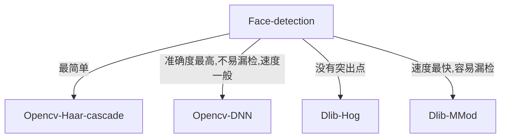

## 前端人脸检测

```mermaid
graph
	Face-detection --最简单--> Opencv-Haar-cascade
	Face-detection --准确度最高,不易漏检,速度一般--> Opencv-DNN
	Face-detection --没有突出点--> Dlib-Hog
	Face-detection --速度最快,容易漏检--> Dlib-MMod
```

* 基本思路：
  * 对比所有算法的速度以及检测精度，给出具体数值（主要是速度，漏检和误检）
  * 选取`Opencv-dnn`和`Dlib-MMod`作为最后的人脸算法
  * 可以考虑通过先进行`人脸对齐(face alighment)`来增强`Dlib-MMod`，再对比速度差异
