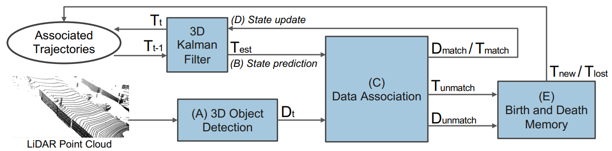
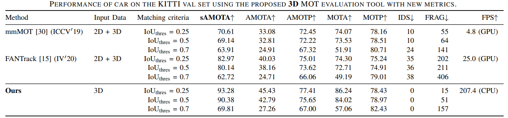
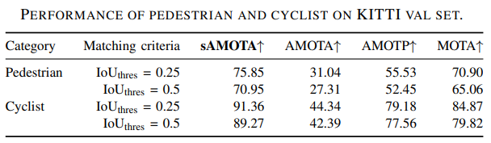
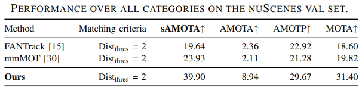
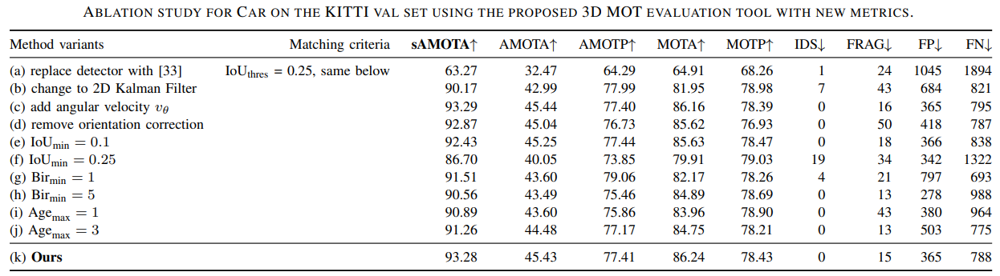

#  AB3DMOT: A Baseline for 3D Multi-Object Tracking and New Evaluation Metrics

> paper: https://arxiv.org/pdf/2008.08063.pdf
>
> paper: https://arxiv.org/pdf/1907.03961.pdf
>
> github: https://github.com/xinshuoweng/AB3DMOT

> `2D`多目标的匹配和跟踪往往基于卡尔曼滤波+匈牙利匹配，或者`KCF`等算法；而现在`3D`目标感知如火如荼，因此想在学习`3D`目标跟踪的同时，复习一遍`2D`目标跟踪。


## 主要贡献

- [x] 实时精确的、基于`3D`卡尔曼滤波的`3D`目标跟踪
- [x] 提供了用于`3D`目标跟踪的性能评价工作和三项评价指标
- [x] 在`3D`目标跟踪数据集上实现性能`SOTA`以及最快运行速度


## 背景

### 2D MOT

`2D MOT` 方法大致可以划分为全局`(Batch)`方法和在线方法

* 全局方法：一般是构造网络流图`(network flow graph)`，并通过最小损失流算法`(min-cost flow algorithm)`求解出全局最优的关联结果
* 在线方法：基于当前帧信息，构造二分图`(bi-partite graph)`，并通过匈牙利算法`(Hungarian algorithm)`或者神经网络来计算关联结果

对于用于匹配的特征，一般采用手动选取的特征（运动模型和颜色信息）作为权重指标

### 3D MOT

与`2D MOT`类似，只是扩展到三维层面，因此目标的空间和外观特征往往都是三维的，除去手动选取的特征，还有基于神经网络选区的特征用于`3D`目标关联

* 作者这里只采用`3D`空间特征（`3D`距离、`3D`速度、`3D`尺寸和朝向信息）


## 核心工作

主要流程如下图所示：



* A.目标检测：通过激光雷达检测算法获得`3D`目标检测结果($D_t$)
* B.轨迹预测：`3D`卡尔曼滤波根据前一帧轨迹信息($T_{-1}$)预测出当前目标位置($T_{est}$)
* C.目标关联：利用匈牙利算法实现对当前帧检测结果$D_t$和$T_{est}$的关联，关联结果为$D_{match}$ 
* D.轨迹更新：对于每个关联的为$T_{match}$ ，基于对应的$D_{match}$信息，通过`3D`卡尔曼滤波对运动轨迹信息进行更新，更新结果为$T_t$ 
* E.状态管理：对于无法关联的目标检测结果$D_{match}$和轨迹信息$T_{unmatch}$需要转换为$T_{lost}$销毁，或者创建新的轨迹$T_{new}$用于跟踪


```
总体而言，算法的流程与2DMOT基本一致
```

### 理论推导

假设：目标的帧间保持匀速运动，且与自车运动情况无关；这样做的好处是无需显式地估计自车运动

#### 参数定义：

* 目标定义：对于某一帧$t$，通过雷达检测到`3D`目标的结果为$D = \{D^1_t,D^2_t...D^{n_t}_t\}$，其中$n_t$为目标的个数；而每个检测目标$D^j_t$，其中$j \in\{1,2...n_t\}$，而每个检测结果表示如下：$D^j_t = \{x,y,z,\theta,l,w,h,s\}$，其中，`3D`距离信息为$(x,y,z)$，`3D`尺度信息为$(l,w,h)$，此外还包含航向角$\theta$和置信度$s$

* 状态定义：定义轨迹状态向量为$T=\{x,y,z,\theta,l,w,h,s,v_x,v_y,v_z\}$，相比于检测结果$D_t$多了对于目标速度的表示；对于每一帧而言，$t-1$时刻前的状态轨迹可以表示为$T_{t-1}=\{T^1_{t-1},T^2_{t-1}...T^{m-1}\_{t-1}\}$，其中$m-1$为该时刻轨迹的数量

> 作者没有引入角速度$v_{\theta}$，因为实际计算发现影响不大

* 轨迹预测：
  * 对于$t$时刻而言，目标的轨迹的预测值为$T_{est}$，其结果由之前时刻的$T_{t-1}$和匀速运动模型假设得到：$x_{est} = x + v_x, y_{est} = y + v_y, z_{est} = z + v_z$
  * 对于$t-1$时刻轨迹$T^i_{t-1}$的目标$i$，$i \in \{1,2...m-1\}$，在$t$时刻的预测结果为$T_{est}=\{x_{est},y_{est},z_{est},\theta,l,w,h,s,v_x,v_y,v_z\}$

#### 数据关联

* 目标关联：为了将轨迹预测结果$T_{est}$与检测结果$D_t$关联，这里引入一个仿射变换矩阵$M_{(m_{t-1},n_t)}$，用于计算每个$T^i_{est}$和$D^j_t$的`3D IOU`或者中心距离，此时的关联模型即为二分图模型，可以通过多项式时间复杂度的匈牙利匹配算法进行求解

当计算的IOU小于设定的$IOU_{min}$或者中心距离大于设定的中心距离阈值，可以认为关联失败；最终得到的关联结果如下：

$$
T_{match}=\{T^1_{match},T^2_{match}...T^{w_t}_{match}\} \\
D_{match}=\{D^1_{match},D^2_{match}...D^{w_t}_{match}\} \\
T_{unmatch}=\{T^1_{unmatch},T^2_{unmatch}...T^{m_{T-1}-W_t}_{unmatch}\} \\
D_{unmatch}=\{D^1_{unmatch},D^2_{unmatch}...D^{n_t-w_t}_{unmatch}\} \\
$$

#### 状态更新

* 状态更新：即根据当前检测结果$D_{match}$，对轨迹预测结果$T_{match}$进行更新；那么在$t$时刻，关联的轨迹状态为$T_t=\{T^1_t,T^2_t...T^{m-1}_t\}$，根据贝叶斯法则，此时更新的轨迹为$T^k_t=\{x^{'},y^{'},z^{'},\theta^{'},l^{'},w^{'},h^{'},s^{'},v_x^{'},v_y^{'},v_z^{'}\}$，其中，$k \in\{1,2...w_t\}$ 
* $\theta$ 修正：直接通过贝叶斯法则对$\theta$进行更新可能导致两者的角度差$\theta_d$较大，因此这里采用的技巧是：当$\theta_d$ 大于$\frac{\pi}{2}$时，给$T^k_{match}$中的$\theta$加上$\pi$，这样角度差$\theta_d$始终小于$\frac{\pi}{2}$，从而满足帧间的状态不发生突变的假设

#### 状态管理

* 新跟踪生成：每个未匹配的检测结果$D_{unmatch}$，都有可能是新目标刚刚进入场景，但是为了避免生成假阳性`(false positive)`的轨迹，需要保证$D^p_{unmatch},p \in (1,2...n_t-w_t)$在接下来的$Bir_{min}$帧中都没有匹配的轨迹，此时生成新轨迹$T^p_{new}$，并初始化速度为$v_x=v_y=v_z=0$

* 旧轨迹销毁：同样的，每个未匹配的轨迹$T_{unmatch}$，都有可能是旧目标刚刚退出场景，参考前面操作，对于$D^q_{unmatch},q \in (1,2...m_{t-1}-w_t)$在接下来的$Age_{max}$帧中都没有匹配的轨迹，此时销毁旧轨迹$T^q_{unmatch}$

### 3D MOT 评价指标

以往`3D MOT` 评价方法往往是将`3D MOT` 的结果投影到图像平面，再通过`KITTI`数据集的`2D MOT`评价方法进行性能验证，而`KITTI`

的`2D`评价方法是将投影的结果与真值轨迹进行比较，并通过`2D IOU`损失函数进行衡量，这种方法对于`3D MOT`并不适用；比如一个`3D MOT` 算法尽管深度估计和`3D IOU`较低，但是其投影到图像平面的`2D IOU`较高，这就无法有效衡量`3D MOT` 算法的性能

* 改进：作者将`3D IOU`作为损失函数用于衡量预测值与真值的差异，也可以采用`3D`中心距离损失

* **CLEAR矩阵**(MOTA, MOTP, FP, FN, Precision, F1 score, IDS, FRAG)指标缺陷：没有衡量目标的置信度属性

* 积分矩阵(AMOTA, AMOTP（average ))：

  * AMOTA（average MOTA）：离散MOTA的积分平均值

    * $MOTA=1-\frac{FP+FN+IDS}{num_{gt}}$，$num_{gt}$为该帧下真值目标的数量
    * $aMOTA=\frac{1}{L}*\displaystyle \sum_{r \in \{\frac{1}{L},\frac{2}{L}...1\}} \frac{FP_r+FN_r+IDS_r}{num_{gt}}$

* 缩放尺度矩阵(sAMOTA)：

  * $sAMOTA_r=\max(0,1-\frac{FP_r+FN_r+IDS_r-(1-r)\times num_{gt}}{r\times num_{gt}})$
  * $sAMOTA=\frac{1}{L}*\displaystyle \sum_{r \in \{\frac{1}{L},\frac{2}{L}...1\}} sAMOTA_r$

> 总体而言，这些指标主要衡量算法对置信度阈值的敏感程度

## 实验

### 性能表现





* KITTI：
  * Car：`SOTA`
  * Cycle and Perdestrian：`good`
* Nuscenes：`SOTA`
* 推理时间：`207.4 FPS`

### 消融实验



* `3D`检测算法性能：激光雷达检测算法优于视觉检测算法，即算法检测结果作为输入对于`3D MOT`任务非常重要
* `3D Karman` vs `2D Karman`：`3D Karman`相对更有，可能原因为其在深度预测上的准确度更高
* 角速度$v_{\theta}$：基本没有影响
* 方位角$\theta$修正：有一定效果
* $IOU_{min}$阈值：选取了`0.01,0.1,0.25`测试，其中`0.01`效果最好
* $Bir_{min}$阈值：选取了`1,3,5`测试，其中`3`效果最好
* $Age_{max}$阈值：选取了`1,2,3`测试，其中`2`效果最好
