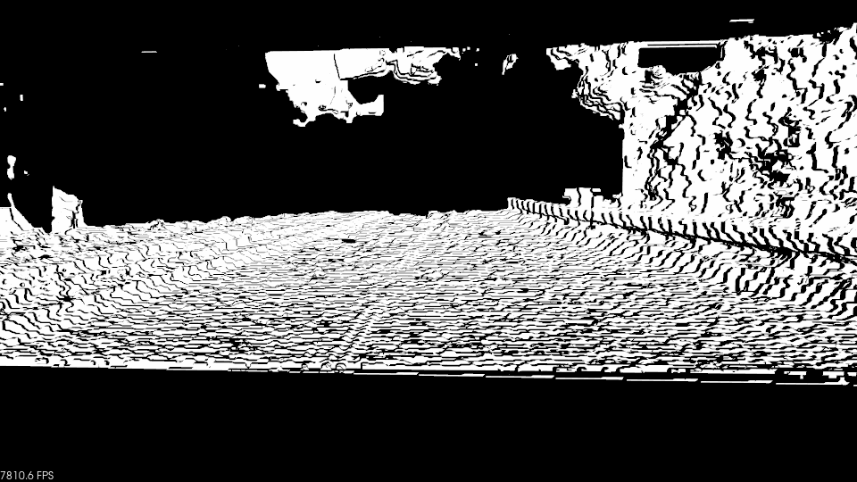

# ELAS-based Dense reconstruction

In this project, I compared performance of Opencv-SGBM and ELAS two disparity computing algorithms, and choose the later one`s result for dense recon, using PCL Delaunay method to create 3D mesh. Here is the [project](https://github.com/leijobs/elas-road-reconstruct)

* opencv SGBM

* ELAS stereo

As you can see, the result is not good, and more can be done to generate smooth road plane.

