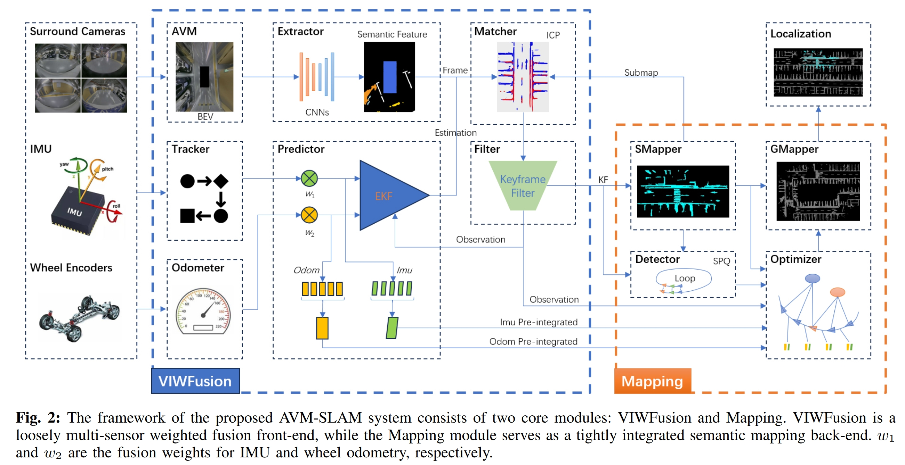
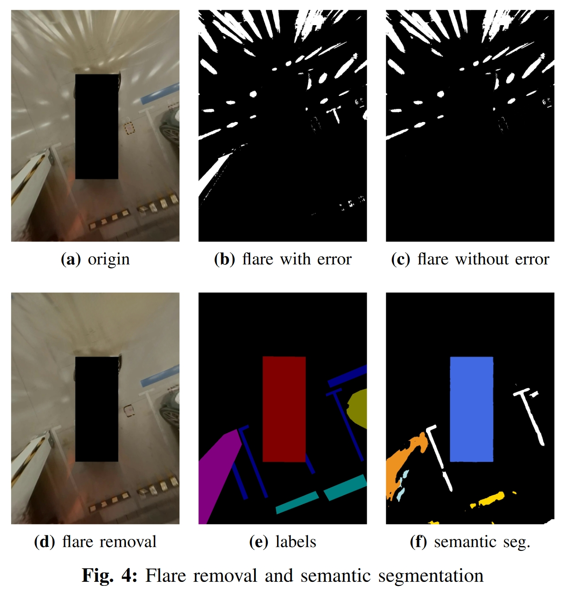
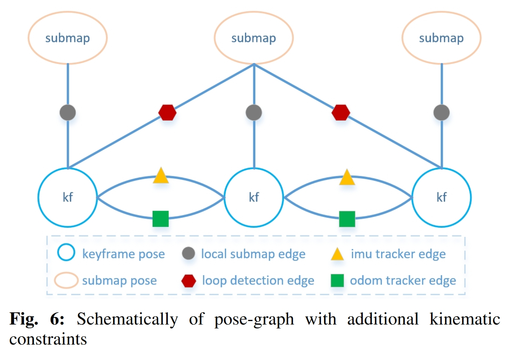

# AVM-SLAM

## Info

> 论文：[https://arxiv.org/abs/2309.08180](https://arxiv.org/abs/2309.08180)
>
> github：[https://github.com/yale-cv/avm-slam](https://github.com/yale-cv/avm-slam)【没有 data 和 code】

- 创新点：
  - 提出了 AVM-SLAM 框架
  - 多传感器的松耦合和紧耦合框架
  - 提出了一个大规模泊车数据集

## Framework

AVM-SLAM 包含两个核心模块 VIWFusion 和 Mapping 模块，其中：

- VIWFusion 是一个基于 EKF 的多传感器的紧耦合前端，包括语义特征提取与匹配、IMU 跟踪、轮速计、位姿预测和关键帧跟踪，其中 IMU 和轮速计使用预积分来提供关键帧间的位姿估计
- Mapping 是紧耦合的语义建图后端，包含回环检测、全局优化、局部建图和全局建图，回环检测采用语义 ICP 配准，使用 semantic pre-qualification（SPQ）来最小化误差，此外关键帧间的 IMU 和轮速计约束也用于全局 map 优化

## Methodology

### Around View Monitor

在进行 IPM 变换之前，需要经过离线标定获得相机内外参。这里使用高阶多项式来拟合畸变误差：

$$
\begin{aligned}\\r(\theta)=k_1\theta+k_2\theta^3+k_3\theta^5+k_4\theta^7+k_5\theta^9\end{aligned}
$$

其中，$\theta$是输入光线与光心轴的夹角，$r$为像素点到光心的距离，$k_i(i \in {0,1,2,3,4})$为通过标定求解的畸变系数

IPM 投影的过程描述如下：

$$
\left.\left[\begin{array}{c}u_{bev}\\v_{bev}\\1\end{array}\right.\right]=H*\left[\begin{array}{c}u_{undist}\\v_{undist}\\1\end{array}\right]
$$

其中，$\begin{bmatrix}u_{ipm}&v_{ipm}\end{bmatrix}$为去畸变后的像素坐标，$\begin{bmatrix}u_{bev}&v_{bev}\end{bmatrix}$为 BEV 视图的像素坐标，$H$为去畸变图像到 BEV 视图的单应矩阵

### Semantic Extractor and Matcher

#### Flare Removal

基于 UNet 实现语义分割，改进包括感知损失和 L1 损失。语义分割的类别包括：车库的道路标记，包括车道线、停车位、斑马线和指示箭头

另外，为了抑制场景中的耀斑，这里引入了 [算法](https://ieeexplore.ieee.org/abstract/document/8754735) 来修正耀斑，效果如下：

#### Semantic Extractor

论文使用了 DDRnet 来提取语义特征，在提取特征之后，需要降采样并转换到 3D 视图：

$$
\left.\left[\begin{array}{c}x_c\\y_c\\z_c\end{array}\right.\right]=K^{-1}*\left[\begin{array}{c}u_{bev}\\v_{bev}\\1\end{array}\right]
$$

其中，$K^{-1}$为内参矩阵的逆，$\begin{bmatrix}x_{c}&y_{c}&z_{c}\end{bmatrix}$为 3D 空间坐标系下的坐标，并且$z_c$表示 3D 空间坐标中的 1m 距离

在投影到 3D 空间之后，下一步投影到车辆坐标系中：

$$
\left.\left[\begin{array}{c}x_v\\y_v\\z_v\\1\end{array}\right.\right]=T_{vc}*\left[\begin{array}{c}x_c\\y_c\\z_c\\1\end{array}\right]
$$

其中，$\left.\left[\begin{array}{rrr}x_v&y_v&z_v\end{array}\right.\right]$为车辆坐标系下的空间坐标，$T_{vc}$表示 BEV 坐标系到车辆坐标系的转换

#### Semantic Matcher

使用 ICP 进行 3D 特征匹配

### Pose Predictor

#### System Initialization

位姿预测器总是考虑时刻 BEV 语义帧队列$deqBevCam$的第一帧对应时刻$t_{0}$作为初始化的时刻

为了确认初始化是否可行，首先检查传感器队列在$t_0$时刻前是否有数据，只有当在$t_0$或之前的时刻存在数据才会初始化

如果$t_0$时刻没有初始化，将会删除$t_0$时刻的传感器队列，并在下一帧的$t_1$时刻判断是否可以初始化

一旦初始化成功，当前的车辆坐标系将作为全局 map 的初始坐标系以及当前第一个 submap 的初始坐标系

为了提高初始化精度，将对传感器队列$deqBevCam$（主要是 IMU 和轮速计）进行线性插值，从而获得在$t_i$时刻较为精确的数据

#### Pose Prediction

在线性运动时，轮速计的线速度具有较高的准确度；而在旋转运动时，IMU 的角速度具有较高的准确度，两者互补

论文采用了 EKF 滤波来自多传感器的数据，可以分为预测和更新两部分

而预测部分可以通过一般的 EKF 进行描述：

$$
\begin{aligned}\hat{x}_k&=f(\hat{x}_{k-1},u_{k-1})\\P_k&=F_kP_{k-1}F_k^T+Q_k\end{aligned}
$$

其中，$\hat x_k$为$k$时刻估计的状态向量，$f$为非线性的状态转移函数，$u_{k-1}$为$k-1$时刻的控制输入，$P_k$为$k$时刻的状态估计误差的协方差矩阵，$F_k$为状态转移函数对状态变量的雅各比矩阵，$Q_k$为$k$时刻的噪声的协方差矩阵

EKF 的更新表示如下：

$$
\begin{aligned}
&K^{\prime} =P_kH_k^T(H_kP_kH_k^T+R_k)^{-1}  \\
&\hat{x}_k^{\prime} =\hat{x}_k+K'(\overrightarrow{z_k}-h(\hat{x}_k))  \\
&P_{k}^{\prime} =(I-K^{\prime}H_k)P_k 
\end{aligned}
$$

其中，$K^{\prime} $为$k$时刻的卡尔曼增益，$H_k$为$k$时刻雅各比矩阵的量测，$R_k$为$k$时刻的噪声协方差矩阵的量测，$\overrightarrow{z_k}$为$k$时刻的状态向量的量测，$h$为非线性的量测函数，$I$为单位阵

除去多传感器的数据滤波，IMU 和轮速计还使用预积分更新关键帧间的数据，用于后续优化全局 map

### SubMapper and GlobalMapper

为了优化 ICP 的计算，论文使用关键帧-submap-全局 map 来构建语义地图：

如果语义的关键帧与上一帧的差异大于 50%，则将该帧放入关键帧滤波器

submap 包含固定数量的关键帧，一般设定为 10 帧，并且 submap 的语义特征明显少于全局 map（这是肯定的），从而降低 ICP 匹配的累计误差，提升配准效率

在 mapping 模块我们维护两个 submap：一个是当前 submap，另一个是更新的 submap，并确保两者的重叠度大于 50%

在更新时，同时向两个 submap 插入关键帧，当当前 submap 的关键帧满足一定数量时，执行点云矫正和局部优化，并将当前 submap 插入全局 map，而更新的 submap 重新作为当前 submap，再创建一个新的更新 submap 继续更新

### Loop Detector

作者使用 SPQ (Semantic Prequalification)来滤波潜在的回环关键帧和 submap，可以降低误差

SPQ 根据关键帧和 submap 中的语义特征的数量和权重来投票，超过阈值的回环关键帧和 submap 将用于 ICP 配准进行回环检测

### Global Optimizer

全局优化使用位姿图计算，位姿图的节点为关键帧和 submap，边对应于关键帧间、关键帧到 submap 的位姿约束

关键帧间的约束为相邻帧间通过语义信息计算的位姿关系，并包括帧间的 IMU 和轮速计的数据

关键帧到 submap 的约束为关键帧到 submap 的位姿关系以及回环约束
