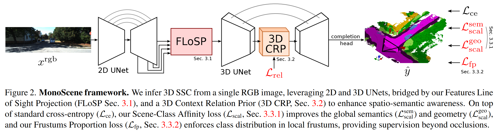
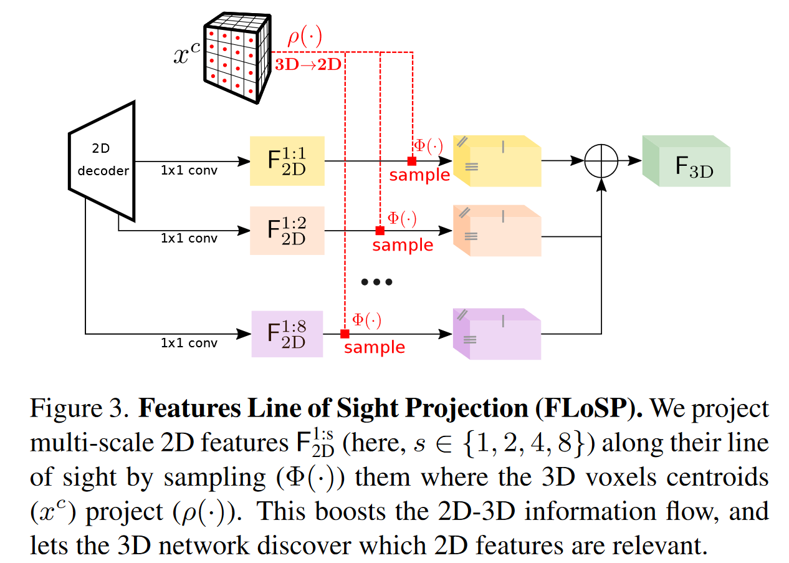
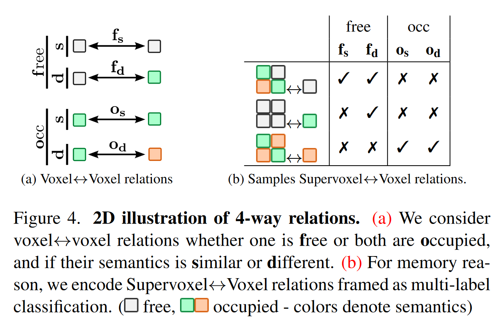
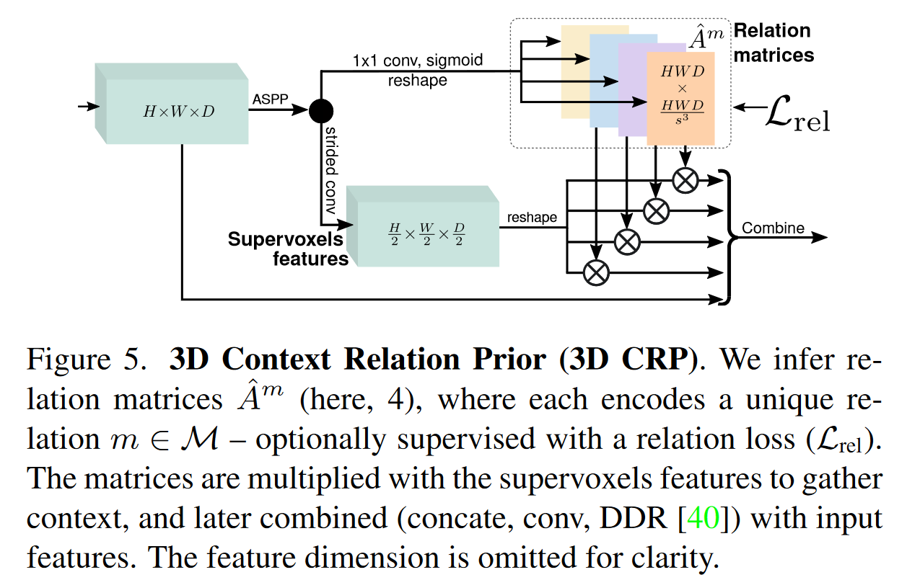
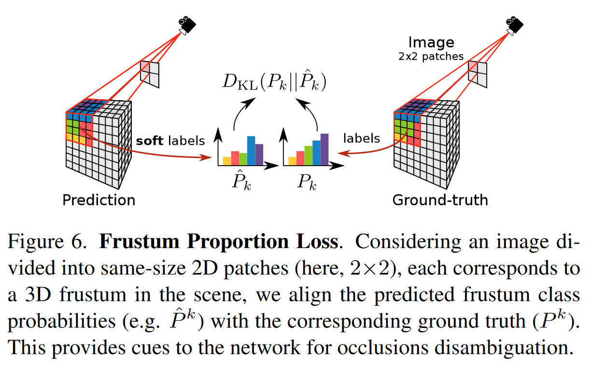

# MonoScene

## Info

> 论文：[https://arxiv.org/abs/2112.00726](https://arxiv.org/abs/2112.00726)
>
> github：[https://github.com/astra-vision/MonoScene](https://github.com/astra-vision/MonoScene)

## Framework

### Model Framework

- 流程：
  - 1.2D UNet:多尺度的特征提取
  - 2.FLoSP:多尺度特征采样提取，2D 转 3D
  - 3.3D UNet:3D 语义分割
  - 4.3D CRP: 多尺度提升感受野，voxel 是否 free 和类别的编码
  - 5.Loss:
    - 1.交叉熵 loss：基本 loss，用于单个 voxel 回归
    - 2.SCA（场景-类别相似性 loss）loss：优化全局的语义和几何 loss
    - 3.FP loss（视锥比例 loss）：优化局部类别分布

## Paper Details

### Abstract

- 创新点：

  - 1.基于单目实现稠密几何（occupancy）和语义分割（senmantics）
- 工作：

  - 1.novel 2D-3D 投影变换
  - 2.3D 空间-语义上下文关联
  - 3.novel global 和 local 视锥 loss

### Method

#### FLoSP

假定相机内参 K 已知，将 3D voxels 的中心点 ($x^{c}$) 投影到 2D，并从 2D Decoder 输出的 feature map 结果进行采样，在 1-2-4-8 的尺度上重复此过程：

$$
F_{3D}=\sum_{s \in S} \Phi_{\rho(x^{c})}(F_{2D}^{1: s})
$$

其中，$\phi_a(b)$代表在 a 坐标系下对 b 进行采样，$\rho(*)$代表投影变换过程

在实际的过程中，作者选择的尺度 S=1-2-4-8，并采用 1x1 的卷积来对多层 2D feature map 进行汇聚

FOV 以外的特征向量都置 0，$F_{3D}$即为 3D UNet 的输入

#### 3D CRP

作者设计了 3D CRP 网络，放在 3D UNet 的 Neck，用于学习 n-way 的 voxel 见的语义关系，网络拥有全局的感受野，可以提升空间-语义的注意力

##### Voxel <-> Voxel 关系

语义场景补全(SSC)一般设置的 n=2 是次优的，作者设置 n=4 来描述 voxel 间的关系如下：

如图(a)，作者采用以下表示来对 voxel 间的 free 和 occupied 进行描述：

对于语义的对比为：相同（C） or 不同（D）

最终得到四种非重叠的关系：对于 N 个 voxel，复杂度为$N^2$

##### Supervoxel <-> Voxel 关系

定义 supervoxel 为$s^3$都不重叠（空间上临近的 8 个 voxel）的 voxel

如图(b)，那么 supervoxel 和 voxel 之间的关系可以用大小为$N^2/(s^3)$的矩阵描述，相当于单个 voxel 与周边的$\nu_{1}, \ldots, \nu_s^{3}$之间的关系：

$$
\mathcal{V} \leftrightarrow \nu=\left\{\nu_{1} \leftrightarrow \nu, \ldots, \nu_{s^{3}} \leftrightarrow \nu\right\}_{\neq}
$$

其中，${\{ *\}}_{\neq}$会 return 一组不相等的元素，每个元素表示其与 voxel 的关系

##### 3D CRP Layer

3D CRP 层以 HxWxD 的 3D feature map 为输入，并就行一系列 ASPP 卷积来放大感受野，然后分解为数量为 $n=\lvert M \rvert $的多个矩阵，维度为 $HWD\times\frac{HWD}{s^3}$

每个$\hat{A}^m$矩阵都会对一段数据进行编码，满足$m \in M$，通过真值$A^m$监督

定义的带权重、多 Label、二进制交叉熵损失为：

$$
\mathcal{L}_{r e l}=-\sum_{m \in \mathcal{M}, i}\left[\left(1-A_{i}^{m}\right) \log \left(1-\hat{A}_{i}^{m}\right)+w_{m} A_{i}^{m} \log \hat{A}_{i}^{m}\right]
$$

其中，i 在所有关系矩阵中循环，而 $w_{m}=\frac{\sum_{i}(1-A_{i}^{m})}{\sum_{i} A_{i}^{m}}$

关系矩阵将会与 reshaped supervoxel 特征相乘，从而汇聚全局 context 的特征

#### Loss

##### SCA loss

SCA loss 直接优化场景和类别的 loss. 其中，类别 loss 可以分别用$P_c$（Precision，精度）,$R_c$（Recall，召回率）,$S_c$（Specificity，特异性）描述，其中前两者用于衡量相同相似的 voxel，后者用于衡量不同的 voxel（比如类别不同）. 定义$p_i$为体素 i 的真值，$\hat{p}_{i,c}$为相同 voxel 对于类别$c$的预测值，那么：

$$
\begin{aligned}
&P_c(\hat{p},p) \begin{aligned}=\log\frac{\sum_i\hat{p}_{i,c}[[p_i=c]]}{\sum_i\hat{p}_{i,c}},\end{aligned}  \\
&R_c(\hat{p},p) =\log\frac{\sum_i\hat{p}_{i,c}[[p_i=c]]}{\sum_i[[p_i=c]]},  \\
&S_c(\hat{p},p) \begin{aligned}=\log\frac{\sum_i(1-\hat{p}_{i,c})(1-[[p_i=c]])}{\sum_i(1-[[p_i=c]])}\end{aligned} 
\end{aligned}
$$

其中，$[[ *  ]]$表示 Iverson 括号. 最终的 Loss 如下：

$$
\mathcal{L}_{\text {scal }}(\hat{p}, p)=-\frac{1}{C} \sum^{C}\left(P_{c}(\hat{p}, p)+R_{c}(\hat{p}, p)+S_{c}(\hat{p}, p)\right)
$$

实际上，在计算中会分别优化语义 loss 函数 $L^{sem}\_{scal}(\hat{y}, y)$ ，以及几何 loss 函数  $L^{geo}\_{scal}(\hat{y}, y) $

##### Frustum loss

FPL（视锥比例 loss）：用于显式的优化 frustum 中类别分布

直觉上，视锥分布是有规律的，比如 occluded 的车辆可能分布于道路周边

给定一个视锥$f$，首先计算视锥类别分布的真值，对于体素$k$为$P_k$；对于体素$k$的类别$c$的比例真值为

$P_{k,c}$；而预测结果则分别为$\hat{P_k}$和$\hat{P_{k,c}}$；为了增强连续性，使用局部视锥的 Kullback-Leibler（KL）分布，下面为计算视锥分布的 loss：

$$
\mathcal{L}_{\mathrm{fp}}=\sum_{k=1}^{\ell^{2}} D_{\mathrm{KL}}\left(P_{k} \| \hat{P}_{k}\right)=\sum_{k=1}^{\ell^{2}} \sum_{c \in C_{k}} P_{k}(c) \log \frac{P_{k}(c)}{\hat{P}_{k}(c)}
$$

注意，公式中使用$C_k$而非$C$，因为视锥包含很小比例的未定义类别，所以 KL 中局部定义为**undefined **.这里的$C_k$表示包含类别定义的视锥$k$

最终，完整的 loss 如下：

$$
\mathcal{L}_{\mathrm{total}}=\mathcal{L}_{\mathrm{ce}} + \mathcal{L}_{\mathrm{rel}} + \mathcal{L}_{\mathrm{scal}}^{sem} + \mathcal{L}_{\mathrm{scal}}^{geo} + \mathcal{L}_{\mathrm{fp}}
$$

其中，$\mathcal{L}_{\mathrm{ce}}$为交叉熵损失

### Experiments

- 数据集：
  - SemanticKITTI 设置：
    - voxel分辨率0.2m，数量256x256x32（51.2x51.2x6.4）
    - 21个语义类别(19个语义标签, 1 freespace, 1 unknown)
    - cam2的尺度：1226x370, cam0（左侧）的尺度裁剪为：1220×370
    - train/val比例：3834/815，全部验证.
- 训练设置：
  - FLoSP尺度 (1,2,4,8)
  - 对于3D场景补全（CRP）任务，使用了4个有监督的关系（即n=4，包含Lrel），并且在Lfp（局部特征金字塔）中采用了8x8的视锥体（frustums）来增强特征表示
  - NYUv2数据集，3D UNet的输入为60x36x60（空间分辨率比例为1:4），SemanticKITTI数据集，输入尺寸被调整为128x128x16（空间分辨率比例为1:2）
  - 对于SemanticKITTI的输出，在completion head中使用了一个反卷积层来将输出上采样到原始尺寸（1:1），以匹配输入数据的空间分辨率
  - 训练：使用AdamW优化器，epochs为30，atch size为4，weight decay为1e-4。lr为1e-4，并在第20/25轮次时（针对NYUv2/SemanticKITTI）将其除以10，以调整学习速度
- 评估指标：
  - 场景补全（SC）任务，使用占用体素（occupied voxels）的交并比（IoU），不考虑其语义类别。评估模型在重建场景几何结构方面的性能
  - 语义场景补全（SSC）任务，使用所有语义类别的平均交并比（mIoU），综合考虑了模型在几何重建和语义分类两方面的性能
  - 注：IoU和mIoU之间存在强烈的相互作用。通过忽略或错误分类某些语义标签（即降低mIoU），可以提高几何估计的准确性（即提高IoU）。这反映了在平衡几何重建和语义分类任务时面临的挑战。

