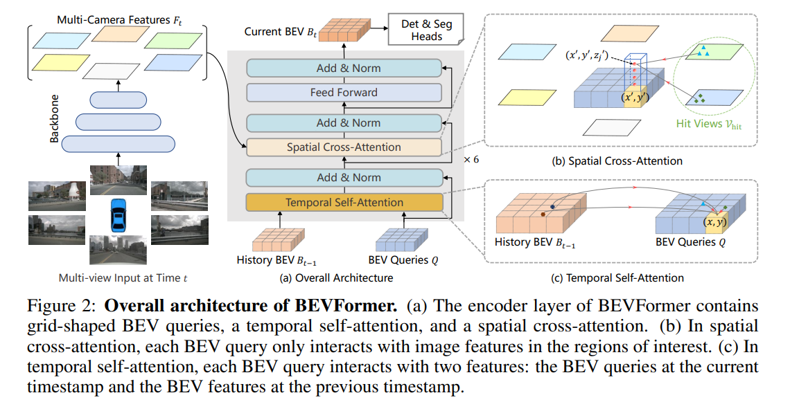
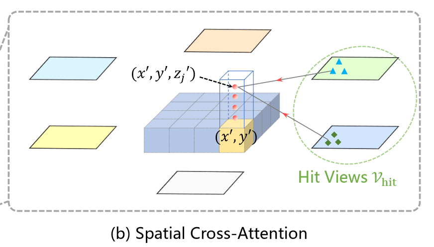
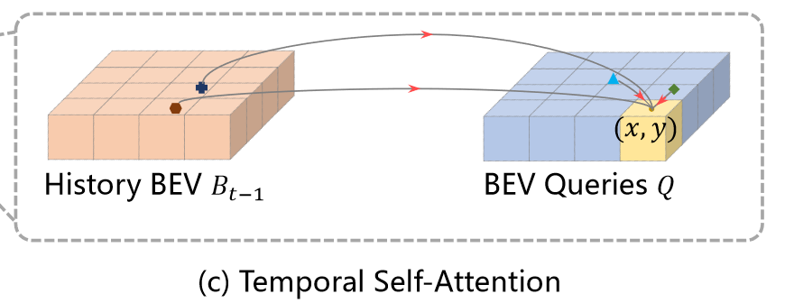

# BEVFormer

## Info

> 论文：[https://arxiv.org/abs/2203.17270](https://arxiv.org/abs/2203.17270)
>
> github：[https://github.com/fundamentalvision/BEVFormer](https://github.com/fundamentalvision/BEVFormer)

## Framework

### Abstract

- 工作：
  - query 时空特征保存到 BEV 网格
  - Spatio：spatio-across attn 提取空间特征
  - Temporal：RNN-styled temporal self-attn

### Related Work

#### Transformer-based 2D 感知

DETR 是第一个将 transformer 应用到图像检测领域的算法，但是训练时间过长

Deformable DETR 引入了 deformable 注意力机制，不使用全局 attn，而是采用局部 attn，只计算周边 K 个点的 attn 从而提升效率、加快训练速度；deformable 注意力的表示如下：

$$
\operatorname{DeformAttn}(q, p, x)=\sum_{i=1}^{N_{\text {head }}} \mathcal{W}_{i} \sum_{j=1}^{N_{\text {key }}} \mathcal{A}_{i j} \cdot \mathcal{W}_{i}^{\prime} x\left(p+\Delta p_{i j}\right)
$$

其中，q，p，x 分别表示 query，参考点（key）和输入特征（value）；i 代表 attn head，$N_{head}$表示全部的 attn head；j 代表采样的 key，$N_{key}$表示所有 attn head 对应的 key 的集合； $W_i{\in}\mathbb{R}^{C\times(C/H_{\mathrm{head}})}$、$ W_i^{\prime}\in\mathbb{R}^{(C/H_{\mathrm{head}})\times C} $ 表示可学习的权重，而$C$表示特征维度； $A_{i j} \in [0,1]$ 表示预测的 attn 权重，并通过 $\sum_{j=1}^{N_{\mathrm{key}}}A_{ij}=1.\mathrm{~}\Delta p_{ij}\in\mathbb{R}^2$ 归一化；$\Delta p_{i j} \in \mathcal{R}^2$表示相对于参考点 p 的预测的 offset， $x(p+\Delta p_{i j})$ 表示位于 $(p+\Delta p_{i j})$ 处的特征，通过双线性插值得到

论文将把 deformable 注意力扩展到 3D 领域，用于时空特征融合

#### Cam-based 3D 感知

- BEV 投影：
  - IPM 是最简单的方式
  - LSS 通过深度图生成 BEV 特征
  - PYNA 通过 cross-view transformer 实现单视图的 BEV 投影变换
  - BEVFormer 采用空间特征 +RNN-styled 时间特征进行融合获得多相机的 BEV 特征

### BEVFormer

#### Overall

如图所示，BEVFormer 包含 6 个 encoder layer，每个后面都接了一个包含 query、spatial cross-attn、temporal self-attn 的 transformer 模块，下面将详细论述每个部分

- query：通过注意力机制从多视图 BEV 空间中提取特征
- spatial cross-attn、temporal self-attn：查找和汇聚 BEV 时空特征

在推理时，假设时刻为$t$，先将多视图图像输入 backbone 网络，比如 ResNet101 提取多视图的特征 :
$$
F_t=\{F_t^i\}_{i=1}^{N_{view}}
$$

其中 $F_t^i$ 表示第 i 个视图的特征， $N_{view}$ 表示视图的总个数

同时用$B_{t-1}$表示在$t-1$时刻的 BEV 先验特征，那么会先使用 BEV query 来查找先验的时间特征$B_{t-1}$，然后再使用 BEV query 来查找对应的多视图特征$F_{t}$，经过 feed-forward 网络优化 BEV 特征；

通过堆叠的 6 个 encoder layer 后得到当前时刻$t$的 BEV 特征$B_{t}$，该特征可以加上后续的 3D 检测 head 和 map 分割 head 即可

#### Query

首先预先定义一组网格参数 $Q \in \mathcal{R}^{H \times W \times C}$ 作为 BEVFormer 的 query，$H、W$为 BEV 平面的空间尺度；特殊的，query $Q_p \in \mathcal{R}^{1 \times C}$表示位于 BEV 网格$p=(x,y)$处的 query，每个网格都与真实世界的位置按照单位 m 来对应，因此多视图 BEV 中心特征即为自车位置

#### Spatial cross-attn

BEVFormer 引入了 3D 的 deformable Attn 来解决全局 Attn 导致的计算复杂度问题，并将原来的 deformable2D 改为 3D

1. 首先先将 BEV 特征 lift 为 pillar-like 的 query，再从 pillar 中采样 $N_{ref}$3D 参考点
2. 将这些点投影到 2D 视图；但是一个视图只能填充部分 BEV query，被填充的部分为$\mathcal{V}_{hit}$
3. 将这些 2D 参考点作为 query$Q_{p}$的参考点，并从$\mathcal{V}_{hit}$的参考点中采样获得特征
4. 通过带权重的累积作为 spatial cross-attn 的输出

spatial cross-attn(SCA)过程的公式描述如下：

$$
\operatorname{SCA}\left(Q_{p}, F_{t}\right)=\frac{1}{\left|\mathcal{V}_{\text {hit }}\right|} \sum_{i \in \mathcal{V}_{\text {hit }}} \sum_{j=1}^{N_{\text {ref }}} \operatorname{DeformAttn}\left(Q_{p}, \mathcal{P}(p, i, j), F_{t}^{i}\right)
$$

其中，i 代表第 i 个视图，j 代表参考点，$N_{ref}$表示每个 BEV query 全部的参考点；$F_t^i$表示第 i 个视图的特征，对于每个 BEV query $Q_p$，使用投影函数$\mathcal{P}(p,i,j)$表示第 i 个视图上的第 j 个参考点

下一步计算投影函数$\mathcal{P}(p,i,j)$，首先计算对应 query$p = (x,y)$位置的真实世界坐标$(x^{\prime},y^{\prime})$：

$$
x^{\prime} = (x - \frac{W}{2}) \times s;y^{\prime} = (y - \frac{H}{2}) \times s
$$

公式中，$H、W$为 BEV query 的空间尺度，$s$为 BEV 网格的分辨率，$(x^{\prime},y^{\prime})$为自车为原点的坐标位置

在 3D 空间中，$(x^{\prime},y^{\prime})$位置的目标还有一个高度信息$z^{\prime}$，因此作者预定义了一组高度锚点 $\{z\prime_j \}\_{j=1}^{N_{ref}}$ ，用于保证能够获得高度信息

最后，将 3D 参考点通过相机投影矩阵投影到不同的视图，表示如下：

$$
\mathcal{P}(p,i,j)= (x_{ij}, y_{ij})
$$

其中，$z_{ij} \cdot [ x_{ij}, y_{ij}, 1 ]^T = T_i \cdot [ x^{\prime},y^{\prime},  z^{\prime}, 1]^T$

这里有 $\mathcal{P}(p,i,j)$表示第 i 个视图上的第 j 个 3D 点坐标$(x^{\prime},y^{\prime}, z^{\prime})$对应的 2D 投影点，$T_i \in \mathcal{R}^{3 \times 4}$表示第 i 个相机的已知的投影矩阵

#### Temporal self-attn

Temporal 信息对于运动目标速度估计、遮挡目标等方面具有较大作用

给定当前时刻$t$的 BEV query $Q$以及上一历史时刻$t-1$的 BEV 特征$B_{t-1}$，

1. 首先根据自车运动将$B_{t-1}$对齐到$Q$，来保证网格中的特征与真实世界位置一致对齐的特征表示为$B_{t-1}^{\prime}$
2. 但是在上一时刻$t-1$到当前时刻$t$，真实世界的运动目标会产生偏移量，还需要精确的实现不同时刻下的目标关联，这里引入了 Temporal self-attn(TSA)来学习这种关系：

$$
\operatorname{TSA}\left(Q_{p}, \left\{Q, B^{\prime}_{t-1}\right\}\right)= \sum_{V \in \left\{Q, B^{\prime}_{t-1}\right\}} \operatorname{DeformAttn}\left(Q_{p}, \mathcal{p}, V\right)
$$

其中，$Q_p$表示位于$p=(x,y)$处的 BEV query 数据，TSA 中的偏移量$\Delta p$通过$Q$和$B_{t-1}^{\prime}$进行预测

对于序列中的第一帧数据，TSA 将不包含历史信息，此时复制当前的$(Q, B^{\prime}_{t-1}) \Rightarrow (Q, Q)$

相比于其他简单将 BEV 特征堆栈的方法，TSA 使用 RNN-like 的更新方式在计算效率上更高效

### Code Details
