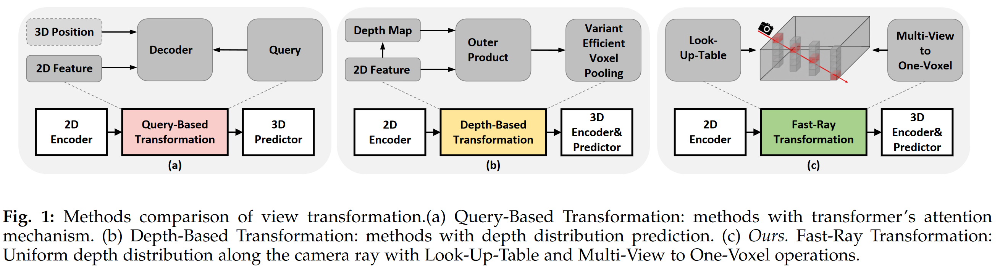
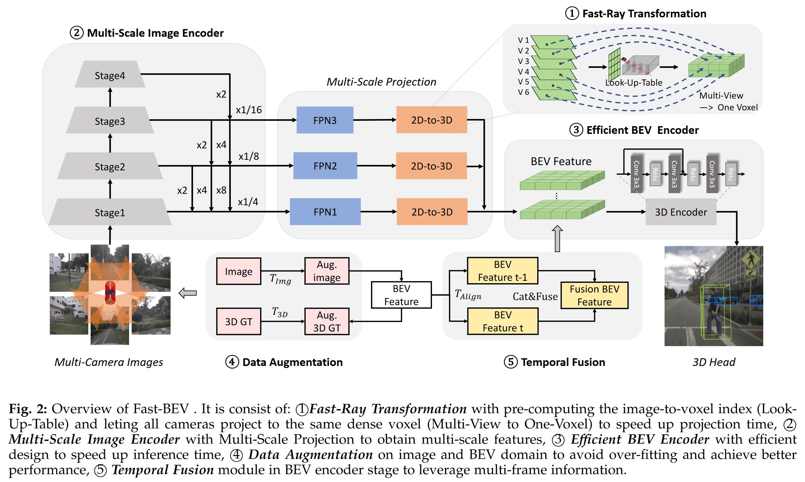
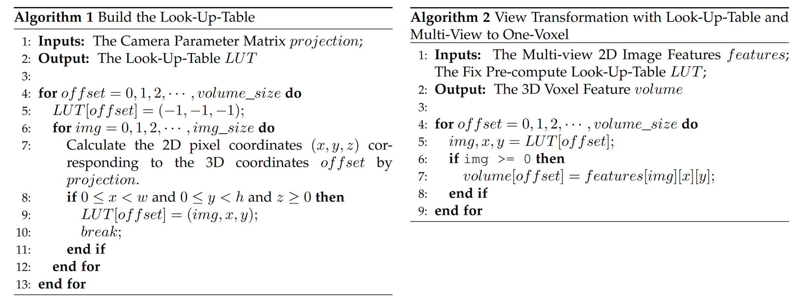
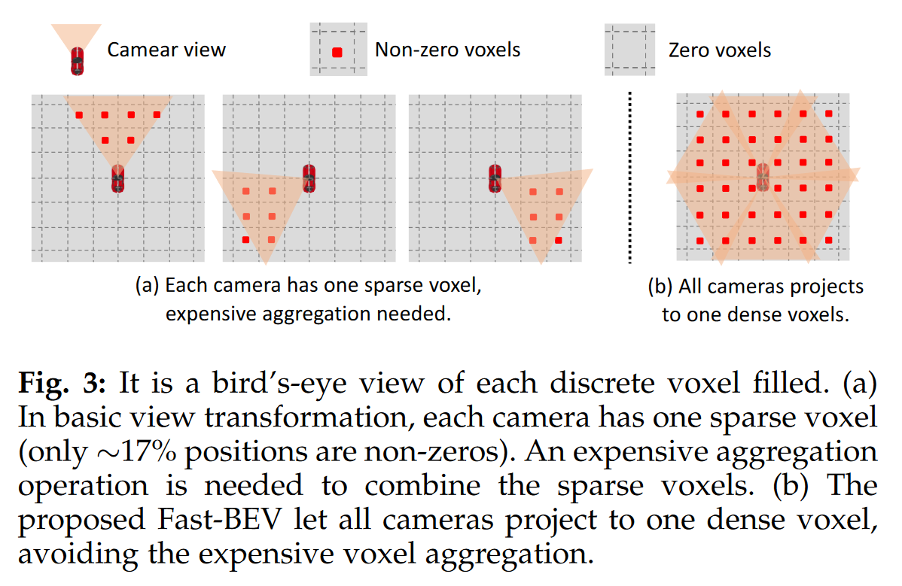
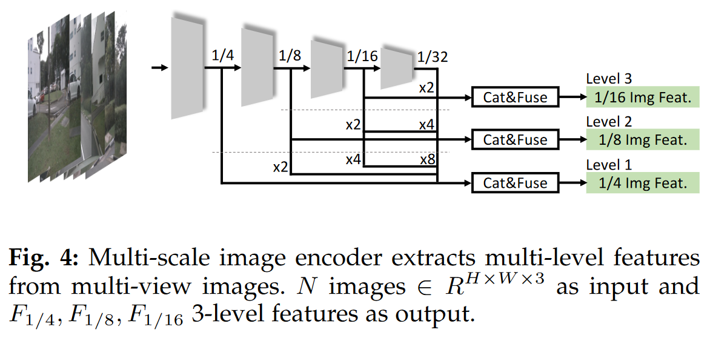
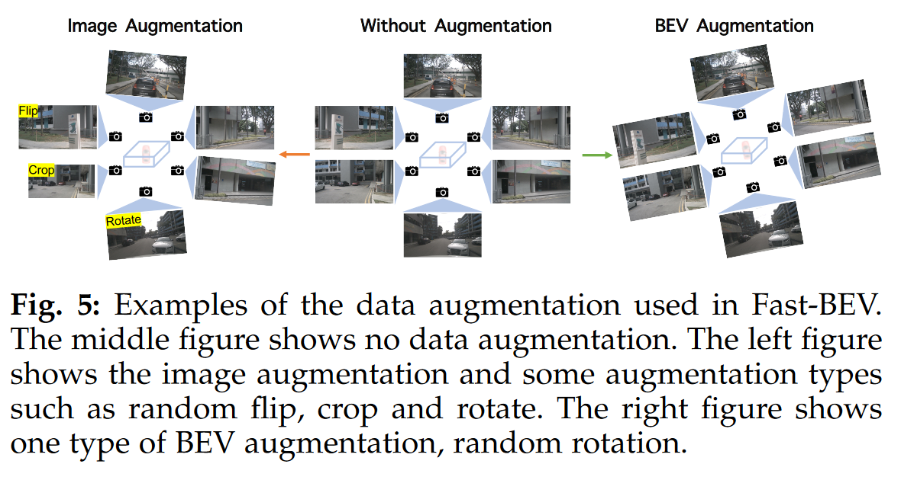
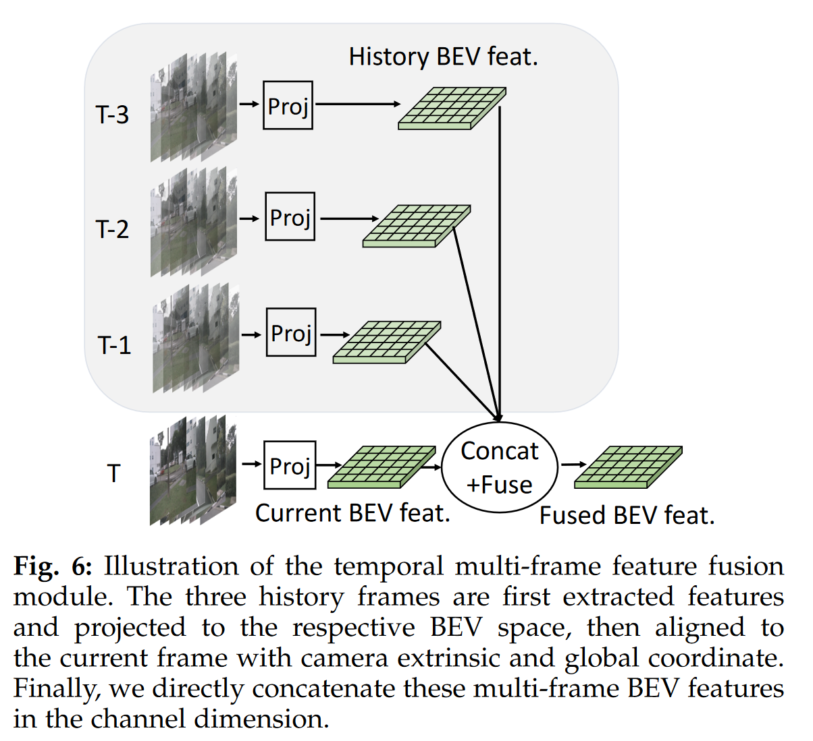
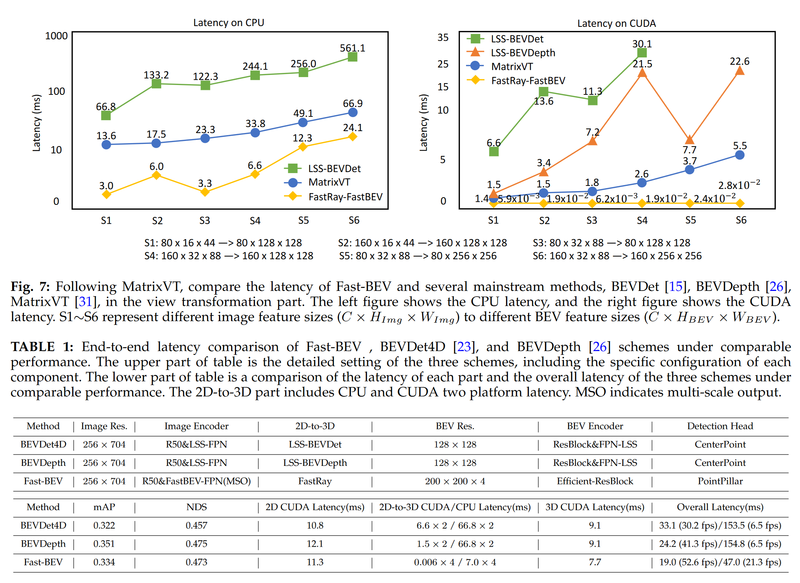

# 02_FAST-BEV

## Info

> 论文：[https://arxiv.org/abs/2301.12511](https://arxiv.org/abs/2301.12511)
>
> github：[https://github.com/Sense-GVT/Fast-BEV](https://github.com/Sense-GVT/Fast-BEV)
>
> 本地 github：[https://github.com/leijobs/Fast-BEV](https://github.com/leijobs/Fast-BEV)

## Framework

### Abstract

针对当前基于 transformer 和 depth 表示的 BEV 感知算法在速度和部署上的问题，提出 Fast-BEV，工作和贡献如下：

### Intro

当前的 BEV（2D-3D）投影过程主要分为（a）Query-Based 变换，（b）Depth-Based 变换

1. Query-Based 变换：Decoder 过程需要注意力机制，硬件要求高
2. Depth-Based 变换：voxel 池化计算过程需要加速，往往依赖于 cuda；推理缓慢

1. Fast-BEV：类似于传统 BEV 变换，通过 path-tracing 和查找表进行计算

### Method

#### Rethink BEV Perception 2D-to-3D Projection

- Query-Based 2D-3D 变换过程可以描述为：

$$
F_{BEV}(x,y,z)=Attn(q,k,v)
$$

其中，q，k，v 分别表示 query，key 和 value；$q \subset P_{x y z}, k, v \subset F_{2D}(u,v)$；而$P_{x y z}$表示预先定义的 3D 空间的锚点，（x, y, z）表示空间坐标，$F_{2D}(u,v)$表示图像平面的特征，（u, v）表示像素坐标

缺点：在 **Attn** 过程需要消耗大量资源，计算效率低

- Depth-Based 2D-3D 变换过程可以描述为：

$$
F_{\text {bev }}(x, y, z)=\operatorname{Pool}\left\{F_{2 D}(u, v) \otimes D(u, v)\right\}_{x, y, z}
$$

其中，$F_{2D}(u,v)$表示图像平面的特征，（u, v）表示像素坐标，$D(u,v)$表示 2D 图像上的深度预测结果，而$\otimes$操作表示 voxel pooling 操作，往往依赖于 cuda 支持

缺点：在$\otimes$时，图像像素分辨率低，高维矩阵计算依赖于 cuda 支持；并导致推理效率低

#### Overview of Fast-BEV

如下图为 Fast-BEV 的感知框架，包含 5 个部分，将在后面分别论述

#### Fast-Ray Transformation

假设：类似于 LSS，假设图像的深度分布均匀

1. 预先计算出 2D BEV 的 Look-Up-Table，加速计算
2. Multi-View to One-Voxel：多个相机的数据投影的同一个 voxel，相比于 LSS 等方法更快，并能在 cpu 实时运行

##### Look-Up-Table

只要相机的位姿和内外参固定，就可以通过查找表保存相机像素 2D-3D 的 mapping 关系，速度非常快

##### Multi-View to One-Voxel

如图 3 所示，单个相机的 FOV 有限，因此只有大概 17% 的 voxel 非空

内容：重叠区域采用第一个视图的数据

#### Multi-Scale Image Encoder

对于 N 张图片输入，满足$N \in R^{H \times W \times 3}$，作为 ResNet-50 等网络的输入提取多维度的特征$F_i,i={1,2,3,4}$，满足维度为$\frac{H}{2^{i+1}} \times \frac{W}{2^{i+1}} \times C$，使用 FPN 对特征进行汇聚和输出，最终得到$F_{1/4}、F_{1/8}、F_{1/16}$的特征

因此，通过 Fast-Ray Transformation 输出的 3 层网络的特征满足 $F=\{R^{N \times \frac{X}{i} \times \frac{Y}{i} \times C} \mid X_{i} \in[4,8,16]\}$，对应通过 multi-scale projection 得到的 BEV 的特征满足 $V=\{R^{X_{i} \times Y_{i} \times Z \times C} \mid X_{i}, Y_{i} \in[200,150,100]\}$

#### Efficient BEV Encoder

BEV 特征是 4D 张量，时空融合还要加上一个 temporal 特征，将导致较大的计算量

3D 张量是较为常用的张量形式，其计算速度也较快，因此需要把高维张量转化为 3D 张量，操作包括：”space-to-channel” (S2C)、multi-scale concatenation fusion (MSCF) 、the multi-frame concat fusion (MFCF)

- S2C 操作：融合张量： $V=\{R^{X_{i} \times Y_{i} \times Z \times C} \} \Rightarrow V=\{R^{X_{i} \times Y_{i} \times ( ZC)} \}$
- MSCF 操作：融合多尺度特征，通过将特征上采样到同样维度来实现
- MFCF 操作：融合多帧特征： $Fuse(V_i \mid V_i \in R^{X_{i} \times Y_{i} \times ZCF_{scales}T_{frames}} ) \Rightarrow V_i \mid V_i  \in \{R^{X_{i} \times Y_{i} \times C_{MSCF \& MFCF} }  \} ，i \in 3 - level$

另外，实验证明 BEV encoder 中 block 的数量和 voxel 分辨率大小对于性能影响不大，因此建议较少的 block 和小的 voxel，有助于加快计算

#### Data Augmentation

- 图像增强：【改变内参】flipping, cropping and rotation
- BEV 特征增强：【改变外参】flipping, scaling and rotation -> 注意：使用时，真值数据也需要一并修改

#### Temporal Fusion

参考 BEVDet4D 和 BEVFormer，Temporal 融合通过空间对齐和 concat 实现，每帧间隔为 0.5 秒

改进：3 帧历史帧，历史帧也计算梯度

#### Detection Head

参考 Pointpillars，使用 3 个并行的 1x1 卷积对 BEV 特征进行处理，能够预测目标的类别、box 和方向；loss 也是沿用 Pointpillars 的：

$$
\mathcal{L}_{det} = \frac{1}{N_{pos}} (\mathcal{B}_{cls} \mathcal{L}_{cls} + \mathcal{B}_{loc} \mathcal{L}_{loc} + \mathcal{B}_{dir}\mathcal{L}_{dir})
$$

其中，$N_{pos}$是预测为 positive 的 anchor 数量，$L_{cls}$是 Focal loss，$L_{loc}$是平滑的 L1 loss，$L_{dir}$是二进制交叉熵 loss

### Experiments

除去性能对比，还研究了通道数、图像分辨率、voxel 维度对于计算延迟的影响

