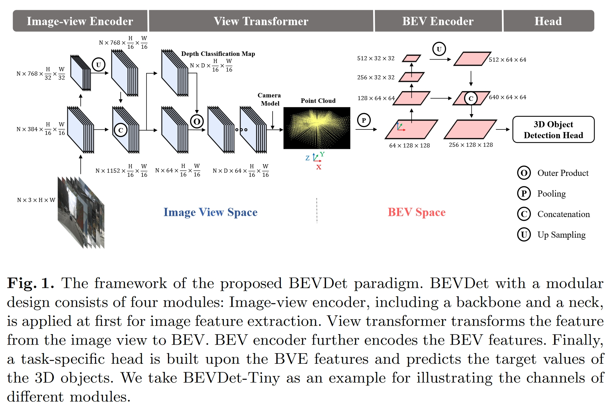
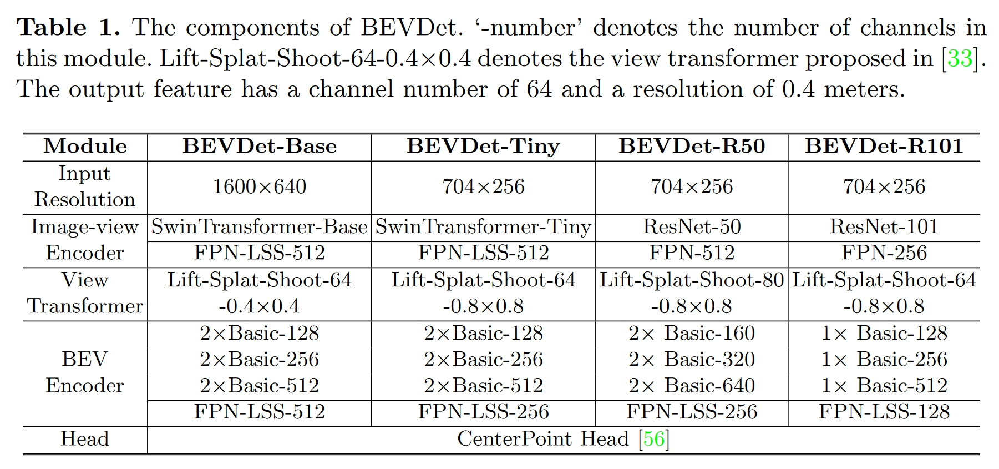
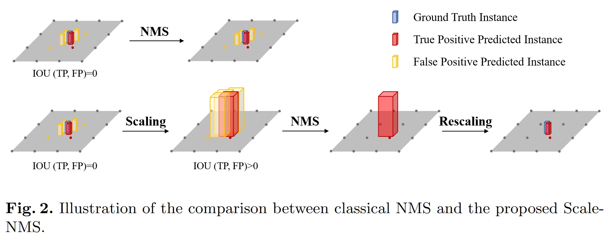
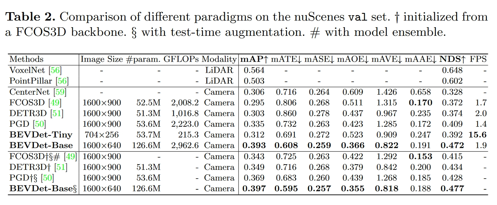
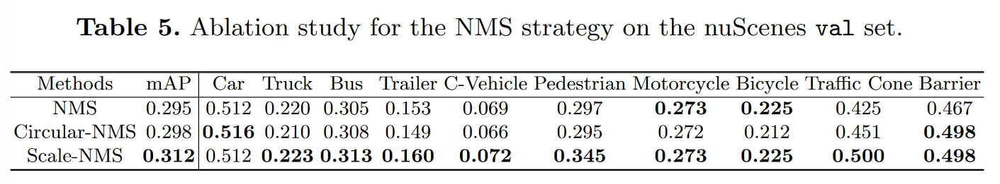
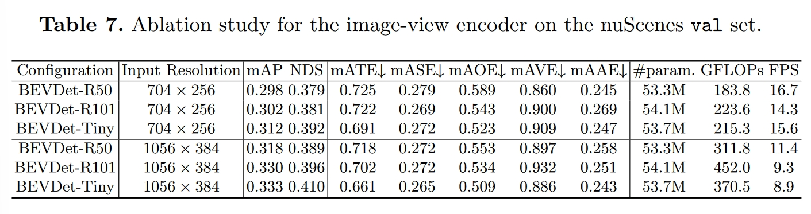
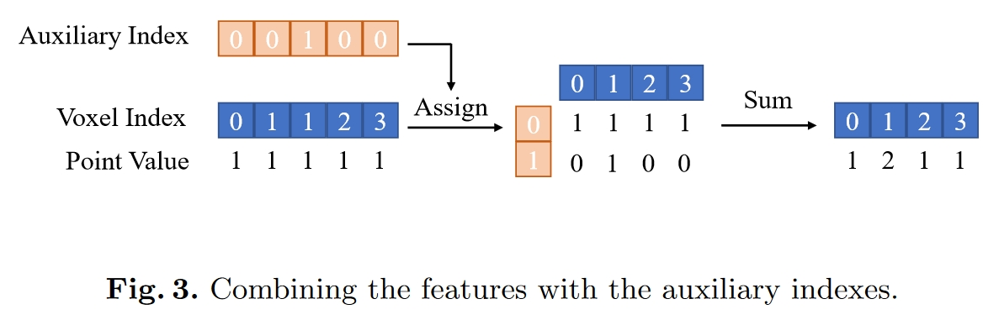

# 04_BEVDet

## Info

> 论文：[https://arxiv.org/abs/2112.11790](https://arxiv.org/abs/2112.11790)
>
> github：[https://github.com/HuangJunJie2017/BEVDet](https://github.com/HuangJunJie2017/BEVDet)

## Framework

### Abstract

提出了一个新的 3D 的 BEV 感知范式，改进包括：

### Intro

- Image-view-based 3D 检测：

  - FCOS3D、PGD
- BEV-based 3D 检测：

  - PON、LSS、VPN

如图为 BEVDet 的网络框架，与其他BEV算法框架相似，并采用模块化设计，其基本流程为：

1. image-view encoder提取image-view特征
2. view-tranfomer将image-view特征转换到BEV空间表示
3. BEV encoder在BEV空间对特征进行refine
4. task-head用于与任务相关的检测头，比如detection、segmentation以及多任务

改进尝试与问题分析：

1. 参考FCOS3D，PGD，其数据处理（增强）策略导致BEV空间overfitting --> 引入BEV空间的数据增强策略
2. 参考LSS引入数据增强 --> 但是该方法与BEV encoder不兼容，导致性能降低
3. image-view空间的batch size为$N = 6$（nuscene数据集），而归一化到BEV空间对应为1，导致BEV空间学习的overfitting
4. view-transformer将导致image-view空间的数据增强失效 --> BEV空间数据增强阻止overfitting

其他改进：

1. 引入Scale-NMS，提升小目标检测回归
2. 多视图特征填充的加速推理操作

### Related Work

- FCOS3D：

  - 空间位置预测准，速度和方位预测差
  - 硬回归，计算量大，实时性差
- DETR、DETR3D：

  - 同样计算量大、实时性差
- LSS：

  - 性能优异，接近于 Lidar
  - 训练依赖于 depth

### Methodology

如图为 BEVDet 的网络框架，包含 4 个部分：image-view encoder、view transformer、BEV encoder 和检测 Head

此外，BEVDet 衍生出多个变种如下：

#### Image-view Encoder

功能：将 image-view 的图像通过 image-view encoder 提取 high-level 的特征

BackBone：为了提取多尺度特征，选取了 ResNet 和 SwinTransformer 作为 backbone

Neck：选择改进的 FPN（参考 [LSS](https://arxiv.org/abs/2008.05711)），FPN-LSS，并将 1/16 和 1/32 的特征进行 concat

#### View transformer

功能：将 image-view 的特征进一步通过 view transformer 转换到 BEV 视图

参考 [LSS](https://arxiv.org/abs/2008.05711)，以 image-view 特征作为输入，通过分类来稠密预测出深度 score，分类的 score 通过将 image-view 特征渲染到预先定义的点云空间得到，最后通过在 z 轴上进行 pooling 操作得到 BEV 特征

在实践中设定的 BEV 深度范围为 [1, 60]，网格间隙为 $1.25 \times r$，其中$r$ 为 BEV 输出特征的分辨率

#### BEV Encoder

功能：将 BEV 视图通过 BEV Encoder 编码为 BEV 特征

类似于 image-view encoder，同样参考 [LSS](https://arxiv.org/abs/2008.05711)，选择 ResNet 和 FPN-LSS

#### Head

功能：结合任务选择合适检测头，比如 Detection、Segmantation 等

这里简单使用 CenterPoint 用于对比 Lidar-based 算法，比如 Pointpillar、VoxelNet

### xxxxxxxxxx |-- configs|   |-- 3dssd|   |-- _base_|   |-- benchmark|   |-- centerpoint|   |-- dynamic_voxelization|   |-- fastbev|   |-- fcos3d|   |-- fp16|   |-- free_anchor|   |-- groupfree3d|   |-- h3dnet|   |-- imvotenet|   |-- imvoxelnet|   |-- m2bev|   |-- mvxnet|   |-- nuimages|   |-- paconv|   |-- parta2|   |-- pointnet2|   |-- pointpillars|   |-- regnet|   |-- second|   |-- ssn|   `-- votenet|-- mmcv_custom|   |-- checkpoint.py|   |-- cpp_extension.py|   |-- multi_scale_deform_attn.py|   `-- remove.sh|-- mmdet3d|-- script|   `-- view_tranform_cuda|-- setup.cfg|-- setup.py`-- tools    |-- __init__.py    |-- analysis_tools    |-- convert_ckp.py    |-- create_data.py    |-- create_data.sh    |-- data_converter    |-- eval.py    |-- fastbev_run.sh    |-- misc    |-- model_converters    |-- slurm_analysis.sh    |-- slurm_eval.sh    |-- slurm_test.sh    |-- slurm_train.sh    |-- slurm_vis.sh    |-- test.py    `-- train.pybash

#### The Isolated View Spaces

给定一个带深度$d$的 $\mathbf{p}_{image}=[x_i,y_i,1]^T$的图像，那么像素在 3D 空间的表示为：

$$
p_{camera}=I^{-1}(p_{image}*d)
$$
其中， $I$表示相机的内参矩阵

在 image-view 的数据增强中常用的手段为 flipping，cropping 和 rotation 等，对应引入的影响为一个 $3 \times 3$旋转矩阵$A$，可以表示为 $p\prime_{image}=Ap_{image}$ ；为了保证BEV视图下目标和特征的空间一致性，那么需要进行 $A^{-1}$ 变换从而还原数据增强的影响，那么：

$$
p\prime_{camera}=I^{-1}(A^{-1}p\prime_{image}*d)=p_{camera}
$$

根据公式可知，在 image-view 平面的数据增强将不会影响到 BEV 视图的特征，因此在 BEV 视图需要重新进行数据增强

#### BEV Space Learning with Data Augmentation

BEV 空间的数据数量远少于 image-view 的图像数量（Nuscene 中为 6），从而容易导致过拟合

这里引入 Lidar-based 方法来实现数据增强，即在 BEV 空间来实现数据增强，包括：flipping、scaling 和 rotation 等；值得注意的是，BEV 特征和目标 Pose 都需要采用相同的数据增强操作来保证空间位置的一致性；另外，由于 BEVDet 采用了能够从 image-view 特征中解耦 BEV 特征的 view transformer，因此以上数据增强策略可能只适用于 BEVDet，其他无法解耦 BEV 特征的算法效果可能并不理想

### Scale-NMS

在 image-view 空间下，不同类别的目标的空间分布都是一致的（分布于一定区域的 2D 像素），因此传统的 NMS 只需要设定一个阈值就能够通过 bbox 间的 IOU 来过滤

而在 BEV 空间下不同类型的目标的分布概率则不尽相同，传统的 NMS 不再适用于 BEV 空间，因为此时 IOU 往往较小，并且不同类别对应的 IOU 也有所区别，比如行人和路锥占据的空间往往较小，甚至小于检测头的分辨率（如 CenterPoint 设置的 0.8m）一般的策略是生成冗余的预测，这样会有大量的目标框与真值不与相交，此时传统的 NMS 则无法区分 true positive 和 false positive。

为此，作者引入了 Scale-NMS，通过缩放不同类别目标的尺度到较大尺度，从而确保目标之间存在一定的 IOU，过滤掉 false positive；在实际操作中，除了障碍物这种不规则类型，其他目标类型均适用于 Scale-NMS；而 Scale-NMS 的缩放系数为类别相关的超参数，在验证集中计算得到

### Experiments

#### Data Processing

作者使用$W_{in} \times H_{in}$表示输入图像的宽高，Nuscene 默认的输入图像尺度为 $1600 \times 900$

- Image-view 数据增强：

首先经过范围为$s \in  [W_in/1600 -0.06, W_{in}/1600 +0.11]$的随机 flipping、scaling，以及$r \in [-5.4°, 5.4°]$的随机 rotation，最终裁剪为$W_{in} \times H_{in}$的尺寸，最后的裁剪在水平方向随机，并在竖直方向固定，满足$\begin{aligned}i.e.,~(y_1,y_2)~=~(max(0,s*900-H_{in}),y_1+H_{in}\end{aligned}$，其中$y_1，y_2$为目标区域的上下边界；

- BEV space 数据增强：

BEV 空间的特征和 3D 目标的通过随机 flipping、范围为$[-22.5°, 22.5°]$的 ratation，以及范围为$[0.95, 1.05]$随机 scaling；

参考 CenterPoint，使用 CBGS 进行训练，在测试时，输入图像进行 scaling，满足$s = W_in/1600 + 0.04$，并裁剪到$W_{in} \times H_{in}$大小，并满足 
$$
(x_1,x_2,y_1,y_2)=(0.5*(s*1600-W_{in}), x_1+W_{in}, s*900-H_{in},y_1+H_{in})
$$

#### Inference Speed

BEVDet 算法基于 mmdetection3d 实现，并对比了其他诸如 FCOS3D、PGD 算法，对于单目 3D 算法的推理速度除以了图像数量$N = 6$，认为是独立处理每张图像，性能对比如下所示：

#### Ablation Study

##### Data Augmentation

论文的数据增强策略主要是 image-view 数据增强（IDA）以及 BEV 视图数据增强（BDA），并研究了 BEV encoder 的影响，结论包括：

1. IDA 在没有 BDA 情况下产生负向效果，在 BDA 存在时起正向效果
2. IDA 对于 BEV encoder 有负面影响，BDA 对 BEV encoder 有正面影响

##### Scale-NMS

论文使用了三种 NMS 策略来测试性能，包括传统 NMS，CenterPoint 提出的 Circular-NMS 以及 Scale-NMS，结论包括：

1. Scale-NMS 在行人和路锥等小目标上提升巨大
2. Scale-NMS 在其他类别上也有着与其他 NMS 相似的性能

##### Resolution

论文使用了两种分辨率测试模型性能，结论包括：

1. 更大的分辨率意味着在目标方位、尺度上更好的预测性能
2. 更大的分辨率同样导致更大的计算负载以及推理延迟

##### Backbone Type in the Image-view Encoder

论文研究了在 image-view 模块使用的 backbone 的影响，并使用了两种分辨率

如图所示，在 $704 \times 256$ 分辨率下，ResNet-50 切换到 SwinTransformer-Tiny 时，性能有所提升（但是 BEVDet-R50 在速度预测上更准确，BEVDet-Tiny 在朝向预测更好）

当使用 $1056 \times 38$ 分辨率时，BEVDet-R01 性能提升较大，证明**输入分辨率对于感受野十分重要**

##### Acceleration

一般情况下，对于相同的 voxel（多视图之间会有重叠），view transformer 会累加重复区域的特征，但是累加操作将导致与对应点云数量成比例的推理延迟

为消除累加操作导致的延迟，这里引入辅助 index 来记录同一 voxel 被填充的次数

通过辅助 index 和 voxel index，能够将点云特征填充进 2D 的 BEV 特征矩阵，再单独基于辅助 index 对对应的 voxel 进行累加填充

在推理时刻固定了相机的内外参，那么辅助 index 和 voxel index 在初始化时也就确定了（参考 [LSS](https://arxiv.org/abs/2008.05711)）

通过以上修改，BEVDet-Tiny 的推理速度提升了 53.3%（从 137ms 到 64ms）

不过，以上操作需要额外内存来保存辅助 index，其内存大小由 voxel 数量和辅助 index 的最大值决定

实践中，限制幅值 index 的数量为 300，并丢弃剩余的点云，从而平衡精度和速度

## Code Framework
