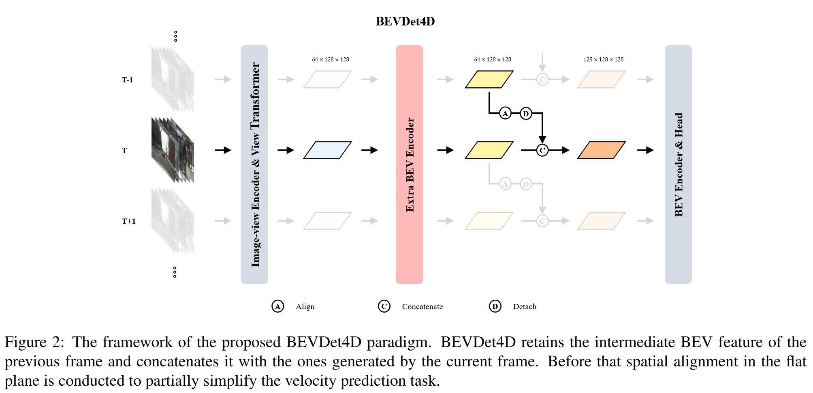
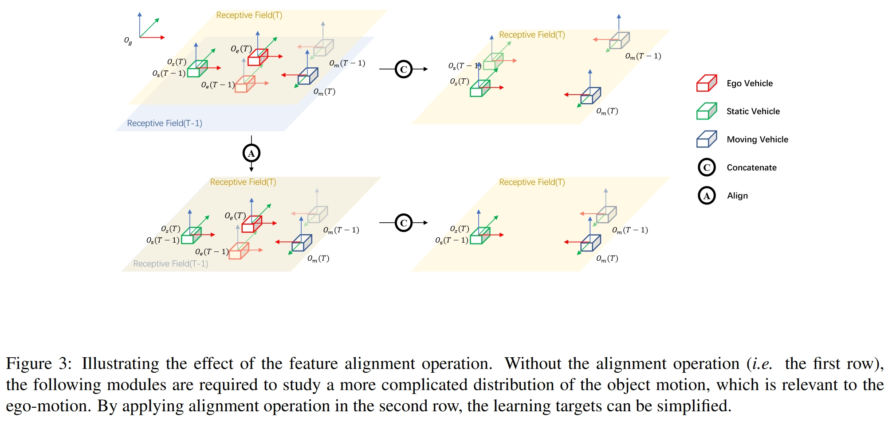
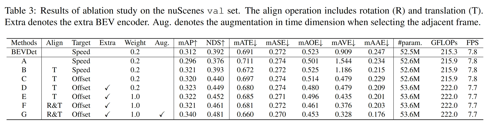
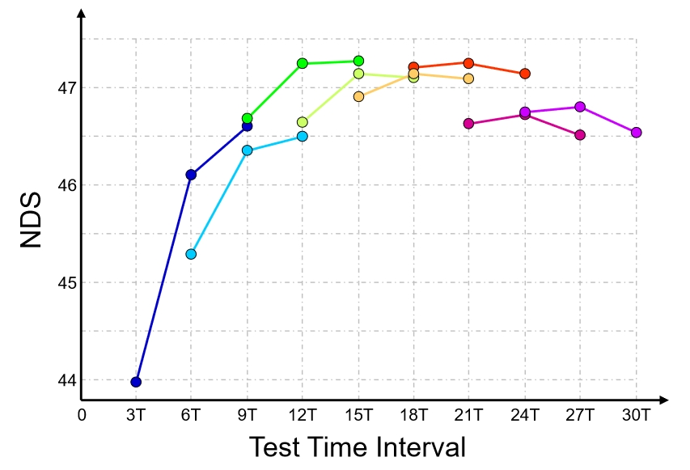
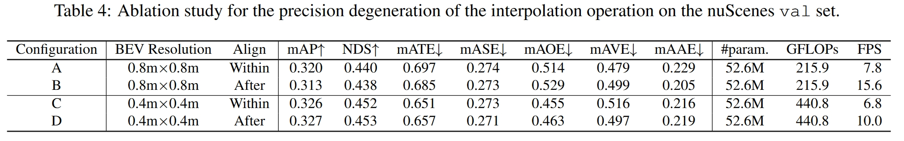
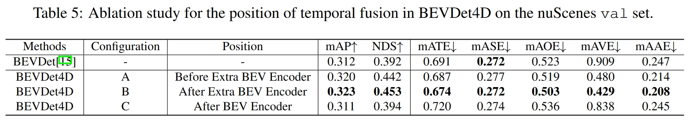

# 05_BEVDet4D

## Info

> 论文：[https://arxiv.org/abs/2203.17054](https://arxiv.org/abs/2203.17054)
>
> github：[https://github.com/HuangJunJie2017/BEVDet](https://github.com/HuangJunJie2017/BEVDet)

## Framework

### Abstract

提出了一个考虑 temporal 信息的 BEV 感知范式，改进包括：

1. temporal特征融合（当前帧和上一帧）
2. 将速度估计转化为当前帧和上一帧的距离差预测

性能：

1. 与Lidar或者Radar性能comparable的速度预测
2. 相同推理速度下的更强性能

### Intro

vision-based 方法 BEVDet 的速度预测误差是 Lidar-based 方法 CenterPoint 的 3 倍，是 Radar-based 方法 CenterFusion 的 2 倍，为了降低误差，作者引入 spatio-temporal 融合的 BEVDet4D。BEVDet4D 的工作包括：

1. BEVDet4D 是第一个融合时刻信息的 BEV 感知框架，通过空间对齐和 concat 实现时空融合
2. 在少量增加计算负载的情况下，使用 query 和对比来获得两帧间的时空特征

### Related Works

#### Vision-based 3D object detection

FCOS3D 将 3D 检测看作 2D 检测，直接硬回归目标的 3D 属性，其在目标位置预测准确而在平移、方位和速度上预测较差

PGD 扩展了 FCOS3D，通过预测目标的深度信息从而得到更为准确的预测结果，其性能可圈可点但是计算负载和推理延迟明显

参考 DETR，DETR3D 提出了基于注意力机制的 3D 目标检测，精度类似于 FCOS3D，其计算负载为 FCOS3D 的一半，但是推理时间由于复杂的 pipeline 限制，与 FCOS3D 接近

PETR 进一步扩展了 3D 检测的范式，引入了 3D 坐标系生成和位置 encoding 以及数据增强策略

Graph-DETR3D 在生成目标特征 query 时，在 3D 空间采样很多点，而不是单个点；另一个改进是通过缩放因子动态调整目标深度，从而为 DETR3D 引入了多尺度训练

BEVDet 的贡献在于在 3D 目标检测中引入了数据增强，并且显式的讲特征编码到 BEV 空间，为多任务学习、temporal 融合提供可能

temporal 融合还是少数，BEVFormer 使用循环网络来融合 temporal 特征，或者基于注意力机制实现融合，而其他 Lidar-based 方法则是融合多帧 sweep（中间帧）数据实现 temporal 融合

BEVDet4D 则是只是用相邻帧的数据进行融合，从而预测出更为准确的速度

#### Object Detection in Video

当前的 temporal 融合主要分为两种手段：

1. 上一帧的预测结果：与单帧的 3D 目标检测类似，相当于根据跟踪结果优化目标预测
2. 上一帧的中间特征：通过各种手段获得上一帧的中间特征，包括通过 LSTM 实现特征蒸馏，注意力机制，特征 query，通过光流实现特征对齐等等

BEVDet4D 类似于通过自车运动补偿空间误差并聚合 3D 空间特征，而且 BEVDet4D 致力于目标的速度预测，这不属于一般的 Video 检测任务

### Methodology

#### Network Structure

如图所示为 BEVDet4D 的基本框架，基本基于 BEVDet 实现，仍然包括四个模块：image-view encoder，view transformer，BEV encoder 以及 task-specific head

BEVDet4D 的改进在于引入了 temporal 特征融合（只使用了上一帧数据，而非多帧），其他改进包括空间对齐以及特征 concat，最后，view transformer 的输出特征过于原始，作者引入了额外的 BEV encoder 来聚合特征，这里使用了两个与输入特征维度相同的残差块进行 filter

#### Simplify the Velocity Learning Task

##### Symbol Definition

参考 Nuscene，作者首先进行了符号定义如下：

全局坐标系系统表示为$O_{g}-XYZ$ ，

自车坐标系系统表示为$O_{e(T)}-XYZ$ ，

目标坐标系系统表示为$O_{t(T)}-XYZ$

如上图所示构建的简单虚拟场景中包含一个绿色的$O_{m}-XYZ$运动目标、蓝色的$O_{s}-XYZ$静止目标以及自车，并包含了目标在$T-1$以及$T$两个相邻时刻在全局坐标系下的位置

以上目标的位置用$P^{x}(t)$表示，其中$x$满足如下表示：

$$
x~\in~\{g,e(T),e(T-1)\}
$$

其中，$t \in ~\{T,T-1\}$表示对应的两帧时刻，并使用$T^{dst}_{src}$表示初始坐标系到目标坐标系的变换

不对目标的速度进行直接估计预测，作者使用目标在相邻帧之间的位置变换来描述目标的运动速度，此时学习任务可以删除时间因子，简化为两帧 BEV 特征之间的位置变换

此外，目标的位置变换与自车运动无关，因此在估计目标运动时可以不考虑自车运动的影响，因此进一步简化了目标的速度估计

比如，全局坐标系下静态目标相对于运动的自车而言为运动目标；此外，BEV 特征的感受野在自车周边是对称的，那么 view transformer 输入相邻帧数据生成的两帧 BEV 特征，由于自车运动影响，其感受野也会发生变换

给定一个静态目标，其全局坐标系下在$T-1$及$T$时刻的位置表示为$P^g(T-1)$以及$P^g(T)$，那么两帧间的位置平移可以表示为如下：

$$
\begin{aligned}
&\begin{aligned}\mathbf{P}_s^{e(T)}(T)-\mathbf{P}_s^{e(T-1)}(T-1)\end{aligned} \\
&= \mathbf{T}_g^{e(T)}\mathbf{P}_s^g(T)-\mathbf{T}_g^{e(T-1)}\mathbf{P}_s^g(T-1)  \\
&= \begin{aligned}\mathbf{T}_g^{e(T)}\mathbf{P}_s^g(T)-\mathbf{T}_{e(T)}^{e(T-1)}\mathbf{T}_g^{e(T)}\mathbf{P}_s^g(T-1)\end{aligned} 
\end{aligned}
$$

此时静态目标在自车坐标系下的位置平移可以视为全局坐标系下坐标$P_s^g(T)$和$P^g(T-1)$首先经过$T_g^e(T)$转换到自车坐标系下，再考虑自车在两帧间的运动平移 $T_{e(T)}^{e(T-1)}$ 得到。根据公式可知，如果直接 concat 两帧 BEV 特征，那么目标的位置将与自车运动相关，即 $T_{e(T)}^{e(T-1)}$ 

为了避免以上情况，需要在相邻帧间目标坐标表示中消除 $T_{e(T)}^{e(T-1)}$ 的影响，对上一公式进一步转换：首先在上一帧$T-1$时刻下静态目标在自车坐标系下的位置$P_s^{e(T-1)}(T-1)$转换到当前$T$时刻下自车坐标系下 $T_{e(T-1)}^{e(T)}P_s^{e(T-1)}(T-1)$ ，再用$T$时刻当前位置减去转换后的位置同样可以得到静态目标的运动平移（即以自车坐标系为基准，补偿上一帧静态目标的位置到当前帧再计算，而非之前的直接转换到全局坐标系下）

最终公式如下：

$$
\begin{aligned}
&\begin{aligned}\mathbf{P}_s^{e(T)}(T)-\mathbf{T}_{e(T-1)}^{e(T)}\mathbf{P}_s^{e(T-1)}(T-1)\end{aligned} \\
&= \begin{aligned}\mathbf{T}_g^{e(T)}\mathbf{P}_s^g(T)-\mathbf{T}_{e(T-1)}^{e(T)}\mathbf{T}_{e(T)}^{e(T-1)}\mathbf{T}_g^{e(T)}\mathbf{P}_s^g(T-1)\end{aligned}  \\
&= \mathbf{T}_g^{e(T)}\mathbf{P}_s^g(T)-\mathbf{T}_g^{e(T)}\mathbf{P}_s^g(T-1)  \\
&\mathbf{P}_s^{e(T)}(T)-\mathbf{P}_s^{e(T)}(T-1)
\end{aligned}
$$

根据以上公式，**目标位置的学习任务可以转换为当前帧下自车坐标系下进行表示，此时与自车运动无关**

在实践中，上一公式的空间对齐操作通过空间对齐实现（即 BEV 特征始终以当前帧的自车坐标系为中心，需要将上一帧的 BEV 特征进行$\mathbf{T}_{e(T)}^{e(T-1)}$运动补偿）

给定上一帧以及当前帧的特征分别为$\begin{aligned}\mathcal{F}(T-1,\mathbf{P}^{e(T-1)})\end{aligned}$、$\begin{aligned}\mathcal{F}(T,\mathbf{P}^{e(T)})\end{aligned}$，那么对齐操作表示如下：

$$
\mathcal{F}^{\prime}(T-1,\mathbf{P}^{e(T)})=\mathcal{F}(T-1,\mathbf{T}_{e(T)}^{e(T-1)}\mathbf{P}^{e(T)})
$$

注意，如果没有对应的有效位置，那么将进行双线性插值，双线性插值是次优的方法，将会导致精度损失，精度损失的程度与 BEV 特征的分辨率负相关，分辨率越大，精度损失越小

更为精确的方式是在 lifting 操作时，在 view transformer 中调整预定义的点云坐标系，论文未采用此操作，因为将需要每次更新 view transformer 预定义的点云坐标系，导致计算效率降低，影响程度在消融实验中也进行了分析

#### Ablation Studies

##### Road Map of Building BEVDet4D

BEVDet4D 以 BEVDet 作为 baseline，其改进如下：

结论包括：

1. 参考$Tab(A)$，直接 concat 相邻帧特征会导致性能降低，尤其是位置平移和速度估计（自车运动导致重叠特征，confuse 模型），对于运动目标而言，BEVDet 很难基于单帧来正确预测目标的速度，此时需要移除$\mathbf{T}_{e(T)}^{e(T-1)}$分量并考虑时间因子
2. 参考$Tab(B)$，增加了平移的空间补偿，但是删除了$\mathbf{T}_{e(T)}^{e(T-1)}$分量，此时平移误差相较于 baseline 有一定降低，但是速度误差仍高于 baseline（相邻帧的时间间隔不一致，其对位置分布影响小，而对速度分布影响较大）
3. 参考$Tab(C)$，删除了时间因子，通过平移运动补偿使模型直接预测目标的平移，此操作使得速度预测误差仅为 BEVDet 的 $52.7\%$
4. 参考$Tab(D)$，在 concat 两帧特征前，增加了额外的 BEV encoder，计算负载增加 $2.8 \%$，但是性能有不错的提升；而$Tab(E)$ 则是增大了速度预测的权重，其误差有所降低
5. 参考$Tab(E，F)$，主要的区别在于是否空间旋转对齐，精确的空间对齐有利于速度预测
6. 为研究最优的 TTI 参数（当前帧与上一帧的间隙），作者使用了 12Hz 的未标注的 sweep 数据而非 2Hz 的标注数据，则$T \approx 0.083s$，作者使用了不同时间间隔来测试参考帧的影响，如图所示，当使用 15T 时取得最优；而参考$Tab(G)$，通过在$[3T, 27T]$时间范围内随机采样，在速度预测上取得了较好的效果

##### Precision Degeneration of the Interpolation

在研究插值的精度损失时，使用$Tab(C)$对应的配置，结论包括：

1. 采用 $0.8m \times 0.8m$ 的低分辨率 BEV 时，速度预测精度降低，表面低分辨率特征下插值将引入系统误差，但是由于没有打破 BEVDet 使用的加速手段，因此推理速度与 BEVDet-Tiny 基本一致
2. 采用 $0.4m \times 0.4m$ 的高分辨率 BEV 时，双线性插值的影响不明显，表明高分辨率的 BEV 特征有助于降低线性插值导致的精度损失；另外，为了加速考虑，view transformer 并未使用空间对齐操作（更精确但推理延迟高）

##### The Position of the Temporal Fusion

最后，研究了 temporal 融合的设置位置对于性能的影响，结论如下：

1. $Tab(B)$在各方面都实现了最优的性能
2. 采用$Tab(A)$配置时，速度误差反而增大 $11.9\%$，这表面 view transformer 生成的 BEV 特征过于原始，可以通过额外的 BEV encoder 进行 refine
3. 采用$Tab(C)$配置时，总体性能有所降低，与基线接近，并且尽管引入了 tempoal 融合，速度误差略微降低而平移误差明显增大，表明 BEV encoder 对于 BEVDet4D 范式非常重要，能够有效降低由于引入前一帧导致模型对目标位置的误解以及速度估计

