# 03_OpenCalib

## Info

> 论文：
> [https://arxiv.org/abs/2205.14087](https://arxiv.org/abs/2205.14087)
> github：[https://github.com/PJLab-ADG/SensorsCalibration](https://github.com/PJLab-ADG/SensorsCalibration)

## Manual Target-less Calib

### Lidar2Camera

3D Lidar 点云在 Lidar 坐标系下可以表示为$p^L_i = (X_i,Y_i,Z_i) \in \mathbb{R}^3$，需要投影到相机坐标系得到$p^C_i = (X_c,Y_c,Z_c)^T \in \mathbb{R}^3$通过如下转换：

$$
p^C_i = R \cdot p^L_i + t
$$

其中，$R$表示三维旋转，$t$表示三维平移

下一步，三维点云将投影到 2D 图像空间，通过投影变换：

$$
K: \mathbb{R}^3 \rightarrow \mathbb{R}^2, q_i = K(p^C_i)
$$

其中，$K$为相机内参矩阵

工具中可以调节点云大小，而 IntensityColor 用于稠密颜色显示，OverlapColor 用于估计深度间隔为 0.4m 的点云的重叠程度

### Lidar2Lidar

Lidar 到 Lidar 的标定相当于两组点云的匹配，可以用 ICP 和 NDT 进行匹配，两组点云可以表示为$p^S_i = (X_i,Y_i,Z_i) \in \mathbb{R}^3$和$p^T_i = (X_i,Y_i,Z_i) \in \mathbb{R}^3$，两者之间的刚性变换可以表示为：

$$
p^S_i = R \cdot p^T_i + t
$$

### Radar2Lidar

- 这里的 Radar 是 2D Radar，4D Radar 相当于 Lidar

2Dradar 与 Lidar 外参标定与 Lidar2Lidar 标定一致，只不过 Radar 少了高度信息，因此需要的参数更少，对应的$R$和$t$都少一个维度

### Radar2Camera

- 同样是默认 2D Radar，4D Radar 相当于 Lidar

首先，2D radar 需要水平于对面安装，而相机则需要计算其与地面的单应矩阵（通过车道线取点计算），然后在 BEV 视图下可视化

单应矩阵计算出来了，那就认为 radar2camera 标定完成

## Automatic Target-based Calib

### Camera Calib

张氏标定法基于小孔成像模型，通过角点计算相机的内参和畸变，但是小孔成像模型是一个简化的模型，真实的相机畸变更为复杂且不存在绝对的光心

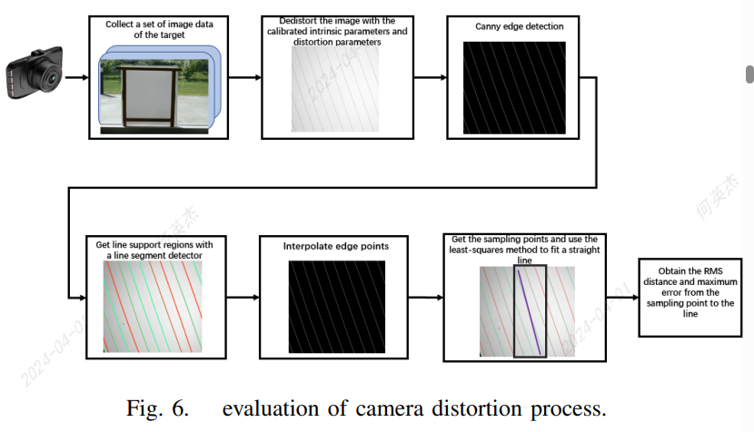

这里采用 Tang 的标定法，流程如下：

1. 相机采集包含 target 的图像，保证 target 充满图像
2. 图像去畸变得到 undistorted 图像
3. 使用 Canny 算法提取线段，并使用 NMS 保证线段是非连续的，而使用线性插值可以获得连续的直线，之后进行高斯采样获得线性采样点
4. 用最小二乘法拟合线段
5. 根据如下公式计算从采样点到拟合直线的均方根误差和最大误差距离

假设回归线段表示为：

$$
\alpha*x+\beta*y-\gamma=0
$$

均方根误差和最大误差距离表示如下：

$$
\begin{aligned}S&=\sum_{i=1}^L\sum_{i=1}^{N_l}|S_{li}|^2=\sum_{i=1}^L\sum_{i=1}^{N_l}(\alpha_l*x_{li}+\beta_l*y_{li}-\gamma_l)^2\\d_{max}&=\sqrt{((\sum_{l=1}^L|max_iS_{li}-min_iS_{li}|^2)/L)}\end{aligned}
$$

均方根误差和最大误差距离用于验证相机畸变系数的质量

### Lidar2Camera

Lidar 的自动标定依赖于标定板如下：

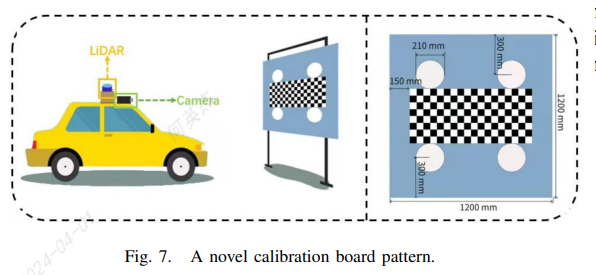

标定流程如下：

1. 通过标定板完成相机内参标定和 Camera2Board 的外参标定
2. 根据 2D 圆环中心可用于计算相机和 Lidar
3. 将 Lidar 点云投影到相机平面，相机圆环中心和点云圆环中心可以构造多组 2D 匹配用于外参求解
4. 2D 匹配间使用欧式距离优化标定参数，同时棋盘格的边缘也可以用于外参求解优化

通过满足标定板的角点约束，从而实现 Lidar 和相机的对齐，首先标定板的角点数量远大于圆孔数量，因此 Lidar-camera 对齐误差的权重远大于 board2camera 的对齐误差，优化的目标函数如下：

$$
\mathcal{J}_{\boldsymbol{sum}}=\alpha\mathcal{J}_{\boldsymbol{board}}+\beta\mathcal{J}_{\boldsymbol{lidar}}
$$

其中，$\mathcal{J}_{\boldsymbol{board}}$表示标定板上角点的重投影误差，$\mathcal{J}_{\boldsymbol{lidar}}$表示标定板上圆环中心的重投影误差，实验中设置$\alpha = 1$和$\beta = 60$

而$\mathcal{J}_{\boldsymbol{board}}$和$\mathcal{J}_{\boldsymbol{lidar}}$分别表示如下：

$$
\mathcal{J}_{\boldsymbol{board}}=\sum_{(u,v)\in P_B}(||u-u_{det}||_2+||v-v_{det}||_2)
$$

其中，$(u,v)$表示经过$P_B$投影的像素点，$(u_{det},v_{det})$表示实际检测的像素点

$$
\mathcal{J}_{\boldsymbol{lidar}}=\sum_{(u,v)\in P_L}(||u-u_{det}||_2+||v-v_{det}||_2)
$$

其中，$(u,v)$表示经过$P_L$投影的像素点，$(u_{det},v_{det})$表示实际计算的像素点

## Automatic Target-less Calib

### Imu heading

该部分用于 Imu 和 Vehicle 的 heading 对齐，因此只标定横摆角$\gamma_{offset}$，假设车辆在对应时刻的 heading 为$\gamma_{gd}$，Imu2Vehicle 的偏移量为$\gamma_{IMU}$。

使用 b 样条采样来对传感器数据进行平滑，此外只使用直线行驶的数据用于标定，标定公式表示如下：

$$
\gamma_{\mathrm{offset}}=\frac{1}{|S_{l}|}\sum_{l\in S_{l}}(\gamma_{\mathrm{gd}}^{l}-\gamma_{\mathrm{IMU}}^{l})
$$

其中，$S_l$表示一段直行道路

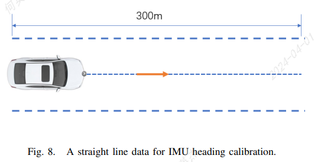

### Lidar2Camera

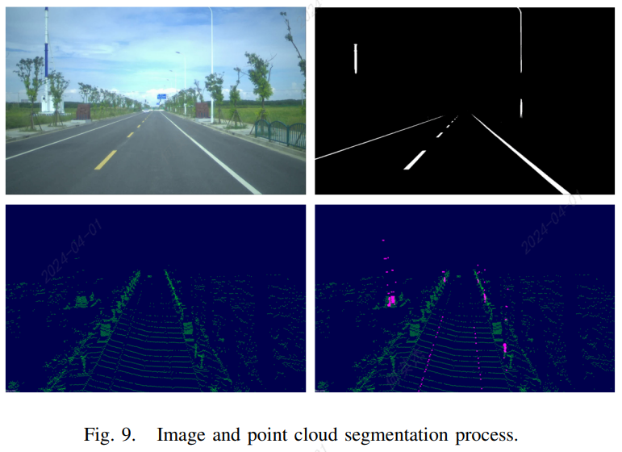

如图所示为 Lidar2Camera 的 Target-less 自动标定，流程如下：

1. 获得一组 Lidar 和 Camera 观测数据，分别从 Lidar 和 camera 提取车道线和道路特征，如图使用 BiSeNet-V2 提取的道路特征，以及几何方法提取的点云特征；之后构造一个 cost 函数来计算初始外参并确保误差处于可接受的范围；杆$Q_{pole}$的像素值和车道线$Q_{lane}$的像素值可以直接通过标签获得，将两者结合可以得到二进制 mask 满足：

$\mathcal{M}_{line} : \mathbb{R}^2 \rightarrow \{0, 1\},line \in \{pole, lane\} $，在坐标系定义如下：

$$
\mathcal{M}_{line}(\mathbf{q}):=\begin{cases}1&\mathbf{q}\in Q_{line}\\0&\mathrm{otherwise}&\end{cases}.
$$

1. 获得了图像和点云的特征之后，引入 cost 函数用于衡量给定$(r,t)$情况下的图像和点云的匹配质量；对 mask $S_l$使用逆深度变换（IDT）从而避免后续优化时复制重复最大值，得到的高度图满足$\mathcal{H}_{line},line \in \{pole, lane\}$，定义如下：

$$
\mathcal{H}_{line}(\mathbf{q}):=\begin{cases}\max_{\mathbf{s}\in\mathbb{R}^2\setminus Q_{line}}\gamma_0^{\|\mathbf{q}-\mathbf{s}\|_1}&\mathbf{q}\in Q_{line}\\0&\mathbf{q}\in\mathbb{R}^2\setminus Q_{line}\end{cases}.
$$

1. 下一步，引入，cost 函数 $\mathcal{J}_{\boldsymbol{proj}}: (r,t) \rightarrow \mathbb{R}$，表示投影的像素$P_{pole}$与$P_{lane}$和对应的 mask 的连续性，$\mathcal{J}_{\boldsymbol{proj}}$定义如下：

$$
\mathcal{J}_{\boldsymbol{proj}}=\tanh(\tau_1\sum_{line\in\{pole,~lane\}}\frac{\sum_{\mathbf{p}\in P_{line}^\mathrm{L}}\mathcal{H}_{line}\circ\mathcal{K}(\mathbf{R}(\mathbf{r})\mathbf{p}+\mathbf{t})}{|P_{line}^\mathrm{L}|})
$$

其中，符号$\circ$表示使用投影的像素位置获得对应的高度值；而$|P^L_{line}|$表示点云$P^L_{line}$的数量用于平衡杆和车道线的 cost；cost 函数越大，匹配关系越好，结果如图所示：

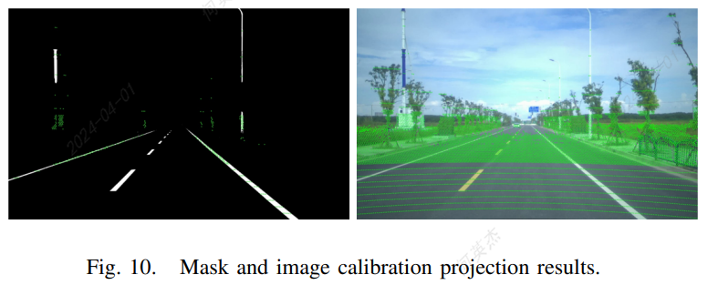

### Lidar2Imu

通常 Lidar2Imu 的标定精度由 Lidar 构建的 local map 的精度，标定过程就是通过滑窗从 Lidar 的 local map 中求解出外参

算法的核心思想是通过最小化协方差矩阵的特征值来最小化点到平面的距离和，从而达到求解 Lidar 到 Imu 之间的外参的目的，BA 优化用户最小化平面上特征点到平面的距离得到，公式如下：

$$
\begin{aligned}
(\mathbf{T}^*,\mathbf{n}^*,\mathbf{q}^*)& =argmin\frac1N\sum_{i=1}^N\mathbf{(n^T(p_i-q))^2}  \\
&=argmin(\underset{\mathbf{T}}{\operatorname*{min}}\sum_{i=1}^N{(\mathbf{n^T(p_i-q))^2}}
\end{aligned}
$$

其中，$P_i$表示滑动窗口中投影到 local map 中待优化的点，$q$表示相同特征的点，$n$表示平面法向量。优化的特征点位置和特征法向量雷表示为位姿函数$T$，因此只需要优化$T$即可，动态的体素化将加快特征提取速度，即已知网格中的点属于同一条边或者位置的平面上，迭代的在网格为 1m 的点云中搜索。在该方法中，Lidar 在世界坐标系下任意时刻$t$的位姿都可以获得，因此较为粗糙的初始外参可以通过公式如下：

$$
\mathbf{R}_I^\mathrm{L},\mathbf{P}_I^\mathrm{L}=argmin(||\mathbf{R}_I^\mathrm{L}\mathbf{T}(\mathbf{t})_I^\mathrm{M}-\mathbf{P}_I^\mathrm{L}-\mathbf{T}(\mathbf{t})_L^\mathrm{M}||^2)
$$

由于随着时间累积，系统误差将会逐渐增大，因此使用 local map 优化来修正这个问题

假设滑动窗口中的第一帧为$P$，当前帧为$O$，假设在$P$和$O$帧时从 Imu 坐标系到世界坐标系的变换分别为$T^W_{I_P}$和$T^W_{O_P}$，设 Lidar 到 Imu 的变换矩阵为为$T^I_{L}$根据坐标系的链式法则，那么$P$时刻到$O$时刻 Lidar 的坐标系变换可以通过如下公式计算：

$$
\mathbf{T}_P^\mathrm{O}=\mathbf{T}_L^\mathrm{I}\mathbf{T}_{I_o}^W\mathbf{T}_{I_P}^{W-1}\mathbf{T}_L^{I-1}
$$

基于以上公式构建一个 local map，local map 建立以后，雷达点和从$O$到之后的帧的相对位姿都可以获得。

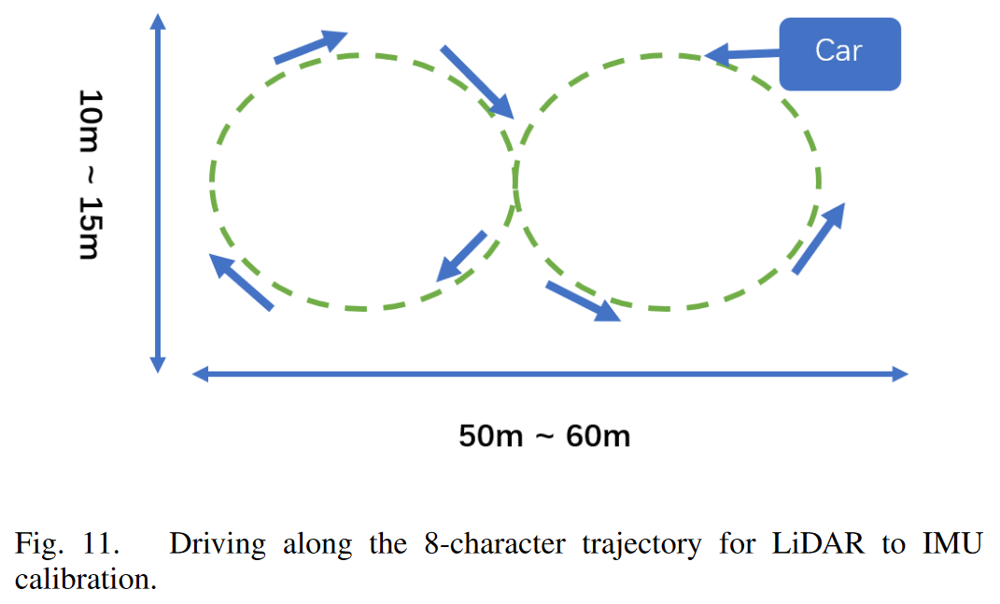

建议使用如图所示的 8 字 路径，标定场景还有如下要求：

1. 保证场地足够平整
2. 保证周边有足够特征点
3. 走 8 字 3 圈以上，控制车速 10km/h
4. 尽量避免场景中存在动态目标

### Lidar2Lidar

单 Lidar 往往存在盲区，多 Lidar 能够有效克服以上问题。多 Lidar 的标定分为两步：

1. 地面对齐
2. 非地面点云配准

具体流程如下：

1. 分割出地面与非地面点云，地面法向量用于初始化外参的俯仰角、滚转角和 z 轴的高度计算
2. 遍历非地面点云，计算横摆角，获得两组 Lidar 的最近点距离计算横摆角方向的最小距离
3. 通过 NICP 和八叉树进行位姿优化

初标定时，Lidar 能够获得大量的地面点，因此第一步就是地面分割，假设最大平面对应的就是地面$GP: \{a,b,c,d\}$：

$$
\begin{aligned}GP:\{a,b,c,d\}&=\arg\max_{|plane|}\lvert ax_i+by_i+cz_i+d\rvert\leq\epsilon\end{aligned}
$$

其中，$(x_i,y_i,z_i) \in plane$，$plane \in PC$，而$\epsilon$表示平面厚度的阈值，假设从 Lidar 的地面为$GP_s$和主 Lidar 的地面$GP_m$：

$$
\begin{aligned}\vec{n}&=\overrightarrow{GP_m}\times\overrightarrow{GP_s}\\theta&=\overrightarrow{GP_m}\cdot\overrightarrow{GP_s}\end{aligned}
$$

其中，$\vec{n}，\theta, \overrightarrow{GP_m},\overrightarrow{GP_s}$分别表示旋转轴，旋转角，主 Lidar 和从 Lidar 的法向量，旋转矩阵可以通过罗德里格斯公式求解

注意，估计的 roll 和 pitch 与实际值可能相差$\pm\pi$，因此需要检查是否大多数点在地面上方。通过以上能够初步估计$angle_{pitch},angle_{roll},z$，下一步就是计算$angle_{yaw},x,y$，损失函数如下：

$$
\begin{aligned}&angle_{yaw}^*,~x^*,~y^*~=\\&\arg\min_{yaw,x,y}\sum\sqrt{(x_s-x_m)^2+(y_s-y_m)^2}\end{aligned}
$$

参数量降低为 3，并且地面点云可以忽略

在精确标定时，使用 NICP 进行优化，假设点云的稀疏性，点云特征难以提取，NICP 方法考虑每个点的法向量从而扩展每个点的感受野。基于八叉树继续最小化位姿误差，一开始，两组点云$PC$用一个 cube 表示其区域，使用八叉树将 cube 切分为更小的 cube：

$$
_pC\Longrightarrow\{_cC_1,_cC_2,\cdots,_cC_7,_cC_8\}
$$

其中，$pC$表示母 cube，$cC_i$表示子 cube。不断裁切从而得到极小的 cube，假设不带点云的 cube 为绿色，那么 cube 可以划分为$C^b$和$C^g$，而$oC$体积可以表示为：

$$
V_oC=\sum_{i=1}^NV_{C_i^b}+\sum_{j=1}^MV_{C_j^g}
$$

其中，$N$和$M$表示为$C^b$和$C^p$的数量。当 cube 的边长足够小，罗大志估计蓝色 cube 所占据的空间，当两组点云对齐时，点云占据的空间最小化，蓝色 cube 的体积也最小，因此问题转化为：

$$
\boldsymbol{R}^*,\boldsymbol{T}^*~=~\arg\min_{\boldsymbol{R},\boldsymbol{T}}\sum_{j=1}^MV_{C_j^b}
$$

考虑到当前位姿已经接近正确的位姿，因此容易通过扫描待优化项从而优化公式

## Factory Calib

工厂标定用于标定传感器之间的位姿关系，作者不使用 OpenCV 并且支持 6 种标定板

### Calibration Board Setup

工厂标定需要构建一条标定产线，通常包含四轮定位和各种标定板，标定板的位姿与标定结果息息相关，因此标定产线设置极为重要：

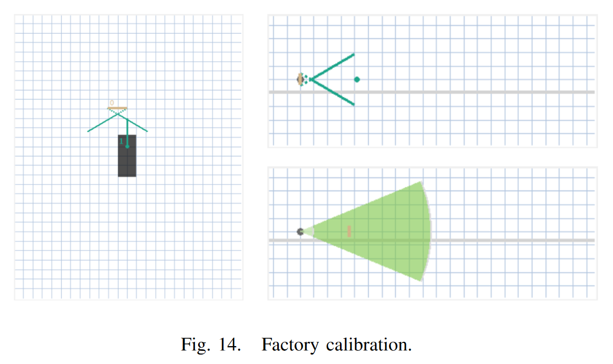

### Calibration board detection

论文选择了 5 种角点检测方法，包括棋盘格，圆形标定板、垂直标定板、编码标定板和圆孔标定板

- 棋盘格一般宽 2.5 米，角点检测流程首先进行自适应二值化。然后执行扩张操作，分离每个黑块四边形的连接。由于图像边缘没有棋盘角点，因此图像边缘设置为白色。遍历图像，如果在八个区域中都是黑色的，则将黑点 0 设置为白色 255，这样就得到了黑块的边缘线。然后将多边形拟合到黑色边框上。然后执行一系列过滤条件，如面积限制、矩形判断、正方形判断，过滤出候选棋盘区域，对候选正方形进行聚类，得到粗略的角点，最后对检测到的角点进行结构判断。例如，是否构成面积相同的等腰直角三角形、判断两点的斜率等，并输出最终的角点检测结果。

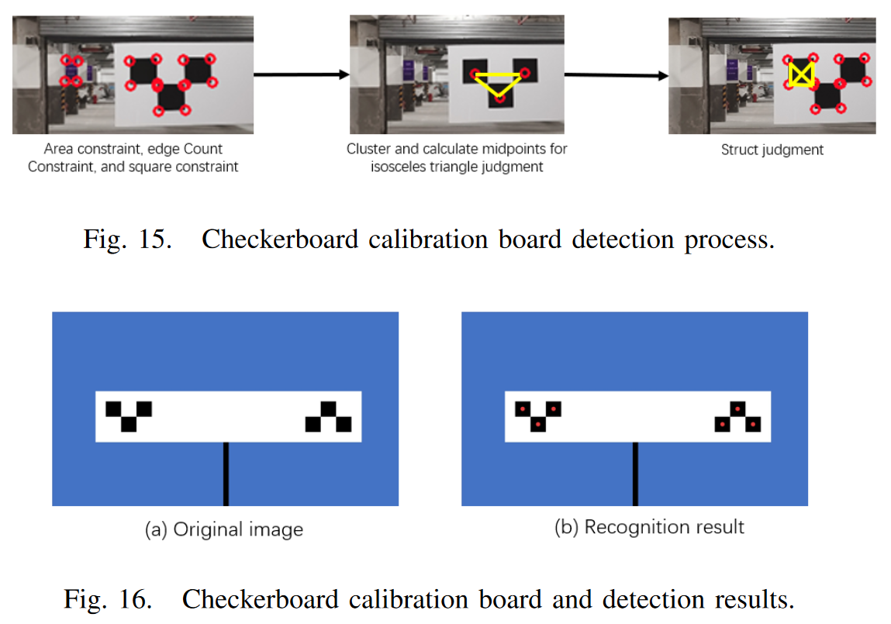

- 圆点标定板用于用于精确标定，并且提供了冗余角点以确保不完整角点也不影响标定过程。首先二值化并提取多组圆环，再通过 RANSAC 拟合圆环的中心线。通过判断轮廓像素到轮廓中心的距离，如果最大距离和最小距离之差满足阈值，则认为轮廓是一个圆。圆心点的颜色记录可检测出该圆是黑色还是白色。通过 Ransac 提取所有圆心的线段，提取垂直直线，并根据斜率范围获得垂直直线。根据四个约束过滤条件，得到黑色圆的线段：
  - 1. 两条线段应平行
  - 2. 相应的黑圆半径相近
  - 3. 对应黑圆在对边线上的投影重合
  - 4. 双线段间距和黑圆半径的大小限制
       确定了校准板中心的位置。平行黑线很好地固定了图案的位置。根据黑圆半径，预测白圆半径和线段上的圆间距，最后得到校准板上所有圆的中心。

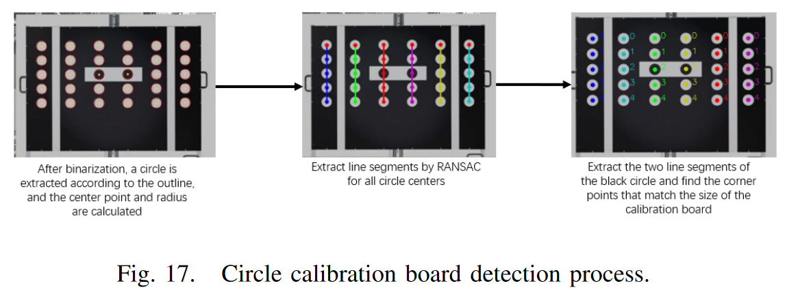

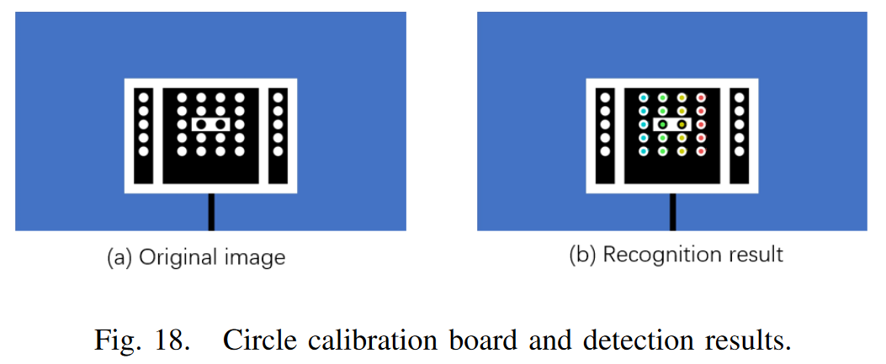

- 垂直板对多个边角缺失也具有鲁棒性。首先进行灰度缩放，然后检测图像中的所有角点，并通过随机选点建立包括角点在内的线模型。根据点的密度对每个线模型进行聚类和分割。然后找出三条平行且间距相等的直线组合。对于每个直线组合，将左右直线上的角点投影到中间直线上，并通过投影直线上的角点与校准板图案特征之间的距离，通过筛选和分割获得正确的角点。

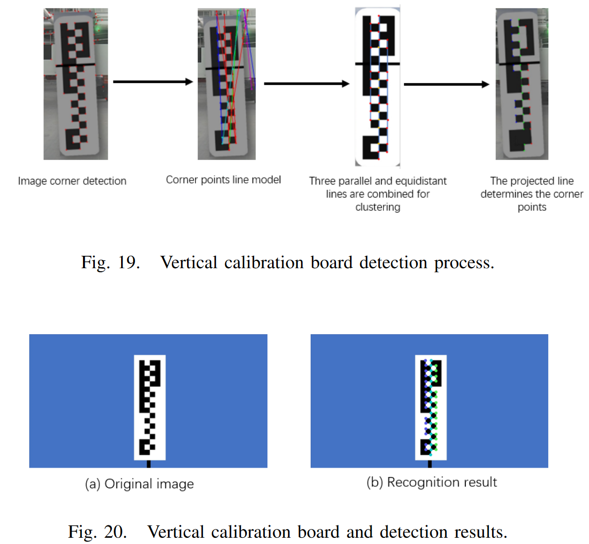

- ArUco 标定板：首先行灰度化和二值化。然后执行连通域搜索以找到候选轮廓，并通过边缘数量限制的过滤条件筛选轮廓，完成基于轮廓点集的多边形拟合。拟合后的多边形符合凸四边形，与图像边缘有一定距离，且轮廓不重复。筛选后对凸四边形的角点进行排序，可防止出现交叉排序。过滤过于接近的四边形。然后，通过径向变换从四边形中提取外矩形，用 127 的阈值对图像进行去二值化处理，切割图像得到二维码区域，并用 6*6 的网格划分二维码区域，对相应的二维码区域进行编码，匹配基础库中的二维码码本，识别相应的二维码 ID，并获取校准板上的角坐标。

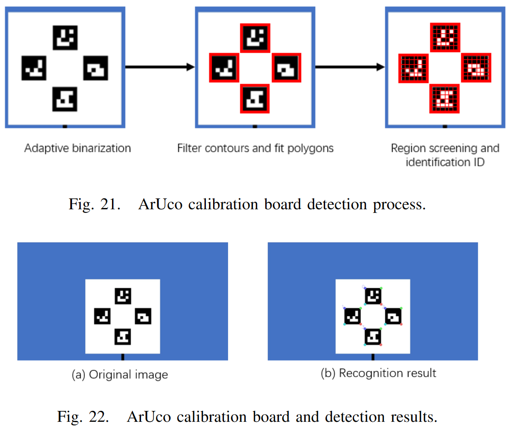

- 圆孔板：依靠标定板上的图案匹配来提取圆。首先，根据校准板的尺寸，设计圆孔的几何匹配掩模。然后进行二维搜索和匹配，最终得到孔内点云数量最少的圆和圆心。根据标定板的位置对点云进行 ROI 滤波，得到校准板附近的点云。通过 RANSAC 算法提取带有方向约束的校准板平面。根据校准板的尺寸预设校准板盒，然后提取二维盒并拟合到点云中。孔掩模的初始位置根据掩模相对于方框的尺寸获得。在初始位置附近进行掩模二维搜索。最后，得到掩膜上点数最少的圆心坐标。

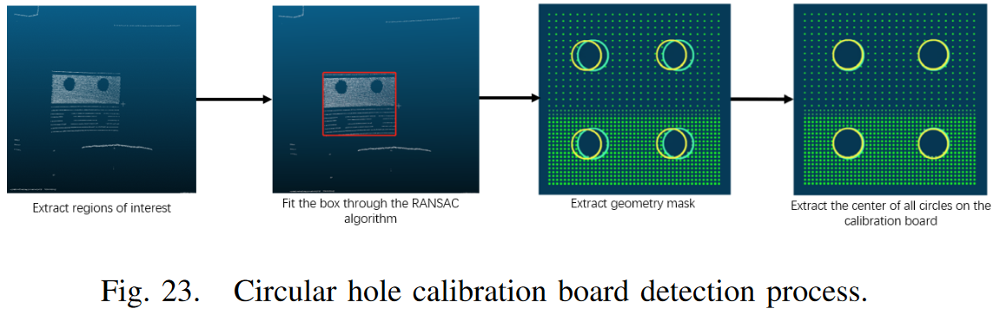

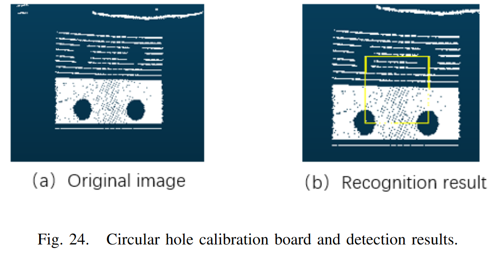

AprilTag 是个虚拟标定系统用于不同任务，可以提取 3D 位置，朝下和 ID 等特征，并使用 C 语言编写，没有其他依赖项

### Camera calibration

通常，相机标定包括消失点标定，相机到地面的单应矩阵标定以及相机到车体的外参标定

- 相机到车体的外参标定：四轮定位之后，标定板相对车体中心的位置固定，下一步就是利用相机对标定板进行识别和标定从而获得相机到车体的坐标位置，一般通过 PnP（2D-3D）算法求解

下面介绍消失点的标定以及相机到地面的单应矩阵标定：

- 消失点标定：消失点标定是指与车身平行的线段的视觉相交点，因为消失点是平行线相对于与车体平行，而消失点的计算则是相机上的一条线通过标定板，并且先与车体保持平行如图：

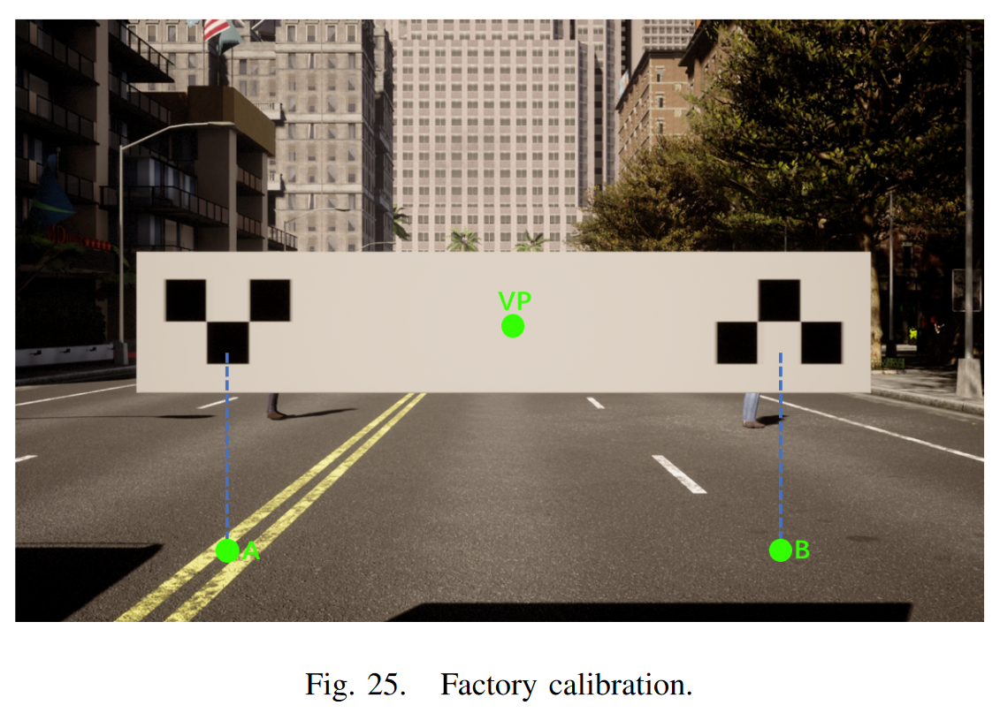

通过标定板的单应矩阵，以及相机到标定板中心在水平和垂直的偏移量$(X_{offset},Y_{offset})$，可以通过如下计算消失点位置在像素平面的坐标$(vp_x,vp_y)$：

$$
\begin{aligned}\begin{bmatrix}x\\y\\w\end{bmatrix}&=\begin{bmatrix}h_{11}&h_{12}&h_{13}\\h_{21}&h_{22}&h_{23}\\h_{31}&h_{32}&h_{33}\end{bmatrix}\begin{bmatrix}X_{offset}\\Y_{offset}\\1\end{bmatrix}\\vp_x&=\frac{x}{w},\quad vp_y\quad=\frac{y}{w}\end{aligned}
$$

如上图所示根据标定板的实际尺寸以及检测到的角点获得标定板到相机的单应矩阵，然后根据标定板到地面的距离获得$A$和$B$点：

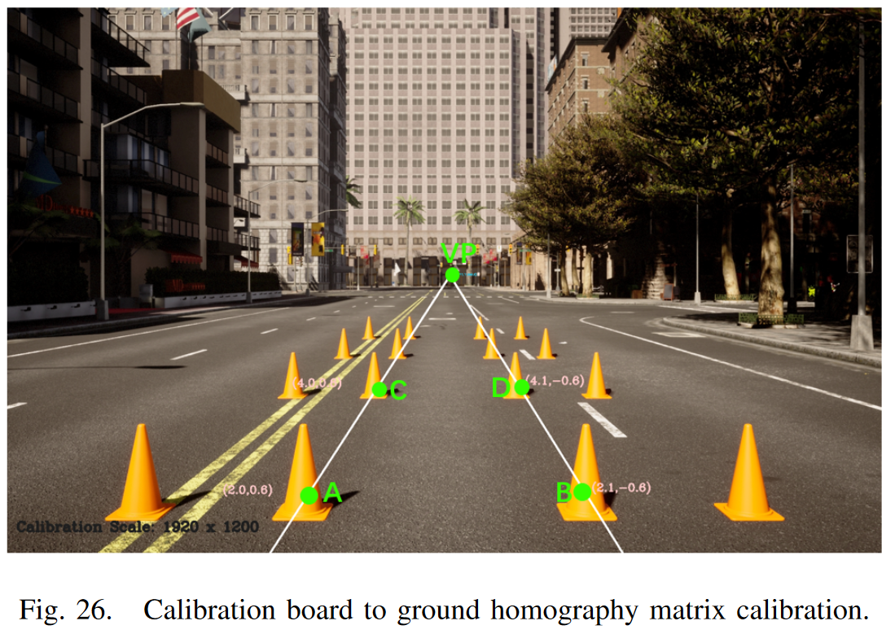

然后分别将$A$和$B$点与$VP$点相连，那么$A-VP$和$B-VP$是平行线，根据距离公式可以选取直线上的点$C$和$D$，构造像素平面到物理空间的 4 个点，从而求解相对地面的单应矩阵。

相机距离公式需要参数$f_x$和$f_y$（相机内参），$H^C$（标定板的单应矩阵）和$vp^I$（标定板的尺度缩放系数）。假设$(p_x,p_y)$为线段上随机点$p^L$投影的像素位置，参考透视原则，点$p^L$处的横纵向距离可以通过如下公式获得：

$$
D_{lon}^\mathrm{C}(\mathbf{p}^\mathrm{L})=\frac{H^\mathrm{C}\cdot f_y}{p_y-vp_y^\mathrm{I}},D_{lat}^\mathrm{C}(\mathbf{p}^\mathrm{L})=\frac{D_{lon}^\mathrm{C}(\mathbf{p}^\mathrm{L})(vp_x^\mathrm{I}-p_x)}{f_x}
$$

由于已知$A$到$B$点的真实距离，因此可以通过以上范围公式优化相机焦距$f_x$和$f_y$，计算$C$和$D$点的纵向距离，最后可以得到四个地面点的像素位置和物理坐标位置，然后可以计算相机到地面的单应矩阵

### Lidar Calib

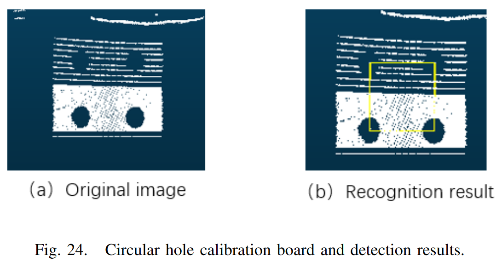

如图所示使用 Lidar 检测标定板的圆孔中心，已知标定板相对车体坐标系的相对位置，满足如下：

$$
T_{lidar2car}*P_{lidar}=P_{car}
$$

通过三组不相交的匹配点可以获得 Lidar 相对车体的位置，而标定板可以获得至少四个，因此：

$$
\begin{bmatrix}P_{car}^1&P_{car}^2&P_{car}^3\end{bmatrix}=\begin{bmatrix}R&t\end{bmatrix}*\begin{bmatrix}P_{lidar}^1&P_{lidar}^2&P_{lidar}^3\\1&1&1\end{bmatrix}
$$

此外，由于 Lidar 相对车体的坐标位置相对准确，添加如下约束：

$$
\begin{aligned}||t_1-a||_2&<\lambda\\||t_2-a||_2&<\lambda\\||t_3-a||_2&<\lambda\end{aligned}
$$

其中，$a,b$和$c$表示车体坐标系中相机的安装位置，而$\lambda$表示较小的误差范围，根据所容忍的阈值进行设置

### After-sale calib

售后标定是指传感器位置发生移动或者更换，相比产线标定更加复杂，此外需要保证场景中存在一定特征

传统方法都是离线标定，耗时耗力；在线标定在系统运行过程中就可以实现外参标定，流程如下：

1. 获得与车体平行的两个参考目标
2. 可以放置 4 个参考点模拟两组平行的参考线
3. 根据 4 个参考点拟合平行线，计算出消失点
4. 相机到物理空间的单应矩阵表示参考公式：

$$
D_{lon}^\mathrm{C}(\mathbf{p}^\mathrm{L})=\frac{H^\mathrm{C}\cdot f_y}{p_y-vp_y^\mathrm{I}},D_{lat}^\mathrm{C}(\mathbf{p}^\mathrm{L})=\frac{D_{lon}^\mathrm{C}(\mathbf{p}^\mathrm{L})(vp_x^\mathrm{I}-p_x)}{f_x}
$$

但是该方法的缺点是滚转角将对横向距离误差产生影响，为了抑制该误差，引入滚转角计算工具：使用者选取两个比地面略短的点构造一条线，保证线的高度始终一致从而根据与像素平面 X 和 Y 轴坐标系的夹角来修正滚转角，然后可以根据 4 点计算相机到地面的单应矩阵

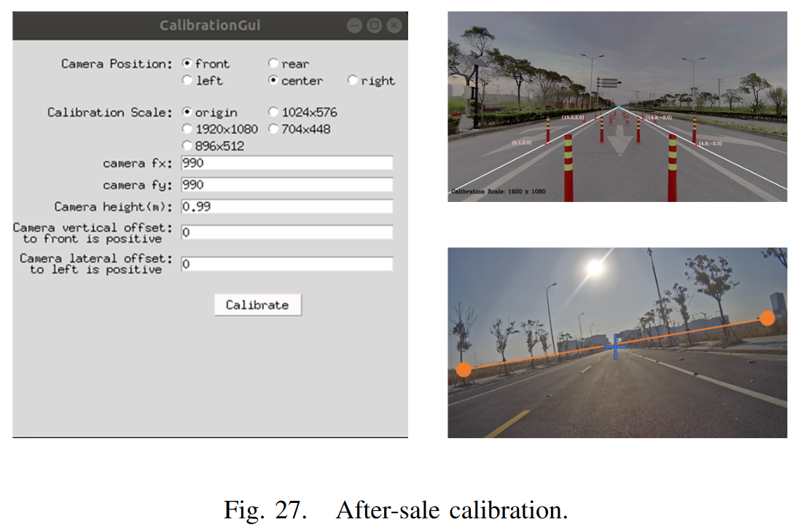

## Online Calib

### Camera2Imu

相机和 Imu 之间的外参标定需要一组视觉帧和 IMU 数据帧，使用 trace correlation 方法，标定模型如下：

$$
\mathrm{td}^*=\mathrm{argmax}_{\mathbf{td}\in\tau}\mathbf{\bar{r}}(\bar{\omega_I},\omega_C)
$$

其中，$\mathrm{td}^*$表示相机和 Imu 之间的最佳时间偏移量，$\tau$表示修正时间偏移，$\mathbf{\bar{r}}(\bar{\omega_I},\omega_C)$表示在$\bar{\omega_I}$和$\omega_C$之间的 trace 修正，$\omega_C$表示相机在两帧相机间的平均角速度，$\bar{\omega_I}$表示 Imu 在两帧相机间的平均角速度

相机在$i$帧到$i+1$帧的旋转表示为$RC_i^{i+1}$，而 Imu 的旋转表示为$RI_i^{i+1}$，两者之间的旋转表示为$RIC$，可参考手眼标定得到如下：

$$
RI_i^{i+1} \cdot RIC = RIC \cdot RC_i^{i+1}
$$

最后是平移标定，相机在$i$帧到$i+1$帧的平移表示为$tc_i^{i+1}$，而 Imu 的旋转表示为$ti_i^{i+1}$，两者之间的旋转表示为$tic$，满足：

$$
RC_i^{i+1} \cdot tiC - tiC = RIC \cdot ti_i^{i+1} - tc_i^{i+1}
$$

### Lidar2Imu

Lidar 和 Imu 之间的外参标定与相机和 Imu 标定类似，使用 LOAM 的前端构造里程计，然后将 Lidar 数据和 Imu 对齐，最后使用类似方法求解外参

Lidar 在$i$帧到$i+1$帧的旋转表示为$RL_i^{i+1}$，而 Imu 的旋转表示为$RI_i^{i+1}$，两者之间的旋转表示为$RIL$，可参考手眼标定得到如下：

$$
RI_i^{i+1} \cdot RIL = RIL \cdot RL_i^{i+1}
$$

最后就是计算平移，Lidar 在$i$帧到$i+1$帧的平移表示为$tl_i^{i+1}$，而 Imu 的旋转表示为$ti_i^{i+1}$，两者之间的旋转表示为$til$，满足：

$$
RL_i^{i+1} \cdot til - til = RIL \cdot ti_i^{i+1} - tl_i^{i+1}
$$

### Radar2Carcenter

- 主要标定 radar 的横摆角

标定过程分为如下几步：

1. 初步标定：
2. 静态目标识别
3. 曲线拟合

首先，假设雷达量测为$\{V_i, angle_i,distane_i\}$，其中$V_i$表示目标的相对速度；初步标定找到前方的目标，并获得雷达量测假设雷达量测为$angle_i$，即横摆角$yaw$

下一步，静态目标检测，静态目标的状态满足如下：

$$
V_i = V_e \cdot cos(angle_i + yaw)
$$

其中$V_e$表示自车速度

最后是拟合 cos 函数曲线，从而得到较为精确的标定结果
