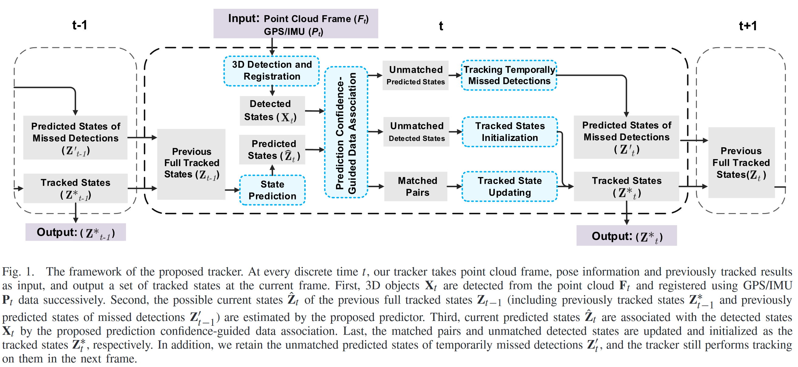
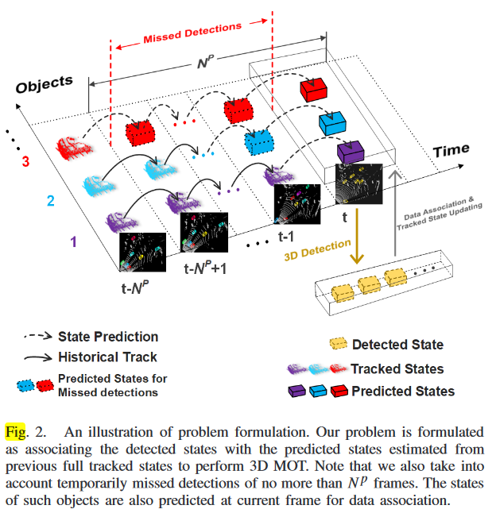
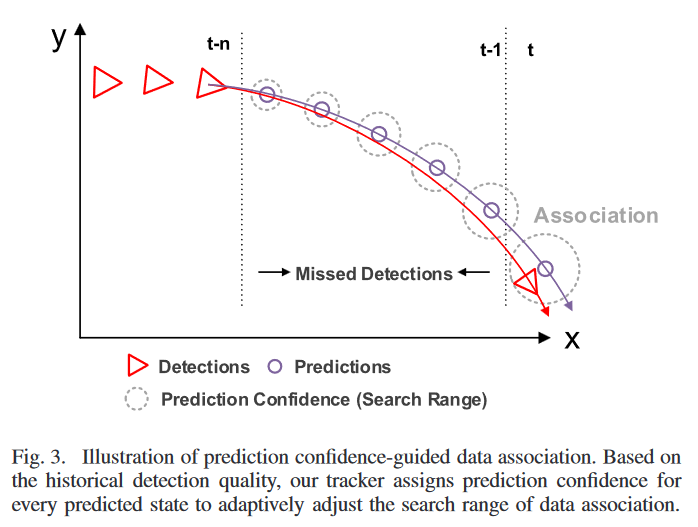

# 3D_MOT

## Info

> 3D Multi-Object Tracking in Point Clouds Based on Prediction Confidence-Guided Data Association
> 
> github: https://github.com/hailanyi/3D-Multi-Object-Tracker [python]
>
> github: https://github.com/leijobs/3D-Multi-Object-Tracker-Cpp.git [c++，个人复现]

## 论文

### Abstract

> 论文提出了 novel 的 3D MOT 算法，可以处理暂时丢失的目标，并且在点云 3D MOT 中能够更好的平衡目标的特征
> 算法基于新的关联策略——预测置信度，包含两个方面：
>
> 1. 使用 CA 模型来预测目标的未来运动状态，并输出预测置信度用于后续数据关联时的检测质量（预测 score）
> 2. 引入聚合的代价矩阵来更好的表示点云特征从而提升关联速度和精度
>    代价矩阵包括几何属性，外观和运动状态。其中，
> 3. 几何属性：3D bb 的长宽高，中心点和朝向
> 4. 外观属性：深度学习提取的特征
> 5. 运动属性：运行向量构成的矩阵
>    性能和速度 SOTA

### Introduction

算法框架如下：

1. 基于检测器从点云中检测目标
2. 使用 CA 模型预测运动状态并对不同预测结果给出预测置信度（尤其是暂时 missed 目标）
3. 通过预测置信度和聚合的损失矩阵进行
4. 更新关联的匹配，并划分为 tracked 和 untracked

### Related Work

当前的 2D MOT 方法在 2D 平面上进行 tracking-by-detection

这种框架主要问题在于数据关联，方法基本上是全局优化或者 online 二分图匹配，前者获得历史帧信息并通过网络流或者贝叶斯滤波方法进行关联，后者则是基于上一帧进行预测跟踪

这些方法致力于设计鲁棒的二分图并采用匈牙利或者贪心进行匹配，这些方法在 3D 空间往往受限

对于 3D 点云目标，点云特征也是跟踪的重要手段

当前的 3D MOT 使用 CV 模型估计目标的运动状态，然后通过预测和估计来修正误差（贝叶斯估计），这些方法中预测质量往往用于状态估计而不用于数据关联，当前的一些算法开始使用 LSTM 来进行数据关联，但是 learning-based 方法速度较慢

Cost matrix 对于数据关联至关重要，大多数 2D MOT 方法通过外观和运动状态进行设计，图像特征和直方图也是一般特征来源；此外还有 bb 之间的距离和 iou 以及特征点也由于关联矩阵；

最后，3D MOT 可以总结为：

1. 目标检测
2. 状态预测
3. 数据关联
4. 状态更新

对应的改进也与上面相关

### Method

#### 问题表示

3D MOT 可以描述为：

1. 检测得到的目标观测$X_t$
2. 通过上一帧预测$\hat{Z}\_{t-1}$（包含跟踪$Z^{\ast}_{t-1}$和丢失$Z^{\prime}\_{t-1}$）更新得到的当前的预测$\hat{Z}\_t$
3. 状态更新和初始化新的航迹$Z^*_{t}$

如图所示表示如下：

- 目标观测

跟踪器使用深度学习得到的检测结果，包含 3D bbox，点云特征和置信度（其中点云特征从 backbone 获得）

所有的 bbox 都转到 IMU/GNSS 世界坐标系，在时刻$t$，检测状态表示如下：

$$
X_{t} = \{ X^i_t\}^{N_t^X}_{i=1} \subset \mathbb{R}^{D^X\times1}
$$

其中，$N_t^X$代表当前离散时间下的目标数量，$D^X$表示检测结果的输出维度，而$X^i_t = [x^i_t, y^i_t,z^i_t,h^i_t,l^i_t,...]^T$表示当前时刻第 i 个目标的检测状态，$x^i_t, y^i_t,z^i_t$表示世界坐标位置,$w^i_t, h^i_t,l^i_t$表示目标的长宽高,$a^i_t$表示目标的朝向角，,$f^i_t$为目标的点云特征

- 之前的跟踪航迹

跟踪器要求包含完整状态的航迹预测$\hat{Z}\_{t-1}$（包含跟踪$Z^{\ast}\_{t-1}$和丢失$Z^{\prime}\_{t-1}$），两者的关系为：

$$
Z_{t-1} = Z^*_{t-1} \cup Z^{\prime}_{t-1}
$$

为了进行准确的运动估计，每个完整的航迹预测状态包括其速度和加速度，在 t-1 时刻下的完整状态如下：

$$
Z_{t-1} = \{Z^j_{t-1}\}^{N_{t-1}^Z}_{j=1} \subset \mathbb{R}^{D^Z\times1}
$$

其中，$N_{t-1}^Z$代表当前离散时间下的预测的目标数量，$D^Z$表示预测状态的输出维度，而

$$
Z^i_{t-1} = [x^i_{t-1}, y^i_{t-1},z^i_{t-1},w^i_{t-1},h^i_{t-1},l^i_{t-1},v^{x,i}_{t-1},v^{y,i}_{t-1},v^{z,i}_{t-1},a^{x,i}_{t-1},a^{y,i}_{t-1},a^{z,i}_{t-1},...f^{y,i}_{t-1},f^{z,i}_{t-1}]^T
$$

而$v$和，$a$表示沿着各轴的速度和加速度，以上为一个航迹的完整状态

- 预测状态

在数据关联前，需要得到较为准确的预测状态，预测状态的维度与跟踪航迹的维度一致，表示如下：

$$
\hat{Z}_{t} = \{\hat{Z}^j_t\}^{N_{t-1}^Z}_{j=1} \subset \mathbb{R}^{D^X\times1}
$$

其中，$\hat{Z}_t^j$表示 t 时刻第 j 个航迹的预测状态

#### proposed 预测器

- CA 运动模型

对于每个预测的完整状态$Z_{t-1}^j$，估计其在$t$时刻可能的当前状态$\hat{Z}_t^j$表示如下：

$$
\begin{aligned}
&\hat{z}_{t}^{j} =AZ_{t-1}^{j}, \\
&\hat{S}_{t}^{j} =AS_{t-1}^jA^T+Q, \\
&\text{A} =\begin{bmatrix}E_{3\times3}&\delta E_{3\times3}&\frac12\delta^2~E_{3\times3}\\O_{3\times3}&E_{3\times3}&\delta E_{3\times3}&O_{9\times n}\\O_{3\times3}&O_{3\times3}&E_{3\times3}&\\&O_{n\times9}&&E_{n\times n}\end{bmatrix}
\end{aligned}
$$

其中，$A$表示状态转移矩阵，$E$和$O$表示单位阵和零矩阵；$\sigma$表示 Lidar 的扫描间隙，$n=4+k$表示其他航迹观测（航向，长宽高和深度学习的特征）的数量

$Q \in \mathbb{R}^{D^Z \times D^Z}$表示状态函数的协方差矩阵，$S_{t-1} \in \mathbb{R}^{D^Z \times D^Z}$表示$t-1$时刻的残差矩阵，$\hat{S}_t \in \mathbb{R}^{D^Z \times D^Z}$表示$t$时刻的协方差矩阵

此外，目标的速度和位置可以用 CA 模型表示为：

$$
\begin{aligned}
\hat{p}_t^j& =p_{t-1}^j+\delta v_{t-1}^{p,j}+\frac{\delta^2a_{t-1}^{p,j}}2,  \\
\hat{v}_t^{p,j}& =v_{t-1}^{p,j}+\delta a_{t-1}^{p,j},
\end{aligned}
$$

其中，$p \in \{ x,y,z\}$和$\hat{p}_t^j, \hat{v}_t^j$分别表示预测的位置和速度

- 置信度预测模型

大多数传统 MOT 算法基于检测和预测结果进行数据关联，而缺少对预测质量的考虑，预测状态并不一定准确，尤其是连续多帧丢失的目标，此类目标的的可能范围较大并应该在关联阶段进行考虑

为了时数据关联对预测质量进行考虑，作者设计了对于每个预测状态$\hat{\gamma}^j_t$的预测置信度如下：

$$
\hat{\gamma}^j_t = \gamma^j_{t-1} - \eta \gamma^j_t
$$

其中，$\gamma \in (0,1]$和$\eta \in (0,1]$，其中$\eta$表示总体预测置信度对于数据关联的总体影响，由训练和验证集决定

$\hat{\gamma}^j_{t-1}$表示离散时刻$\hat{\gamma}^j_t$的预测置信度，该置信度初始化为 1 并在后续进行更新，目标丢失将导致置信度降低，对应关联时的隐式搜索范围也将扩大，通过引入预测置信度，能够动态调节关联时的搜索范围

### 聚合配对 cost

直接使用点云特征用于数据关联的计算复杂度较高，因此论文提出 novel 配对 cost，考虑几何、外观和运动特征等参数用于数据关联

定义配对 cost 为$C^{i,j}$，描述第$i$个检测状态$X^i_t$和第$j$个的预测状态$\hat{Z}^j_t$：

$$
C^{i,j}_t = G^{i,j}_t + A^{i,j}_t + M^{i,j}_t
$$

其中，$G^{i,j}_t,A^{i,j}_t,M^{i,j}_t$分别是几何、外观和运动 cost

- 几何 cost

几何 cost 用于衡量 3D Bbox 的几何相似性，不同于 IOU-based 方法，作者使用长宽高、中心位置以及朝向角来计算 cost：

$$
\begin{aligned}\mathcal{G}_{l}^{i,j}&=w_{\boldsymbol{h}\boldsymbol{w}l}\cdot\mathcal{N}(\sum_{k\in\{\boldsymbol{h},\boldsymbol{w},\boldsymbol{l}\}}\frac{\mid\boldsymbol{k}-\hat{\boldsymbol{k}}\mid}{k+\hat{\boldsymbol{k}}})\\&+w_{\boldsymbol{d}\boldsymbol{i}s}\cdot\mathcal{N}(\parallel p-\hat{\boldsymbol{p}}\parallel_{2}^{2})\\&+w_{\boldsymbol{a}\boldsymbol{n}\boldsymbol{g}}\cdot\mathcal{N}(1-\cos(\alpha-\hat{\alpha}))
\end{aligned}
$$

其中，$w_{hwl,dis,ang}$分别是对应的重要性权重，$N(\cdot)$表示均一化函数，$p$表示目标$X^i_t$全局坐标系的位置，$\alpha$表示朝向角，而$\hat{k},\hat{p},\hat{\alpha}$表示$\hat{Z^j_t}$对应的预测值

- 外观 cost

外观 cost 由深度学习网络提取的特征获得，为了计算效率，作者使用 detector 的 backbone 特征并且计算其 L2 距离表示相似性：

$$
\mathcal{A}_t^{i,j}=w_{app}\cdot\mathcal{N}(\parallel f-\hat{f}\parallel_2^2)
$$

其中，$w_{app}$是对应的重要性权重，$f$和$\hat{f}$分别是目标$X^i_t$和预测值$\hat{Z}^j_t$分别是对应的重要性权重的点云特征

- 运动 cost

为了准确估计目标的运动状态，作者引入一个带速度的检测状态$\tilde{X}^{i,j}_t$表示第$i$个检测状态$X^i_t$和匹配的预测状态$\tilde{Z}^j_t$的运动残差：

$$
\tilde{X}_t^{i,j}=HX_t^i+K(HX_t^i-\hat{Z}_{t-1}^j)
$$

其中，$H \in \mathbb{R}^{D^Z \times D^X}$表示速度和加速度初始化为 0 的旋转矩阵，而$K \in \mathbb{R}^{D^Z \times D^X}$为速度的计算矩阵，两个速度向量的运动 cost 定义如下：

$$
\mathcal{M}_{l}^{i,j}=w_{vang}\cdot\mathcal{N}(1-\frac{\tilde{v}\cdot\hat{v}}{\parallel\tilde{v}\parallel\parallel\hat{v}\parallel})+w_{vdis}\cdot\mathcal{N}(\parallel\tilde{v}-\hat{v}\parallel_{2}^{2})
$$

其中，$w_{vdis,vang}$分别是对应的重要性权重，而$\tilde{v}$和$\hat{v}$分别是$\tilde{X}_t^{i,j}$和$\hat{Z}^j_t$的速度向量

所有提及的重要性权重都由训练集中的六重交叉验证确定

### 考虑预测置信度的数据关联

之前的 3D MOT 算法往往不考虑预测的置信度影响，预测置信度较低则应该放大预测范围，作者提出了考虑预测置信度的数据关联模型

如图，首先为关联检测和预测状态，引入考虑预测置信度的关联矩阵$\psi_t$，其中的元素在置信度模型和聚合配对 cost 中计算得到

$$
\boldsymbol{\psi}_t=\begin{bmatrix}\gamma_t^{1}\mathcal{C}_t^{1,1}&\cdots&\gamma_t^{N_{t-1}^Z}\mathcal{C}_t^{1,N_{t-1}^Z}\\\vdots&\ddots&\vdots\\\gamma_t^{1}\mathcal{C}_t^{N_t^X,1}&\cdots&\gamma_t^{N_{t-1}^Z}\mathcal{C}_t^{N_t^X,N_{t-1}^Z}\end{bmatrix}
$$

第二步，使用贪心算法进行数据关联，数据关联后可获得匹配组合$(\mathbf{X}^{\sigma}\_t, \hat{\mathbf{Z}}^{\sigma}\_t)$，包含检测状态和预测状态，同时还获得未关联的检测结果$X^{\epsilon} \in \mathbf{X}\_{t}^{\epsilon}$，将会初始化为新航迹，而丢失关联的预测$\hat{\mathbf{Z}}^{\epsilon}\_{t}$将维持一定帧数后删除

### 跟踪状态更新和初始化

数据关联之后使用 KF 机械能状态更新，通过配对的检测状态和预测状态来更新跟踪状态，表示如下：

$$
\mathbf{Z}_{t}^{\sigma}\leftarrow KF(\mathbf{X}_{t}^{\sigma},\mathbf{\hat{Z}}_{t}^{\sigma})
$$

假设检测过程中存在高斯噪声$P \in \mathbb{R}^{D^Z \times D^X}$，并且检测特征相互独立，对于每个$Z^{\sigma} \in \mathbf{Z}_{t}^{\sigma}$和其协方差矩阵$S^{\sigma}_t$更新如下：

$$
\begin{aligned}
&J_{t}^{\sigma} =\hat{S}_{t}^{\sigma}B^{T}(B\hat{S}_{t}^{\sigma}B^{T}+P)^{-1}  \\
&\mathbb{Z}_{t}^{\sigma} =\hat{Z}_t^\sigma+J_t^\sigma(X_t^\sigma-B\hat{Z}_t^\sigma)  \\
&S_{t}^{\sigma} =(E-J_t^\sigma B)\hat{S}_t^\sigma
\end{aligned}
$$

其中，$B \in \mathbb{R}^{D^Z \times D^X}$为量测矩阵，$P \in \mathbb{R}^{D^Z \times D^X}$为检测结果的协方差矩阵，$E \in \mathbb{R}^{D^Z \times D^X}$为单位阵，$J^{\sigma}_t \in \mathbb{R}^{D^Z \times D^X}$为卡尔曼增益。$(X^{\sigma}_t, \hat{Z}^{\sigma}_t)$为匹配的检测结果和航迹组合$(\mathbf{X}^{\sigma}_t, \hat{\mathbf{Z}}^{\sigma}_t)$的一组元素，检测置信度满足$c_t^\sigma \in (0,1]$，预测置信度$\gamma_t^\sigma$通过如下公式更新：

$$
\left.\gamma_t^\sigma=\left\{\begin{array}{ll}1 &c_{t-1}^\sigma=0,c_t^\sigma\neq0\\\hat{\gamma}_t^\sigma+\eta c_t^\sigma &otherwise \end{array}\right.\right.
$$

其中，$c^{\epsilon}_{t-1} = 0$表示第$t-1$时刻丢失目标的置信度

此外，对于未关联的航迹，作者初始化了一组新的跟踪状态，满足

$$
\mathbf{Z}_{t}^{\epsilon}\leftarrow Init(\mathbf{\hat{X}}_{t}^{\epsilon})
$$

对于每个未匹配的检测结果$X^{\epsilon} \in \mathbf{X}\_{t}^{\epsilon}$，初始化速度为零，初始化加速度为$Z_{t}^{\epsilon} = HX^{\epsilon}\_t, (Z^{\epsilon} \in \mathbf{Z}\_{t}^{\epsilon})$，同时协方差矩阵和预测置信度分别初始化为$S^{\epsilon}\_t = E, \gamma^{\epsilon}\_t = 1$

在跟踪航迹更新和初始化之后，获得了一组跟踪航迹满足$\mathbf{Z}\_{t}^{*}=\mathbf{Z}\_{t}^{\sigma} \cup \mathbf{Z}\_{t}^{\epsilon}$，可以用于下一时刻的跟踪

### 多帧丢失的目标跟踪

对于未匹配的预测航迹$\hat{Z}^\epsilon_t$有两种情况，第一种情况是目标自然丢失，第二种情况是目标被遮挡导致的漏检

假设预测阈值$N^p$来区分两种情况，如果预测航迹在超过$N^p$帧都未进行更新，那么认定自然消失，将不进行预测和跟踪，否则维持预测航迹，在$t$时刻$Z^{'}_t$表示丢失目标的预测航迹，并在下一帧继续进行预测和关联

