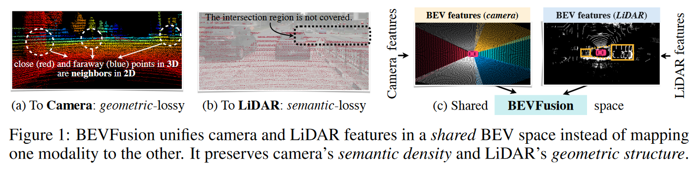

# 06_BEVFusion_MIT

## Info

> 论文：[https://arxiv.org/abs/2205.13542](https://arxiv.org/abs/2205.13542)
> github：[https://github.com/mit-han-lab/bevfusion](https://github.com/mit-han-lab/bevfusion)

## Framework

### Abstract

当前的主流方法使用视觉-Lidar 融合，但是相机到 Lidar 的投影导致图像的语义稠密特征丢失，阻碍了 3D 语义分割的应用

论文提出了多任务-多模态的 BEVFusion 框架，在 BEV 空间统一多模态的几何和语义特征，修改包括：

1. 修改了 view tranformation 过程中 bottleneck 的 BEV pooling 操作，延迟降低 40X
2. 相比于 start-of-the-art，提升一定性能，负载降低 1.9X

### Introduction

论文提出了 BEVFusion 来实现在 BEV 表示空间下任务无关的学习的多模态特征的统一，通过融合激光的几何特征和视觉的语义特征来实现 3D 感知任务

在将全部特征转化为 BEV 特征时，pooling 一项操作就占用了模型 80% 的时间，为此作者提出了 precomputation 和 interval 的 kernel 来降低延迟，提升 40X 速度

最有使用全卷积的 BEV Encoder 来融合 BEV 特征，再结合不同的任务添加不同的检测头

### Related Work

#### Lidar-Based 3D Perception

不少论文使用 PointNets 和 SparseConvNet 提取展平的点云特征，并在 BEV 空间进行感知任务，或者使用 anchor-free；或者使用 two-stage 方法，在检测器上增加 RCNN/UNet 来进行 BEV 语义分割的任务

#### Camera-based 3D Perception

FCOS3D 通过硬回归来学习 3D 感知

DETR3D、PETR、GraphDETR 通过带目标 query 的 DETR 检测头来学习 3D 空间

BEV 空间的算法包括 BEVDet 和$M^2$BEV 学习 LSS 和 OFT 来实现 3D 检测

CaDDN 通过深度监督来进行 view tranformer 的转换，BEVDet4D、BEVFormer 和 PETRV2 使用了多帧特征融合

而 BEVFormer、CVT 和 Ego3RT 研究了在 view tranformation 过程中的多头注意力机制

#### Multi-Sensor Fusion

多传感器融合可以划分为 proposal-level 和 point-level 两种：

- Proposal-level：

  1. MV3D 在 3D 空间创建目标 proposal 并将 proposal 投影到图像来获取 ROI 特征
  2. F-Point、F-ConvNet 以及 CenterFusion 将图像 proposal 升维到 3D frustum
  3. FUTR3D 和 TransFusion 在 3D 空间中定义目标 query 并将图像特征 fuse 到 3D proposal 上
- Point-level：（paint 视觉语义特征到 PointCloud，再进行 Lidar-based 检测）

  1. PointPainting、PointAugmenting、MVP、FusionPainting、AutoAlign 和 FocalSparseCNN 都是 Lidar input-level 处理
  2. DeepContinuousFusion 和 DeepFusion 时 feature-level 的处理

#### Multi-Task Learning

当前的工作包括$M^2$BEV、BEVFormer、BEVerse 实现了 3D 空间的 BEV 语义分割，但并未使用多模态

MMF 同时进行基于视觉-Lidar 深度预测和目标检测，还是以 obj 为中心，没有 BEV 地图分割

### Method

BEVFusion 注重于多模态-多任务感知，框架如下：

1. 首先应用模态相关的 encoder 提取特征
2. 将多模态特征转换到 BEV 表示空间，保存几何和语义信息
3. 修改了 view transformer 的 bottleneck 来加速 BEV pooling 操作
4. 使用全卷积的 BEV encoder 进行 BEV 特征编码，消除不同特征的不对齐
5. Task-specific 检测头

#### Unified Representation

为了将不同传感器的进行特征融合，核心任务是：

1. 传感器特征能够快速转换为特定 task，不损失信息
2. 不同 task 共享特征

##### To Camera

参考 RGB-D，将点云投影到相机屏幕渲染 2.5D 的稀疏深度，这种方法将造成几何损失

##### To Lidar

大多数 state-of-the-art 方法都是将视觉语义特征投影到点云上，这种方法将导致语义损失，实际上只有 5% 的相机特征能够匹配点云（比如 32 线），导致语义特征的稠密性损失

同样 obj query 的方法也会存在类似问题

##### To BEV

BEV 的优势在于所有感知任务都能在 BEV 空间表示和输出，并且 BEV 空间在几何特征和语义稠密特征都保留了，总而言之，BEV is the best

#### Efficient Cam-to-BEV Transformation

如图所示，view tranformer 对于 BEV 特征至关重要，因为每个相机对应的像素的深度都是模糊的

为此，作者参考 LSS 和 BEVDet，view tranformation 流程如下：

1. 显式的预测每个像素的离散分布
2. 如图（a）所示，将每个像素的特征沿着相机光线方向分布到$D$个离散的点，并且给定每个点深度分布概率，此时的相机特征维度为$N \cdot H \cdot W \cdot D$；其中，$N$为相机数量，为单个相机的特征图尺度
   而 3D 点云则可以设置为一定尺度$r, (eg., r = 0.4m)$的网格来构造 BEV 特征
3. 使用 BEV pooling 来聚合$r \times r$的网格的特征，并在 z 轴将特征展平

BEV pooling 看起来简单，实际上非常低效，在 3090 上耗时 100ms，这是由于相机的特征点数量非常庞大，经验上一帧包含近 200m 个点，是 Lidar 点云的两个数量级，因此作者的优化如下：【类似于前缀和计算】

##### Precomputation

BEV pooling 的第一步是将相机特征点云中的每个点与 BEV 预先生成的网格关联

不同于 Lidar 点云，相机点云的坐标系固定的（主要内外参标定准确），因此，作者会先计算每个点的 3D 坐标和对应的 BEV 网格 index，然后再对每个点按照网格 indices 排序记录其 rank；在推理时，只需要将全部特征映射到对应的 rank 就行

这一操作将网格关联延迟由 17ms 降到 4ms

##### Interval Reduction

BEV 网格关联之后，所有的点都在 BEV 空间并且 tensor 表示上连续，BEV pooling 的下一步就是将每个网格的特征通过对称的函数（mean，max，sum）聚合

如图（b），LSS 首先计算所有点的前缀和，然后减去 indices 发生变化的边界上的值。然而，前缀相加操作需要在 GPU 上进行树形缩减，并产生许多未使用的部分相加（因为我们只需要边界上的值），这两种方法都效率低下。【中间值和不连续的问题】

为了加速特征聚合，作者实现了一个专门的 GPU 内核，可直接在 BEV 网格上进行并行处理：为每个网格分配一个 GPU 线程，计算其区间和并将结果写回。该内核消除了输出之间的依赖性（因此不需要多级树缩减），并避免将部分和写入 DRAM，从而将特征聚合的延迟从 500 毫秒降至 2 毫秒，结果如图（c）

##### Takeaways

优化的 BEV pooling 操作使得 view tranformation 的速度提升 40X，从 500ms 缩减到 12ms，并且适用于不同分辨率尺度；

之前的工作 CaDDN 假定了深度的均匀分布或者投影到 BEV 网格中，而作者使用的方法不需要估计，因此更快

#### Fully-Convolutional Fusion

传感器数据都投影到 BEV 空间，但是 Lidar 和相机特征并未完全空间对齐，这是由于 view tranformer 的深度并不准确

这里引入了全卷积的 BEV Encoder（带残差 block）来对误差进行补偿，这可能对于深度估计也是有利的，这里并未探讨

#### Multi-Task Heads

现在可以在 BEV 特征图上进行特定任务，这里展示分割和检测两个

##### Detection

这里使用 CenterPoint 的 heatmap 来预测目标的 size、方位和速度

##### Segmentation

检测头参考 CVT，使用标准 focal loss

### Experiment

#### Model

使用 Swin-T 作为图像 backbone，VoxelNet 作为 Lidar backbone，使用 FPN 来融合多尺度相机特征生成 1/8 的 feature map；

将图像下采样到 256x704，对应的 Lidar voxel 为 0.075（检测）及 0.1（分割）

由于检测和分割需要多尺度和范围的 BEV 特征，因此使用了双线性插值来进行数据增强

### Ablation

结论如下：

1. BEVFusion 对于 lidar 的小目标和远距离目标提升明显
2. 稀疏点云对于 BEVFusion 影响不大
3. 多任务对于单任务而言对应的性能有所下降
