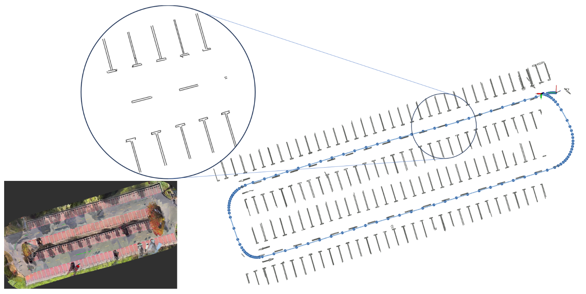

# 07_Less-Map

## Info

> 论文 ：[http://arxiv.org/abs/2310.07390](http://arxiv.org/abs/2310.07390)

## Abstract

精确且长稳的定位对于泊车而言至关重要，当前的方法依赖于固定且内存受限的 map，无法维护精确且长稳的 map

作者提出了基于地面语义分割的集定位，建图和地图更新为一体的定位系统，工作包括：

1. 精确且轻量化的参数化方法用于数据关联和高精度定位
2. 通过参数化的语义特征关联实现高精度的 Novel 地图更新和增强
3. 在实车数据集上性能优异，长稳的地图规模小且可维护

## Introduction

泊车点包含大量地面特征，比如箭头，泊车位和停止线等，这些特征通常是规则化，平面化且普遍存在的，基于以上特征进行定位是极其有效的

参数化方法能够利用以上纹理特征并进行用于地面语义信息间的高精度数据关联，从而进行配准，建图和定位然而当前方法缺乏较为鲁棒的特征参数化的方法，导致数据关联时从而影响定位和建图精度

因此作者引入精确且轻量化的语义特征的参数化方法实现快速高效的定位和建图，并且提出 novel 的地图方法，高精度且可更新

## Related Work

Lidar-based 方法能够通过提取电线特征从而实现准确定位，为了实现轻量化定位，算法引入 GMM、高斯分布等概率模型进行表示，然而 Lidar-based 处理半静态或动态目标效果不好，并且价格昂贵

视觉方法成本更低，传统方法是提取特征点进行关联，但是这样地图很大，对动态目标敏感，光照影响；其他方法考虑使用地面静态特征进行定位建图，但是环境鲁棒性差

当前主流方法使用语义分割进行特征提取，再使用 ICP 和 NDT 等进行位姿估计。此外还有将语义特征引入 grid map 用于定位和更新，但是以上方法只是缝合其他方法并未充分描述地面特征的几何属性，因此定位精度有限

作者在工作中专注于地面的几何特征用于定位、建图和更新，具有精度高且轻量化的优势

## Method

作者采用环视相机、IMU 和轮速计构造 VIO，如图所示，算法包括定位和建图模块：

### Overview

- 建图：

车辆首次进入环境，任务就是建立 global map 用于后续任务，提取语义特征并投影到 3D 空间，观测的不确定性需要考虑用于地图融合，然后进行参数化，通过位姿估计和回环检测得到全局地图

- 定位与地图更新：

构建全局地图后，车辆再次进入场景即可根据新采集的数据进行定位和地图更新，光线和位置变化能够用于更新之前未建图的区域，里程计和定位结果构建因子图，用于全局路径优化和地图更新

### Semantic Seg and Cloud Projection

作者使用 SegNet 在鱼眼相机上进行语义分割，之后再将鱼眼图像投影到自车坐标系下的语义特征点云，这一过程包括去畸变和 IPM 变换

语言相机使用 omnidirectional 模型，相机的投影模型如下：

$$
\begin{aligned}
\begin{bmatrix}X_c\\Y_c\\Z_c\end{bmatrix}& =\lambda\begin{bmatrix}u_c\\v_c\\d(\rho)\end{bmatrix},\rho=\sqrt{u_c^2+v_c^2}  \\
\begin{bmatrix}u\\v\end{bmatrix}& =S_{2\times2}\begin{bmatrix}u_c\\v_c\end{bmatrix}+\begin{bmatrix}u_0\\v_0\end{bmatrix}  \\
\end{aligned}
$$

其中，$u$和$v$表示像素坐标，$u_c$和$v_c$表示光轴中心为原点的像素坐标系，$u_o$和$u_o$表示光轴中心的像素坐标系，$\lambda$表示尺度缩放系数，$d(p)$表示畸变系数，满足$d(p) = a_0+a_2p^2+a_3p^3+a_4p^4$，$S$表示拉伸矩阵

那么去畸变的坐标系表示为$u',v'$，鱼眼相机图像上对应的像素坐标$u$和$v$为：

$$
\begin{bmatrix}u'\\v'\end{bmatrix}=\begin{bmatrix}\frac{a_0}{d(\rho)}u+(1-\frac{a_0}{d(\rho)})u_c\\\frac{a_0}{d(\rho)}v+(1-\frac{a_0}{d(\rho)})v_c\end{bmatrix}
$$

获得了去畸变的像素坐标系$u',v'$之后，车辆坐标系下的点云$(x_b,y_b)$可以通过如下计算获得，其中相机投影到地面的单应矩阵$H$已知：

$$
\mu\begin{bmatrix}x_b\\y_b\\1\end{bmatrix}=H_{3\times3}^{-1}\begin{bmatrix}u'\\v'\\1\end{bmatrix}
$$

为了进行后续 local map 融合，在投影过程计算量测的置信度，用于评估投影的语义点云的观测质量，基于以上计算，位置$(x_b,y_b)$相对于车辆中心的距离$\sqrt{x_b^2 + y^2_b}$可以表示为对像素$(u,v)$的函数$f(u,v)$；梯度$\vert \vert \nabla f\vert \vert$表示物理空间像素的尺度，较大的$\vert \vert \nabla f \vert \vert$表示像素到物理空间较大的不确定性，由于$\vert \vert \nabla f \vert \vert$与相机模型相关，因此通过归一化函数定义每个像素的量测置信度如下：

$$
bel([u,v])=\frac1{1+\exp(b(a-1/\vert \vert \nabla f \vert \vert))}
$$

其中，$a$和$b$是与尺度相关的参数，比如图像尺寸，畸变模型和相机安装位置；而该置信度表示相机投影模型对特定区域的观测质量。如图所示，由于以上参数相对投影是固定的，因此只需要在相机初始化时计算一次即可

### Contour Parameterization

为了充分利用地面特征的语义信息，作者提出自适应的参数化方法来 encode 地面特征：

具体流程如下：

1. 点云边缘检测，并过滤低置信度和小的特征，得到$P^t_b$
2. 计算$P^t_b$的 2D 轮廓点的法向量，定义该法向量从边缘内部指向外部，垂直于轮廓的边
3. 根据 2D 法向量，通过区域增长算法获得 Line 聚类，连续轮廓的法向量进行聚类
4. 从聚类的 Line 点云提取 Line 特征，并且使用聚类 Line 上每个点的置信度测量作为整条线的置信度，并计算聚类线段的方向和中心点获得 6 自由度的系数和两个端点

总之，假设一组点云用于一组线段表示为$L_t = \{l_1,l_2...l_k\}$，每条线包含 6 自由度的系数$coef_i$，轮廓法向量$e_i$，两个端点$(p_{d1},p_{d2})$，聚类标签$k_i$和观测置信度$c_i$。

### Odometry

里程计用于两帧相机观测之间的位姿变换，基于上面获得的观测，使用$P^t_b,L_t$和$P^{t-1}_b,L_{t-1}$来计算帧间的相对位姿$_t^{t-1}T$，这一过程使用 point-to-plane 的 ICP，并修改部分以提高定位精度和效率。

- 参考轮廓法向量的点线匹配

通过只对连续的轮廓法向量的点进行匹配实现法向量来优化匹配，对于每个观测$P^t_b$中的每个点$p^t_{bi}$，首先使用最近邻算法找到上一时刻的最近点$p^{t-1}_{bj}$，然后通过要求$p^{t-1}_{bj}$处于同一轮廓来约束搜索结果。方法是搜索$l^{t-1}_m \in L_{t-1}$，要求点线距离最短并且法向量对齐，从而得到与点$p^t_{bi}$匹配的线段$l^{t-1}_m$

- 匹配的线特征的点到线的距离计算

一旦建立了点$p^t_{bi}$和线$l^{t-1}_m$之间的数据关联，计算点对线的距离来优化初步匹配并且降低误差

基于最近邻算法的数据关联由于不准确的点对点的匹配，需要多次迭代；而使用了法向量之后，能够进行更为精确的数据关联，从而实现高效且高精度的匹配；之后进行 IMU 预积分来修正里程计结果

### Local mapping

获得了连续两帧之间的变换关系，下一步是根据预设的时间和距离阈值设置关键帧，由于语义信息的限制以及单次测量中片段化和低置信度的观测，作者使用概率滤波来融合两个关键帧之间的所有观测，从而得到更准确的关键帧

定义普通帧$F^i = \{ _i^kT, L^iP^i_b\}$，其中，$_i^tT$表示上一关键帧$F_k$到当前帧$F^i$的变换关系，此外，将当前普通帧下的线特征与关键帧的线特征进行关联，把多个普通帧中相同的线特征进行融合，表示为$b^k_j = (l^k_j,\{l^{i_1}_{m_1},l^{i_2}_{m_2}...l^{i_n}_{m_n}\})$，其中，$l^{i_i}_{m_i}$表示从第$i_i$个普通帧获得的第$m_i$个线特征，$l^k_j$表示从所有线$b^k_j$中获得的融合线特征

定义关键帧$F_k = \{^w_kT,B^k\}$，其中，$^w_kT$表示全局位姿，$B^k = \{b^k_1,b^k_2...b^k_n\}$表示关键帧包含的全部 batch

通过轮廓法向量、线段方向和线到线的距离来判断一条线段是否属于一个 batch，每个 batch 都分配一个置信度$p^k$来表示其稳定性，通过贝叶斯滤波来更新其置信度：

$$
p^k(b^k)=p^k(b^k \vert l_{m_1}^{i_1},...,l_{m_{n-1}}^{i_{n-1}})+\log\frac{p(b^k \vert z_{l_{m_n}^{i_n}})}{1-p(b^k \vert z_{l_{m_n}^{i_n}})}
$$

其中，$p(b^k \vert z_{l_{m_n}^{i_n}})$表示线段的置信度

取$b^k_l$中的最佳观测的线段的平均值得到$l^k_j$，从而得到一组线段$L^k=\{l^k_1,...l^k_n\}$用于关键帧的插入任务，地图融合模块使用关键帧实现高精度和稳定的观测

### Loop Closure Detection and Global Optimization

为了实现回环检测，需要对关键帧进行插入；对于一个关键帧，通过点线匹配对齐临近的关键帧用于后续回环检测；单独只依赖以上插入可能由于局部最优导致对齐错误。

因此，在完成当前关键帧$F_i$和候选关键帧$F_{dst}$的对齐之后，参考局部建图对对齐结果进行评价，计算$F_i$到$F_{dst}$的重叠率：

$$
\begin{aligned}p=\frac{\sum_{j=0}^Nlen_j\times c_j\times s}{\sum_{j=0}^Nlen_j\times c_j}\end{aligned}
$$

其中，$len_j$表示线特征$l_j \in F_i$的长度，$c_i$表示$l_i$的置信度，$s$定义如下：

$$
s=\begin{cases}0&\text{if }l_j\in\boldsymbol{F}_i\text{ can't be merged into }\boldsymbol{F}_{dst}\\1&\text{if }l_j\in\boldsymbol{F}_i\text{ can be merged into }\boldsymbol{F}_{dst}&\end{cases}
$$

其中，$p$表示$F_i$和$F_{dst}$的重叠比例，如果$p$超过阈值，那么认为两者以及相交，即为回环

进一步，构建因子图用于全局 pose 优化，因子包括：

1. 里程计因子
2. IMU 预积分因子
3. 回环检测因子

使用$iSAM2$进行全局优化，完成优化后降 local map 合并到 global map，由于地图有一组与时间相关的 batches 构成，因此只需要离线保存每个 batch 的参数化表示，比如包含 6 自由度的系数$coef_i$，轮廓法向量$e_i$，两个端点$(p_{d1},p_{d2})$，聚类标签$k_i$和观测置信度$c_i$，能够极大地降低地图占用

### Localization and Map Update

完成地图构建之后，当车辆再次进入场景则可以直接基于当前地图进行定位和更新，在定位部分，在先验地图的加持下，算法能够更新变化或者没有去过的场景

参数化地面语义信息后能够并行的运行两个模块：

1. 基于 frame-to-frame 匹配的里程计
2. 基于先验地图的定位

其中，里程计模块与前面提到的一致；定位模块则是加载带有预估 pose 的先验地图并 frame-to-map 的匹配从而获得车辆在全局坐标系的 pose 和位置

为了估计车辆是否遇到环境变化或者地图边缘，作者在定位时会进行有效性估计：给定一组先验地图中没有的观测，通过 frame-to-map 来计算当前帧和地图帧的重叠度，当重叠度小于阈值认为定位结果无效，并将该有效性送入图优化模块

获得了定位和里程计结果之后，如图所示维护一个因子图，包含里程计因子，IMU 因子和定位因子，其中里程计因子基于里程计模块中的 frame-to-frame 的匹配结果得到，而定位因子则是基于定位模块的 frame-to-map 匹配得到，注意，定位因子只有定位结果有效时才计入

优化因子图能够修正当定位失效时的累积漂移误差，获得连续的轨迹，由于因子图主要处理轨迹对齐和优化无图的区域，因此在位姿图中只保存最近 10 帧的定位结果从而避免处理过大的参数量

获得连续轨迹后使用局部建图方法基于新的观测和轨迹生成新的 local map，并基于 local map 中的关键帧实现到全局地图的匹配，从而更新全局地图
