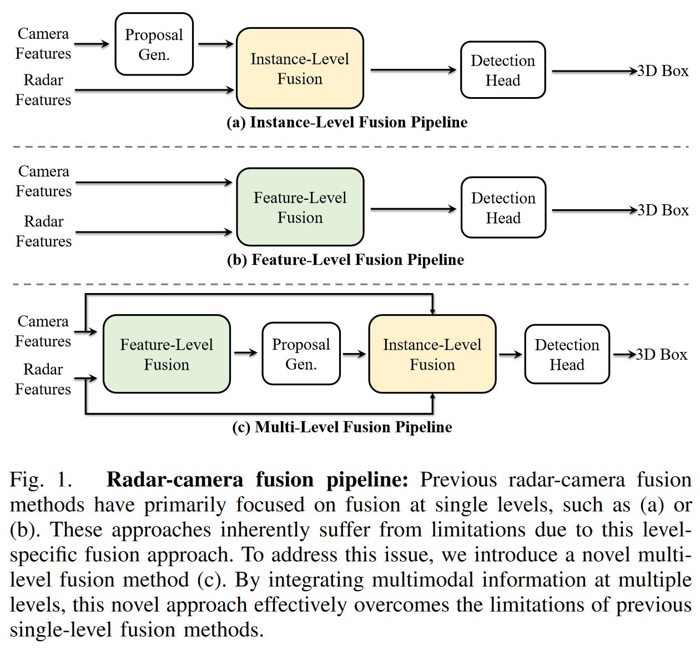
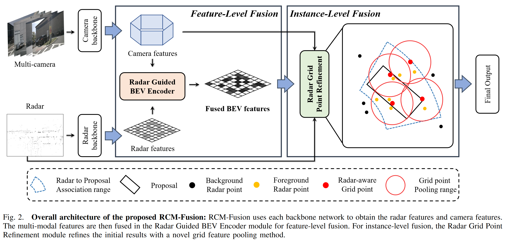
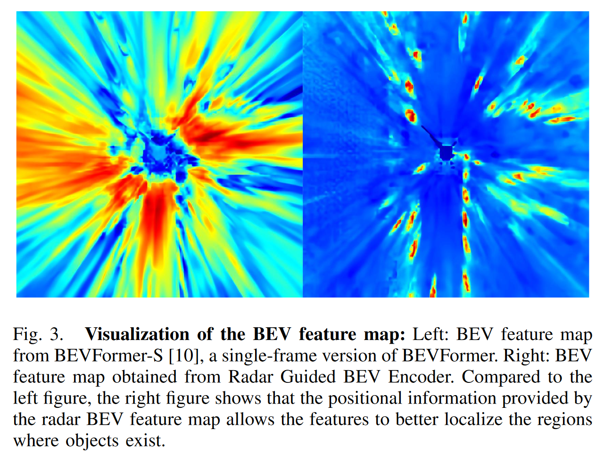
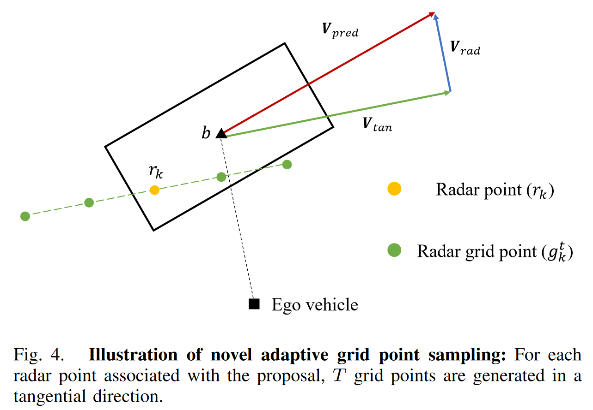

# RCM-Fusion

## Info

> 论文：[https://arxiv.org/pdf/2307.10249.pdf](https://arxiv.org/pdf/2307.10249.pdf)
> 
> github：[https://github.com/mjseong0414/RCM-Fusion](https://github.com/mjseong0414/RCM-Fusion)

## Abstract

cam 和 radar 融合的效费比相比于 Lidar 更好，但是以往的方法没有有效利用 radar 的潜在信息。作者提出 RCM-Fusion 尝试从特征和实例级融合；其中，特征融合上，作者提出了 Radar Guided BEV Encoder，通过 radar 特征引导，用于将 cam 特征精确地转换到 BEV 空间表示，并实现 radar 和 cam 特征融合；实例级融合上，作者提出 radar Grid point refine 模块，通过统计 radar 点云特性来降低位置误差。

## Introduction

作者提出了 novel 的 radar-cam 融合方法，称为 RCM-Fusion，实现了特征和实例级别的融合。其中，通过特征级融合生成稠密 BEV 特征图并生成 3D Proposal，而实例级融合则是基于网格点 proposal 特征融合来增强 proposal（这里的实例级融合是指对于每个 Proposal 进行 radar 点和网格点(BEV 视觉特征)融合，因此为实例级）。

贡献：

1. 提出特征 + 实例级的 RV 融合算法
2. 使用 radar guided BEV query 将图像特征精确的投影到 BEV 空间，使用 Radar-Camera Gating 模块实现多模态 BEV 特征融合；该特征级融合生成稠密的 BEV 特征图，用于生成初始的 3D proposal
3. 使用 Proposal-aware Radar atten 实现实例级融合，降低无关点的影响并通过 Radar Grid Point Pooling 生成 refined 特征

其他，单帧融合

## Related work

- Radar-Cam 3D detection
  Rdar-cam 融合能够利用雷达深度补偿视觉尺度问题。GriFNet 使用 3D anchor 和 Proposal 来从视觉和雷达提取特征，CramNet 采用 2D 分割模型提取前景特征，再将其融合到 3D 空间，CenterFusion，CRAFT 通过使用 radar 信息来回归位置和速度误差，RADIANT 设计了网络用于估计雷达和目标中心的位置偏移量，从而解决雷达视觉的关联问题，CRN 通过 radar 信息来引导视觉 BEV 变换和 3D 目标检测。
  RCM-Fusion 不同于以上算法，在特征和实例级进行融合，CRN 依赖于深度 gt 用于训练深度预测，本文不需要。
- Grid-based refinement for two-stage 3D detection
  不少二阶段检测器使用 Lidar 特征对初始预测的 Proposal 进行 refine，RV-RCNN 和 Voxel-RCNN 使用统一的虚拟网格来 refine，Pyramid-RCNN 提出了当稀疏和非常规分布的可信 refine 策略。
  RCM-Fusion 使用新型的 refine 策略，自适应的构建 2D 虚拟网格，并考虑雷达在方向上的测量误差。

## Method

如图所示作者提出了 multi-level 的融合方法，流程如下：

1. radar 和 image 分别提取特征并生成各自的 feature map，然后 Radar Guided BEV Encoder 将 image 特征转化到 BEV 空间，并与 radar 特征融合
2. 基于 BEV 特征图，使用 transformer 检测头生成初始 3D proposal
3. Radar Grid Point Refinement 对 3D Proposal 增强，提升检测准确度

### Radar and Camera Backbones

多视图图像使用带 ResNet 的 FPN 进行特征提取得到特征$F_C$，radar 使用 pointpillar 获得 BEV 空间的雷达特征，雷达点信息包括其位置、速度和 RCS 通过稀疏 2D 卷积得到 BEV 空间下的雷达特征图$F_R \in \mathbb{R}^{H \times W \times C}$

### Radar Guided BEV Encoder

Radar guided BEV encoder 使用$F_C$和$F_R$作为输入并生成增强的 BEV 特征：

1. 使用$F_R$创建包含雷达位置信息的 radar guided BEV query（RGBQ）
2. 基于 RGBQ 将$F_C$特征转换到增强的 BEV 空间表示$B_C$
3. 使用 radar-camera Gating 考虑两种 BEV 特征间的信息差，对$B_C$和$F_R$特征进行门控聚合

#### Radar Guided BEV Query

为了实现特征级融合，需要将$F_C$转换到 BEV 表示，作者使用 BEVFormer 作为基线模型，通过 BEV query 和 transformer 实现 view transform。为了提升 transformer 的精度，作者利用了 radar 的深度信息：

作者首先使用 radar BEV 特征图$F_R$中的位置信息获得增强的 BEV query$Q^{RG} \in \mathbb{R}^{h \times W \times C}$，称为 radar guided BEV query（RGBQ），该 RGBQ 用于深度引导 image view 的特征转换为 BEV 特征。

注意，RGBQ，表示如下：

$$
Q^{RG}_p = \sum_{V \in \{Q,F_R\}}{DeformAttn(Q_p, p, V)}
$$

其中，$Q^{RG}_p$和$Q_p$表示位于 BEV 特征像素位置为$p=(x,y)$的 query。然后$Q^{RG}_p$通过 spatial-cross Atten 模块 decode 图像特征，生成增强后的 BEV 特征$B_C$如下：

$$
B_C = SCA(Q^{RG}_p, F_C)
$$

#### Radar-Camera Gating

增强的 BEV 特征$B_C$与雷达 BEV 特征$F_R$通过加权求和：

$$
\begin{aligned}
F_R^{\prime}& =\mathrm{MLP}_0(F_R), \\
B_{RC}=& \begin{aligned}\{\sigma(\text{Conv}_C[B_C\oplus F'_R])\odot B_C\}\end{aligned} \\
&\begin{aligned}\oplus\left\{\sigma(\mathsf{Conv}_R[F_R^{\prime}\oplus B_C])\odot F_R^{\prime}\right\}\end{aligned}
\end{aligned}
$$

其中，$B_{RC}$表示融合的 BEV 特征图，$F'_R$表示 encoded 雷达 BEV 特征图，$MLP(\cdot)$表示 channel-wise 的 MLP，$\sigma(\cdot)$表示 sigmoid 函数，$\odot$和$\oplus$表示 element-wise 的乘法和累加；$Conv_C$和$Conv_R$表示相机和雷达的卷积层；门控通过考虑两边信息来动态调整$F_C$和$F_R$的权重，并通过在卷积层使用 sigmoid 函数实现

下一步，融合的 BEV 特征图$B_{RC}$参考 BEVFormer 经过均一化和前馈神经网络，经过$L$次 BEV encoder 最终得到的 BEV 特征。

在使用 radar guided BEV encoder 时，如图所示能够基于雷达位置信息得到增强的 BEV 特征图，RCM-Fusion 能够更好地定位目标位置

### Radar Grid Point Refinement

作者提出了 novel 的实例级融合方法，称为 radar grid refinement 模块，流程如下：

1. Proposal-aware radr atten（PRA）获得 3D proposal 以及关联的雷达点作为输入，使用 MLP-based atten 层决定每个雷达点的重要性；
2. radar grid point Pooling（RGPP）考虑雷达的属性和分布来采样虚拟的网格点，再将雷达特征和多尺度图像特征融合到网格点实现增强
3. 最后，将增强的特征和原始的 3D proposal 特征结合作为最终输出

#### Proposal-aware Radar Attention

PRA 的流程如下：

1. 首先参考 CRAFT，使用 soft polar association（SPA）实现雷达点和 3D Proposal 的关联，SPA 将雷达点和 3D proposal 转换为极坐标表示，并将一定角度和距离范围内的雷达点和 3D proposal 关联，关联的雷达点数量越多，对 Proposal 特征贡献越大

2. 不过有些雷达点与 Proposal 无关，PRA 能够有效滤除外点：
   假设第一阶段检测包含$N$个 Proposal 中的$b$，其属性包括$b = (\mathbf{c},w,h,l,\theta,\mathbf{v}_{pred})$，假设有$K$个雷达点与$b$关联，表示为$\{r_k\}^K_{k=1}$，第$k$个点的 3D 位置为$u_k \in \mathbb{R}^3$。
   对$c$和$u_k$之间的雷达点特征和相对位置进行 encode，计算第$k$点的重要性权重$s_k$，获得所关注的雷达点特征为$a_k$：
   $$
   \begin{aligned}s_k&=\text{MLP}_2\left([\text{MLP}_1(r_k);\delta(\textbf{c}-\textbf{u}_k)]\right)\\a_k&=\text{softmax}(\{s_k\}_{k=1}^K)_k\odot\text{MLP}_3(r_k)\\&\text{where }\forall k\in\{1,\cdots,K\}\end{aligned}
   $$
   其中，$\sigma(\cdot)$表示位置 encoding

#### Radar Grid Point Pooling

网格点中的位置和数量对于网格增强模块的影响至关重要，而且雷达点的低密度和高位置错误率导致网格采样至关重要，作者提出 RGPP 根据雷达点属性进行采样，如图所示：

给定 3D Proposal 的速度向量为$\mathbf{v}_{pred}$，可以分解为切向速度$\mathbf{v}_{tan}$和法向速度$\mathbf{v}_{rad}$。对于第$k$个雷达点$r_k$，根据如下可以参考雷达点位置$u_k$来计算网格点$T = \{g^t_k\}^{T-1}_{t=0}$：

$$
\begin{aligned}\gamma&=\left\{\begin{array}{cc}\rho_{min},&|\mathbf{v}_{tan}|\leq\rho_{min}\\|\mathbf{v}_{tan}|,&\rho_{min}<|\mathbf{v}_{tan}|<\rho_{max}\\\rho_{max},&|\mathbf{v}_{tan}|\geq\rho_{max}\end{array}\right.\\g_k^t&=\gamma\cdot\left(\frac{t}{T-1}-\frac{1}{2}\right)\cdot\frac{\mathbf{v}_{tan}}{|\mathbf{v}_{tan}|}+\mathbf{u}_k,t=0,...,T-1\end{aligned}
$$

如图所示，获得网格点的切向速度$\mathbf{v}_{tan}$，这样做的原因是雷达点在切向的速度噪声更大，因此网格点应该位于该方向以获得更佳的雷达点特征；相邻网格点的空间间隔由$\gamma$决定，与$\mathbf{v}_{tan}$的幅值成比例。由于$\mathbf{v}_{tan}$包含一个预测值，因此并不准确，所以网格点也不一定正确，因此作者为$\gamma$引入上界$p_{max}$和下界$p_{min}$。

对于每个 3D Proposal，$k$个雷达点将生成$KT$个网格点，Farthest Point Sampling（FPS）用于选择$M$个网格点形成固定尺寸的网格点集合$\{g_m\}^M_{m=1}$。

下一步，使用网格点集合$\{g_m\}^M_{m=1}$作为提取雷达点特征和图像特征生成融合网格特征的基础。首先 set abstraction（SetAbs）对网格点网格点集合$g_m$周边的雷达点进行编码来生成雷达点特征$F^{pts}_m$：

$$
F_m^{pts}=\text{SetAbs}(\{a_k\}_{k=1}^K,\{u_k\}_{k=1}^K,g_m)
$$

同时，网格点$g_m$投影到投影视图的图像特征$F_C$，通过双线性插值获得图像特征$F_m^{img}$：

$$
F_m^{img}=\text{Bilinear}(F_C,\text{proj}(g_m))
$$

其中，$proj(\cdot)$表示到相机视图的投影矩阵。最终，proposal 特征 $F^{obj}_m
$通过融合$F^{pts}_m$和$F^{img}_m$ 获得：

$$
F_m^{obj}=\text{mахрооl}(F_m^{pts}\oplus F_m^{img})
$$

这些特征再与初始 Proposal 特征融合生成最终输出的 3D proposal 特征。

## Experiment

## Ablation study
