## Info

> 论文：[https://arxiv.org/abs/2306.08341](https://arxiv.org/abs/2306.08341)
> 
> github：[https://github.com/GREAT-WHU/gv_tools.git](https://github.com/GREAT-WHU/gv_tools.git)

## Framework

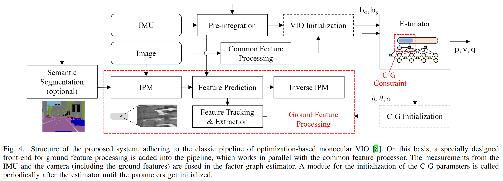

### Abstract

单目 VIO 提供了高精度、低漂移且低成本的定位方案。然而对于运动车辆而言缺乏稳定的特征。

论文提出了 Ground-VIO，使用地面特征和相机-地面几何信息来增强 VIO 性能，方法具体为对以车辆为中心对相机-地面几何（CGG）进行建模，并送入 VIO 进行优化。其中，相机-地面参数可以在线标定并在 VIO 中通过提供稳定的地面特征持续优化。并通过 IPM 作为视觉前端使得能够稳定跟踪地面目标。最后通过实验和仿真对算法进行验证，优于当前 SOTA 的 VIO 方法，甚至是双目方案。

### Intro

1. 单目 VIO 具有成本优势，双目和 Lidar 精度高但是成本高
2. IMU 在常规驾驶车辆上的难以获得较大的激励导致可观测性较差
3. 地面与车辆存在稳定的几何关系，可以将地面作为相机模型中一种特殊的平面

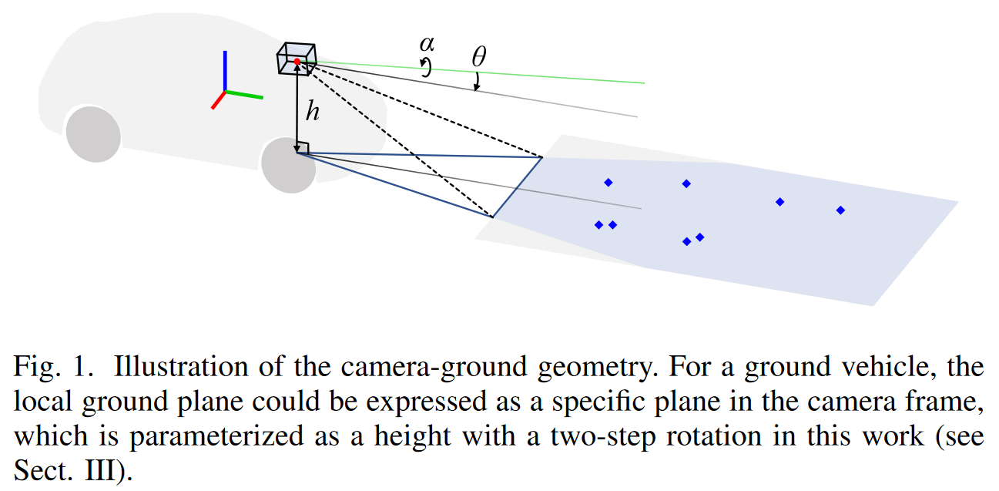

以上相机-地面几何关系其实早有应用，比如 IPM 使用预标定得到的单应矩阵来实现 AVM，但是在线求解 CGG 尚未解决。

作者提出了 Ground-VIO，引入在线估计 CGG 的方法到 VIO 中，能够实现在线估计 CGG 与 IPM 的自标定，工作如下：

1. 提出了以车辆为中心的模型来描述相机-地面几何，可在线标定与提升里程计性能
2. 基于 CGG 和 IPM 通过检测和跟踪地面特征的视觉前端
3. 仿真 + 实车 + 开源

### Related Work

#### VIO

- 滤波方法：

MSCKF，将历史 IMU pose 作为状态向量，并使用视觉特征来构建位姿间的几何约束；其他改进包括引入可观测性约束，外参标定，多 IMU，路标点等

- 优化方法：主流是利用 IMU 预积分因子和视觉重投影因子来估计位姿和路标点，性能更优但是计算复杂；滑动窗口限制优化问题复杂度，从而优化 loc map

在车辆动态场景下，往往难以获得快速运动且稳定的特征，引入车辆与地面的约束是可以可行方式

#### Vehicle Navigation Utilizing the Ground Constraint

在设计车载导航系统时，利用地面约束是一个自然而然的想法。大多数此类研究将地面建模为局部平面（或流形），并限制车辆在其上的运动，这有时隐含在车辆为中心的非完整约束（NHC）中，大致分为确定性 SE(2)约束和随机性 SE(2)约束。确定性 SE(2)约束通过参数化或确定性模型严格约束车辆姿态，而随机性 SE(2)约束则应用于 SE(3)姿态估计，具有时变和概率性约束。一般来说，前者更适合室内或小规模环境，而后者在室外环境中表现出优越性，更能抵抗异常值。虽然其中一些方法使用了基于视觉的传感器设置，但大多数并没有直接将视觉观测与地面相关联【单独作为状态向量进行估计】，只有少数算法利用立体视觉特征来估计地面流形表示，随后将其用于约束车辆姿态。

对比以上方法，作者致力于相机与地面的几何关系而非车辆与地面的几何关系，区别在于：

1. 前者为地面的观测特征
2. 后者为车辆在地面运动

即地面的观测特征可以作为 VIO 中稳定的路标点距离约束，从而提供实例级的尺度信息。部分算法已经基于以上思路进行实现。

但是算法基于相机到地面高度的标定结果，从而限制了可用性。有工作将 CGG 作为 VIO 的状态向量，但是没有讨论其机制。本文将讨论在线标定 CGG 并可大幅优化里程计性能。

### Camera-Ground Geometric Model

CGG 模型的机理：

假设地面平整且车辆为刚体（忽略悬架系统），在相机坐标系$c$中，地平面可以由法向量和距离确定。这里参数化地面高度$h$表示相机中心到地面的高度，在$X-Z$轴的二维旋转可以使相机与地面平行。

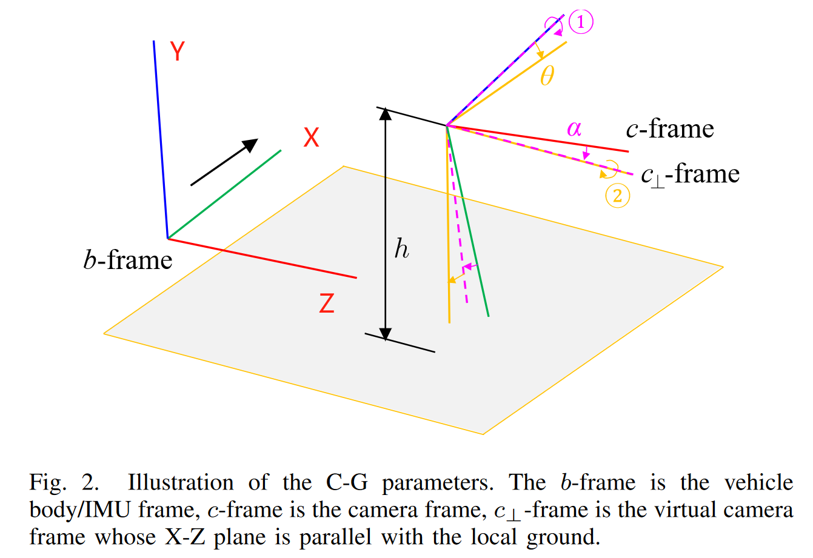

其中，首先旋转$Z$轴使得相机的$X$轴与地面平行，再旋转$X$轴使得相机到达与地面平行的$c_{\bot}$，这里也可作为 IPM 的参考位置

因此，地面到相机坐标系的几何关系表示如下：

$$
\left(\mathbf{R}_{c_\perp}^c\left(\alpha,\theta\right)^\top\mathbf{p}_f^c\right)_y-h=0
$$

其中表示如下，

$$
\mathbf{R}_{c_\perp}^c\left(\alpha,\theta\right)=\begin{bmatrix}\cos\alpha&-\sin\alpha&0\\\sin\alpha&\cos\alpha&0\\0&0&1\end{bmatrix}\begin{bmatrix}1&0&0\\0&\cos\theta&-\sin\theta\\0&\sin\theta&\cos\theta\end{bmatrix}
$$

其中$(\cdot)_{x/y/z}$表示三维向量/矩阵的第一二三行，$\alpha$和$\theta$表示二维旋转的角度，对应于 roll 和 pitch 角。参数$(h,\theta, \alpha)$即为相机-地面参数

以上参数化通过一个高度和两个角度就可以完成相机-地面几何关系的估计，并且容易使用 IMU 姿态来补偿几何关系。在常见的道路环境中，如果传感器标定或车辆负载没有显著变化，表示局部地平面的 C-G 参数在统计上是稳定的。所提出的 Ground-VIO 充分利用了这一点，并且稍后将介绍几种技术来处理复杂条件。

假设相机观测道德路标点为$f$，根据针孔相机模型可以如下：

$$
\mathbf{p}_f^c=\frac{\mathbf{u}_f}{\lambda_f},\quad\mathbf{u}_f=\begin{bmatrix}x\\y\\1\end{bmatrix}=\pi_c^{-1}\begin{bmatrix}u\\v\\1\end{bmatrix}
$$

其中，$\begin{bmatrix}u&\upsilon\end{bmatrix}^\top $表示路标点$f$在图像中的位置，$\mathbf{u}_f = \begin{bmatrix}x&y&1\end{bmatrix}^\top $表示归一化的相机平面，$\pi_c$是相机投影矩阵，$\lambda_f$是$f$的逆深度。

由公式 1 和 3 可以证明，图像中的路标点的(逆)深度可以直接得到：

$$
\lambda_f=\frac1h\left(\mathbf{R}_{c_\perp}^c\left(\alpha,\theta\right)^\top\mathbf{u}_f\right)_y
$$

以上深度信息将极大提升 VIO 性能。

通过结合公式（1）和（3）可以用于 VIO 的路标点的深度预测。下面是一个简单的一维模型来量化分析其对 VIO 的作用。

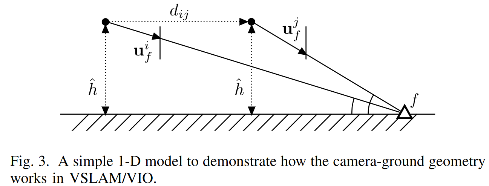

VIO 系统需要通过跟踪路标点$f$来估计运动距离$d_{ij}$。假设 CGG 已知，并且相机高度为$\hat{h}$，那么运动距离表示为如下：

$$
d_{ij}=\hat{h}\cdot\left(1/(\mathbf{u}_f^i)_y-1/(\mathbf{u}_f^j)_y\right)
$$

其中，$\mathbf{u}_f^i$和$\mathbf{u}_f^j$分别表示$f$在$i$和$j$的观测。假设视觉观测不存在噪声，那么对$d_{ij}$只与高度$\hat{h}$有关，即：

$$
d_{ij}\propto\hat{h}
$$

给定一个典型场景，相机高度为 $2m$，误差为$2cm$，那么$d_{ij}$的相对误差为 $1 \%$。即单个地面路标的跟踪导致$1 \%$的相对误差，超过了当前 VIO 的性能。

那么问题进一步展开：

1. CGG 如何引入 VIO
2. CGG 如何获得并在线估计

### System

#### Overview

框架与 VINS-MONO 一致，主要增加了 CGG 模块

视觉和 IMU 通过一般的 VIO 流程进行处理，在此基础上增加了 IPM 以及特征提取模块。地面特征提取模块处理和跟踪 BEV 地面特征，语义分割可以采用但并非必须。

因子图部分，地面特征作为视觉特征的子集，包含相机-地面几何信息约束，这些约束有利于 VIO 性能提升与 CGG 参数的在线估计。

CGG 参数完全未知的情况时，CGG 初始化模块将在因子图优化后进行调用，一旦初始化完成，CGG 与因子图优化将打开，即 CGG 参数将作为因子图的参数进行更新优化。

#### Ground Feature Processing

特征提取参考一般 VIO，使用 KLT 光流进行检测和跟踪，并使用基于基础矩阵的 RANSAC 进行外点过滤。

对于地面特征，其独特分布和快速运动导致在透视图难以有效跟踪，由近及远的过程中被逐渐压缩，而近点尽管易于观测但是运动迅速。

作者这里使用 IPM 进行特征提取，可以基于 CGG 可以直接生成 BEV 视图，并直接得到每个像素的 3D 位置，透视图到 BEV 像素的关系如下：

$$
\mathbf{p}_f^c=\frac{1}{\lambda}_f\cdot\begin{bmatrix}x\\y\\1\end{bmatrix}=h\cdot\mathbf{R}_{c_\perp}^c\left(\alpha,\theta\right)\begin{bmatrix}x_\perp\\1\\-y_\perp\end{bmatrix}
$$

其中，$\mathbf{u}_\perp=\begin{bmatrix}x_\perp&y_\perp&1\end{bmatrix}^\top $表示路标点$f$在 BEV 图像上归一化的图像坐标系。

CGG 先验使得预测地面路标点成为可能，一旦有新的图像输入，能够根据 IMU 预测的相对位姿去预测地面特征：

$$
\mathbf{p}_f^{c_{k+1}}=\hat{\mathbf{R}}_{c_k}^{c_{k+1}}\mathbf{p}_f^{c_k}+\hat{\mathbf{p}}_{c_k}^{c_{k+1}}
$$

其中，$\left(\hat{\mathbf{R}}_{c_k}^{c_{k+1}},\hat{\mathbf{p}}_{c_k}^{c_{k+1}}\right)$表示 IMU 积分得到的相对位姿，结合以上两个公式，无论透视图还是 BEV 视图都可以进行地面特征预测，并且通过限制光流的搜索区域，可以有效提升跟踪性能。

在 Ground-VIO 中，作者选择在 BEV 视图进行特征提取和跟踪，因为 BEV 特征压缩相对较少，实际上 KLT 不具备尺度和选择不变性，因此可能在透视图中发生跟踪失效。

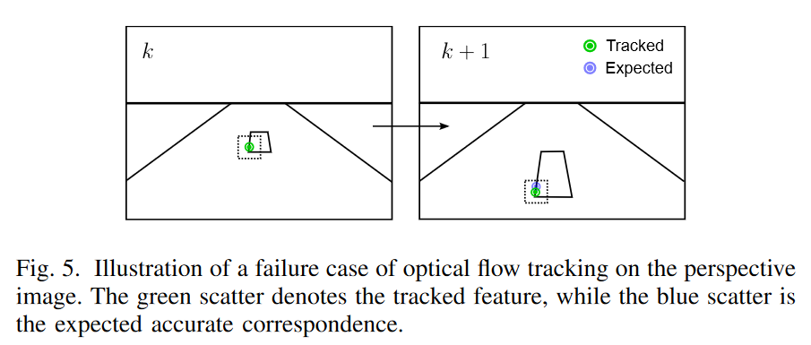

不过 IPM 可以恢复出地面特征的真实尺度，从而降低运动和尺度的影响。

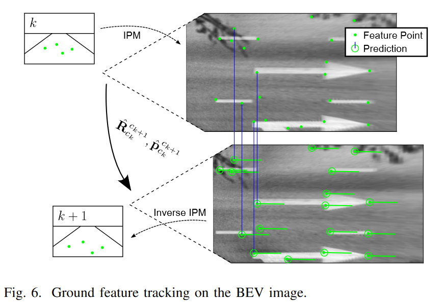

在实践中，作者选择 $15m \times \pm3m$的范围（分辨率$0.015m$）进行跟踪，从而保证跟踪稳定性。

在 BEV 图像上进行特征提取之后，地面特征将通过逆 IPM 重映射为透视图，这样特征可以与一般特征一样进行处理（即 VINS 不直接从图像提取特征，而是先 IPM 在逆 IPM 得到特征）。这样做可以不引入 CGG 的系统误差。在整个 VIO 系统中，CGG 参数将持续更新

提取和跟踪地面特征需要识别特征区域，使用语义分割可以实现以上目的。注意 IPM 自身可以排除大量非地面元素，使用 CGG 结合 RANSAC 可以过滤出 BEV 图像上的外点。另外在因子图模块中，外点检测的误差将进一步缩小，因此语义分割为可选项。

在因子图模块，提取的地面特征将作为地面特征的子集用于构建视觉重投影因子，CGG 约束也将加入因子图

#### Optimization-based VIO

参考 VINS-MONO，因子图维护一个滑动窗口来同时估计定位状态，路标点和 CGG 参数。

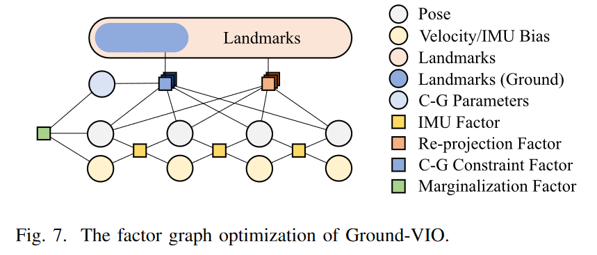

Ground-VIO 的状态向量定义如下：

$$
\begin{aligned}
&\text{X}&& =(\mathbf{x}_0, \mathbf{x}_1, \cdots, \mathbf{x}_n, \mathbf{x}_\perp, \lambda_0, \lambda_1, \cdots, \lambda_m) \\
&\mathbf{x}_{k}&& =\left(\mathbf{p}_{b_k}^w, \mathbf{q}_{b_k}^w, \mathbf{v}_{b_k}^w, \mathbf{b}_{a,b_k}, \mathbf{b}_{g,b_k}\right), k\in[0, n] \\
&\mathbf{x}\perp && =(h, \theta, \alpha) 
\end{aligned}
$$

其中，$\mathbf{p}_{b_k}^w, \mathbf{q}_{b_k}^w, \mathbf{v}_{b_k}^w$分别为世界坐标系下第$k$帧的位置，朝向和速度，$\mathbf{b}_{a,b_k}$和$\mathbf{b}_{g,b_k}$为加速度计偏差向量以及陀螺仪漂移向量，$\lambda_0, \lambda_1, \cdots, \lambda_m$表示路标点的逆深度。每个路标点与滑动窗口中的第一个观测帧锚定。

以下是优化中考虑的因子：

- IMU preintegration factor

帧间的 IMU 通过预积分来构造预积分因子，残差项如下：

$$
\mathrm{r}_{\mathrm{IMU}}\left(\hat{\alpha}_{b_{k+1}}^{b_{k}},\hat{\beta}_{b_{k+1}}^{b_{k}},\hat{\gamma}_{b_{k+1}}^{b_{k}},\mathrm{x}_{k},\mathrm{x}_{k+1}\right)= \begin{bmatrix}\mathbf{R}_{b_{k}}^{w}\operatorname{\top}\left(\mathbf{p}_{b_{k+1}}^{w}-\mathbf{p}_{b_{k}}^{w}+\frac{1}{2}\mathbf{g}^{w}\Delta t_{k}^{2}-\mathbf{v}_{b_{k}}^{w}\Delta t_{k}-\hat{\alpha}_{b_{k+1}}^{b_{k}}\right)\\\mathbf{R}_{b_{k}}^{w}\operatorname{\top}\left(\mathbf{v}_{b_{k+1}}^{w}+\mathbf{g}^{w}\Delta t_{k}-\mathbf{v}_{b_{k}}^{w}\right)-\hat{\beta}_{b_{k+1}}^{b_{k}}\\2\left[\mathbf{q}_{b_{k}}^{w}\operatorname{-1}\otimes\mathbf{q}_{b_{k+1}}^{w}\otimes\left(\hat{\gamma}_{b_{k+1}}^{b_{k}}\right)^{-1}\right]_{xyz}\\\mathbf{b}_{a,b_{k+1}}-\mathbf{b}_{a,b_{k}}\\\mathbf{b}_{g,b_{k+1}}-\mathbf{b}_{g,b_{k}}\end{bmatrix}
$$

其中，第$k$和第$k+1$帧表示相邻的两帧，$\Delta t_k$表示对应的时间间隔，$\hat{\alpha}_{b_{k+1}}^{b_k}, \hat{\beta}_{b_{k+1}}^{b_k}, \hat{\gamma}_{b_{k+1}}^{b_k}$表示 IMU 的预积分项

IMU 提供了稳定的相对位姿信息，但是单独使用无法估计绝对的旋转和速度。在 VIO 系统中，真实尺度的旋转和速度可以通过视觉观测以及足够激励的 IMU 相结合来获得

- Visual re-projection factor

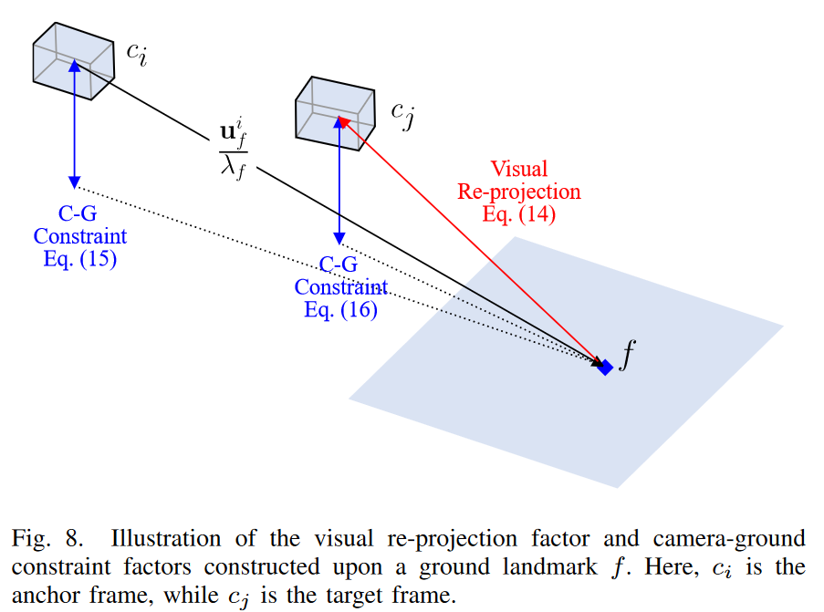

视觉特征维护一个滑动窗口，包含地面特征，用于构建视觉重投影因子，残差项表示如下：

$$
\mathbf{r}_{\mathrm{cam}}\left(\mathbf{u}_f^i,\mathbf{u}_f^j,\mathbf{x}_i,\mathbf{x}_j,\lambda_f\right)=\begin{bmatrix}(\mathbf{p}_f^{c_j})_x/(\mathbf{p}_f^{c_j})_z\\(\mathbf{p}_f^{c_j})_y/(\mathbf{p}_f^{c_j})_z\end{bmatrix}-\mathbf{u}_f^j
$$

其中有：

$$
\mathbf{p}_{f}^{{c_{j}}}=\mathbf{R}_{{b_{j}}}^{w}\top\left(\mathbf{R}_{{b_{i}}}^{w}\left(\mathbf{R}_{c}^{b}\left(\frac{\mathbf{u}_{f}^{i}}{\lambda_{f}}\right)+\mathbf{p}_{c}^{b}\right)+\mathbf{p}_{{b_{i}}}^{w}-\mathbf{p}_{{b_{j}}}^{w}\right)
$$

其中，$\mathbf{u}^i_f$和$\mathbf{u}^j_f$表示在第$i$帧和$j$帧的视觉观测，$(\mathbf{R}_c^b,{\mathbf{p}}_c^b)$表示 IMU-相机的外参矩阵

视觉测量通过 BA 优化用于约束车辆位姿和路标点

- Camera-ground constraint factor

CGG 约束同样通过滑动窗口维护。实际上有两种 CGG 约束因子，由决定

如果 anchor 帧【应该是关键帧】和目标帧为同一帧，那么残差项定义如下：

$$
r_{\mathrm{C-G}}\left(\mathbf{u}_f^i,\lambda_f,\mathbf{x}_\perp\right)=h-\left(\mathbf{R}_{c_\perp}^c\left(\alpha,\theta\right)^\top\frac{\mathbf{u}_f^i}{\lambda_f}\right)_y
$$

如果 anchor 帧和目标真不是同一帧，残差项定义如下：

$$
r_{\mathrm{C-G}}\left(\mathbf{u}_f^i,\lambda_f,\mathbf{x}_i,\mathbf{x}_j,\mathbf{x}_\perp\right)=h-\left(\mathbf{R}_{c_\perp}^c\left(\alpha,\theta\right)^\top\mathbf{p}_f^{c_j}\right)_y
$$

其中，第$i$帧是 anchor 帧，第$j$帧是目标帧。

通过引入 CGG 约束，可以在 VIO 中在在线估计 CGG 参数。一旦参数收敛，那么这些约束就可以为 VIO 提供低漂移，真实尺度的地面信息。这一"使某些参数收敛并用于提升状态估计性能"的机制类似 IMU 偏差项的维护。但是 CGG 参数相对于具有更加稳定的影响：

1. IMU 偏差项是时变的，而 CGG 相对稳定
2. CGG 与位姿估计是同阶的，不需要像 IMU 进行积分

最终得到的优化问题可以表示为最小化以下残差项和先验项：

$$
\begin{gathered}
\min_{\mathcal{X}}\left\{\left\|\mathbf{r}_p-\mathbf{H}_p\mathcal{X}\right\|^2+\right. \\
\sum_{k\in[0,n)}\left\|\mathbf{r}_{\mathrm{IMU}}\left(\hat{\alpha}_{b_{k+1}}^{b_k},\hat{\beta}_{b_{k+1}}^{b_k},\hat{\gamma}_{b_{k+1}}^{b_k},\mathbf{x}_k,\mathbf{x}_{k+1}\right)\right\|_{\mathbf{P}_{\mathrm{IMU}}}^2+ \\
\sum_{i<j\in[0,n],f\in\mathcal{F}}\rho_{\mathrm{H}}(\left\|\mathbf{r}_{\mathrm{cam}}\left(\mathbf{u}_{f}^{i},\mathbf{u}_{f}^{j},\mathbf{x}_{i},\mathbf{x}_{j},\lambda_{f}\right)\right\|_{\mathbf{P}_{\mathrm{cam}}}^{2})+ \\
\sum_{i\in[0,n],f\in\mathcal{F}_\perp}\rho_{\mathbf{C}}(\left\|r_{\mathbf{C}-\mathbf{G}}\left(\mathbf{u}_f^i,\lambda_f,\mathbf{x}_\perp\right)\right\|_{P_{\mathbf{C}-\mathbf{G}}}^2)+ \\
\sum_{i<j\in[0,n],f\in\mathcal{F}_\perp}\rho_{\mathrm{C}}(\left\|r_{\mathrm{C-G}}\left(\mathbf{u}_f^i,\lambda_f,\mathbf{x}_i,\mathbf{x}_j,\mathbf{x}_\perp\right)\right\|_{P_{\mathrm{C-G}}}^2)\biggr\} 
\end{gathered}
$$

其中，$\mathbf{r}\_p$和${\mathbf{H}}\_p)$表示参考 VINS-MONO 边缘化获得的先验信息，$\mathcal{F}$是滑动窗口中维护的路标点，$\mathcal{F}\_{\bot}$是地面路标点，作为$\mathcal{F}$的子集。$\rho_H(*)$和$\rho\_C(*)$是 Huber 和柯西和函数。$(\mathbf{P}\_{IMU},{\mathbf{P}}\_{cam}, P\_{\mathrm{C-G}})$表示残差的协方差和方差项，并通过 Ceres 进行求解。

#### Initialization of Camera-Ground Parameters

如果一开始 CGG 完全未知，那么地面特征处理无法正常工作，因为无法构建准确的相机-地面约束，此时系统需要在线初始化 CGG。

已知单目 VIO 在足够 IMU 激励情况下可以感知米级的环境。基于此，完全可以不使用其他传感器实现 CGG 参数的在线标定，整体流程如下：

VIO 初始化之后，一般的 VIO 流程开始工作。没有 CGG 先验只能在透视图上进行地面特征跟踪。选取一个图像上的 ROI，由 IMU-相机外参和车身高度决定。

初始化 CGG 时，地面路标点的不确定性（方差等）进行周期性的检查。一旦地面路标点的不确定性低于某个阈值，这些路标点将组合起来用于估计 CGG 参数：

$$
\left(h,\theta,\alpha\right)\\\left(\hat{h},\hat{\theta},\hat{\alpha}\right)=\arg\min_{(h,\theta,\alpha)}\sum_{i\leq j\in[0,n],f\in F_\perp}\left\|h-\left[\mathbf{R}_{c_\perp}^c\left(\alpha,\theta\right)^\top\left(\mathbf{R}_{c_i}^{c_j}\frac{\mathbf{u}_f^{c_i}}{\lambda_f}+\mathbf{p}_{c_i}^{c_j}\right)\right]_y\right\|
$$

在 CGG 参数初始化之后，地面特征处理模块将打开用于更好的跟踪，同时 CGG 约束也加入因子图进行优化。

#### Dealing with Complex Road Conditions

在现实场景中，道路条件可能相对复杂，不符合第三节中描述的理想相机-地面几何模型。这些复杂条件主要可以归结为以下两种情况：

1. 由于道路不平整或车辆动力学特性导致的车辆姿态振动
2. 道路坡度的变化

这两种情况在图 9 中进行说明，如果不加考虑，它们将导致系统误差并影响系统性能。在所提出的系统中，我们采用了几种策略来减轻这些问题的影响。

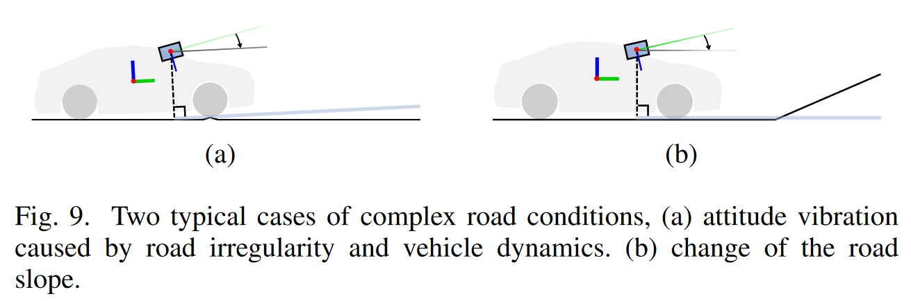

为了处理车辆的高频姿态振动（图 9(a)），使用局部惯性测量单元（IMU）的姿态估计来临时补偿相机-地面（C-G）参数，结果如图 10 所示。

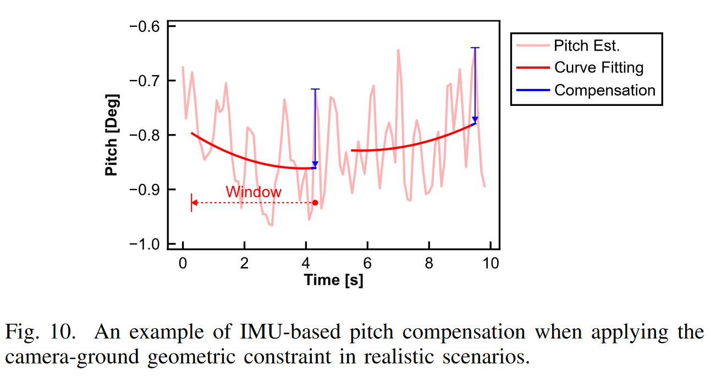

在实践中仅对俯仰角 θ 进行补偿，考虑到感兴趣的地面区域（±3 米宽，15 米远）时，俯仰角的变化更为敏感。具体来说，使用 4 秒的时间窗口的历史俯仰角估计值来拟合一个二次曲线，并据此计算当前时刻的俯仰角补偿值。公式如下：

$$
\theta_{comp} = \theta^{w}_{b_{k}} + \hat{\theta}^{w}_{b_{k}}
$$

其中，$\theta^{w}_{b_{k}}$是当前 IMU 的 pitch 角估计值，$\hat{\theta}^{w}_{b_{k}}$时曲线拟合的 pitch 角估计值，通过使用相机-地面约束因子，当前帧临时的 CGG 可以通过如下补偿：

$$
\theta_k = \theta + \theta_{comp}
$$

其中，$\theta_k$可以看作在$k$轮的临时 CGG 参数。这样由于高度振动导致的 CGG 噪声将有效减弱。

对于如图 9（b）的斜坡情况，首先需要丢弃不满足地面平直假设的观测点，进一步在构建 CGG 因子时，使用相对严格的外点筛选策略，使用 cut-off 阈值结合柯西核函数，从而纠正由急剧坡度变化引起的较大误差。

### Experiment

> 这里缩减

结论：

1. 总体而言，通过 CGG 实现 IPM 的特征跟踪相较于直接图像跟踪更加稳定，因此性能更好
2. CGG 自标定可以逐渐收敛
3. 通过 CGG 标定获得 IPM 也是可行的

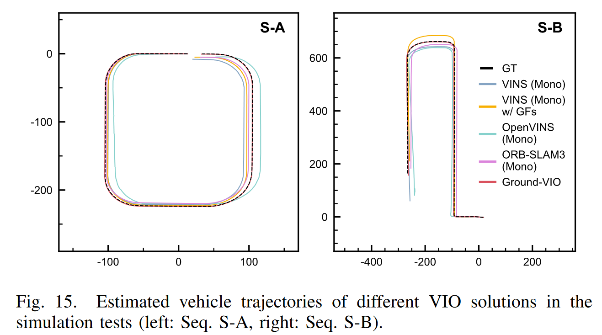
