# mmBEV

## Info

> github: https://leijobs/MonoFusion.git [开发中]

## TodoList

- [X] Baseline trainable code
- [X] pretrained model
- [ ] Stable configuration
- [ ] More configuration
- [ ] Visualize Results

## Idea

多目的环视 BEV+Transformer 感知方案正成为当前量产的基本趋势，而更 noval 的 Occ 也逐渐进入量产阶段；但是当前还有大量传统的 1V1R 这或者其他非 BEV 的智驾配置，通过特征级融合用于实现主动安全以及其他基本 L2 功能

基本思路：

1. 轻量化的 BEV 融合网络
2. 考虑车身/IMU 数据实现前处理或者位姿补偿
3. Multi Task【目前数据集较少支持】
4. Temporal 融合【需要自车 pose】

## Progress

### Dataset

| 数据集    | 模态     | 标注         | 优缺点                                                                     |
| --------- | -------- | ------------ | -------------------------------------------------------------------------- |
| Nuscnes   | C+L+R2   | nuscnes 格式 | 优点：大规模，leaderboard 缺点：2D 稀疏雷达                                |
| VOD       | C+L+R4   | kitti 格式   | 优点：开源缺点：4D 雷达相对稀疏，规模较小                                  |
| DualRadar | C+L+R4*2 | kitti 格式   | 优点：稀疏 + 稠密两种 4D 雷达缺点：外参标定不准确导致 Label 不准确，规模小 |
| TJ4DRadar | C+L+R4   | --           | 需要合同签字，相当于不开源                                                 |

### Method

#### Seg-based

一开始的方案是参考 Fiery、Mono-seman-maps：

基本思路如下：

1. 单目视觉特征参考 LSS[Fiery]或者堆叠 view transformer[Mono-seman-maps]并投影为 BEV image view
2. 雷达点云投影到相机系，并使用 Voxel 或 Pillar 方法提取特征
3. 在 BEV 空间实现视觉-雷达特征融合
4. 在 BEV 空间执行语义分割获得目标

- 问题：

1. Mono-seman-maps 在 nuscenes 单目的分割效果较差

> 验证 1： PanoticBEV

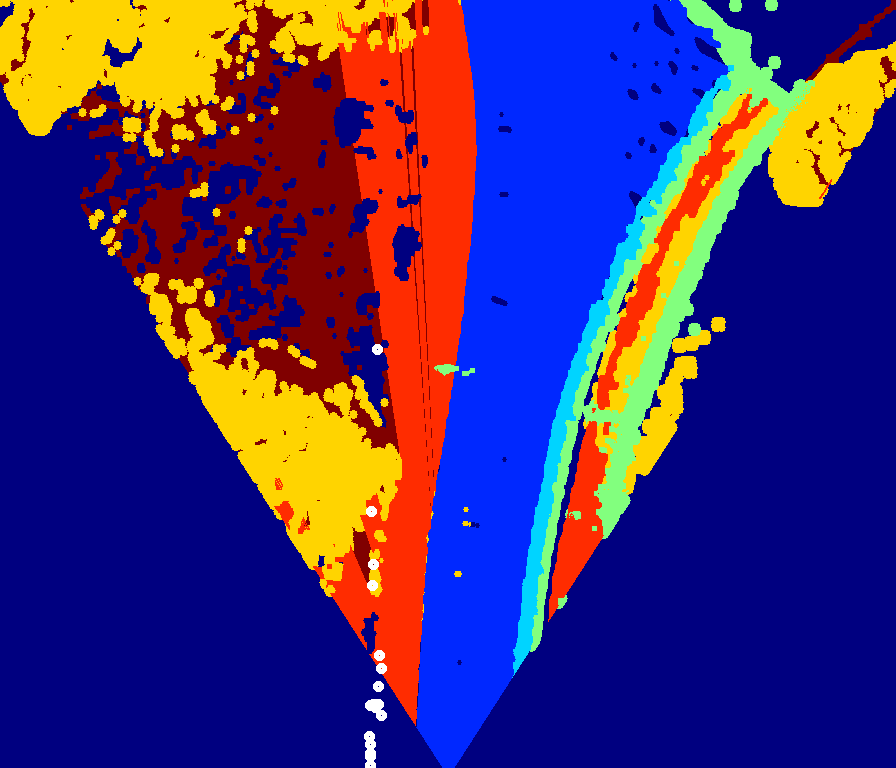

结论：Radar 到 BEV 的投影相对稀疏，并且与目标关联不大【已经转换到 cam 坐标系】

> 验证 2：Mono-seman-maps

nuscenes

| 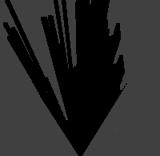 | 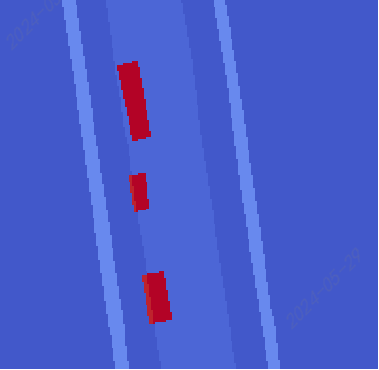 | 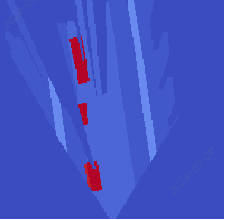 | 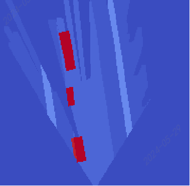 |
| ------------------------------------------- | ------------------------------------------- | ------------------------------------------- | ------------------------------------------- |
| encoded img                                 | full img                                    | Decoded occlued img                         | Decoded inocclued img                       |

vod

| 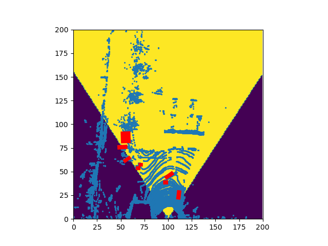 | 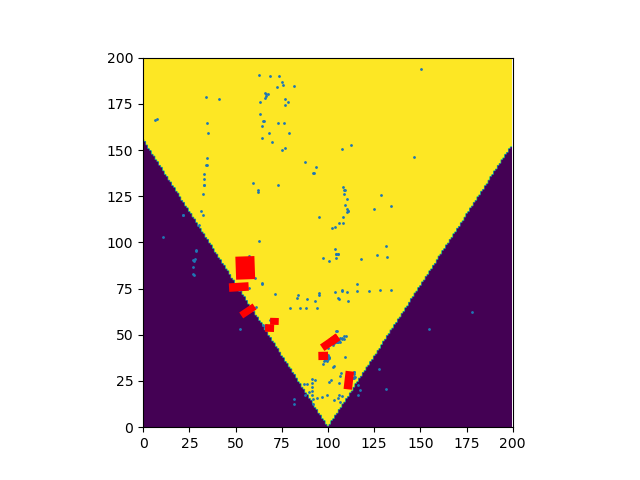 | 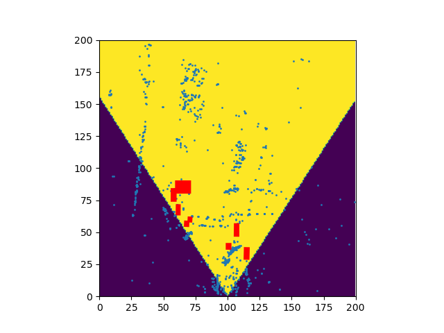 |
| ------------------------------------------- | ------------------------------------------- | ------------------------------------------- |
| lidar frame                                 | single frame radar                          | multi frame radar                           |

> 结论：多帧雷达单纯叠加的结果与实际的位置不符，需要自车 pose 更新位置才可使用

dualradar

| 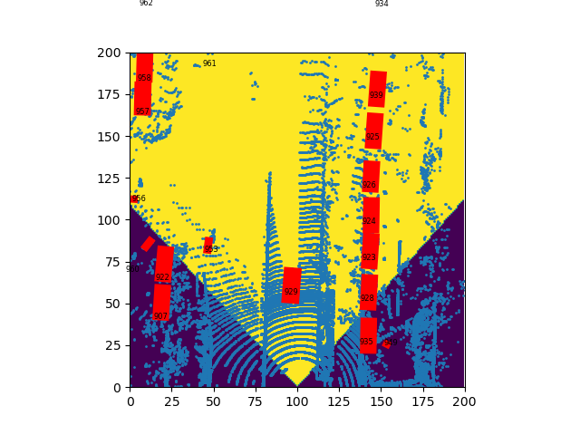 | 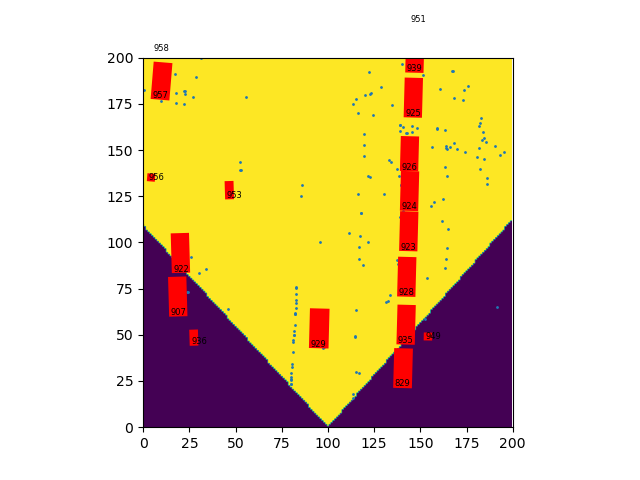 | 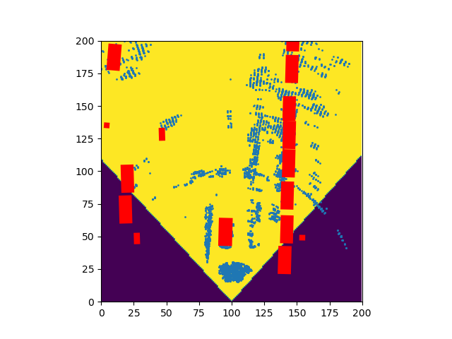 |
| ------------------------------------------- | ------------------------------------------- | ------------------------------------------- |
| lidar frame                                 | ars548 radar frame                          | arbe radar frame                            |

> 结论：arbe 雷达近似于稀疏的雷达，ars548 雷达性能较差

1. 分割适合地图要素构建，不适合目标检测

#### Det-based

参考 BEVFusion-MIT 或者 FastBEV 实现 BEV 空间的 1V1R 的融合检测：

模块具体如下：

> 1. 特征提取：图像：Swin，雷达：Voxel
> 2. View transformer：LSS（目前非 BEVFusion 的 DepthLSS）
> 3. 特征融合：参考 BEVFusion 使用简化的 ConvFuser
> 4. 检测头：CenterHead 或 TransFusionHead

### Work Pipeline

1. 新增 `VOD` 数据集
2. 修改数据加载、LSS 部分
3. 修复部分错误

## Performance

- VOD

【epoch 13】

```
2024-07-28 11:20:34,736   INFO  Car AP@0.70, 0.70, 0.70:
bbox AP:51.0133, 53.6131, 49.1140
bev  AP:48.0569, 52.6448, 48.2621
3d   AP:22.4799, 28.1073, 26.5429
aos  AP:49.27, 52.11, 47.79
Car AP_R40@0.70, 0.70, 0.70:
bbox AP:50.8908, 52.1052, 47.5238
bev  AP:45.5199, 51.3034, 46.8703
3d   AP:19.9899, 26.8023, 23.3624
aos  AP:48.95, 50.48, 46.05
Car AP@0.70, 0.50, 0.50:
bbox AP:51.0133, 53.6131, 49.1140
bev  AP:74.4977, 75.0987, 68.9763
3d   AP:59.9959, 60.1491, 56.7814
aos  AP:49.27, 52.11, 47.79
Car AP_R40@0.70, 0.50, 0.50:
bbox AP:50.8908, 52.1052, 47.5238
bev  AP:75.5695, 75.7632, 69.8452
3d   AP:59.2751, 61.1261, 55.5252
aos  AP:48.95, 50.48, 46.05
Pedestrian AP@0.50, 0.50, 0.50:
bbox AP:74.2177, 70.3852, 65.9038
bev  AP:65.4564, 60.9743, 55.6546
3d   AP:48.9154, 44.4633, 41.4854
aos  AP:60.48, 57.22, 53.47
Pedestrian AP_R40@0.50, 0.50, 0.50:
bbox AP:75.9622, 71.1841, 66.0593
bev  AP:65.3848, 60.6695, 55.0678
3d   AP:47.1498, 43.4199, 38.8922
aos  AP:60.46, 56.36, 51.95
Pedestrian AP@0.50, 0.25, 0.25:
bbox AP:74.2177, 70.3852, 65.9038
bev  AP:78.3212, 73.7838, 69.1017
3d   AP:78.2214, 73.3973, 68.3235
aos  AP:60.48, 57.22, 53.47
Pedestrian AP_R40@0.50, 0.25, 0.25:
bbox AP:75.9622, 71.1841, 66.0593
bev  AP:79.7321, 75.0397, 69.8003
3d   AP:79.4058, 74.5621, 69.0770
aos  AP:60.46, 56.36, 51.95
Cyclist AP@0.50, 0.50, 0.50:
bbox AP:82.9971, 80.4414, 74.2504
bev  AP:83.5886, 81.0976, 74.3854
3d   AP:80.6624, 76.5114, 70.4621
aos  AP:82.43, 79.80, 73.57
Cyclist AP_R40@0.50, 0.50, 0.50:
bbox AP:85.8467, 81.4123, 75.3921
bev  AP:87.0186, 82.2613, 75.2761
3d   AP:82.2976, 77.6057, 70.5446
aos  AP:85.25, 80.76, 74.69
Cyclist AP@0.50, 0.25, 0.25:
bbox AP:82.9971, 80.4414, 74.2504
bev  AP:84.1203, 81.8499, 76.2273
3d   AP:83.9593, 81.8089, 75.9828
aos  AP:82.43, 79.80, 73.57
Cyclist AP_R40@0.50, 0.25, 0.25:
bbox AP:85.8467, 81.4123, 75.3921
bev  AP:87.7087, 83.4792, 77.4977
3d   AP:87.6287, 83.2592, 77.2985
aos  AP:85.25, 80.76, 74.69
bev  AP:88.2891, 84.3780, 78.6743
3d   AP:87.6133, 83.4949, 77.4712
```

## 问题

1. 训练时有时维度错误

> 分析：VOD 数据集部分标注错误，需要优化
> 解决：对于问题数据暂时通过强制对齐解决

1. 暂无可视化

> 分析：`demo.py` 暂不支持多模态数据集加载
> 解决：后面重写对应的 `Dataset` 部分

## 参考

> [https://github.com/open-mmlab/OpenPCDet/blob/master/docs/GETTING_STARTED.md](https://github.com/open-mmlab/OpenPCDet/blob/master/docs/GETTING_STARTED.md)
> [https://github.com/open-mmlab/OpenPCDet/blob/master/docs/guidelines_of_approaches/bevfusion.md](https://github.com/open-mmlab/OpenPCDet/blob/master/docs/guidelines_of_approaches/bevfusion.md)
