# RoadLib

## Info

> 论文：[https://ieeexplore.ieee.org/document/9850364](https://ieeexplore.ieee.org/document/9850364)
> 
> github：[https://github.com/GREAT-WHU/RoadLib](https://github.com/GREAT-WHU/RoadLib)

## Framework

### Abstract

高精地图对自动驾驶车辆定位与导航至关重要，为了获得高精地图，可以考虑低成本建图方案

作者提出了基于视觉的 SLAM 系统，生成实例级的地图信息。通过 IPM 考虑了地图元素的不确定性，使得定位和建图时更为灵活。此外图优化的位姿优化可以实现 GNSS 与里程计的精确融合。实车实验验证了系统的有效性。

### Introduction

高精度定位对于高级智能车辆应用至关重要。将 GNSS、IMU、LiDAR 和摄像头信息融合在一起，以实现车辆准确且高可用性的定位。对于消费级应用，通常只能使用米级 GNSS。低成本方案的定位性能受到很大限制，尤其是在 GNSS 信号条件恶劣的城市地区。

借助 HD 地图，通过将高精度先验信息与车辆的环境感知相结合，可以大大提高车辆定位的准确性和可用性。作者提出了一种轻量级的基于视觉的地图构建和定位系统，该系统能够自动生成紧凑的地图，并在该地图上实现高精度定位。

系统从单目 RGB 图像中提取的语义道路标记通过 IPM 恢复为真实尺度的点云，然后参数化以实现高效的交换和灵活的数据关联。此外，系统在不同阶段都会研究和充分考虑道路标记的空间不确定性，从而在复杂条件下实现更准确的地图构建和定位性能。在地图生成过程中，使用 RTK 进行地理参考，而最终用户可以在几乎没有任何要求的情况下进行准确的地图辅助定位。该系统的目标是为潜在的众包地图构建和低成本地图辅助车辆导航提供一个统一的框架。本研究贡献如下：

1. 开发了一个基于语义道路标记紧凑实例级参数化的视觉地图构建和定位系统。研究了由 IPM 生成的道路元素的空间不确定性，这能够在复杂条件下实现概率性地图构建和定位
2. 为系统的地图构建和定位阶段中的姿态估计开发了一个统一的基于姿态图的估计器
3. 进行了实际实验以验证系统的不同阶段，包括车载地图构建、多源地图合并和地图辅助定位

### Related Work

Jeong 等人开发了一个基于从 IPM 图像中提取的分类道路标记的 SLAM 系统，该系统具有姿态图优化和闭环检测功能。Qin 等人从 IPM 图像中提取语义特征以生成语义地图，从而在室内停车场和室外道路场景中实现高精度定位。在上述实现中，语义道路标记通常被视为密集点云，同时也提出了基于边缘和网格的道路场景下的语义地图构建方法。此外，Cheng 等人使用了一种新颖的基于 CNN 的前端来提取稀疏语义视觉特征并构建紧凑的语义地图，从而实现高效且准确的定位。

还有一些研究集中在基于先验高清地图的视觉定位。Tao 等人利用从图像中提取的车道线进行地图匹配，以约束车辆的横向位置和航向。Schreiber 等人在感知到的道路标记和预构建的矢量地图之间建立了点对点的关联，实现了从分米级到厘米级的全球定位。除了利用道路元素外，Wang 等人还采用了更通用的基于 CNN 的目标检测方法。在该方法中，通过将语义对象与投影到图像中的高清地图元素相关联，构建了全局车辆姿态约束。

在本文的系统中，主要利用 IPM 生成的语义道路标记，因为它简单且高效。不同的是，我们采用更紧凑的参数化来生成实例级道路，而不是使用密集点云或体素，这使得数据的使用更加灵活。对于 IPM 生成的道路标记，其准确性受到语义分割错误、道路不规则性和车辆姿态变化的高度影响，这极大地限制了其实用性。在提出的系统中，在地图生成、地图元素合并和地图辅助定位过程中，充分考虑了地图元素的空间不确定性。与同样生成基于紧凑参数的地图元素的相比，本文中采用了截然不同的前端处理和更简化的参数化，从而导致了不同的地图使用方式。

### System Overview

系统包含定位和建图两部分，假设车辆装有用于全局定位的 GNSS 和局部定位的里程计或 VIO。用户可以使用低精度的 GNSS 获得高精度的地图信息。

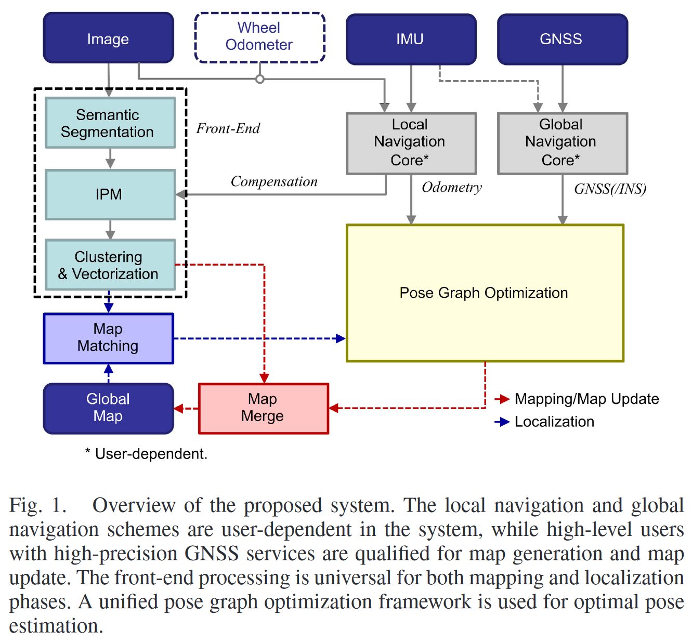

对于视觉环境感知，定位和建图模块共享相同的 pipeline，用于从图像中生成语义级的地面实例。在定位模块，地面元素将加入全局地图并 merge，该数据可以来源于单一车辆或者多车辆。构建的地图可以用于终端用户的地图定位服务

位姿估计使用统一的图优化框架，融合全局位姿，loc map 和地图匹配（终端）从而实现鲁棒的精确定位

### Semantic Road Marking Extraction

语义信息的提取采用 SegFormer，在 Apolloscape 上预训练之后再在自建数据集中进行训练，类别如下：

1. 实线
2. 虚线
3. 引导标志
4. 斑马线
5. 停止线
6. 其他

注意该模块集成在感知系统中，不作为单独的模块

语义分割之后使用 IPM 恢复真实尺度的地面标志，对于 IPM 中标志的空间不确定性将在下面展开

假设虚拟相机定义为$\bar{c}$，与真实相机$c$位于同一光心，方向地面朝下，虚拟相机的$X-Y$轴与地面平行。对应的 3D 坐标点的位置$f$在$\bar{c}$和$c$的变换如下：

$$
\mathbf{p}_f^c=\mathbf{R}_{\bar{c}}^c\mathbf{p}_f^{\bar{c}} \mathbf{R}_{\bar{c}}^c\approx\left(\begin{array}{ccc}1&0&0\\0&0&-1\\0&1&0\end{array}\right)
$$

其中，$\mathbf{R}\_{\bar{c}}^c$可以提前标定得到

另外，$f$可以通过如下方法投影到原始图像和 IPM 图像上：

$$
\begin{gathered}
\mathbf{p}_f^c=Z\cdot\left(\begin{array}{c}{x}\\{y}\\{1}\\\end{array}\right)=Z\cdot\left(\begin{array}{cc}{f_x}&{0}&{c_x}\\{0}&{f_y}&{c_y}\\{0}&{0}&{1}\\\end{array}\right)^{-1}\left(\begin{array}{c}{u}\\{v}\\{1}\\\end{array}\right) \\
\mathbf{p}_{f}^{\overline{c}}=D\cdot\left(\begin{array}{c}{x_{I}}\\{y_{I}}\\{1}\\\end{array}\right)=D\cdot\left(\begin{array}{cc}{\frac{1}{R}}&{0}&{\frac{W}{2}}\\{0}&{\frac{1}{R}}&{H}\\{0}&{0}&{1}\\\end{array}\right)^{-1}\left(\begin{array}{c}{u_{I}}\\{v_{I}}\\{1}\\\end{array}\right) 
\end{gathered}
$$

其中，$(u,v)$和$(u_I, v_I)$分别为$f$在原始图像和 IPM 图像上的像素坐标；$(x,y)$和$(x_I, y_I)$为归一化之后的坐标；$(f_x, f_y, c_x, c_y)$为原始图像的相机内参，$Z$为像素$f$在真实相机中的深度，$R$为其在 IPM 图像中的像素对应的分辨率（一个像素对应的真实尺度因子）；$W$和$H$是 IPM 图像的宽度和高度，$D$为虚拟相机$\bar{c}$到地面的高度，与车辆高度直接相关。

基于上面三个公式，假设相机高度$D$已知且虚拟相机$\bar{c}$与地面平行，那么原始图像中地面的像素可以变换为相机坐标系下的 3D 点或者 IPM 图像中的真实尺度。作者使用以上公式得到 IPM 图像，并在 IPM 图像上对像素进行聚类生成实例级的地面标记点云。整个流程如图所示

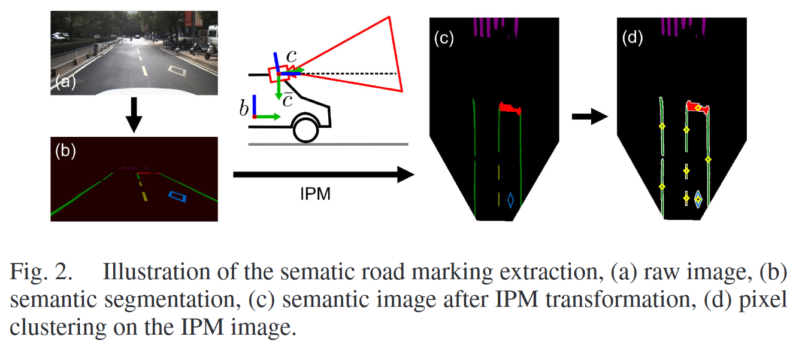

### Modeling the Instance-Level Road Markings

这部分讨论如何进行考虑空间不确定性的地面标记参数化，作为后续定位和建图的基础

#### Parameterization of the Road Markings

注意，斑马线由于模式复杂因此在定位和建图中并为使用。其他类别划分为以下两种：

1. Patch-Like：虚线和引导标志
2. Line-Like：实线和停止线

对应的参数化策略分别如下：

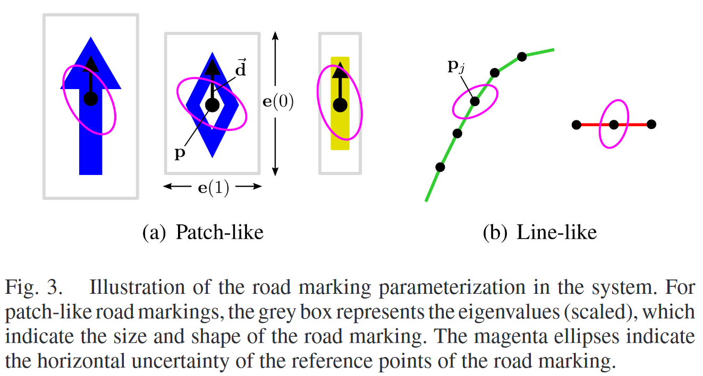

对于 Patch-Like 数据，像素聚类后的中心点，主方向和点云特征值通过 SVD 计算得到。其中中心点作为地面标志的参考位置，主方向表示标志的朝向，可用于地图匹配和自车朝向估计，特征值表示标志的形状，与 bbox 类似但是对噪声更鲁棒。在后续表述中，作者使用缩放$\times 2$的特征值来可视化 Patch-Like 的地面标志

对于 Line-Like 数据，可以参数化为随机数量的线段。在像素聚类后的标志点云使用多项式沿着主方向拟合，并给定间隙进行采样如 0.5m。线段直接表示了 Line-Like 片段的方向和形状，用于后续地图匹配

在上述参数化之后，可以丢弃原始的点云数据，从而使数据得到极大的简化。系统中不使用密集的点云或大量的顶点来表示道路标线。虽然会损失一些详细的局部几何信息，但可以获得更紧凑的参数化。这也使得更复杂的后续处理成为可能，例如考虑地图元素的概率属性或在地图匹配中进行高效的迭代。

#### Modelling the Uncertainty

针孔相机模型无法直接获得像素的深度值，通过 IPM 可以获得距离信息，但是其精度对像素误差较为敏感，比如地面不平度和车辆高度变化，因此 IPM 变换引起的距离不确定性需要考虑进 VIO 系统。作者引入以下方法来考虑 IPM 的不确定性：

##### Pixel error

像素误差可能由相机模型或语义分割误差导致。像素误差的影响是增加感知距离，根据公式(1-3)可知 IPM 点位置相对于像素误差定义如下：

$$
\begin{gathered}
\mathbf{J}_{u,\upsilon} =\frac{\partial\mathbf{p}_f^{\bar{c}}}{\partial(u,v)}=\frac{\partial\mathbf{p}_f^{\bar{c}}}{\partial(x,y)}\cdot\frac{\partial(x,y)}{\partial(u,v)} \\
=\left(\begin{array}{rr}-\frac{1}{y}&0&0\\\frac{x}{y^2}&\frac{1}{y^2}&0\end{array}\right)\left(\begin{array}{rr}\frac{1}{f_x}&0\\0&\frac{1}{f_y}\end{array}\right) 
\end{gathered}
$$

##### Pitch angle error

在 IPM 中，假设虚拟相机$\bar{c}$与地面平行，地面的不平整以及车辆运动导致车辆相对地面的 pitch 角其实是变化的，欧美从这个假设可能无效，对应的误差定义如下：

$$
\mathbf{R}_{\bar{c}}^c=\mathbf{R}_{\hat{\bar{c}}}^c\left(\begin{array}{cc}1&0&0\\0&\cos\theta&\sin\theta\\0&-\sin\theta&\cos\theta\end{array}\right)
$$

其中，$\hat{\bar{c}}$表示假设的虚拟相机坐标系

Pitch 角误差将会极大地影响 IPM 获得的 3D 点位置，定义如下：

$$
\mathbf{J}_\theta=\frac{\partial\mathbf{p}_f^{\bar{c}}}{\partial\theta}=\left(\begin{array}{c}-x\\y^2\end{array}\frac{-y^2-1}{y^2} 0 \right)
$$

##### Road height error

地面高度误差是指虚拟相机与地面的高度与实际地面高度的误差。将会导致地面不平整和车身高度变化，定义如下：

$$
\mathbf{J}_D=\frac{\partial\mathbf{p}_f^{\bar{c}}}{\partial D}=\left(\begin{array}{c}\frac{x}{-y} \frac{1}{-y} 1\end{array}\right)
$$

论文中假设以上误差均服从高斯分布。

基于以上定义可以估计某个 IPM 得到的元素的几何不确定性如下：

$$
\Omega_{\mathbf{p}_f^{\bar{c}}}=\sigma_{u,v}^2\mathbf{J}_{u,v}\mathbf{J}_{u,v}^\top+\sigma_\theta^2\mathbf{J}_\theta\mathbf{J}_\theta^\top+\sigma_D^2\mathbf{J}_D\mathbf{J}_D^\top 
$$

其中，$\sigma_{u,v}$为$X$和$Y$轴上像素误差的标准差，$\sigma_\theta$是 pitch 角的标准差，$\sigma_D$为路面高度标准差

假设 pitch 角误差为 $0.1 \%$，地面高度误差为$0.05m$，像素误差为 $2$ 个像素，IPM 图像的横纵向不确定度如图所示：

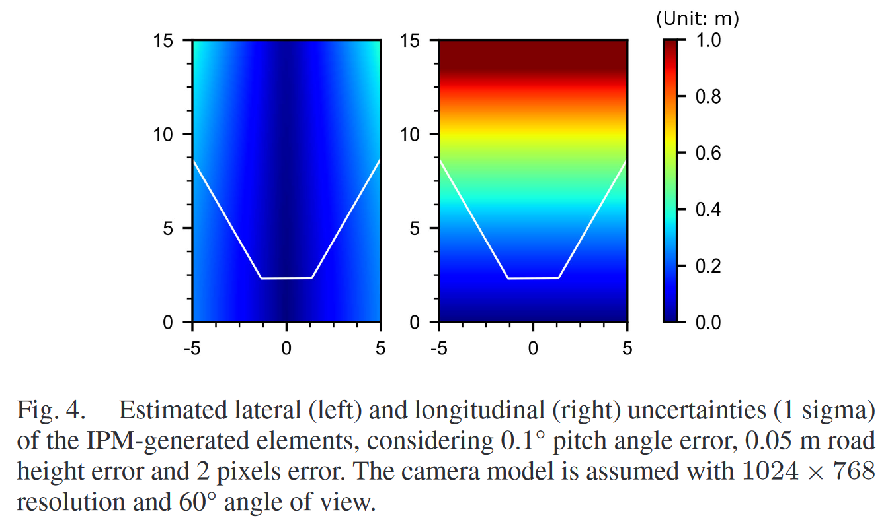

可知：

1. 感知距离越近，不确定误差越小
2. 纵向不确定性大于横向不确定性，分米级且不可忽略

通过不确定模型能够在 VIO 中考虑到以上因子对建图与定位的影响，并且在全局地图增加路面元素时，也需要考虑车辆位姿的不确定性

#### Dealing With Complex Road Conditions

只要上述提到的误差因素相对较小且符合相关假设，不确定性模型就能很好地处理由 IPM（逆透视映射）得出的道路标记的概率属性。然而，在现实世界中，实际上经常存在与上述假设相悖的巨大系统误差。

如图展示了两个典型案例，分别对应于车辆急剧加速/颠簸和道路坡度急剧变化【与 Ground-VIO 相同】。在这些情况下，IPM 生成元素的系统误差将超过正常水平，这不符合上面介绍的不确定性模型，并将极大地限制所提出系统的可用性。

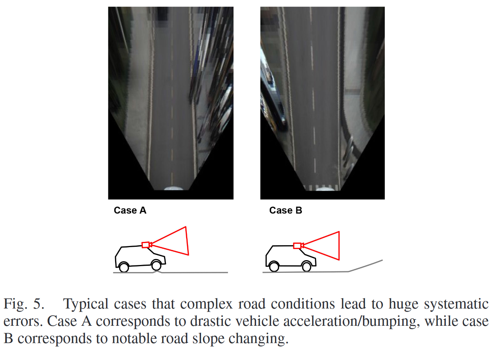

首先，车载的核心导航系统 VIO 可以提供车辆的高精度相对姿态估计。在此基础上，可以在 IPM 中补偿相对于“平均”车辆姿态的高频姿态变化（主要为俯仰角和翻滚角），从而减轻急剧的姿态变化并获得一个与路面平行的更准确的虚拟相机坐标系$\bar{c}$。补偿后，预计大多数情况下可以保持 $0.1 \degree$ 的标准差俯仰角误差。

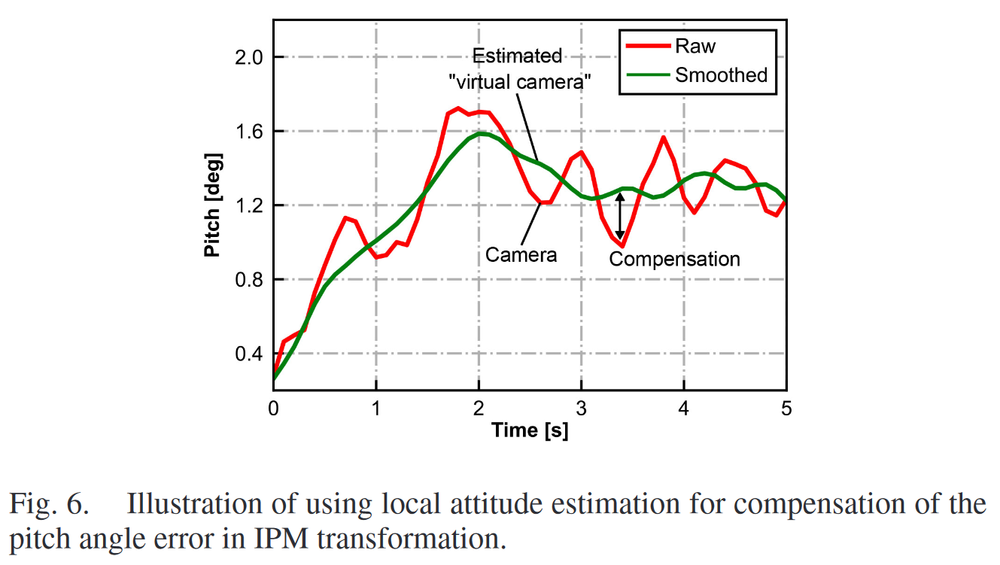

其次，为了处理车辆前方道路坡度的急剧变化，再次利用自车姿态估计。当车辆在短距离内俯仰角发生明显变化时（如在 10 米内变化超过 $4 \degree$），则在车辆当前位置检测到急剧的坡度变化。在这种情况下，将标记该位置上的道路标记历史观测为无效。虽然这会导致一些道路元素缺失，但不会导致最终地图中添加错误信息。幸运的是，实车测试表明主干道上很少出现这种情况。处理此类情况的一个更好方法可能是利用视觉信息在线估计道路地形。除了这些机制外，系统与地图相关的每一步都会应用概率离群值检测，以尽可能减少粗大误差的影响。

#### Data Association

由于道路标记的规律和离散分布，尽管在参数化过程中丢弃了道路标记的大部分复杂的几何信息，但有效的数据关联仍然可行。在数据关联中使用道路标记的语义类别、参考位置、方向和特征值。

在建图阶段，当车辆经过某个区域时，利用高精度车辆姿态将感知到的道路标记投影到地图中，然后根据空间相似性进行聚类。通过最小化几何距离实现地图扩展，将相同道路标记（包括 Patch-Like 和 Line-Like）的对应观测值进行概率合并。对于 Line-Like 标记，应用连续性约束（例如局部二次曲线）。整个过程是迭代进行的，期间会拒绝具有不可靠残差的观测值。注意，对于 Patch-Like 的路面标记的连续观测，由于它们的误差不是完全独立的，因此只保留其中不确定性最低的最佳观测值。

在定位阶段，感知到的路面标记也被投影到地图中以搜索最近的匹配项。由于初始姿态估计可能不准确，单个道路标记的最近邻 NN 匹配可能是模糊的。不过路面标记的最小参数化允许通过有效的重复尝试来获得多个道路标记观测值的最佳一致性。通过结合多个时间段的观测值，可以进一步提高数据关联的可靠性，并可能实现大规模重定位。

### Pose Graph Optimation

整体的图优化如图所示

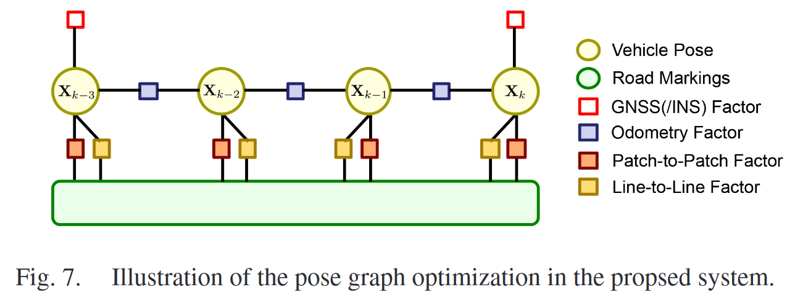

##### GNSS/INS Factor

GNSS 的定位结果作为车辆位置的全局约束，根据用户需求，GNSS 的定位策略也有所差异

##### Odometry Factor

相对位姿约束可以通过车载传感器获得，比如 VIO 或者轮速计，对于关联帧间观测至关重要

##### Patch-to-Patch Factor

Patch-Like 道路信息关联通过点对点的约束如下：

$$
\mathbf{r}_{p_j}=\widetilde{\mathbf{p}}_{p_j}^{b_k}-\mathbf{p}_{p_j}^{b_k}
$$

其中，$\widetilde{\mathbf{p}}\_{p_j}^{b_k}$表示 IPM 生成的地面标志的观测位置，$\mathbf{p}\_{p_j}^{b_k}$是地面元素在车辆坐标系的位置

##### Line-to-Line Factor

对于采样的 Linke-Like 路面标志，使用顶点距离来描述线段间的因子：

$$
r_{l_j}=\frac{\left \vert \left(\tilde{\mathbf{p}}_{l_j,m}^{b_k}-\mathbf{p}_{l_j,z}^{b_k}\right)\times\left(\tilde{\mathbf{p}}_{l_j,m}^{b_k}-\mathbf{p}_{l_j,z+1}^{b_k}\right)\right \vert}{\left \vert \mathbf{p}_{l_j,z}^{b_k}-\mathbf{p}_{l_j,z+1}^{b_k}\right \vert}
$$

其中，$\tilde{\mathbf{p}}\_{l_j,m}^{b_k}$是 IPM 图像生成的 Line-Like 地面标识的一个采样后的顶点的观测位置，$\mathbf{p}\_{l_j,z}^{b_k}$和$\mathbf{p}\_{l_j,z+1}^{b_k}$是 Line-Like 的地面元素在车辆坐标系的位置

考虑以上因素，位姿图优化可以建立来计算最优的车辆位姿估计。在实际中地图匹配（Patch-to-Patch 和 Line-to-Line）的因子将不在建图时考虑，从而简化建图处理流程。在建图模式，将维护全局位姿图，在定位模式只维护几秒的滑动窗口来实现高效。

在 map-aided 的定位场景中，地面标识的不确定性将用于决定地图匹配因子的权重，但是地图元素并不更新，因为终端用户并为要求。

### Experiment

实车实验包含两组数据，细节包括：

1. 传感器配置相同但是车辆不同
2. 定位和建图使用低精度 IMU（$8\%$ 的陀螺仪偏差）
3. 真值使用战术级的 RTK/INS 的平滑结果
4. 地图 A 和 B 分别建图并合并为一张图

#### On-Vehicle Mapping

建图阶段，使用 RTK/INS 组合导航（全局定位）+VIO（局部定位），并在位姿图中融合

基于位姿估计，检测到的地面标记首先聚类，在考虑空间不确定性的基础上加入全局地图。通过上面提到的方法生成了紧凑的实例级道路标志，可用于计算最优估计和降低不确定性

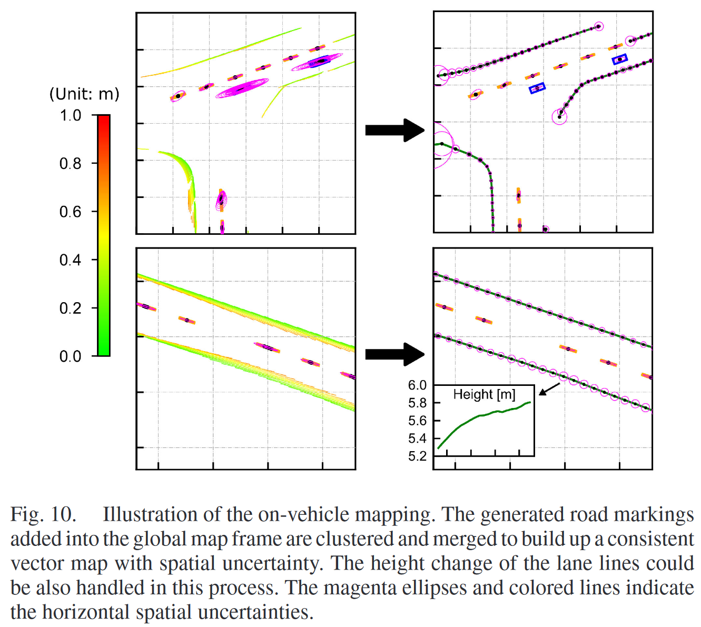

#### Multi-Source Map Merging

多源地图可以合并为统一的全局地图，单车建图不够高效，可以通过多元数据生成合并的地图

分别对 A 和 B 进行建图，之后进行地图合并生成全局地图。多个观测下的重叠的路面表标识可以过滤掉，通过序列、增量地合并可以合并为全局地图

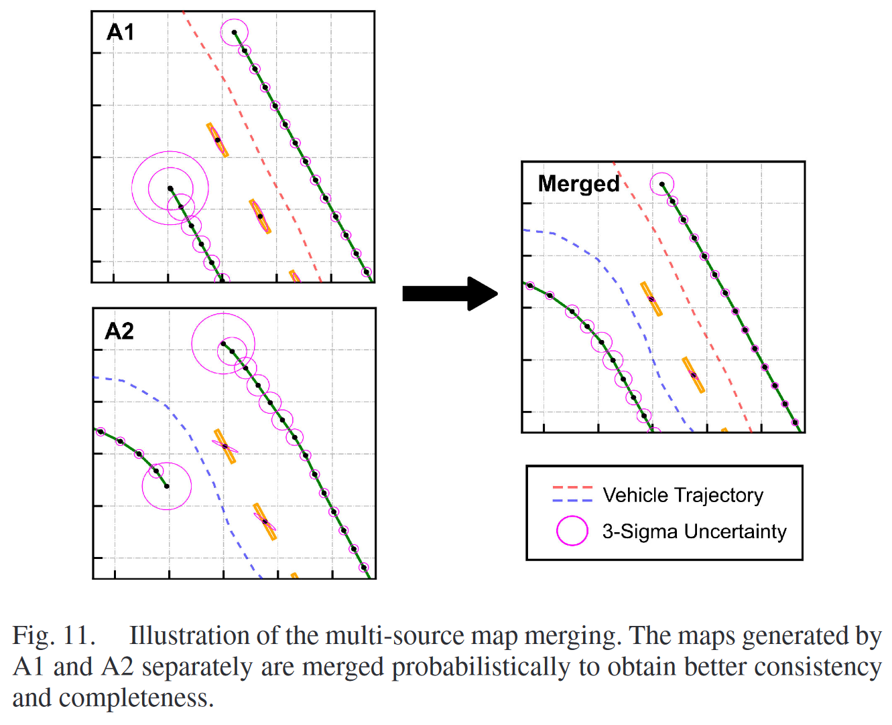

通过提出的参数化方法，生成的向量地图 size 较小并且保存了大部分标记信息。并且道路元素的 3D 空间不确定性也继续保留，可以在后续进行更新和用于地图定位。

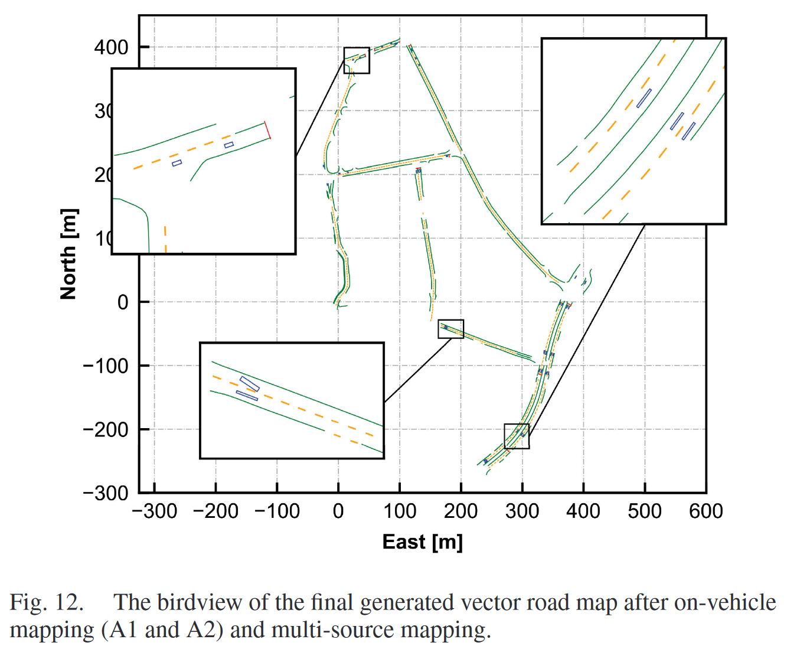

$2.32$公里的双道路的地图尺寸为$271kb$

#### Map-Aided Localization

对于终端用户假设车辆搭载低精度传感器只能接收高精度 GNSS 通过 SPP 提供的米级定位信息，那么可以使用 VIO 的局部定位，通过先验地图进行匹配即可，在位姿图中融合全局定位和局部定位得到最终的位姿估计

由于地图辅助定位需要低延迟执行，因此位姿图不会保留所有历史 pose。这里考虑两种方案：

1. 1 秒滑动窗口包含 10 个历史姿态
2. 10 秒滑动窗口包含 19 个姿态（最新 1 秒内的 10 个姿态和过去 9 秒内精选的 9 个姿态）

对于 10 秒方案，窗口中保留了更多历史信息以进行地图匹配，从而克服特征不足的路段问题，但计算成本会相应增加。

注意，在地图辅助定位中并未应用边缘化，这样做存在保留错误信息的风险（由错误的地图匹配或 GNSS 粗差引起）。虽然牺牲了一定的准确性，但地图辅助定位在没有边缘化的情况下更为灵活，因为优化仅关注当前窗口内的所有观测值。

首先，关注的是存在较大初始位置误差的地图辅助定位，或者说是重新定位。考虑到道路标线的模糊性，车辆需要观测到足够多的可区分信息以实现成功的重新定位。

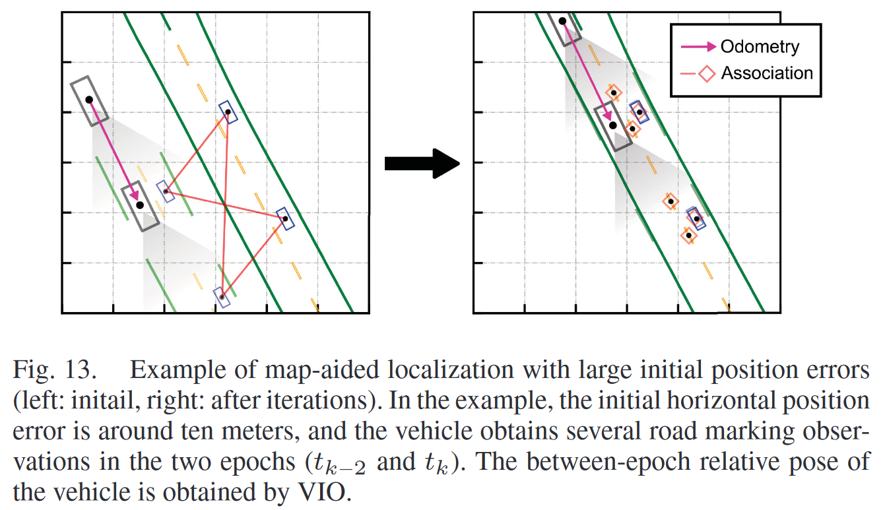

这里给出了一个使用两个观测历元的最小示例。由于引导标记（蓝色）较为稀疏且更易于区分，因此在地图匹配的第一阶段中使用了这些标记，这可以通过非常有限的候选匹配对来高效完成。随着车辆姿态在迭代过程中变得更加准确，基于空间相似性，会利用更多观测到的道路标线来进行地图匹配，从而检查地图匹配的一致性并提高定位精度。与采用密集点云和迭代最近点（ICP）方法进行地图匹配相比，我们方法中的实例级参数化使得搜索正确的数据关联变得高效且灵活。同时，由于我们的方法能够很好地建模空间不确定性，因此具有实现更高定位精度的潜力。

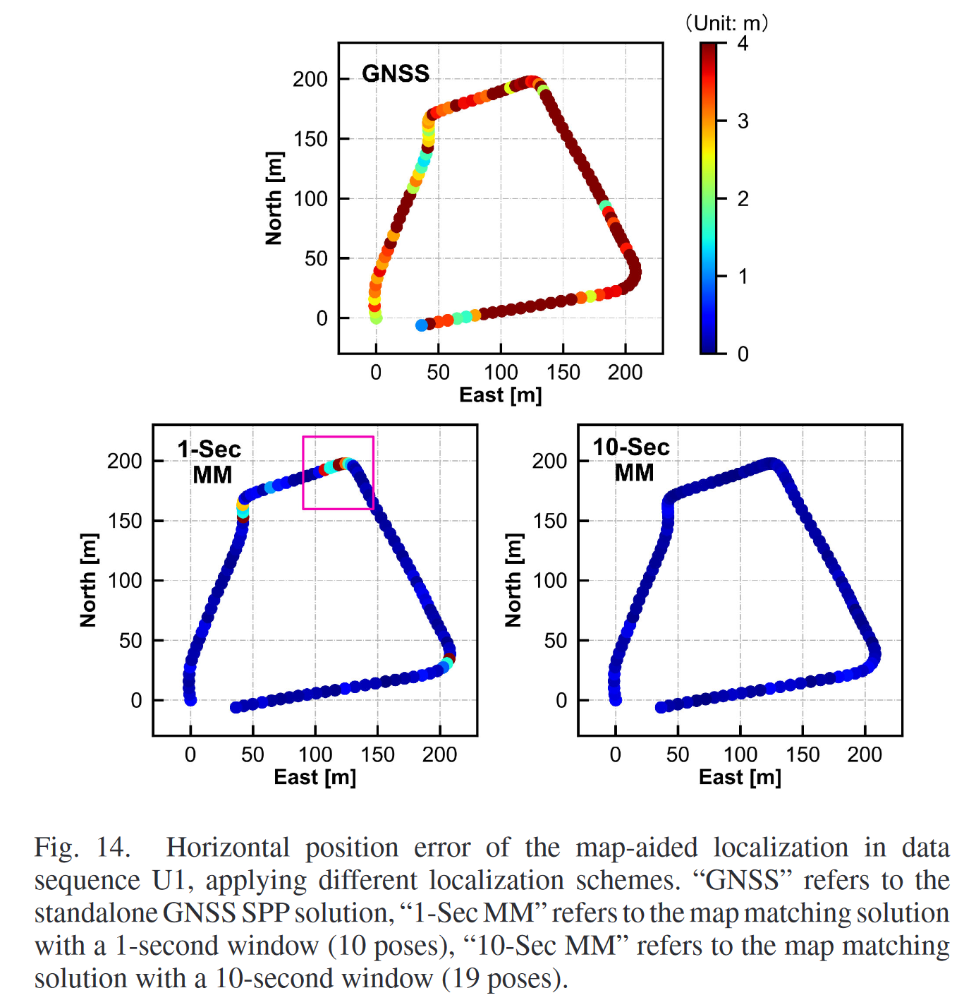

其次，图展示了整个轨迹上不同方案的定位精度。表 I 列出了地图辅助定位精度和可用性的统计数据。

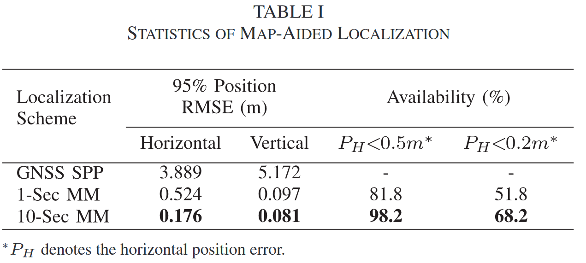

结果表明，在地图的辅助下，车辆的定位性能可以从单点定位的米级精度大幅提升到大多数时间段的分米级精度。

对于 1 秒滑动窗口方案，在特征缺乏的路段，地图匹配的性能可能会急剧下降，导致较大的定位误差。而对于 10 秒滑动窗口方案，通过利用更多历元的道路标线观测值，可以在整个轨迹上保持良好的定位性能。

### Code

- Batch pipeline ➡️ Incremental pipeline
- Ellipsoid parameterization (SVD-based) ➡️ Bounding box parameterization
- High-precision poses always required ➡️ Local mapping + geo-registering
