# VINS-AVP

## Info

> github: https://leijobs/VINS-AVP.git [开发中]

## ToDo List

- [X] 数据集与算法调研
- [X] 地图创建与数据集生成
- [X] 3D 可视化工具开发
- [X] 内外参标定与环视图生成
- [X] 分割模型训练与部署
- [ ] 泊车位检测
- [ ] SLAM 集成

## Framework

参考 VINS，VINS-AVP 的功能模块可包括五个部分：数据预处理、初始化、后端非线性优化、回环检测及优化。代码中主要开启了四个线程，分别是：前端图像跟踪、后端非线性优化（其中 初始化和 IMU 预积分在这个线程中）、回环检测、回环优化。

## Method

## Process

### Dataset

见 `相关数据集` 部分，目前没有合适的数据集，因此采用自建数据集

#### 问题

- [ ] IMU 不准确【非常差，仅自建地图有此问题】
- [ ] Lidar 真值问题【只能获得自车点云，仅自建地图有此问题】
- [X] 图像地面标识不稳定【贴图高度问题，基本修复】
- [X] GNSS 非常准确【无问题】

|  |  | 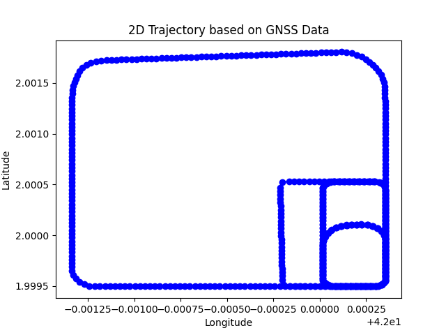 | 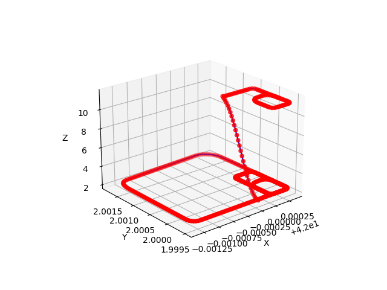 |
| ------------------------------------------- | ------------------------------------------- | ------------------------------------------- | ------------------------------------------- |
| IMU 轨迹                                    | 图像地面标识                                | GNSS 轨迹                                   | GNSS 3D 轨迹                                |

### Visualization

> 参考：
> [https://github.com/yuntianli91/pangolin_tutorial.git](https://github.com/yuntianli91/pangolin_tutorial.git)
> [https://github.com/Kingzhoudk/lidar3d_display.git](https://github.com/Kingzhoudk/lidar3d_display.git)

- TODO

- [x] 增加点云
- [x] 增加关键帧
- [x] 关键帧点云保留
- [x] 合并当前 GUI 到 VINS-Course

| 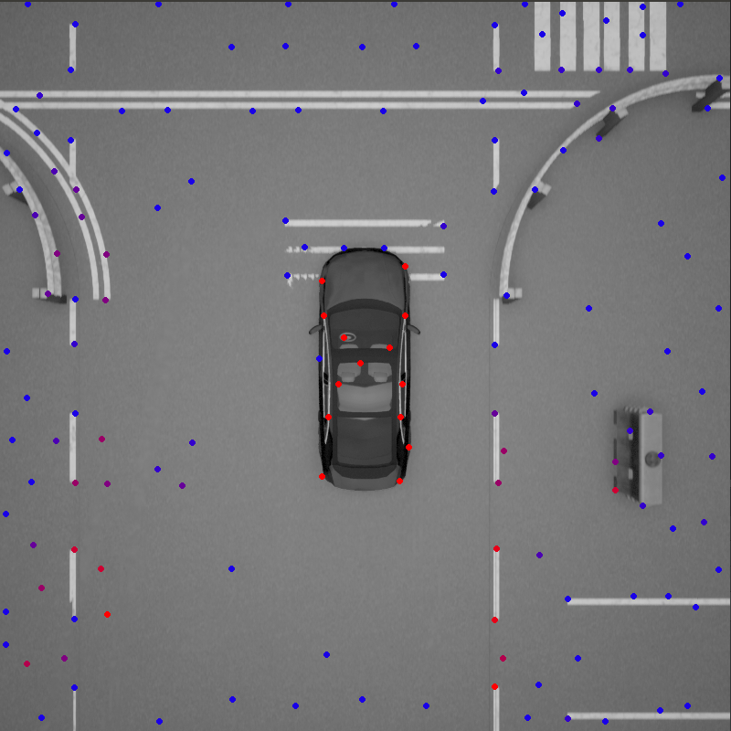 | 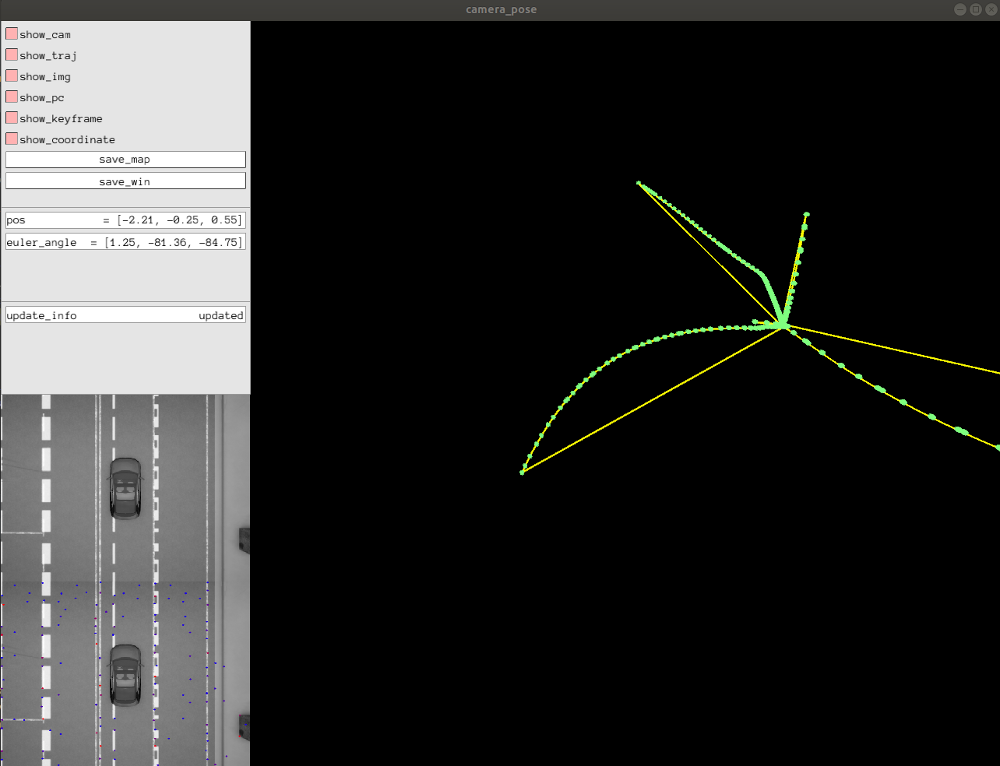 | 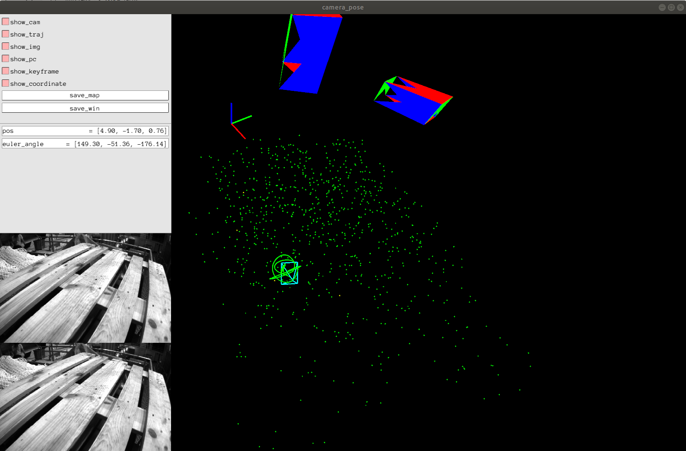 |
| ----------------------------------------------------- | ----------------------------------------------------- | ----------------------------------------------------- |
| 特征提取                                              | VINS-Course 定位                                      | 增加 3D bbox【目前有问题】                            |

- 情况描述：

> 1. 可稳定匹配的特征点太少，容易丢失跟踪，无法计算相对 pose【地面标识可以稳定跟踪】
> 2. IMU 测量不准确【仅自建图有此问题】
> 3. 转弯时的定位误差较大【可能与 IMU 有关】

- 自车关键点删除

> 自车一定区域内的关键点不可靠，需删除【提取特征点时删除自车附近特征点】
> 或者使用 mask 先删除自车区域

### Bisenetv2

使用自建数据集训练 Bisenetv2 模型

#### Train

> 参考：[https://blog.csdn.net/jiaoyangwm/article/details/114373269](https://blog.csdn.net/jiaoyangwm/article/details/114373269)

#### Demo

| 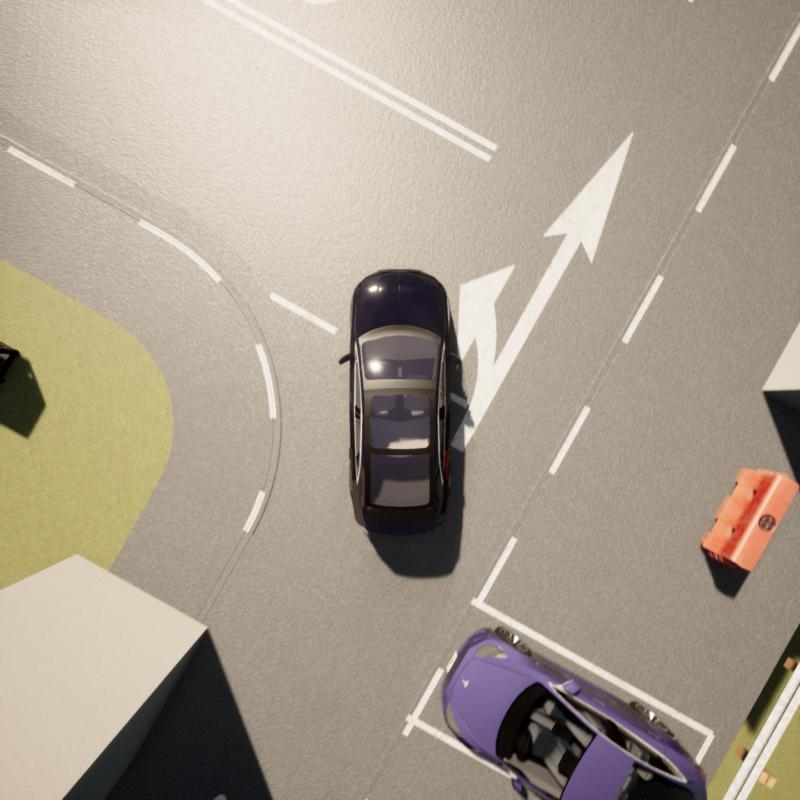 | 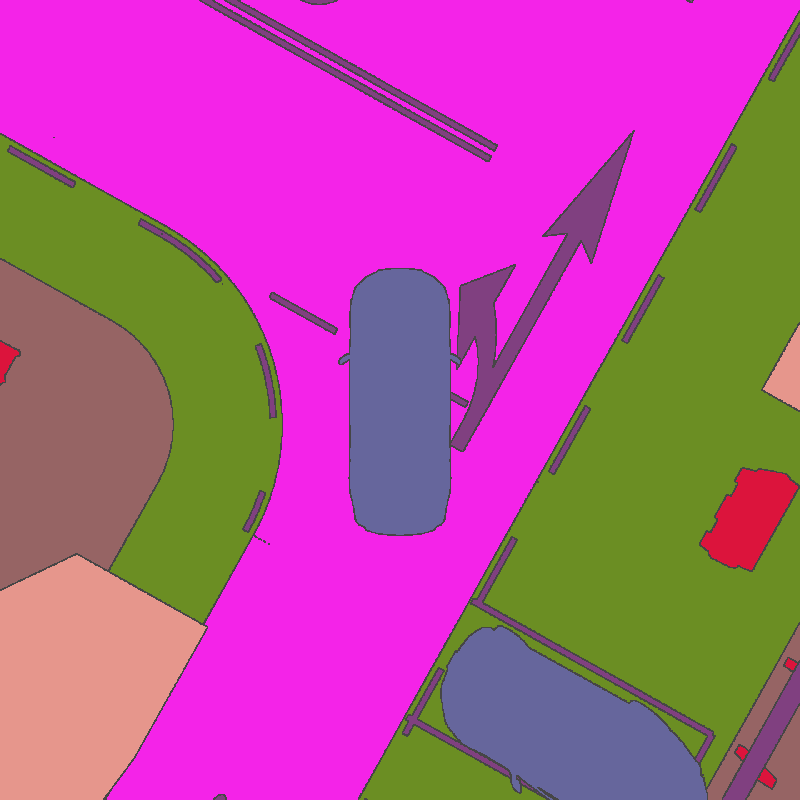 | 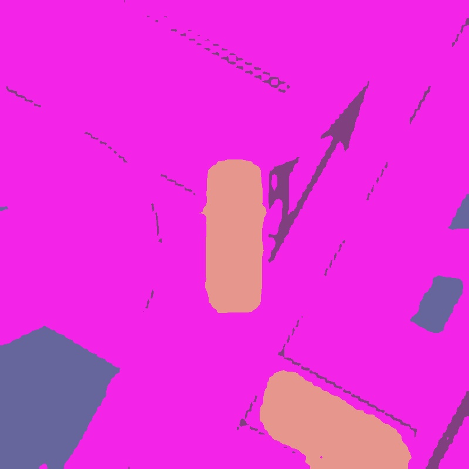 |  | 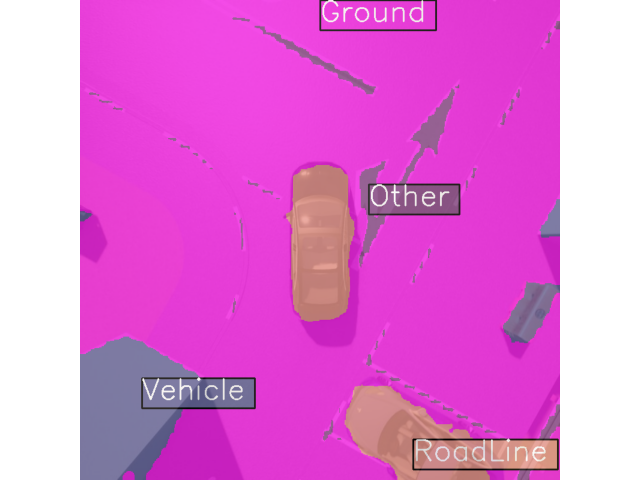 |
| ------------------------------------------- | ------------------------------------------- | ------------------------------------------- | ------------------------------------------- | ------------------------------------------- |
| raw                                         | gt                                          | seg                                         | onnx                                        | trt                                         |

问题：

- [X] 量化模型类别标签不对【后处理，影响不大】
- [ ] 量化模型边缘分割不准确，需要后处理

#### c++ deploy

> 参考：[https://github.com/open-mmlab/mmdeploy/tree/main/demo/csrc/cpp](https://github.com/open-mmlab/mmdeploy/tree/main/demo/csrc/cpp)

##### MMdeploy

> 推理时间 0.57 s 【太慢了，考虑 trt】

|  | 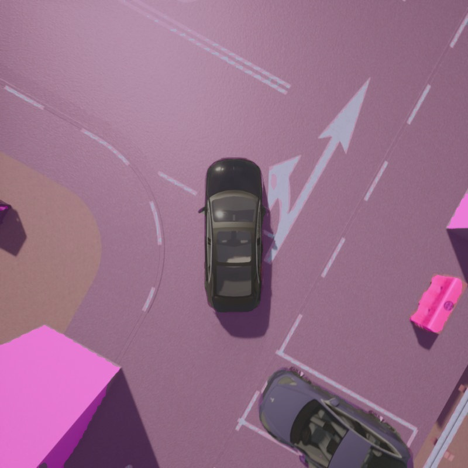 |
| ------------------------------------------- | ------------------------------------------- |
| raw                                         | Seg - mmseg + mmdeploy                      |

##### TensorRT

> 参考：[https://mmdeploy.readthedocs.io/zh-cn/latest/tutorial/06_introduction_to_tensorrt.html](https://mmdeploy.readthedocs.io/zh-cn/latest/tutorial/06_introduction_to_tensorrt.html)

目前 python 导出 trt 脚本可正常分割模型，但 trt 的 python 和 c++ 的代码无法正确输出结果

|  | 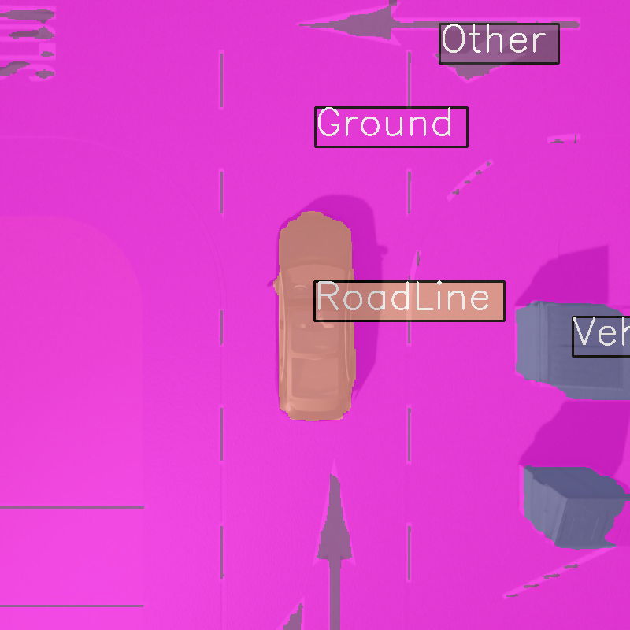 |
| ------------------------------------------- | ------------------------------------------- |
| raw                                         | Seg - mmseg                                 |

### ParkingSlot Det

由于没有时间精力做车位检测，这里只是简单做了通过图像处理检测车位的简单方案，可以实现车位补全，或则会直接不处理，对重要的地面要素全部用于 SLAM

| 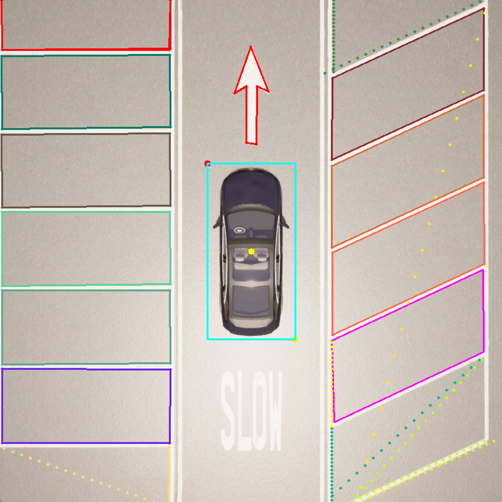 |                        |                        |
| ------------------------------------------- | ---------------------- | ---------------------- |
| 车位检测                                    | 不完整车位检测（垂直） | 不完整车位检测（25°） |

### SLAM

## Related Dataset

### AVP SLAM Dataset

| 年份 | 单位               | 论文/链接                                                                                            | 数据集                                                                                                                                           | 备注                                        |
| ---- | ------------------ | ---------------------------------------------------------------------------------------------------- | ------------------------------------------------------------------------------------------------------------------------------------------------ | ------------------------------------------- |
| 2020 | TJU-VISSLAM        | [https://cslinzhang.github.io/VISSLAM/](https://cslinzhang.github.io/VISSLAM/)                           | [Tongji Underground Dataset](https://pan.baidu.com/s/1TezCPPQXmef0ucn-Yn7zIw)(pw: e4q6)                                                          | 已下载，可用                                |
| 2021 | TJU-MOFIS          | [https://shaoxuan92.github.io/MOFIS/](https://shaoxuan92.github.io/MOFIS/)                               | [Benchmark Dataset](https://pan.baidu.com/s/1OFQoREbllE_psV1PU3ITsA)(pw: in1j)                                                                   | 已下载，不可用                              |
| 2021 | TJU-BEVIS          | [https://shaoxuan92.github.io/BeVIS/](https://shaoxuan92.github.io/BeVIS/)                               | [BeVIS Benchmark Dataset](https://pan.baidu.com/s/1GYCvroh8Bw5NHjxFQ_d0Wg)(pw: 2bn0)                                                             | 已下载，可用（但环视图很差）                |
| 2021 | TJU-ROCES          | [https://cslinzhang.github.io/ROECS/](https://cslinzhang.github.io/ROECS/)                               | [Download the Dataset](https://pan.baidu.com/s/1ZQe63Y8y34P1HIsyKETwhA)(pw: 26yo)                                                                | 已下载，已经是生成好的环视图，但 imu 不好用 |
| 2022 | SJTU-SUPS          | [https://arxiv.org/abs/2302.12966](https://arxiv.org/abs/2302.12966)                                     | [https://github.com/jarvishou829/SUPS?tab=readme-ov-file](https://github.com/jarvishou829/SUPS?tab=readme-ov-file)                                   | 已下载，缺乏单应矩阵计算 AVP                |
| 2022 | Valeo-SynWoodScape | [https://arxiv.org/abs/2203.05056](https://arxiv.org/abs/2203.05056)                                     | [https://drive.google.com/drive/folders/1N5rrySiw1uh9kLeBuOblMbXJ09YsqO7I](https://drive.google.com/drive/folders/1N5rrySiw1uh9kLeBuOblMbXJ09YsqO7I) | 已下载，离散的，不好使                      |
| 2021 | AVP-SLAM           | [https://github.com/liuguitao/AVP-SLAM-PLUS](https://github.com/liuguitao/AVP-SLAM-PLUS)                 | Gazebo Sim                                                                                                                                       |                                             |
| 2022 | AVP-SLAM           | [https://www.hindawi.com/journals/jat/2022/9681455/](https://www.hindawi.com/journals/jat/2022/9681455/) | [https://pan.baidu.com/s/1ioeXqYIlocYpsQb0KB-_Ng(pw](https://pan.baidu.com/s/1ioeXqYIlocYpsQb0KB-_Ng(pw): lxq8)                                      | 只有环视图                                  |

### AVP Seg Dataset

| 时间 | 论文                                                                                                         | 链接                                                                                                                                                                                                                                         | 环境  | 备注 |
| ---- | ------------------------------------------------------------------------------------------------------------ | -------------------------------------------------------------------------------------------------------------------------------------------------------------------------------------------------------------------------------------------- | ----- | ---- |
| 2018 | ICNET                                                                                                        | [https://hszhao.github.io/projects/icnet/](https://hszhao.github.io/projects/icnet/)                                                                                                                                                             | CAFFE |      |
|      | AVP-SLAM[https://www.hindawi.com/journals/jat/2022/9681455/](https://www.hindawi.com/journals/jat/2022/9681455/) | [https://pan.baidu.com/s/1ioeXqYIlocYpsQb0KB-_Ng(pw](https://pan.baidu.com/s/1ioeXqYIlocYpsQb0KB-_Ng(pw): lxq8)                                                                                                                                  | Torch |      |
| 2023 | AVP-SLAM-GICP[https://www.mdpi.com/1424-8220/23/18/7947](https://www.mdpi.com/1424-8220/23/18/7947)              | [https://github.com/ywlee0305/Accurate-Visual-SLAM-against-AVM-Distortion-Error-using-Weighted-GICP-Dataset/tree/master](https://github.com/ywlee0305/Accurate-Visual-SLAM-against-AVM-Distortion-Error-using-Weighted-GICP-Dataset/tree/master) |       |      |

### Cutsom Dataset

通过 Roadrunner+Carla 实现多层泊车停车场

#### TodoList

- [X] Base env
- [X] Multi floor
- [X] Loop routing
- [X] Dataset
- [ ] Multi Label【当前 Carla 导出的地面标记为相同类型】
