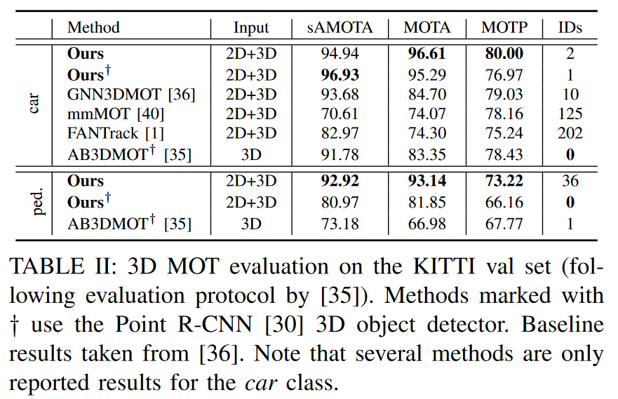

# EagerMOT

## Info

> Paper: [https://arxiv.org/abs/2104.14682](https://arxiv.org/abs/2104.14682)
>
> Github: [https://github.com/aleksandrkim61/EagerMOT](https://github.com/aleksandrkim61/EagerMOT)

## 论文

### Abstract

MOT 使得机器人在 3D 空间中进行信息已知的运动规划和导航，当前很多算法依赖于 Lidar 来检测和跟踪目标，受限于感知范围和点云稀疏性。相机可提供稠密且丰富的视觉信息，有助于定位远距离目标，但是仅限于图像域。

作者提出 EagerMOT，简单的融合框架实现图像和 Lidar 检测结果的融合，使用相机可检测远距离的 oncoming 目标，Lidar 可实现精确地深度估计。在 KITTI 和 Nuscenes 上性能 SOTA。

### Introduction

为了确保机器人安全导航和运动规划，移动平台需要感知周围物体并预测其未来状态。为此需要检测、分割物体，并精确地在 3D 空间中持续的定位物体。如 Weng 和 Kitan 所示，即使采用依赖于线性运动模型和基于 3D 重叠的双帧数据关联的简单方法，在使用强大的基于 LiDAR 的 3D 物体检测器时，也能获得高性能的跟踪性能

与基于图像的方法相比，依赖 Lidar 的方法对反射率更为敏感，并且由于输入信号的稀疏性，只能在有限的感知范围内工作。而基于图像的方法利用丰富的视觉信号来获得对部分遮挡的鲁棒性，并在图像域中以像素精度定位物体，即使物体距离过远而无法在 3D 空间中可靠定位

本文提出了 EagerMOT，融合来自 3D 和 2D 物体检测器的所有可用物体观测结果，以获得对场景动态的全面解读。**方法使用摄像头在图像域中识别和维持轨迹，而 3D 检测则允许在物体进入激光雷达感知区域后立即进行精确的 3D 轨迹定位。**通过两阶段关联策略实现这一点：

1. 关联来自 Lidar 和相机的检测结果，以建立跨传感器的初始对应关系
2. 采用一种基于图像的方法来更新和维护这些轨迹，即使物体离开激光雷达的感知范围也能继续跟踪

这种设计能够结合两种方法的优势，实现既稳健又精确的物体跟踪和定位。此外采用了一种跟踪公式，允许我们在只有部分（基于图像或基于 Lidar）物体证据可用时更新轨迹状态。使得 EagerMOT 能够抵抗来自不同传感器模态的假阴性，并能在物体进入深度感知范围之前初始化物体轨迹。

方法足够灵活，可以应用于多种不同的传感器配置，如激光雷达结合前置摄像头（如 KITTI），或结合具有非重叠视锥体的多个摄像头（如 NuScenes）。通过 EagerMOT，我们在大规模 NuScenes MOT 基准和 KITTI MOT 基准的 2D 多目标跟踪和分割方面建立了新的 SOTA 水平。方法仅假设一个配备有激光雷达和（可能多个）摄像头传感器的校准传感器设置的移动平台。给定两种传感器模态的预训练物体检测器，可以轻松地部署在任何移动平台上，无需额外训练，并且在推理时仅产生极小的额外计算成本。

贡献如下：

1. 提出了一种简单而有效的**多阶段数据关联方法**，该方法可以利用来自可能不同模态的多种不同物体检测器；
2. 展示了我们的方法可以应用于各种多目标跟踪（MOT）任务（包括 2D/3D MOT 和 MOTS）以及**不同的传感器配置**
3. 对我们的方法进行了全面分析，通过消融研究证明了所提出的数据关联方法的有效性，并在三个不同的基准测试中取得了 SOTA 结果

### Related Work

#### 2D MOT

当前大多数基于视觉的跟踪方法依赖于物体检测领域的最新进展，以在图像域中检测和跟踪物体。TrackR-CNN 通过 3D 卷积网络扩展了 Mask R-CNN，以提高检测器的时间一致性，并使用物体再识别作为关联的线索。Tracktor 重新利用 Faster R-CNN 的回归头来跟踪目标。类似地，CenterTrack 通过添加一个用于跨帧关联的偏移回归头来增强物体检测器。最近的趋势是朝着端到端学习和使用图神经网络进行关联学习的方向发展。

#### 3D MOT

早期的基于激光雷达的 MOT 方法首先执行自底向上的激光雷达扫描分割，然后进行片段关联和轨迹分类。由于点云表示学习和 3D 物体检测领域的最新进展，最近，基于激光雷达和立体视觉的检测跟踪方法开始流行起来。Weng 等人最近提出了一种简单但性能良好的 3D MOT 方法；**然而，由于其强烈依赖于基于 3D 的检测，因此容易受到假正例的影响，并且在填补较长的遮挡间隙时遇到困难。**一种后续方法使用**基于马氏距离的关联度量来替代交并比**。最近提出的 CenterPoint 方法检测物体的 3D 中心，并使用预测的速度向量在帧间进行关联。相比之下，我们提出了一种方法，该方法结合了互补的 3D 激光雷达物体检测器（能够精确地在 3D 空间中定位物体）和 2D 物体检测器（对部分遮挡的敏感性较低，即使在物体远离传感器时也能保持可靠性）。

#### Fusion-based methods

在跟踪过程中融合 2D 和 3D 的物体证据是一个尚未充分探索的领域。Oˇsep 等人提出了一种基于立体视觉的方法。其核心在于，该方法使用跟踪状态滤波器，该滤波器在 3D 和图像域中共同维护每个轨迹的位置，并且仅使用部分物体证据即可更新它们。相比之下，**我们的方法独立处理不同的传感器模态。我们同时在两个域中跟踪目标，但不显式地耦合它们的 2D-3D 状态。**另一种方法 BeyondPixels 利用单目 SLAM 在 3D 空间中定位跟踪的物体。MOTSFusion 融合光流、场景流、立体深度和 2D 物体检测来在 3D 空间中跟踪物体。与此不同的是，我们的方法仅依赖于从两种互补传感器模态获得的边界框物体检测，并且能够在不同的传感环境中很好地扩展（例如，单个激光雷达和多个摄像头）。最近提出的 GNN-3DMOT 学习融合外观和运动模型，这些模型分别为图像和激光雷达序列独立训练。

### Method

EagerMOT 框架结合了来自预训练物体检测器的互补 2D 和 3D（例如，激光雷达）物体证据。我们在图中提供了我们方法的一般概述。

在每帧的输入中：

1. 获取一组 3D Bbox 检测$Det^{3d}$和一组 2D 检测$Det^{2d}$输入
2. 融合模块将来自同一物体的 2D 和 3D 检测进行关联
3. 二阶段数据关联模块完成跨时间关联检测，并根据可用的检测信息（完整的 2D+3D 或部分信息）更新轨迹状态
4. 最后采用一种简单的轨迹管理机制来初始化或终止轨迹

这种设计允许将所有检测到的物体与轨迹相关联，即使它们在图像域中或 3D 传感器中都没有被检测到。方法可以从短暂的遮挡中恢复，并在其中一个检测器失效时保持近似的 3D 位置，而且可以在物体进入 3D 感知范围之前在图像域中跟踪远处的物体。一旦物体进入感知范围，我们就可以为每条轨迹平滑地初始化一个 3D 运动模型。

#### Fusion

从输入中获取两组分别来自图像和 Lidar 的 2D、3D 的检测框，并在两组检测之间建立匹配：

融合模块通过贪婪算法将$Det^{3d}$与$Det^{2d}$中的检测进行关联，关联依据是基于它们在图像域的 2D IOU，并得到一组融合的实例$I_t=\{I^0_t, \dots, I^i_t\}$。在贪婪关联过程中，我们按 IOU 降序对所有可能的检测配对进行排序。逐一考虑这些配对，并在满足以下条件时将它们组合成一个单一的融合实例$I_t$：

1. 它们的 IOU 高于阈值$\theta_{fusion}$
2. 2D 或 3D 检测都尚未匹配

融合实例$I_t^{fuse} \subseteq I_t$包含来自两种模态的信息：物体的精确 3D 位置和其 2D 边界框。实例还可以存储其他可用信息，例如 2D 分割 mask。

将剩余的（未匹配的）检测称为部分观测，分别形成实例$I^{u_{3d}}\_t \subseteq I^{3d}\_t$和$I^{u_{2d}}\_t \subseteq I^{2d}\_t$，仅包含两种模态中的一种的信息。注意，$I_t^{fuse} \subseteq I_t^{3d}$且$I_t^{fuse} \subseteq I_t^{2d}$。

##### Multi-camera setup

在存在多个相机（如 NuScenes 数据集所示的场景）的情况下，按照以下方式调整融合算法。在每个相机中，执行如上文所述的融合：

如果某个 3D 检测在特定相机中不可见，认为该检测在该图像平面与 2D 检测的重叠为空。

在单独对每个 2D 平面进行融合之后，通过多个相机可见的 3D 检测可能会存在多个潜在的匹配项。始终只将一个 2D 检测与一条轨迹相关联，并启发式地从视图中选择检测，其中投影的 3D 边界框覆盖的面积最大。来自其他视图的其他潜在配对将被丢弃。

#### Matching

在每一帧$t$中，融合后的实例$I_t$会进入一个两阶段的匹配过程，以使用新的 3D/2D 信息来更新现有的轨迹$T_t$。

##### Track parameterization

与[23]类似，我们并行地维护轨迹$T_t$的 2D 和 3D 状态。但是，我们对它们进行独立处理。

通过一个 3D bbox 和一个位置速度向量（如 AB3DMOT 中所述，不包括角速度）来表示轨迹的 3D 状态，而一个 2D 边界框则表示其 2D 状态。由于我们主要在 3D 空间中跟踪对象，因此轨迹的置信度得分等于其 3D 状态的置信度。注意，这些状态不必在每个帧中都被完全观察到，轨迹可能仅使用 3D 信息$T^{u_{3d}}\_t \subseteq T^{3d}\_t$、仅使用 2D 信息$T^{u_{2d}}\_t \subseteq T^{2d}\_t$或使用两者（其中$T_t^{fuse} \subseteq T_t^{3d}$且$T_t^{fuse} \subseteq T_t^{2d}$）进行更新。

对于轨迹$T^{3d}_t$，我们还维护了一个由线性 KF 建模的 CV 运动模型。对于每个新帧$t+1$，现有轨迹$T^{3d}_t$会根据先前的观测和速度估计来预测其在当前帧中的位置。

##### First stage data association

在第一关联阶段，我们使用轨迹的 3D 状态信息将检测到的 3D 实例与现有轨迹进行匹配。具体而言，我们基于实例的有向 bbox 与轨迹预测的有向 bbox 之间的校准距离，贪婪地将检测到的实例$I_t^{3d}$与轨迹$T_t^{3d}$进行配对。我们定义了一对有向 3D bbox 的校准距离为它们之间的欧氏距离，乘以它们方向向量之间的归一化余弦距离：

$$
d(B^i,B^j)=\|B_\rho^i-B_\rho^j\|*\alpha(B^i,B^j) \\\alpha(B^i,B^j)=2-\cos\langle B_\gamma^i,B_\gamma^j\rangle,\in[1,2]
$$

其中，$B_\rho^i~=~[x,y,z,h,w,l]$包含了位置和 bbox 的尺度，$B_\gamma^i$表示垂直轴向的 box 朝向

与平面欧氏距离相比，这种方法考虑了方向相似性，这对于非全向对象（如车辆或行人）来说可能是有用的信息。通过实验，我们发现与考虑预测和观测不确定性的 3D IoU 和马氏距离相比，这种关联准则更加稳健，特别是在低帧率场景下（如 NuScenes 数据集）。

与前面所述类似，最佳匹配的实例-轨迹对（低于最大阈值$\theta_{3d}$）形成成功的匹配元组$IT_t^{1m}=\{(I^i_t,T^j_t) \dots\}$。我们将其余的标记为未匹配，即实例$I^{1u}_t$和轨迹$T^{1u}_t$。在第一个匹配阶段之后，所有在 3D 中检测到的对象实例应成功与现有轨迹相关联，或被标记为未匹配，并将不会参与进一步的匹配。

##### Second stage data association

在第二阶段，将检测到的实例与 2D 图像域中的轨迹进行匹配：

基于 2D IoU 准则，贪婪地将实例$T^{u_{3d}}\_t \subseteq T^{3d}_t$与剩余的轨迹$T^{u_{2d}}\_t \subseteq T^{2d}_t$相关联。对于每对实例-轨迹，我们评估当前帧中实例的 2D bbox 与轨迹预测的 3D bbox 的 2D 投影或（在没有 3D 预测的情况下）最后一次观察到的 2D bbox 之间的重叠。

注意，即使在 2D 中也检测到了在 3D 中检测到的实例，即$I^{1u}\_t$，它们也不会参与此匹配阶段。这个关联阶段与第一个阶段相同，只是我们使用 2D 边界框 IoU 作为关联度量，并设置其阈值$\theta_{2d}$。同样，这一阶段的输出是一组匹配项$IT_t^{2m}=\{(I^i_t,T^j_t) \dots\}$，一组未匹配的实例$I^{2u}\_t$，以及未匹配的轨迹$T^{2u}\_t$。

在存在多个相机的情况下，我们按照之前中描述的方式修改算法。我们使用 3D 运动模型，通过相机投影操作在图像域中获得 2D bbox 预测。对于某些轨迹，没有足够的 3D 证据来可靠地初始化运动模型——这通常发生在观察到 LiDAR 传感范围之外的物体时。在这种情况下，表观边界框运动通常可以忽略不计，关联可以仅基于观察到的 2D 边界框进行。为 2D 状态添加预测模型或（学习的）外观模型可以进一步改进第二个关联阶段，这将是我们的后续工作。

#### State update

使用匹配的检测实例来更新相应轨迹的新的 3D/2D 状态信息：

1. 通过用新检测到的 2D 边界框覆盖先前的状态来简单地更新 2D 状态
2. 轨迹的 3D 状态建模为多变量高斯分布，并使用 KF 结合 CV 运动模型对其参数进行滤波。当没有可用的 3D 对象检测信息时（例如只有部分观测结果，仅提供图像域中的 2D 边界框或分割掩码），只执行 KF 的预测步骤来更新状态

#### Track lifecycle

参考 AB3DMOT，使用一套简单的规则来管理对象轨迹及其生命周期。

1. 如果一个轨迹在最近的$\text{Age}_{max}$帧内没有被任何实例（无论是 3D 还是 2D）更新，则该轨迹将被丢弃。
2. 由于 3D 对象检测器在精度方面通常不如基于图像的检测器可靠，因此如果一个轨迹在当前帧中与一个实例相关联，并且在最近的$\text{Age}_{2d}$帧内被 2D 信息更新过，则该轨迹被视为已确认。
3. 最后，所有从未匹配过的检测实例$I^{u_{2d}}_t$将开始新的轨迹。

### Experiment

分别在 NuScenes 3D MOT, KITTI 3D MOT, KITTI 2D MOT, 和 KITTI MOTS 进行验证

##### Evaluation measures

描述关联指标：

使用标准的 CLEAR-MOT 评估指标来讨论结果，并重点关注多目标跟踪准确度（MOTA）指标。

对于 KITTI 3D MOT，遵循 AB3DMOT 的评估设置，并对比 CLEAR-MOT 评估指标的平均值（AMOTA 和 AMOTP）。

对于 MOTS，对比多目标跟踪和分割准确度（MOTSA）以及精确度（MOTSP）。

在 KITTI 2D MOT 和 MOTS 基准测试中，对比最近引入的高阶跟踪准确度（HOTA）指标。HOTA 通过分别测量检测准确度（DetA，评估检测性能）和关联准确度（AssA，评估检测关联），来区分任务中的检测和跟踪方面。

##### 3D detections

在 NuScenes 数据集上，我们的最终模型使用了由 CenterPoint 提供的检测结果。

而在 KITTI 3D MOT 数据集上，我们报告并比较了使用当前最先进的 Point-GNN 和 Point R-CNN 两种 3D 目标检测器所获得的结果。对于提交给 KITTI 基准测试集的我们的模型，我们采用了 Point-GNN。

我们没有对 3D 目标检测结果进行预筛选，而是将全部检测结果作为输入传递给我们的跟踪流程。

##### 2D detections

在 NuScenes 数据集上，使用了在 NuImages 数据集上训练的 Cascade RCNN 目标检测器。

在 KITTI 数据集上，我们遵循 MOTSFusion 的方法，对于汽车使用 RRC 提供的 2D 检测结果，对于行人则使用 TrackR-CNN。对于 RRC 和 TrackR-CNN 的检测分别使用了 0.6 和 0.9 的阈值。

#### Ablation Study

##### Data association

在 NuScenes 验证集上评估了方法的不同变体：

其中，“Full”（AMOTA 为 0.712）与“No 2D info”（AMOTA 为 0.651）之间的显著差异凸显了**利用二维目标检测对整体性能的影响**。随着我们完整模型的召回率提高了 0.054，平均轨迹上的定位精度（由 AMOTP 衡量）却下降了 0.018。这是因为方法能够利用二维目标检测来更新跟踪状态，即使在没有三维检测的情况下也能如此。然而，在没有三维证据的情况下，我们无法更新跟踪状态，通过卡尔曼滤波预测来定位物体，但这会降低整体的三维定位精度。

分析数据关联函数的影响：

配置“No 2D info; 2D distance”展示了一个不使用二维检测信息，仅通过计算跟踪预测与检测之间的二维地面平面上的欧几里得距离作为唯一匹配阶段关联标准的变体性能。而“No 2D info; 3D IoU”变体则使用三维交并比（IoU，如[35]中所述）作为关联度量。可以看出，我们的关联函数相较于二维距离（+0.004 AMOTA）和三维 IoU（+0.036 AMOTA）更为鲁棒。

我们得出结论，由于 NuScenes 的扫描率显著低于 KITTI，因此三维 IoU 并不适合用于 NuScenes。

##### Detection sources

检测质量对整体性能的影响：

方法的一个优势是其灵活性。与其他跟踪器不同，框架不需要昂贵的训练，并且可以轻松地应用于现成的检测器，更好的检测器会导致更好的跟踪性能。

#### Benchmark results

##### NuScenes

使用 NuScenes MOT 测试获得结果。除了已发表的方法外，还包括了排名最高的未发表方法，用灰色标记。测试集包括 150 个场景，每个场景 80 秒。这是一个具有挑战性的基准测试，因为它包含了多种多样的目标类别，并且帧率较低，仅为 2FPS。

为了进行公平的比较，我们使用了与 CenterPoint 相同的 3D 检测结果。然而，我们只使用了 3D 边界框信息（而没有使用预测的速度向量）。召回率的差异支持了我们的假设，即**融合 2D 检测结果有助于弥合遮挡，并恢复那些原本可能会丢失的轨迹**。

##### KITTI 3D MOT

在表中将 3D MOT 性能与多个基线进行了比较。用†标记的方法使用了 Point R-CNN3D 目标检测器

由于方法使用了与 AB3DMOT 相同的 3D 检测结果，因此我们可以得出结论，我们的改进（汽车和行人类别分别提高了 +5.15 和 +7.79 sAMOTA）显示了**两阶段关联过程**的优点，该过程利用 2D 信息来提高 3D MOT 性能

##### KITTI 2D MOT

在表中报告了在 KITTI 测试集上获得的 2D MOT 结果。尽管方法在 3D 空间中跟踪目标，可以通过使用相机内参将 3D 边界框投影到图像平面上，并报告完全包围这些投影的最小轴对齐 2D 边界框作为轨迹的 2D 位置来报告 2D 跟踪结果。

尽管方法只在 3D 中跟踪目标，仅将 2D 检测结果作为次要线索，并报告近似的 2D 位置，但我们在 HOTA 指标方面仍取得了最先进的结果。

在图中，我们突出了由于信号稀疏或遮挡而导致 3D 检测器失败的示例；然而，我们的方法获得了 **2D 目标检测结果可用于更新轨迹状态**

示例表明基于 3D LiDAR 的检测和基于图像的检测是跟踪的互补线索。方法在关联准确度方面表现特别好（汽车类别为 74.16 AssA），这证实了第二阶段关联不仅改善了任务的检测方面，还改善了时间关联。对于行人类别，我们获得的性能低于当前 SOTA，因为我们使用了较弱的目标检测器（在非模态 MOTS 数据集上训练的 TrackR-CNN 和 Point-GNN）

##### KITTI MOTS

MOTS 在 MOT 的基础上增加了对目标轨迹的像素级精确定位

可以轻松地调整 MOTS 方法，通过在数据关联后，将实例的分割掩码额外传递给轨迹。

在表中在 KITTI 测试集上的 MOTS 性能，并将其与其他已发表的方法进行了比较。

可以看出，尽管我们使用了相同的一组二维分割掩码，但我们在两个类别（汽车 +1.03，行人 +3.61）上都比 MOTSFusion 获得了更好的结果。然而，我们注意到 EagerMOT 还使用了从激光雷达流中获得的 3D 对象检测，而 MOTFusion 则依赖于立体相机。我们的方法适用于现代汽车数据集中常用的各种以激光雷达为中心的传感配置，例如 NuScenes、Waymo Open Dataset 和 Argoverse。

此外，与 MOTSFusion 在立体相机上的 2 FPS 相比，方法在 KITTI（激光雷达 + 单相机）上以 90 FPS 的速度运行。最后，我们的方法在 HOTA 方面为汽车（74.66）和行人（57.65）两个类别建立了 SOTA 水平。此外，我们的方法在关联精度（AssA）方面也表现得特别好，这再次证实了使用额外的传感器观测有助于保持轨迹的一致性。

#### Runtime discussion

在不计算目标检测和自身运动估计所花费的时间的情况下，我们的 Python 实现在 NuScenes 数据集上以 4 FPS 的速度运行。与仅使用激光雷达数据并以 10 FPS 速度运行的 StanfordIPRL-TRI 和 AB3DMOT 相比，方法速度较慢（但更准确）

KITTI 数据集只有一个摄像头，不需要进行多摄像头关联，因此方法能以 90 FPS 的速度运行。其他方法及其运行速度如下：GNN3DMOT（5 FPS）、mmMOT（4 FPS）和 FANTrack（25 FPS），它们也利用了二维和三维输入。

##### Implementation details

KITTI 设置如下：

所有类别：$\theta\_{fusion} = 0.1, \theta\_{3d} = 0.01, \theta\_{2d} = 0.3, \text{Age}\_{max} = 3, \text{Age}\_{2d} = 3$

2D MOT 评估时，将 3D 估计中确定关联的 bbox 投影到 2D 并计算

NuScenes 设置如下：

7 种类别无关参数：$\theta_{fusion} = 0.3, \theta_{2d} = 0.5, \text{Age}_{max} = 3$

其他参数与类别相关：$\theta_{3d} = (7.5, 1.8, 4.4, 8.15, 7.5, 4.9, 7.5), \text{Age}_{2d} = (2, 3, 1, 3, 3, 2, 2)$对应的类别为：car, pedestrian, bicycle, bus, motorcycle, trailer, truck

此外，trailer 的阈值$\theta_{fusion} = 0.01$，其他类别$\theta_{fusion} = 0.3$

在 KITTI 和 NuScenes 的 3D MOT 评估中，我们计算了已确认轨迹的估计 3D bbox 及其原始 score 和未确认轨迹的估计值。但是，对于没有进行 2D 更新的每一帧，我们都会将其分数减半。
