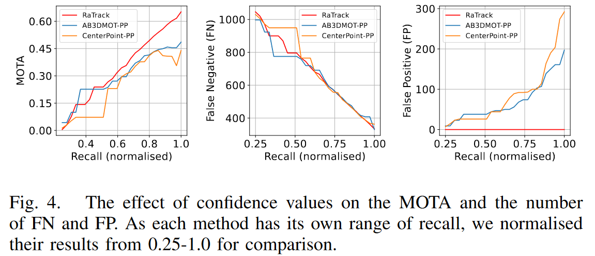

## Info

> [https://arxiv.org/pdf/2309.09737v3.pdf](https://arxiv.org/pdf/2309.09737v3.pdf)
> 
> [https://github.com/LJacksonPan/RaTrack](https://github.com/LJacksonPan/RaTrack)
> 
> 参考：[https://mp.weixin.qq.com/s/eNcTCsDGpq7KSi363WzW6Q](https://mp.weixin.qq.com/s/eNcTCsDGpq7KSi363WzW6Q)

## 论文

### Abstract

自动驾驶依赖于环境中的动态目标感知。稳定的动态目标跟踪对于后续的轨迹预测，避障和路径规划至关重要。当前很多方法都是基于 Lidar 的 MOT 方法，对于 4D Radar 的 MOT 的方法尚待探索，但是 Radar 需要考虑雷达的噪声和稀疏性，作者引入 RaTrack 对 4D 成像雷达点云追踪，摆脱了对特定目标类型和 3D 包围盒的依赖。该方法侧重于运动分割和聚类，并集成了运动估计模块。性能 SOTA。

## Intro

动态环境中的精准定位对于自动驾驶至关重要，3D MOT 作为后续预测、避障和规划任务的基础。

当前 SOTA 的 MOT 方法依赖于 Lidar，Cam 或者融合结果。但是 4D Radar 尚未探索。4D Radar 具有环境鲁棒性和不错的成像性能，并且可以测速，消费比高。因此 4D Radar 是 Lidar 的可替代方案。

然而 4D Radar 进行 MOT 并不简单，最近方法都是 TBD 方法，检测出 3D 框再进行跟踪，MOT 依赖于感知性能。但是对 Radar 而言其稀疏性和噪声导致难以检测和分类，并且还存在多径效应和稀疏性不利于检测类别和回顾方位，因此 4D Radar 检测性能相对 Lidar 较低，从而限制了 4D Radar 的 MOT。

作者引入 RaTrack，首个提出 4D Radar MOT 的算法，策略来源于一个观测：**有效的 MOT 与类别无关，如果点云可以聚类，那么 bbox 实际是冗余信息。**基于这一理解，将 MOT 的挑战重新构建为更简单的运动分割和聚类。这种重构使我们能够绕过使用 4D 雷达时通常会遇到的复杂任务，如目标分类和 bbox 回归。为了进一步提高方法的性能，我们集成了 point-level 的运动估计，该模块通过点级场景流丰富了雷达数据的固有稀疏性。在此基础上，数据关联模块被精确地调整以适应我们的聚类方法，并通过校准不同特征的权重以实现最佳匹配。以上内容设计为一个端到端可训练的网络，其训练被建模为多任务学习，包括运动分割、场景流估计和亲和度矩阵计算。

在 VoD 数据集上验证了 RaTrack 在移动目标检测和跟踪精度方面优于现有方案。此外，RaTrack 结果还强调了基于聚类的检测方法的优点，以及场景流估计在检测和数据关联阶段的关键作用。

## Related Work

鉴于基于 4D Radar 的 MOT 缺乏相关研究，简要介绍一般 MOT 的现有研究。作为 2D MOT 在 3D 空间中的提升，3D MOT 由于其在自动驾驶系统中的重要应用而备受关注。大多数在线 3D MOT 解决方案遵从 TBD 方法，侧重于 3D bbox 检测和数据关联。数据关联的核心在于提取全面的跟踪信息，并将新的检测与之前的轨迹进行匹配。

### 3D Bbox detection

采用检测跟踪法的前提是准确的 3D 边界框估计。得益于 3D 对象检测领域的最新进展，许多现成的检测器已被用作跟踪系统的前端。根据用于 3D 检测的输入模式，当前的 3D MOT 系统可以分为基于 Lidar、Cam 和 Fusion 方法。与这些方法不同，RaTrack 方法仅将 4D 雷达点云作为输入，并将对象实例检测为点簇，而不是用于跟踪的 3D Bbox

### Tracking cues

为了利用 3D 运动信息，AB3DMOT 提出了一种基线方法，**使用 KF 对对象运动进行建模，并通过 CV 模型预测位移**。后续工作遵循了相同的策略及其变体，以产生用于关联的运动线索。

另一种常见策略是**直接从检测器中回归对象速度**。LSTM 网络被用于为跟踪对象提取潜在的运动特征。除了运动线索外，对象外观特征通常通过神经网络从传感器中学习，以进行数据关联。

与以往工作不同，作者估计每个点的场景流向量以获得运动线索，有助于匹配具有相似运动的对象，还有助于移动对象检测。除了场景流之外，我们还从每个簇中聚合互补的 point-level 特征，以实现稳健的数据关联。

### Tracking-detection Matching

在给定对象运动或外观线索的情况下，大多数方法会基于对象运动或外观线索生成一个权重矩阵，以记录潜在轨迹-检测对的匹配分数。一些方法使用传统的距离度量，如余弦距离或$L2$距离，而其他方法则使用网络来学习距离度量。分配通常使用 HM 算法或贪婪算法解决。最近的技术采用图结构和神经消息传递进行更直接的关联。

在我们的方法中，使用 MLP 网络来估计簇对之间的相似性。并且采用可微分的 Sinkhorn 算法进行二分匹配，使数据关联过程完全可微分，从而增强了轨迹预测和规划等任务。

## Problem Formulation

### Scope

在标准 MOT 设置中，所有感兴趣的对象，如汽车和摩托车，都会被跟踪，不论它们的运动状态如何。本工作仅专注于移动对象的跟踪。这种关注源自一个前提，即对于跟踪而言，动态实体比静态实体具有更重要的意义。此外，Radar 固有的测量速度的能力使得区分移动和静止对象变得简单。

### Notation

鉴于上述背景，我们考虑了使用 4D Radar 进行在线 MOT 的问题。

输入是一个有序的 4D Radar 点云序列$\mathcal{P}^2=\{\mathbf{P}^t\}\_\{t=1}^T$，该序列由同一雷达捕获的$T$帧组成。其中一帧$\mathbf{P}^t = [p^t_1,\dots,p^t_{N^t}]$包含$N^t$个雷达点。每个雷达点$\mathbf{p}^t_i$由其在度量空间中的 3D 位置$\mathbf{x}^t_i \in R^3$和速度特征$\mathbf{v}^t_i = [v^t_{r,i}, v^t_{c,i}]$表征，其中$v^r_{r,i}$是测量的相对径向速度，$v^t_{c,i}$是其经过自车运动（假设已知）补偿后的结果。

给定来自流中的每个雷达点云$P^t$，目标是以与类别无关的方式检测多个移动目标$D^t = \{d^{t}_k\}^{K^t}\_{k=1}$，而无需回归 3D 边界框。然后，将这些检测到的对象与前一帧中跟踪的对象$O^t = \{o^{t-1}_m\}^{M^t}\_{m=1}$进行关联。此过程的结果是一组针对当前帧更新的跟踪对象$O^t$

## Method

### Overview

RaTrack 是一个基于学习的通用框架，专为 4D Radar 移动目标 MOT 设计

框架的流程如下：

1. 应用 Backbone 来编码帧内和帧间雷达点云特征
2. 利用这些提取的特征，我们的 point-level 运动估计模块推断出点级场景流，作为对雷达点云潜在特征的显式补充
3. 目标检测模块中引入了无边界框、无类别的思想，首先识别移动点，然后通过聚类来检测移动对象
4. 数据关联模块使用可学习的距离度量计算关联矩阵，并优化二部图匹配问题

整个网络是端到端可训练的，采用多任务损失函数，该损失函数结合了三个监督子任务：运动分割、场景流估计和亲和度矩阵计算

### Backbone Network

接收到 4D 雷达点云$P^t$后，主干网络对每个雷达点提取特征。首先使用点特征编码器（PFE）提取点级局部-全局特征 Gt，该编码器包括：

1. 三个集合抽象层，以并行方式在不同尺度上提取局部特征
2. 三个基于 MLP 的特征传播层，将局部特征映射到高级表示
3. 最大池化操作，以聚合附加到每点特征的全局特征向量

为了进一步编码当前帧的帧间点运动，获得上一帧特征$G^{t-1}$并结合 cost volume 层输出 cost volume$H^t$，其表示$P^t$中每个点的运动信息

### Motion Estimation Module

Radar 的稀疏性和噪声导致雷达点云的潜在特征缺乏信息丰富的几何线索，从而增加了物体检测和跟踪的复杂性。为了解决这个问题，引入了一个 point-wise 运动估计模块，该模块显式地确定逐点运动向量。

与从帧$t$到$t+1$的传统场景流方法不同，我们选择向后估计（从帧$t$到$t-1$）。这不仅可以消除跟踪延迟，还可以确保估计的流向量与当前帧$t$中的点相对应。

在解码场景流之前，首先通过整合不同的主干输出来聚合混合特征：输入点特征$P^t$、局部-全局特征$G^t$和成本体积$H^t$。再使用另一个 PFE，旨在促进这些不同特征之间的信息交换并增强它们的空间一致性，生成流嵌入特征$E^t$。在这个 PFE 中，使用 GRU 网络将时间信息引入全局特征向量中，然后再将其与逐点特征相关联。最后，使用基于 MLP 的流预测器解码场景流$S^t = [s^t_1, \dots, s^t_{N^t}] \in R^{N^t \times 3}$。

该模块在我们的框架中起着关键作用，并用于在聚类之前增强逐点特征，以及作为数据关联的额外运动线索

### Object Detection Module

在传统的 TBD 范式中，目标首先检测出特定类别的 3D bbox，然后基于这些 bbox 进行跨帧构建轨迹。然而这种方法的性能不可避免地依赖于准确的分类和边界框回归，这在稀疏且嘈杂的 4D Radar 数据中很难实现。与依赖类型相关、容易出错的 3D 边界框检测不同，作者强调将分散的点简单地分组为聚类以进行有效跟踪

作者提出了一种无类别对象检测方法，在方案中摒弃了边界框。通过这种方法，容易出错的边界框检测器被更可靠的运动分割和聚类组合所取代，特别适合 Radar 点云。换句话说，以自下而上的方式检测对象，其中点首先被分类为移动和静态（即运动分割），然后在潜在特征空间中接近的点被聚集成对象聚类

对于运动分割，利用主干网络提供的成本体积$H^t$，并通过基于 MLP 的运动分类器为每个点$P^t$计算移动可能性得分$c^t_i$。分类结果是可靠的，因为主干网络编码了关键的 RRV 测量值和帧间运动信息，从而产生了鲁棒的运动表示。进一步使用固定阈值$\zeta_{mov}$将移动目标从静态背景中分离出来，生成运动分割掩码$\mathbf{M}^t = \{m_i^t \in \{0,1\}\}\_{i=1}^{N_t}$。为了从选定的移动点中勾勒出移动对象的边界，采用经典的聚类算法 DBSCAN。这将类似的点分组为目标聚类表示为$D^t = \{d^t_k\}^K_{k=1}$，称为检测的（移动）目标

为了进行稳健的聚类，我们利用点云$P^t$、其估计的场景流$S^t$和流嵌入$E^t$作为显著特征，并识别相邻点。这样，每个检测到的对象$d^t_k$都被表示为一个包含点子集$\{p^t_{k,j}\}_j$及其对应的场景流和流嵌入向量$\{[s^t_{k,j}, e^t_{k,j}]\}_j$的聚类。再次注意，作者放弃了估计明确的对象类别，简单地将它们识别为无类别的实体

### Data Association Module

给定在当前帧中检测到的对象$D^t$，数据关联模块努力将它们与前一帧$t-1$中跟踪的对象$O^{t-1}$对齐。**为了端到端学习，选择 MLP 而不是传统的手工设计度量来推导用于二部图匹配的关联矩阵**$A^t \in R^{K^t \times M^t}$。这种可学习的距离度量在计算相似度分数时可以自动调整不同特征的权重。对于每对聚类$\{d^t_k, o^{t-1}_m\}$，其对应的相似度分数$a^t_{k,m}$可以计算如下：

$$
a_{k,m}^t=MLP(\mathbf{l}_k^t-\mathbf{l}_m^{t-1})
$$

其中，$\mathbf{l}_k^{t}$和$\mathbf{l}_m^{t-1}$分别是两个聚类的聚合特征。以目标$d^t_k$为例，为了生成其聚合特征$\mathbf{l}_k^{t}$，将以下部分进行拼接：

1. 其关联点子集$\{p^t_{k,j}\}_j$的平均值和方差
2. 点级场景流和嵌入向量$\{[s^t_{k,j}, e^t_{k,j}]\}_j$的最大池化

这个过程可以有效地聚合每个聚类的信息，并确保在点数量不同的聚类之间保持维度一致性。一旦计算出亲和度（关联）矩阵$A^t$，我们就基于它们的相似度分数并采用 Sinkhorn 算法来识别最优匹配对。该方法涉及对$\exp(A^t)$进行行和列的迭代归一化，以确保整个数据关联过程保持可微性。优化后，为成功匹配的对重新分配对象 ID，为新检测到的对象分配新 ID，并移除与当前帧中不存在的先前跟踪对象相关联的 ID

注意由于检测模块无法提供此类分数，因此采用检测和跟踪的匹配最终分数作为当前检测对象的置信度分数。这些置信度分数用于某些指标，如 AMOTA 和 AMOTP，这些指标在所有召回值上整合结果

### End-to-End Training

利用标记样本对网络进行端到端训练，使用场景流估计、运动分割和亲和度矩阵计算的多任务损失：

$$
\mathcal{L}=\alpha_1\mathcal{L}_{flow}+\alpha_2\mathcal{L}_{seg}+\alpha_3\mathcal{L}_{aff}
$$

其中，$\alpha_1,\alpha_2,\alpha_3$分别表示不同 loss 的权重超参数。对于场景流损失$\mathcal{L}\_{flow}$，计算估计的场景流$S^t$与 GT 场景流$\tilde{S}^t = \{\tilde{s}^t_i\}^{N^t}\_{i=1}$的损失：

$$
\mathcal{L}_{flow}=\frac1{N^t}\sum_i\vert\vert\mathbf{s}_i^t-\tilde{\mathbf{s}}_i^t \vert\vert_2^2
$$

假定 GT 的运动分割 mask 为$\tilde{M}^t = \{\tilde{m}^t_i\}^{N^t}_{i=1}$，分别使用交叉熵来监督真实移动点和静态点的分类 score，以解决点云中移动点比例较低（<10%）的问题。运动分割损失可以表示为：

$$
\mathcal{L}_{seg}=\beta\frac{\sum_i(1-\tilde{m}_i^t)\mathrm{log}(1-c_i^t)}{\sum_i1-\tilde{m}_i^t}+(1-\beta)\frac{\sum_i\tilde{m}_i^t\mathrm{log}(c_i^t)}{\sum_i\tilde{m}_i^t}
$$

其中，$\beta$用于平衡运动点和静态点的影响。为了监督亲和矩阵$A^t$的计算，将相似度分数的预测表述为一个二分类（匹配或不匹配）问题，并计算二分类交叉熵损失：

$$
\mathcal{L}_{aff}=\frac1{K^tM^t}\sum_k\sum_m\tilde{a}_{k,m}^t\log(a_{k,m}^t)+(1-\tilde{a}_{k,m}^t)\mathrm{log}(1-a_{k,m}^t)
$$

其中，$\tilde{a}^t_{k,m} \in \{0,1\}$为匹配的目标与跟踪$\{d^t_k,o^{t-1}_m\}$的亲和 score。GT label 的生成过程参考后面

上述任务本质上是相互交织的，并通过端到端训练同时进行优化。直接监督场景流估计和运动分割有助于计算亲和（关联/传输）矩阵，该矩阵以场景流和移动点簇作为输入。反之，源自亲和矩阵损失的梯度指导主干网络从点云中编码出强大的特征。这种间接指导随后增强了运动分割和场景流估计的性能

## Experiment

### Evaluation Settings

### Dataset

使用 VoD 数据集来验证 RaTrack 的有效性，该数据集包含了问题所需的基本组件（即 4D Radar、里程计信息、对象边界框和跟踪 ID 注释）。作为专门为 3D 对象检测设计的官方基准测试集，其测试集的注释并未公开，因此我们使用其在训练过程中未见的验证集来评估我们的训练模型。

### Evaluation Metrics

为了量化我们的性能，使用经典的 MOTA、MODA、MT、ML 指标以及流行的 sAMOTA、AMOTA、AMOTP 指标进行评估。为了使这些指标适应我们基于聚类的对象检测，通过计算真实对象与预测对象之间相交和并集的雷达点数来计算 IoU。在所有实验中，我们基于点的 IoU 阈值设置为 0.25

### Baseline

由于目前没有基于 4D Radar 的移动目标 MOT 的工作，选择了两种最先进的 MOT 方法，即 AB3DMOT 和 CenterPoint 作为基线。为了确保比较的公平性，保留原始设置，并在 VoD 训练集上训练。

注意，尽管基线方法是为 Lidar 设计，但在本工作中，它们也接受 4D 雷达点云作为输入。具体而言，我们通过将 AB3DMOT 的检测器替换为 PointPillars，并将 CenterPoint 的主干网络替换为 PointPillars 的主干网络，来开发两个增强的基线：AB3DMOT-PP 和 CenterPoint-PP

### Implementation Details

#### Label Generation

遵循参考方法，使用自车运动和对象注释来生成伪场景流标签。然后，通过从场景流中补偿自车运动，并通过阈值处理，可以获得真实运动分割掩码。为了获得真实关联矩阵，首先将真实对象与检测到的对象进行匹配。如果检测到的对象与任何真实对象的基于点的 IoU 高于 0.25，则将其分配与真实对象相同的 ID。然后，如果关联的目标与跟踪$\{d^t_k,o^{t-1}\_m\}$具有相同的 ID，则将真实关联矩阵中的$\tilde{a}^t_{k,m}$设置为 1，反之亦然

#### Hyper Parameterss

超参数是根据经验和测试结果确定的。

移动阈值$\zeta$简单地设置为 0.5。对于 DBSCAN 算法，邻域半径设置为 1.5 米，而聚类中的最小点数设置为 2。对于损失权重，我们在总损失中将$\alpha_1,\alpha_2,\alpha_3$分别设置为 0.5、0.5 和 1.0，在运动分割损失中将$\beta$设置为 0.4

#### Network Trainning

由于模块和帧之间中间输出的依赖性，训练 RaTrack 并非易事。例如数据关联模块的有效性取决于对象检测模块中移动对象是否正确检测

为了更有效地训练网络，将训练分为两个阶段：

1. 首先使用$\mathcal{L}_{seg}$训练用于运动分割的主干网络和类别预测器，并保持其他组件不变。训练持续 16 个 epoch，初始学习率为 0.001。这允许在数据关联之前快速学习准确的移动目标检测
2. 然后使用 0.0008 的初始学习率对整个网络进行额外的 8 个 epoch 的端到端训练

在两个阶段中，都使用 Adam 优化器进行网络参数更新，并且学习率在每个周期中衰减 0.97

### Overall Performance

对 RaTrack 和基线方法进行评估，并在表中展示了它们在不同指标上的结果比较。

RaTrack 在基线方法上具有显著优势，与第二优秀的成绩相比，其 sAMOTA、AMOTA 和 MOTA 分别提高了 13.4%、10.0% 和 17.9%。结果证明了 RaTrack 在基于 4D 雷达的移动目标 MOT 方面的优越性。并且 RaTrack 在用于测量目标检测准确性的 MODA 指标上实现了 28.0% 的提升，证明了无边界框、无类别的目标检测方法比当前的 3D bbox 检测器在识别 4D Radar 点云中的移动目标方面是一个更好的选择

由于更可靠的对象检测和数据关联模块，RaTrack 在 MT 和 ML 指标上也超过了所有基线方法，证明了其维持移动目标长期跟踪的能力。还可以观察到，RaTrack 的 AMOTP 略低于 AB3DMOT-PP 基线。作为精度指标，AMOTP 仅计算成功匹配对象对之间的 IoU，因此在 MOTA 和 MODA（评估跟踪和检测精度）显著降低时，其重要性会降低

在图中展示了 RaTrack 的一些定性结果。如表所示，训练并评估了基线模型，使用所有标注对象而不是仅使用移动对象，以比较它们在两种设置下的性能。在基线方法的两种设置之间可以观察到一致的性能差距，这表明**检测和跟踪移动目标比检测和跟踪一般对象更容易**。此外，两个增强基线（即带有-PP 的基线）比原始基线表现更好

### Ablation Study

为了验证对象检测模块（ODM）和运动估计模块（MEM）的有效性，进行消融研究以观察它们的影响。同时分析了辅助速度特征的影响

#### Object detection module

通过将 ODM 替换为 PointPillars 检测器，sAMOTA、MOTA 和 MODA 的性能分别下降了 21.0%、25.6% 和 35.5%。证明了**基于聚类的目标检测方法在移动对目标检测方面比之前的检测器更有效**，因此能够产生更准确的跟踪结果。然而，这个消融版本的结果并不如预期那么理想。我们将其归因于**边界框检测器与我们框架的不兼容性**。具体而言，从**边界框中导出的对象簇可能包含的噪声点干扰**了利用点级特征进行的数据关联

#### Motion estimation module

移除 MEM 后，sAMOTA、AMOTA 和 MODA 分别下降了 5.7%、5.4% 和 6.6%。表明 MEM 估计的场景流可以促进稳健的对象检测并有利于对象的时序匹配。具体来说，没有 MEM 时 AMOTP 下降了 8.9%，这是一个在检测精度上的显著变化。凸显了**场景流估计作为聚类中额外运动线索的重要性**。具有相似场景流向量的点更有可能被组合在一起

#### Auxiliary velocity feature

通过将速度信息作为输入，在所有指标上都观察到了显著的增益，表明输入速度特征是 RaTrack 不可或缺的。实际上，**速度特征是网络中场景流估计和运动分割任务的关键推动者，通过为骨干特征编码点级运动信息来实现**。另一方面，RaTrack 能够充分利用这些特征，因为其网络是专为 4D Radar 设计的。

### Sensitivity Analysis

#### valid object threshold

在评估过程中，我们从预测和真实标签中忽略了无效对象（点数少于 5 个），因为我们更关注于得到充分测量的对象。这里，我们研究了有效对象阈值（即识别一个对象为有效的最小点数）对我们评估结果的影响。

无论有效对象阈值如何增大，RaTrack 始终优于所有基线方法，并且随着阈值的增加，其分数也不断提高。这归功于我们基于聚类的对象检测方法，它可以将任意数量的相邻点组合成对象进行跟踪，其中点数更多的对象更容易被识别和跟踪。相比之下，对于基于 3D 边界框的检测策略，我们的基线方法很难产生可比的结果。

#### point-based IoU threshold

分析了基于点的 IoU 阈值（即识别为真阳性样本所需的最小 IoU）对我们评估结果的影响。

在所有 IoU 阈值下，RaTrack 都取得了最佳结果，并且相对于基线方法有大约 10% 的持续改善，进一步证实了 RaTrack 的优越性。

#### confidence threshold

在计算指标 AMOTA 和 MOTA 时，结果需要在不同的置信度阈值上重复评估，这进一步对应于不同的召回率值。然后报告最佳的 MOTA 分数进行比较，并计算平均 MOTA 作为 AMOTA 分数。这里展示了置信度阈值对 MOTA 以及假阴性（FN）和假阳性（FP）数量的影响，这两者是计算 MOTA 的两个关键组成部分。

与两个增强的基线方法相比，RaTrack 在大多数召回值上都显示出更高的 MOTA 分数。值得注意的是，在评估中忽略点数少于五个的对象后，RaTrack 几乎不出现假阳性，从而避免了基线方法在平衡假阳性和假阴性时所面临的折衷。
