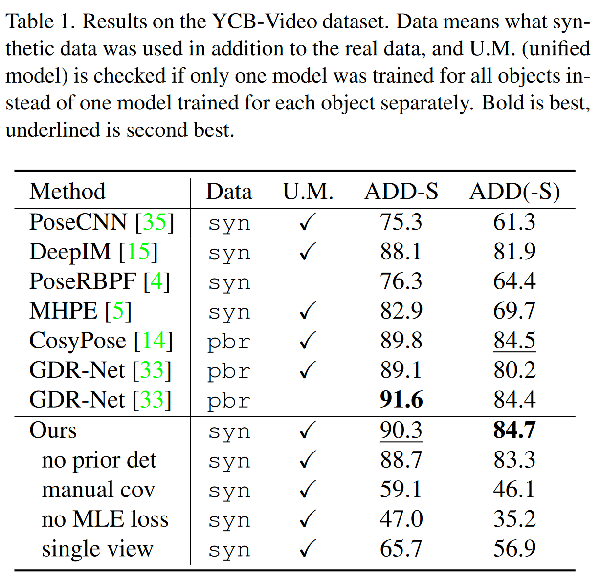

# 07_SUO_SLAM

## Info

> Paper: [https://arxiv.org/pdf/2309.02185v4](https://arxiv.org/pdf/2309.02185v4)
> Github: [https://github.com/rpng/suo_slam.git](https://github.com/rpng/suo_slam.git)

## 论文

### Abstract

提出了一种基于关键点的目标级 SLAM 框架，该框架可以为对称和不对称对象提供全局一致的 6 自由度（6DoF）姿态估计。系统首先利用 SLAM 中的相机姿态信息为对称目标上的关键点跟踪提供先验知识的系统之一，从而确保新的测量结果与当前的三维场景保持一致。此外，语义关键点网络经过训练，可以预测关键点的高斯协方差，该协方差捕获了预测的真实误差，因此它不仅可以用作系统中优化问题残差的权重，还可以用作检测异常值的手段，而无需选择手动阈值。实验表明，方法在 6DoF 目标姿态估计方面提供了 SOTA 性能，并且实时推理。

### Introduction

六自由度（DoF）物体姿态估计在多种下游应用（如自动驾驶、机器人导航、操作和增强现实）中发挥着关键作用，并已在计算机视觉和机器人技术领域中得到了广泛研究。一些方法依赖于 RGB 输入，而其他方法则利用额外的深度输入来提高性能。一些方法处理单视图，而其他方法则利用多视图来增强结果。特别是，多视图方法可进一步分为离线运动恢复结构（SfM）其中所有帧一次性给出和在线 SLAM 风格，其中帧是顺序提供的，并且期望实时性能。

**本文聚焦于在线单目 SLAM 系统中的基于图像的多个物体的六自由度姿态估计。**典型的多视图六自由度姿态估计方法可以分为单视图估计阶段和多视图增强阶段。虽然可以融合来自多个视图的姿态估计以获得更好的性能，但处理极端不一致性——例如由物体的旋转对称性引起的不一致性——仍然具有挑战性。此外，手动调整离群值拒绝的阈值并为非线性优化分配残差权重也是不可靠的。为了解决这些挑战，**本文提出了一种对称性和不确定性感知的六自由度物体姿态估计方法，该方法在 SLAM 框架内融合来自所有视图的语义关键点测量。**本文的主要贡献是：

- 设计了一个**基于关键点的物体 SLAM 系统**，该系统能够实时联合估计全局一致的物体和相机姿态——即使在存在错误检测和对称物体的情况下也能如此。
- 提出了一种方法，**能够持续预测并跟踪对称物体随时间变化的 2D 语义关键点**，该方法利用现有 3D 关键点在当前图像上的投影作为关键点网络的有信息先验输入。
- 开发了一种**训练关键点网络，以估计其预测的不确定性的方法**，从而使不确定性度量能够量化关键点的真实误差，并在物体 SLAM 系统中显著提高物体姿态估计的准确性

### Related Work

#### Single-view object pose estimation

近年来，已经提出了大量单视图物体姿态估计方法：

1. 一个主要趋势是利用深度网络以回归和细化的方式预测物体相对于相机的相对姿态。尽管这种方法有效，但迭代细化过程通常计算成本较高。
2. 另一种趋势是从 CAD 模型估计稀疏 3D 语义点的 2D 投影位置，或者从物体掩码内的密集 2D 像素回归 3D 坐标，然后解决透视 n 点（PnP）问题以估计物体姿态。这种方法更加高效，但在遮挡情况下并不总是可靠。

为了同时实现对遮挡的优越鲁棒性和实时效率，我们开发了一种多视图方法，该方法在物体级 SLAM 系统中集成了稀疏语义关键点检测。我们**没有采用传统描述符，而是选择开发基于卷积神经网络（CNN）的关键点检测器，以便利用更多的全局上下文来推断关键点位置并区分其语义。**我们证明了物体 SLAM 系统可以有效地利用稀疏的语义关键点集合，在带有关键点级别离群值拒绝的光束平差（BA）优化中优化姿态。

#### Object-level SLAM

物体级 SLAM 通常建立在单视图物体姿态估计器的基础上，通过多视图优化来提高估计姿态对遮挡、漏检和全局一致性的鲁棒性。SLAM++ 是这一领域的开创性工作，但他们的系统仅适用于深度图像。还有一些工作将物体建模为稀疏的 3D 关键点集合，并使用 2D 关键点检测器来估计随时间融合的对应关系，但这些工作都没有考虑对称物体。另一方面，PoseRBPF 提出了一种方法，使用自编码器和粒子滤波器来跟踪物体随时间的变化，并推理对称性，但他们的系统一次只能跟踪一个物体，限制了应用。CosyPose 提出了一种方法，通过物体级 RANSAC 从多个视图消除对称物体姿态估计的歧义，但他们的方法是一种离线的结构从运动（SfM）方法，无法直接与我们的方法进行比较。Fu 等人提出了一种多假设 SLAM 方法来估计对称物体的姿态，该方法使用最大混合模型进行优化。相比之下，我们的方法只跟踪一个假设，并且已被证明具有更优的性能。

#### Keypoint uncertainty estimation

典型的全局优化方法使用预测的对象关键点作为测量值（即 PnP 或多视图图优化），需要对残差进行适当的加权。如果没有与关键点测量值相对应的确定性度量，则此权重通常设置为单位权重或某些手动调整的值。一些工作直接从关键点网络的输出中检索权重，在 PnP 中将其作为确定性的标量度量或高斯协方差矩阵使用，而则采用中的贝叶斯方法，通过对 RANSAC 来估计关键点的协方差矩阵。尽管这些方法在实践中已被证明有效，但没有任何一种方法表明，它们所预测的不确定性实际上与真实情况相比，能够限制预测的真实误差。除了残差加权外，不确定性在剔除离群值方面尤其有用，因为假设不确定性是高斯协方差矩阵，与手动调整相比，卡方 χ² 分布可以更系统地确定离群值阈值。受最近大量关于网络自不确定性预测（与关键点预测无关）的工作的启发，我们设计了一个最大似然估计器（MLE）损失，该损失训练网络以准确预测关键点位置，并联合预测不确定性，使其紧密围绕预测的实际误差。

### The Proposed Method

我们的多视图 6 自由度（6DoF）物体姿态估计方法统一在一个物体 SLAM 框架中，该框架在估计物体和相机姿态的同时，考虑了检测到的物体的对称性，并利用网络的不确定性估计来增强系统的鲁棒性。整个流程的示意图如图所示。该流程分为两个步骤，分别处理非对称物体和对称物体。

1. 在步骤 1 中，跟踪 3D 场景中的非对称物体以估计相机姿态
2. 在步骤 2 中，将估计的对称物体的 3D 关键点投影到当前相机视图中，作为先验知识，以帮助预测与 3D 场景一致的这些物体的关键点。

物体 SLAM 系统主要由两个模块组成：使用关键点网络的前端跟踪模块和后端全局优化模块，用于增强物体和相机姿态估计。因此，所提出的系统可以处理连续输入，并实时估计当前状态，供需要物体和相机姿态反馈的操作员或机器人使用。

#### Keypoint Network

我们开发了一个关键点网络，该网络不仅能够预测 2D 关键点坐标，还能预测它们的不确定性。此外，为了使该网络能够为对称物体提供一致的关键点轨迹，它还可以选择性地接收先前带有一定噪声的关键点热图输入。我们的关键点网络架构如图所示。

该网络的骨干架构是堆叠沙漏网络，已被证明是物体姿态估计的一个良好选择。与原始文献类似，我们选择多通道关键点参数化方法，因为其简单性。在这种框架下，每个通道负责预测一个关键点，可以将数据集的所有关键点组合成一个输出张量，从而允许使用一个网络来处理所有物体。

给定裁剪到边界框并调整到静态输入分辨率的图像和先前输入，网络会预测一个$N \times H/d \times W/d$的张量$p$，其中$H \times W$是输入分辨率，$d$是下采样率（实验中是 4），$N$是数据集的总关键点数。从$p$中，我们可以预测出一组$N$个 2D 关键点$\{u_1,u_2,...,u_N\}$和 2 × 2 的协方差矩阵$\{\Sigma_1,\Sigma_2,...,\Sigma_N\}$。通过利用空间 softmax，$p$的每个通道$p_i$都被强制为一个 2D 概率质量。预测的关键点被取为该概率质量上 2D 坐标的期望值$u_i = \Sigma_{u,v}p_i(u,v)[u v]^T$。与不可微的 argmax 操作不同，这允许我们直接在损失函数中使用关键点坐标，这对于不确定性估计非常重要。

##### Keypoints with uncertainty

由于关键点$d_i$是 2D 坐标分布的预期值，该分布的概率质量由$p_i$的值给出，因此可以直接通过该分布关于均值的二阶矩（即协方差）来估计不确定性度量：

$$
\boldsymbol{\Sigma}_i=\sum_{u,v}p_i(u,v)\left([u v]^\top-\boldsymbol{u}_i\right)\left([u v]^\top-\boldsymbol{u}_i\right)^\top 
$$

然而，如果没有关于协方差的特定标准，就无法确保不确定性实际上能够反映预测的真实误差。为此，我们建议使用高斯最大似然估计器（MLE）损失来联合优化关键点坐标及其协方差：

$$
L_{\mathrm{MLE}}^{(i)}=\left(\boldsymbol{u}_{i}^{*}-\boldsymbol{u}_{i}\right)^{\top} \boldsymbol{\Sigma}_{i}^{-1}\left(\boldsymbol{u}_{i}^{*}-\boldsymbol{u}_{i}\right)+\log \left|\boldsymbol{\Sigma}_{i}\right|
$$

其中，$u_i^*$是真实的关键点坐标。从高层次的角度来看，第一项确保了协方差能够限制预测的真实误差，而第二项则防止协方差变得过大。

通过这种方式，网络可以以一种高斯协方差矩阵的形式预测其自身的不确定性，该矩阵经过训练能够紧密地限制估计关键点的真实误差。虽然网络总共预测了$N$个关键点，但对于特定对象$\ell$来说，其中只有一部分，即$\mathcal{K}(\ell) \subset \{1,2,\ldots,N\}$，是有效的。此外，在考虑单个图像时，只有$K$的一个子集$B \in K(\ell)$位于对象$\ell$的边界框内（请注意，被遮挡的关键点仍然会被预测）。然而，在部署期间，虽然可以从对象类别和关键点标签中得知$\mathcal{K}(\ell)$，但可能无法知道哪些关键点位于检测到的边界框内。因此，我们在网络上添加了另一个头部来预测一个 sigmoid 向量$\boldsymbol{m}\in[0,1]^N$，该向量经过训练可以估计真实二值掩码$\boldsymbol{m^*}\in \{0,1\}^N$，其中如果$m_i^* = 1$，则$i \in B$，否则为 0（有关架构，请参见图 3）。因此，对于单个图像中的单个对象，总损失变为：

$$
L_{\mathrm{tot}}=\mathrm{BCE}\left(\boldsymbol{m}, \boldsymbol{m}^{*}\right)+\frac{1}{|\mathcal{B}|} \sum_{i \in \mathcal{B}} L_{\mathrm{MLE}}^{(i)}
$$

其中$BCE(\cdot)$表示交叉熵损失，剩余部分，简而言之，我们将使用$k \in \{1,2,...K\}$ 来表示那些通过真实掩码$m^*$（用于训练，即下一节内容）或估计掩码 $m$（以及已知的$K(\ell)$）筛选出来的关键点的索引，这些关键点将用于在 SLAM 系统中进行部署。

##### Keypoints for symmetric objects

由于在部署过程中我们希望高效地随时间跟踪关键点，因此获得与 3D 场景一致的对称假设的关键点预测将非常便利。受论文启发，我们选择向关键点网络添加 N 个额外通道作为输入，这些通道包含对物体关键点的先前检测。如图 2 所示，在 SLAM 系统中部署时，一旦找到相应的相机姿态（即第二步），就会将从全局物体框架中的 3D 关键点投影到当前图像中，从而获得先前检测到的关键点。

在此范式下，需要解决两个主要问题：

1. 如何创建先前检测的训练示例（因为训练期间不会运行 SLAM 系统）
2. 如何在尚未获得物体姿态估计的情况下检测对称物体的初始关键点。

在这里，我们描述了用于解决这些问题的训练方案。为了创建训练先验，我们模拟了一个 SLAM 系统通过扰动的真实物体姿态$\delta\mathbf{T}_O^C\mathbf{T}^*$（有关符号的详细信息，请参阅补充材料第 A 节）将物体框架中的 3D 关键点投影到图像平面上而产生的带噪声的先前检测。为了进一步确保网络能够学会遵循对称假设的先前检测，我们利用了一组对于每个物体都期望可用的对称变换$\mathcal{S}=\{\begin{smallmatrix}O\\S_1\end{smallmatrix}\mathbf{T},\begin{smallmatrix}O\\S_2\end{smallmatrix}\mathbf{T},\ldots,\begin{smallmatrix}O\\S_M\end{smallmatrix}\mathbf{T}\}$（对于具有连续对称轴的对象进行离散化）。当应用于物体的 CAD 模型时，S 中的每个$\begin{smallmatrix}O\\S_m\end{smallmatrix}\mathbf{T} \in S$都会使渲染看起来（几乎）完全相同，并且在实际操作中，这些变换可以相当容易地手动选择。因此，在构建带有先前检测的训练示例时，我们先选择一个随机的对称变换，并在投影之前将其应用于真实物体姿态。

为了让网络学会在没有先验的情况下预测对称物体的初始关键点，我们只为大约一半的示例随机提供此模拟先验。然而，如果没有先前检测，网络将依靠自身来推断物体的绝对方向，这对于对称物体来说在理论上是不可能的，除非进行特殊处理。与提出的镜像技术和额外的对称分类器不同，我们教会网络通过简单的标准来处理这个问题，即**选择对应于最接近规范视图（其中物体的前面面向相机，物体的顶部面向图像的顶部）的对称有效姿态的关键点**。有关此过程的更多详细信息，请参阅补充材料（第 B 节）。

#### Object SLAM System

我们的对称性和不确定性感知物体 SLAM 系统由两个模块组成：前端跟踪和后端全局优化。

前端负责处理传入的帧：运行关键点网络、估计当前相机姿态以及初始化新物体；而后端则负责增强整个场景中相机和物体的姿态。建议读者参考图 2 以直观地了解我们的系统。

##### Front-end tracking

我们前端的第一步是将当前图像中检测到的边界框分成两个信息流——第一个用于非对称物体和首次检测到的对称物体，第二个用于已经有 3D 估计的对称物体。同样，我们期望每个物体类别都包含对称性信息（即是否对称）。第一个信息流将裁剪自边界框的图像发送到关键点网络，而无需任何先验信息来检测关键点和不确定性。然后，这些关键点被用于通过 RANSAC 算法与 PnP 结合来估计当前相机帧中每个非对称物体的姿态$\begin{smallmatrix}C\\O\end{smallmatrix}T_{pnp}$。接着，这些 PnP 姿态被用于粗略估计当前相机姿态，并初始化那些还没有 3D 估计的物体。有关如何执行此操作以及前端更详细的行为，请参阅补充材料第 C 节。在粗略估计当前相机姿态后，我们转到前端的第二个信息流。我们使用相机姿态的粗略估计，通过将对称物体的 3D 关键点投影到当前图像中，并为网络输入构建先验关键点热图，从而为这些物体的关键点创建先验检测。在对这些对称物体运行关键点网络后，我们存储来自两个信息流的关键点测量值，以便在后续的全局优化中使用。

##### Back-end global optimization

全局优化会定周期运行，以根据每张图像中的测量数据来优化整个场景（包括物体和相机的姿态）。我们没有将问题简化为姿态图（即使用 PnP 的相对姿态测量），而是保留了使用关键点检测作为测量的原始噪声模型。这使我们能够利用网络提供的协方差预测来为每个残差分配权重。全局优化问题是通过创建残差来构建的，这些残差将图像$j$的姿态 $\begin{smallmatrix}C_j\\G\end{smallmatrix}\mathbf{T}$和物体$\ell$的位姿 $\begin{smallmatrix}G\\O_{\ell}\end{smallmatrix}\mathbf{T}$与第$k$个关键点约束起来：

$$
\boldsymbol{r}_{j,\ell,k}=\boldsymbol{u}_{j,\ell,k}-\Pi_{j,\ell}\begin{pmatrix}C_j\\G&\boldsymbol{T}_{O_\ell}^G\boldsymbol{T}^{O_\ell}\boldsymbol{p}_k\end{pmatrix}
$$

其中， $\Pi_{i,\ell}$是图像 $j$中对象 $\ell$的边界框的透视投影函数。因此，整个问题就变成了最小化整个场景中的成本：

$$
C=\sum_{j,\ell,k}s_{j,\ell,k} \rho_H\left(\boldsymbol{r}_{j,\ell,k}^\top\boldsymbol{\Sigma}_{j,\ell,k}^{-1}\boldsymbol{r}_{j,\ell,k}\right)
$$

其中， $\Sigma_{j,\ell,k}$是网络为关键点 $\mathbf{u}_{j,\ell,k}$的 2×2 协方差矩阵， $s_{j,\ell,k} \in \{0,1\}$是一个常数指示器，如果在优化开始之前该测量值被视为内点，则为 1，否则为 0。 $\rho_H$是 Huber 范数，它在优化中减少了离群值的影响。 $\rho_H$和 $s_{j,\ell,k}$使用相同的离群值阈值 $\tau$，该阈值是从二维 $\chi^2$分布中得出的，并且始终设置为 95% 置信阈值 $\tau = 5.991$。因此，只要协方差矩阵 $\Sigma_{j,\ell,k}$能够正确捕获关键点 $\mathbf{u}_{j,\ell,k}$的真实误差，我们就无需手动调整离群值阈值

### Experiments

实验是在两个最具挑战性的物体姿态估计数据集上进行的：YCB-Video 数据集和 T-LESS 数据集。这两个数据集都在多个关键帧序列中，为杂乱环境中对称和非对称物体提供了真实姿态。YCB-Video 数据集包含 21 个日常用品，其中包括 4 个具有离散对称性的物体和 1 个具有连续对称轴的物体（碗）。T-LESS 数据集包含 30 个与工业相关的物体，这些物体几乎没有纹理，且大多数是对称的。

#### Implementation Details

##### Choice of keypoints

虽然我们的设计对关键点的选择是非特定的，以减少网络需要预测的通道数，但我们创建了一套规则来手动标注关键点，以便每个关键点可以应用于多个对象实例，并且相同的规则可以应用于 YCB-Video 和 T-LESS 数据集。我们手动为两个数据集的 3D CAD 模型进行标注，并将关键点从 3D 投影到 2D 以创建 3.1 节中描述的真值关键点。有关如何标注关键点的更多详细信息，请参阅附录 D。

##### Training procedure

我们在 PyTorch 中实现了关键点网络。对于所有训练，我们使用了 Adam 优化器，学习率为 10^-3。对于 YCBVideo 数据集，我们使用了官方提供的 80k 合成图像以及与其对应的真实训练数据。由于真实训练数据存在较高的冗余性，我们仅使用了每 5 张图像。我们使用批次大小为 24 的随机背景和随机边界框、颜色以及图像变形对该数据集进行了 60 个 epoch 的训练。对于 T-LESS 数据集，只有在暗背景下的单个物体的实例训练图像，因此对于合成数据，我们选择了基于物理的 pbr 渲染数据。对于真实和 pbr 分割的数据，我们都对示例进行了随机背景、边界框、颜色和变形的增强，以及仅对真实数据进行的随机粘贴物体处理——因为该数据仅包含孤立物体的图像。我们使用批次大小为 8 对 TLESS 模型进行了 89 个 epoch 的训练，由于 pbr 数据的图像分辨率更高，因此其批次大小比 YCB-Video 小。

##### SLAM system

我们的 SLAM 系统采用 Python 实现。GPU 仅用于网络推理，而其他操作都在 CPU 上执行。所有优化都通过 g2o 库的 Python 封装实现，除了使用 Lambda Twist 求解器进行 PnP 操作的 RANSAC2。我们的前端跟踪在每个新到达的帧上运行，而后端则每 10 帧运行一次。请注意，两个数据集的测试序列已经作为关键帧提供，因此不需要进行关键帧处理。对于实际部署，理想情况下是在单独的线程上运行后端图优化，但由于操作系统在两个线程之间分配资源的随机性，这将使重现确切结果变得不可能。为了使结果可重现，我们仅在主线程上执行前端和后端的评估。我们的前端跟踪通常可以在配备 GTX 1080Ti 显卡的桌面上以 11Hz 的速度运行，而后端的平均速度为 2Hz

#### YCB-Video Dataset

针对 YCB-Video 数据集，我们将本文方法与单视图方法和 SLAM 方法进行了比较。请注意，我们没有包含 CosyPose 的多视图结果，因为它是一种离线的结构从运动恢复（SfM）方法，无法与实时的 SLAM 方法进行比较。我们遵循中的做法，通过将精度阈值从 0 变化到 10 厘米来计算 ADD-S 和 ADD(-S)的曲线下面积（AUC），这是针对每个物体分别计算的，然后取平均值。为了公平比较这些方法，我们使用了与 PoseCNN 相同的边界框。在实际应用中，边界框可以来自任何实时的边界框检测器。

表中报告了基准测试结果以及几项消融研究的结果，其中我们的方法标记为“Ours”。表 1 中的方法被标记为除了使用真实数据外，还使用了标准合成数据（syn）（即物体随机放置）或基于物理的（pbr）训练数据。请注意，虽然基于物理的训练数据通常被认为优于物体随机放置的数据，但它并不是 YCB-Video 数据集官方训练集的组成部分。尽管如此，我们的方法在 ADD(-S)指标的 AUC 方面超越了所有最先进的单视图和 SLAM 方法——甚至包括那些使用了基于物理的训练数据的方法，而我们的方法仅使用一个网络来处理所有物体。在这里，ADD(-S)的 AUC 是最重要的指标，因为它考虑了物体的实际对称性，而不仅仅是像 ADD-S 那样进行形状匹配。这表明我们的系统可以为对称物体提供高度准确的全局一致姿态，同时在对纹理不对称物体的处理上仍保持高精度。定性结果见图 4。每个物体类别的更详细结果见补充材料第 E 节。

##### Effect of prior detection

第一项消融研究是在不使用先验检测的情况下运行我们的相同系统。结果略有下降，但在该数据集中，这是预料之中的，因为 21 个物体中只有 5 个被认为是对称的，而且只有碗显示出了连续的旋转对称性。在下一节中，我们将看到，在 T-LESS 数据集上，先验检测实际上产生了更大的差异，因为 T-LESS 数据集中的大多数物体都是对称的，并且相机围绕场景进行了多次完全旋转——而 YCB-Video 中的相机运动则简单得多。

##### Manual covariance weight

在表 1 中的下一项消融研究“manual cov”中，我们手动调整了一个权重来替换 SLAM 系统中残差和离群值剔除机制中的协方差。在这里，我们发现，对应于网络预测的标准差的 2 倍（约为 2.5 像素）的权重取得了最佳分数。据观察，与使用网络预测的协方差相比，结果显著下降。

##### Effect of MLE loss

对于标记为“no MLE loss”的消融研究，我们使用相同的程序训练了一个网络，但将 MLE 损失替换为了与流行的人体姿态估计中使用的方差调节类似的固定方差损失。据观察，当将其放入 SLAM 系统中时，结果显著低于使用 MLE 损失训练的网络。该实验的定性结果也见图 4。除了 SLAM 系统在这一变化下的准确性之外，我们还测试了预测的协方差本身的准确性。为此，我们在一组单独的模拟 YCB-Video 物体（未用于训练的 pbr 数据）上运行了两个网络（有 MLE 损失和无 MLE 损失），这些物体具有完美的关键点真实值。在这里，我们使用真实值的边界框运行网络，并且没有使用先验检测。为了评估预测的协方差的准确性，我们将关键点误差与网络的预测标准差进行了绘图。理想情况下，如果 er 是关键点预测误差残差的 x 或 y 分量标量，则误差将始终位于 er < 3σ 的圆锥体内。

该实验的结果可见图 5。据观察，使用 MLE 损失训练的网络中有更多的误差位于 3σ 圆锥体内。事实上，图 5 左侧的数据点中有 91.0% 通过了 99% 置信度的 χ² 检验，而右侧的数据点中只有 7.1% 通过。这表明，预测的不确定性很好地描述了实际的误差分布（除了由于严重遮挡和对称性而产生的一些预期离群值之外），并且包含 MLE 损失对于实现这一点至关重要。

##### Comparing to single view

在表 1 中的最后一项消融研究中，我们只运行了我们的单视图网络并比较了准确性。具体来说，对于每个视图，我们只运行了 PnP 算法，并使用与等式 5 相同的程序进行了优化，但每个优化过程中只有一个固定的相机姿态。显然，完整的 SLAM 系统更为准确。值得注意的是，单视图的结果实际上比使用手动协方差或固定方差网络的 SLAM 结果更准确。这很可能是因为在我们的 SLAM 系统中，错误的协方差可能导致离群值剔除机制不可靠，然后离群值可能会将物体姿态拉向错误的方向，尽管大多数关键点都是正确的，但这仍然会损害所有视图的准确性。

##### Accuracy of camera poses

在本实验中，使用数据集提供的姿态来初始化相机姿态的影响很小。使用给定的相机姿态，系统实现了 90.5 的 ADD-S 分数 AUC（Area Under Curve，曲线下面积），而使用估计的相机姿态的系统则获得了表 1 中显示的 90.3 的分数。这表明，在该数据集上，估计的相机姿态非常准确

#### T-LESS Dataset

针对 T-LESS 数据集，我们与两个单视图基线方法以及再次与 PoseRBPF 和 CosyPose 进行了比较。为了公平地与其他方法进行比较，我们使用了相同的 RetinaNet 边界框，并为每个对象选择了得分最高的边界框。我们采用了其他方法所报告的标准视觉表面差异（vsd）召回率指标，即 evsd < 0.3。由于 T-LESS 数据集包含多个仅包含对称物体的场景，而我们的系统需要非对称物体来估计相机姿态，因此我们使用数据集提供的姿态来初始化相机姿态。尽管这可能是我们系统的一个潜在缺点，但典型的部署场景将包含对称物体或允许从其他来源（如额外的 IMU 传感器或传统的基于特征的 SLAM）检索外部里程计信息。

表 2 报告了基准测试结果和消融研究结果，其中我们的系统实现了 63.7 的召回率分数，仅次于 CosyPose 的 63.8。然而，值得注意的是，CosyPose 是一种迭代优化方法，它利用了在距离相机 1 米处渲染的初始物体姿态，这个距离接近所有物体的距离，而我们的方法则没有这样的假设。图 6 还展示了在真实数据上叠加的合成数据的定性结果。这显示了我们的方法能够在有限的数据量下工作，这些数据甚至无法覆盖物体的所有方向。

##### Effect of training data

为了测试对训练数据的敏感性，我们仅使用包含每个对象在暗色背景下 1,231 张图像的小型真实训练集进行训练。从表 2 中我们观察到，即使只有这么少量的数据，我们的方法仍然超越了除 CosyPose 之外的所有最先进方法——而这些方法都在真实数据的基础上使用了大量的合成数据。这显示了我们的方法能够在有限的数据量下工作，这些数据甚至无法覆盖物体的所有方向。

##### Effect of prior detection

在 T-LESS 数据集中，大多数物体在某种程度上都是对称的，当移除先验检测时，表 2 中的 63.7 召回率分数降至 16.2。这表明，当相机多次围绕这些 T-LESS 物体的对称轴旋转时，先验检测对于处理这些具有挑战性的物体至关重要。如果没有先验检测，SLAM 系统的离群值剔除功能会简单地拒绝对称物体上的大多数关键点测量值，因为它们并不对应于相同的 3D 位置。图 6 还包括了该实验的一些定性结果。

##### Manual covariance weight

在这里，我们再次将 SLAM 系统残差中的协方差设置为手动调整的权重。在这种情况下，结果降至 13.8 的召回率，这进一步证实了我们在 SLAM 系统中协方差估计的有用性。此外，我们发现该数据集的最佳权重远大于 YCB-Video 数据集的权重，这并不奇怪，但表明通过使用预测的协方差来消除手动调整权重的需要是我们系统的一个有用特性。

##### Comparing to single view

在这种情况下，当 SLAM 系统使用手动协方差权重或没有先验检测时，表 2 中的单视图结果优于 SLAM 系统的结果。由于单视图结果没有使用先验检测，这表明为每个视图独立考虑的关键点是合理的，而先验检测对于随时间跟踪这些关键点至关重要。

### Conclusions and Future Work

在这项工作中，我们设计了一个基于关键点的目标级 SLAM 系统，该系统能够为对称或非对称对象提供全局一致的 6 自由度（6DoF）姿态估计。我们的方法能够在所提出的先验检测的帮助下，一致地跟踪对称对象上的语义关键点，并且我们网络预测的不确定性已被证明能够捕捉预测关键点的真实误差，同时极大地提高了对象姿态的准确性。在未来，我们希望将我们的系统适应于更大的环境，并推广到未见实例的类级关键点预测。

## Supplementary Material

### A. Rigid Body Transform Notation

在整篇论文中，我们经常在许多方程中包含了刚体变换。在这里，我们简要解释一下所使用的符号。

一个 6 自由度（6DoF）的刚体变换 $^B_AT \in SE(3)$，它会将一个在参考系 $\{A\}$中定义的点变换到参考系 $\{B\}$中。我们可以用两种方式来表示这个变换:

1. 第一种，也是最常见的方式，是将 $^B_AT$分解为旋转分量 $^B_AR$（属于特殊正交群 $^B_AR \in SO(3)$）和平移分量 $^Bp_A$（属于三维实数空间 $^Bp_a \in R^3$）。在这种形式下，我们写为 $^Bp_k = ^B_AR^Ap_k + ^Bp_A$，以将 3D 点 $^Ap_k$从 $\{A\}$系变换到 $\{B\}$系
2. 另一种形式，我们保持变换在其完整的 $4 \times 4 SE(3)$形式中，并使用平移向量的齐次形式 $A\bar{\boldsymbol{p}}_k=[^A\boldsymbol{p}_k^\top 1]^\top $。这样，我们写为$^B\bar{\boldsymbol{p}}_k = _A^B\mathbf{T} ^A\bar{\boldsymbol{p}}_k$。这种形式特别允许我们使用简化的符号将多个变换串联起来，例如：

$$
{}^B\bar{\boldsymbol{p}}_k={}_{A_2}^B\mathbf{T}{}_{A_1}^{A_2}\mathbf{T}{}_A^{A_1}\mathbf{T}{}^A\bar{\boldsymbol{p}}_k
$$

### B. Choice of Symmetry Without Prior

如 3.1 节所述，与 Bb8 提出的镜像技术和额外的对称性分类器不同，我们需要在先验信息可用之前，训练网络预测对称物体的初始关键点。我们选择利用一组对称变换，以更简洁的方式和直观的思路来解决这个问题：当对称物体的先验检测信息不可用时，我们可以简单地指导网络选择使物体位姿最接近规范位姿的方向，即物体正面朝向相机，物体顶部朝向图像顶部。网络在训练过程中通过选择使 3D 关键点（在方向上）最接近相机坐标系中规范视图$\{O_c\}$中变换后的关键点的对称性标签来学习：

$$
\begin{aligned}_S^O\mathbf{T}&=\underset{S_m}{\operatorname*{argmin}}\frac{1}{K}\sum_{k=1}^K\left\|^C\tilde{\boldsymbol{p}}_k-^C\tilde{\boldsymbol{p}}_k^c\right\|_2&\text{(6)}\\^C\boldsymbol{p}_k&=_O^C\mathbf{R}\left(_{S_m}^O\mathbf{R}^O\boldsymbol{p}_k+^O\boldsymbol{p}_{S_m}\right)&^C\boldsymbol{p}_k^c=_{O_c}^C\mathbf{R}^O\boldsymbol{p}_k\end{aligned}
$$

其中， $\tilde{\boldsymbol{p}}_k = \boldsymbol{p}_k - \frac{1}{K}\sum_{k=1}^K\boldsymbol{p}_k$表示经过均值移除处理后的点云中的第$k$个点。如图为公式 6 的可视化结果：

当模拟的先验检测信息没有提供给网络时，公式 6 用于在训练期间选择应用于真实关键点的对称变换——否则，会对先验和真实关键点一起应用一个随机的对称变换，以便网络可以学习遵循对称性的先验。公式 6 的主要作用是，它会选择应用于真实关键点的对称性，以使其与规范视图在方向上最匹配，这实际上告诉网络，如果没有提供先验，则始终选择使物体正面最接近相机、物体顶部最接近相机坐标系负 y 轴（即图像顶部）的对称性。当然，仍然存在检测对称性拐点附近关键点的问题。虽然我们可以利用 Bb6 中的镜像技术来避免这个问题，但在实际应用中（即第一次检测时），我们只需要在没有先验检测的情况下检测一次关键点，而 Bb6 的镜像技术在测试时需要额外的分类器，这会使流程复杂化并增加额外的计算量。如果物体处于对称性的拐点，并且难以决定使用哪种对称性，在我们的完整 SLAM 系统中，通常可以简单地拒绝不良测量值，直到相机移动到物体的更好视角，以便网络能够根据使用公式 6 进行的训练更有信心地选择初始对称性。

### C. Front-End Tracking Details

除了第一幅图像，其相机坐标系被设定为全局参考系$\{G\}$之外，我们还需要利用一组物体的 PnP 位姿和当前全局坐标系中物体的估计值来估计相机的位姿$^C_GT$。对于在当前帧中成功检测到 PnP 位姿$_O^C\mathbf{T}_{pnp}$和全局位姿$_O^G\mathbf{T}$的每个非对称物体，我们可以根据当前相机的位姿做出假设，即$\mathop{}_G^C\mathbf{T}_{hyp}=\mathop{}_O^C\mathbf{T}_{pnp}\mathop{}_O^G\mathbf{T}^{-1}$。

然后使用这个相机位姿，将当前图像中所有既有全局 3D 估计又有检测结果的物体的 3D 关键点投影到当前图像平面上，并使用$\chi^2$检验和检测到的关键点及其不确定性来计算内点数量。我们选择内点数量最多的相机位姿假设作为最终的$\mathop{}_C^G\mathbf{T}$，并拒绝内点数量过少的假设。在此之后，对于具有有效 PnP 位姿但尚未在场景中初始化的物体，我们会为其赋予一个初始位姿$\mathop{}_O^G\mathbf{T}=\mathop{}_G^C\mathbf{T}^{-1}\mathop{}_O^C\mathbf{T}_{pnp}$

由于每个物体都是使用 PnP 位姿进行初始化的，因此如果 PnP 失败，初始化可能会非常糟糕。如果位姿误差足够大（例如，方向误差很大），优化可能只会达到局部最小值而无法修正。为了解决这个问题，我们会检查当前图像的 PnP 位姿是否比最近几帧中的估计位姿产生了更多的内点。如果是这样，我们会使用新的位姿重新初始化物体。之后，我们通过固定物体位姿并仅优化当前相机来进行快速的局部相机位姿优化，以便更好地将相机注册到场景中。

### D. Keypoint Labeling

#### Choice of keypoints

网络学习的关键点的选择很重要，但对于哪种选择最佳，目前尚无普遍共识。有人提出检测 3D 边界框的角点，而有人选择位于物体上的关键点——这似乎是一种更准确的方法。我们尝试选择具有某种语义含义的关键点。YCB-Video 数据集上的关键点标签如图 8 所示，T-LESS 数据集上的关键点标签如图 9 所示。具体来说，我们根据整体形状将物体分为三类——盒状、柱状和手工具，并根据最可识别的特征为这些形状类别中的每一个选择一组统一的关键点。

我们发现，为这些类别中的每一个选择一组关键点可以准确地描述 YCB-Video 和 T-LESS 数据集中物体的形状，尽管一些物体的形状并不完全是矩形、圆柱形等，但关键点网络学习这些关键点时相对容易。为了增加关键点的数量并提高它们在后续应用中的潜在实用性，我们还添加了一些特定实例的关键点，如品牌名称、条形码和手柄，这些只在 YCB-Video 数据集中出现。这些关键点仍然可以在 YCBVideo 数据集中的多个物体实例之间共享，但有时也会出现在不同的形状类别之间（例如，条形码既出现在盒状的饼干盒上，也出现在圆柱形的汤罐上）。

#### Labeling tool

为了标注关键点，我们创建了一个简单的标注程序，允许用户在 CAD 模型上多次选择同一个关键点（例如关键点 k），并取 CAD 模型框架中该关键点的平均 3D 位置作为最终的 3D 关键点位置 Opk。该工具还允许用户通过简单地将物体旋转到正确的视图来选择用于等式 6 中的规范视图$\{O_c\}$。这对于 YCB-Video 数据集尤其重要，因为该数据集中的物体模型并不像 T-LESS 数据集那样已经旋转到规范视图。标注程序将与我们的关键点标签一起包含在软件发布中，该软件将在本文发表时提供。发布内容还将包括如何重现我们的关键点标签的详细说明（即我们用来确定每个关键点位置的规则），这些说明也可用于为其他包含与 YCB-Video 和 T-LESS 类似物体的数据集标注关键点。我们发现，在用户熟悉标注程序后，每个物体的关键点标注只需几分钟。在未来，我们希望减少形状类别特定关键点的标注任务，因为当给定规范视图中的 CAD 模型时，应该有一组简单的启发式方法来自动标注这些关键点。

### E. Extended Results

#### YCB-Video per-object results

YCB-Video 数据集的单物体结果。如第 4.2 节所述，我们为 YCB-Video 数据集中的每个物体提供了更详细的结果，具体见表 3。在此，我们的方法对于大多数物体显示出更高的 ADD 和 ADD-S 曲线下面积（AUC）。

对于表 3 中以粗体蓝色突出显示的五个对称物体，我们的方法在其中四个上取得了最佳的 ADD-S AUC，这表明我们能够有效处理这些对称物体。请注意，**对于对称物体而言，ADD 指标并不十分重要，因为它检查的是与实际真实姿态的匹配程度**——由于对称性，这种匹配是任意的——而 ADD-S 仅检查真实姿态和估计姿态之间物体的形状是否匹配良好。这在木块的情况下尤为明显，我们的方法在 ADD 的 AUC 上得分为 0.0，但在 ADD-S 的 AUC 上超越了其他所有方法。这是因为我们对该物体的估计姿态正确地将 CAD 模型与场景对齐以匹配形状，但由于对称变换，导致方向与真实姿态完全不同。

#### Qualitative results

更多定性结果如图 10 所示。

在此，我们展示了 YCB-Video 和 T-LESS 数据集的三个成功案例和一个失败案例。即使存在遮挡、检测效果不佳或缺失的情况，我们的系统也能够为各种难以处理的物体估计出正确的姿态。我们观察到的常见失败案例是**系统错误地将物体（尤其是对称物体）倒置初始化。**虽然我们在 YCB-Video 数据集中仅展示了我们发现的这样一个案例，但在 T-LESS 数据集中这种情况尤为常见，因为对于许多物体而言，很难区分其顶部和底部。在未来研究中，可靠地解决此类边缘案例是一个有趣的问题。
