# 3D DeepBox

## Info

> 论文：[https://arxiv.org/pdf/1612.00496](https://arxiv.org/pdf/1612.00496)
>
> github1：[https://github.com/skhadem/3D-BoundingBox.git](https://github.com/skhadem/3D-BoundingBox.git)
>
> github2：[https://github.com/ruhyadi/YOLO3D.git](https://github.com/ruhyadi/YOLO3D.git)

## Framework

### Abstract

提出了基于单张图像实现 3D 目标检测和位姿估计的方法。相比于当前只是回归目标的 3D  朝向，作者的方法首次通过深度卷积网络实现相对稳定的 3D 目标属性回归，然后将其与从 2D 检测中获得的带几何约束的估计相结合从而生成完整的 3D 检测框。

1. 第一个网络使用新颖的混合-离散 loss 来估计目标的 3D 朝向信息，该混合 loss 大幅度优于 L2 loss；
2. 第二个网络用于回归目标的 3D 尺度，其方差相对较小可以用于多种类型的预测；
3. 结合以上两个网络的输出以及 2D 检测框得到的几何约束，从而恢复出相对稳定且精确的 3D 目标位姿。

作者在 KITTI 数据集上进行 3D 目标检测和朝向的性能验证，尽管简单，但是方法超出了很多复杂且计算成本该的方法，比如语义分割，实例分割或者子分类检测。作者提出的离散-连续 loss 也在 Pascal 3D 数据集中达到 SOTA 水准。

### Introduction

在需要与现实世界中的物体进行决策或交互的机器人应用中，3D 目标检测问题尤为重要。3D 目标检测需要从图像中恢复物体的六自由度位姿和尺度。尽管最近 2D 检测算法能够处理视角和背景干扰的大幅变化，但精确的 2D 目标检测在很大程度上仍是一个悬而未决的难题，尽管近期出现了一些具有前景的研究成果。当前将位姿估计与 SOTA 目标检测器相结合的研究主要集中于视角估计：这些方法基于以下观察：物体外观会随视角变化而变化，而将视角（以方位角和仰角参数化）离散化后，可以建立可通过判别式训练的子类别。在更具限制性的驾驶场景中，替代完整 3D 位姿估计的方法会采用穷举采样策略，并利用各种上下文和语义线索对所有假设进行评分。

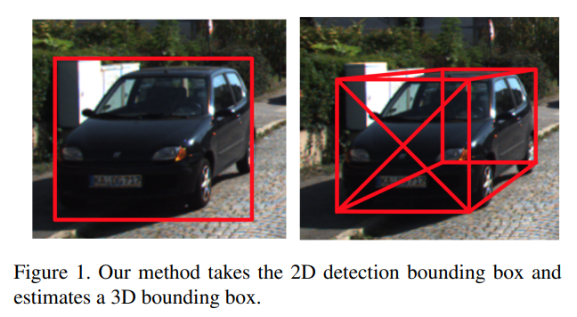

在本文中，作者引入了一种方法，从 2D 检测框和相关像素中来估计目标的 3D 位姿$(R,T) \in SE(3)$。该方法简单有效，适用于比如自动驾驶等现实场景应用，方法的主要贡献在于回归参数和相关目标函数的选择。

首先回归出目标的朝向和目标维度，再结合这些几何约束生成最终的 3D 位姿估计。对比以前的工作都是尝试直接回归出位姿。SOTA 的检测网络用于训练一个 CNN 来回归目标的 3D 朝向和尺度。获得这些目标的朝向和尺度估计以及 3D 检测框投影到 2D 检测框的严格约束，从而恢复出目标的 3D 检测框以及位置信息。

尽管方法简单，但是该方法引入了几个重要思想：引入 MultiBin 离散-连续模型来对回归建模，明显优于传统的 L2 loss。并且通过 3D 尺度来约束目标的 3D 框被证明非常有效且准确，从而得到稳定的 3D 检测框估计。

在 KITTI 和 Pascal 3D+ 数据集上评估了本方法的性能。在 KITTI 数据集中，将估计的 3D 边界框与其他 SOTA 的 3D 物体检测算法的结果进行了深入对比。KITTI 官方基准测试仅评估 3D 边界框的方向估计精度，为此作作者引入了三项新的性能指标来全面衡量三维边界框的准确性：**边界框中心点距离误差、最近边界框面中心距离误差，以及通过三维交并比（3D IoU）计算的边界框整体重叠度**。实验证明，在充足训练数据条件下，方法在上述所有三维指标上均优于当前 SOTA 方法。

由于 Pascal 3D+ 数据集未标注物体物理尺寸且相机内参为近似值，仅评估了视角估计精度，结果表明本研究的 MultiBin 模块在该任务上同样达到了 SOTA 水平。

因此，研究的主要贡献包括：

1. 提出了一种**基于 2D 边界框估计物体完整 3D 位姿和尺寸**的方法，该方法利用投影几何约束，结合深度卷积神经网络回归的物体朝向和尺寸估计。相较于其他方法，该方法无需任何预处理阶段或 3D 物体模型；
2. 设计了一种名为 **MultiBin** 的新型离散-连续混合 Loss CNN 架构**用于物体朝向估计**；
3. 针对 KITTI 数据集提出了三项超越方向估计精度的三维边界框评估指标；
4. 通过实验验证了方法在 KITTI 车辆检测上的有效性，同时揭示了 3D 位姿估计框架中回归参数特定选择的重要性；
5. 在 Pascal 3D+ 数据集上完成了视角估计性能评估。

### Related Work

基于单幅二维图像中物体实例的六自由度位姿估计这一经典问题，**传统上被视为纯几何学问题——即透视 n 点问题(PnP)**。论文 A 及其引述研究中提供了多种基于图像二维关键点与物体 3D 模型对应关系的闭式解和迭代解法。另一些方法则聚焦于构建物体实例的 3D 模型，继而寻找图像中最匹配该模型的三维位姿。

随着新型挑战性数据集的出现，3D 位姿估计研究已扩展到物体类别层面，这需要同时处理由位姿变化引起的表观差异和类别内部的表观差异。论文 B 采用基于判别性部件模型(DPMs)的物体检测框架，将位姿估计构建为结构化预测问题，其中每个混合成分代表不同方位角区间。然而此类方法仅能预测物体标准坐标系下的欧拉角子集，无法估计物体尺寸和位置。

另一研究路径是**利用 3D 形状模型进行假设采样与优化**。例如 Mottaghi 等对物体视角、位置和尺寸进行采样，继而使用 HOG 特征度量物体三维 CAD 模型渲染图与检测窗口的相似度。论文 C 在机器人桌面场景中探索了类似方法，通过 CAD 模型投影估计位姿，该场景检测难度较低。基于 DPM 检测器获取粗略位姿估计后，通过投影三维模型与图像轮廓的对应关系来优化连续六自由度位姿。相关评估仅在 PASCAL3D+ 或遮挡/尺度变化有限的简单桌面场景中进行。论文 D 将该方法扩展至存在显著遮挡的复杂场景，通过从三维 CAD 模型学习的三维体素模式字典，同时表征物体形状和常见遮挡模式。

近年来，深度卷积神经网络(CNN)显著提升了二维物体检测性能，多项研究进一步扩展至三维位姿估计领域。论文 E 采用 R-CNN 进行物体检测，并将检测区域输入至位姿估计网络。该位姿网络基于 VGG 初始化，利用 Pascal 3D+ 的真实标注数据进行微调。此方法与之前类似，其特点在于为每个类别使用独立的位姿权重，并采用大量带位姿标注的合成图像进行训练。

论文 F 中，Poirson 等将物体视角离散化，训练深度卷积网络联合执行视角估计与二维检测，网络在所有类别间共享位姿参数权重。Tulsiani 等则探索了粗粒度视角估计与关键点检测、定位及位姿估计的协同关系。Pavlakos 等利用 CNN 定位关键点，结合网格生成的 3D 坐标恢复位姿，但该方法需要带关键点标注的训练数据。

在自动驾驶场景的三维边界框检测方面，多项最新研究与本文方法密切相关。Xiang 等将可能物体位姿聚类为视角相关子类别，这些子类别通过先前提出的 3D 体素模式聚类获得，且需要 3D CAD 模型来学习模式字典。这些子类别同时捕捉形状、视角和遮挡模式，并采用深度 CNN 进行判别式分类。Chen 等提出另一种相关方法，在平坦地面约束假设下对物理世界中的 3D 框进行采样，利用高级上下文特征、形状及类别特异性特征进行评分。上述方法均需复杂预处理（包括分割或 3D 形状库等高级特征），可能不适用于计算资源有限的机器人系统。

### 3D Bounding Box Estimation

借助当前成功的 2D 检测工作来实现 3D 检测框估计，作者基于这一假设：3D 检测框的透视投影应该和 2D 检测框紧密贴合。

假设 2D 检测器能够被训练以生成对应 3D 框的 2D 检测框。这个 3D 检测框通过中心点$\mathbf{T} = [t_x, t_y, t_z]^T$，维度$\mathbf{D} = [d_x, d_y, d_z]$和朝向$\mathbf{R}(\theta, \phi, \alpha)$进行角进行描述，这里的朝向角度参数化为$(roll, pitch, yaw)$。假设目标在相机坐标系下的 pose 表示为$(R,T) \in SE(3)$，对应的相机内参矩阵为$\mathbf{X_o} = [X, Y, Z, 1]^T$，3D 带你的投影为$x = [x, y, 1]^T$，以及该目标到图像坐标系的坐标为：

$$
\mathbf{x}=K
\begin{bmatrix}
R & T
\end{bmatrix}\mathbf{X}_o\quad(1)
$$

假设目标的坐标系位置位于检测框的中心，并且目标坐标系$D$已知，那么 3D 检测框的顶点可以表示为$\mathbf{X_1} = [d_x/2, d_y/2, d_z/2, 1]^T, \mathbf{X_3} = [-d_x/2, d_y/2, d_z/2, 1]^T, \cdots, \mathbf{X_8} = [-d_x/2, -d_y/2, -d_z/2, 1]^T$，这个 3D 检测框到图像投影的约束与 2D 检测框密切贴合。比如，假设 3D 点$\mathbf{X_0} = [d_x/2, d_y/2, d_z/2, 1]^T$投影到 2D 检测框的左边$x_{min}$。这个点到边的匹配约束表示如下：

$$
x_{min}=\left(K
\begin{bmatrix}
R & T
\end{bmatrix}
\begin{bmatrix}
d_x/2 \\
-d_y/2 \\
d_z/2 \\
1
\end{bmatrix}\right)_x\quad(2)
$$

其中，$(\cdot)x$表示透视投影的$x$坐标系。类似公式可以通过扩展到 2D 检测框的参数$x_{max}, y_{min}, y_{max}$。2D 检测框可为 3D 检测框提供总共 4 个约束，但是这无法约束 9 个自由度，可以从物体的视觉外观中估计多种几何属性来进一步约束三维边界框，关键在于这些属性必须与视觉特征紧密关联，并能有效限约束最终的三维框参数。

#### Choice of Regression Parameters

对三维边界框影响最显著的首组参数是各轴旋转角度$\mathbf{R}(\theta, \phi, \alpha)$。除角度外，我们选择回归边界框尺寸$\mathbf{D}$而非平移量$\mathbf{T}$，因为尺寸估计的方差通常更小（例如车辆尺寸大致相同），且不随物体朝向变化而变化——这在同时回归角度参数时尤为重要。此外，尺寸估计与特定物体子类别外观紧密相关，若能分类该子类别，则可能准确恢复尺寸。第 5.4 节实验表明，采用平移相关参数的回归方案会导致三维框重建精度下降，这证实了参数选择的重要性。本回归问题采用的 CNN 架构及相关损失函数将在第 4 节讨论。

#### Correspondence Constraints

利用 CNN 回归得到的三维框尺寸和朝向，结合二维检测框，可以求解使重投影误差最小化的平移量$\mathbf{T}$，该误差受限于初始二维检测框约束条件（公式 2）。求解平移量的具体方法详见补充材料最后 **Supplymentary Material**。

二维检测框的每条边可能对应三维框八个角点中的任意一个，因此共存在 $8^4 = 4096$ 种配置组合。每种配置都需要求解一个超定线性方程组，计算过程可并行处理且效率较高。在许多场景中，可假设物体始终保持直立状态。此时，二维框的顶部和底部分别仅对应三维框顶部和底部顶点的投影，将对应关系组合数降至 1024 种。当物体相对横滚角接近零时：

- 二维框垂直边坐标$x_{min}$和$x_{max}$仅对应三维框垂直侧边的点投影
- 水平边坐标$y_{min}$和$y_{max}$仅对应三维框水平侧边的点投影

因此，二维检测框每条垂直边对应$[\pm d_x/2, \cdots, \pm d_z/2]$参数，每条水平边对应$[\cdots, \pm d_y/2, \pm d_z/2]$参数，最终产生 $4^4 = 256$ 种可能配置。在 KITTI 数据集中，由于物体俯仰角和横滚角均为零，配置组合数进一步降至 64 种。

图 2 展示了二维框边与三维框点之间可能存在的部分对应关系。

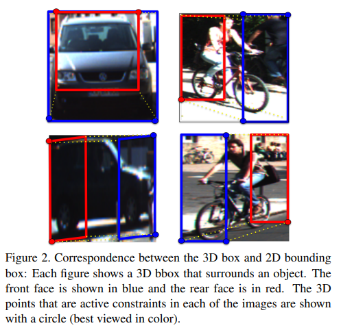

### CNN Regression of 3D Box Parameters

本节讨论作者在 3D 回归框朝向和维度的方法

#### MultiBin Orientation Estimation

只从检测框中估计相机坐标系下目标的朝向信息$R \in SO(3)$是不大可能的，还需要目标在图像平面的位置。这里只考虑旋转$R(\theta)$只有参数 yaw 角$\theta$，如图 4 所示一辆车沿直线运动，尽管其在全局坐标系下的朝向$R(\theta)$没有改变，但是其相对图像坐标系的朝向$\theta_l$相对图像中心改变了，对应的图像检测滑窗也会改变。

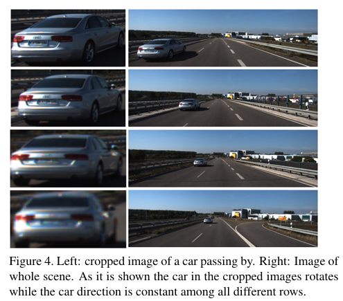

因此需要回归的是图像坐标系下的朝向$\theta_l$，并且图 4 展示了如下规律：局部朝向角$\theta_l$和方位角的变化共同组成了车辆全局朝向的约束。给定内参，特定像素的方位角就可以计算。在推理时，作者将方位角和估计的局部朝向角度相结合从而计算出全局的朝向信息。

已知 L2 loss 难以拟合复杂的多模型回归问题，L2 loss 引导网络最小化平均误差，会导致单个模型的结果很差，这在图像上色问题上已经证明。类似 Faster-RCNN、SSD 等检测算法不直接回归检测框：他们将检测框划分为很多个离散模型，称为锚框，然后估计每个锚框的连续 offsets。

作者使用类似策略称为 MultiBin 用于朝向估计。首先离散化朝向角将其分为$n$个连续的 bin。

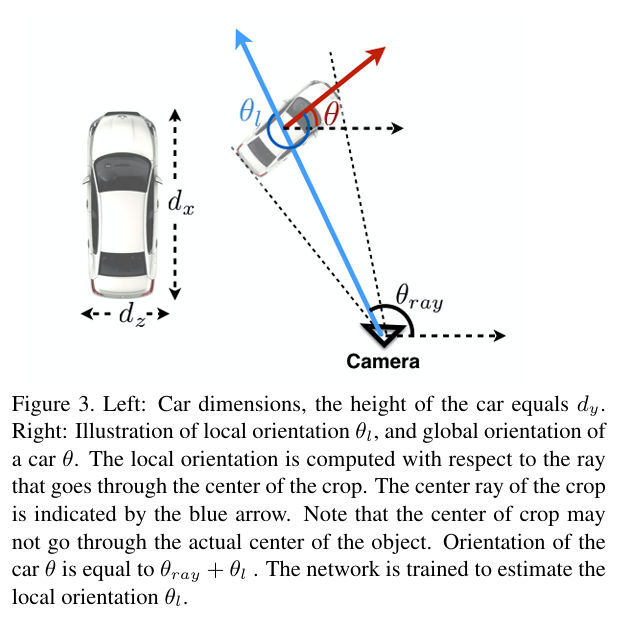

每个 Bin 使用 CNN 估计两个参数，一个表示输出角度在第$i$个 bin 内的置信度$c_i$，以及残差旋转描述中心线到输出角度的偏移量。这个残差旋转包含两个数，即对应的 sin 和 cos 角度。这样每个 bin 会产生 3 个输出：$(c_i, cos(\Delta\theta_i), sin(\Delta\theta_i))$。可以通过 2 维输入使用 L2 norm 层获得有效的正弦和余弦结果。最终的 MultiBin 朝向 loss 的结果如下：

$$
L_{\theta} = L_{conf} + w \times L_{loc}\quad(3)
$$

其中，$L_{conf}$为每个 bin 经过 softmax 的结果，$L_{loc}$表示最小化估计角度和真值角度的残差项，相邻的 bin 之间存在重叠区域。在位置 Loss$L_{loc}$中，所有包含真值角度的 bin 都会最小化与真值的误差，

位置 loss 定义如下：

$$
L_{l o c}=-\frac{1}{n_{\theta^{*}}} \sum \cos \left(\theta^{*}-c_{i}-\Delta \theta_{i}\right) \quad(4)
$$

其中，$n_{\theta^*}$表示包含真值角度$\theta^*$的 bin 数量，$c_i$表示第$i$个 bin 中心的角度和偏移量$\Delta \theta_i$。

在推理过程中，具有最大置信度的 bin 将通过使用估计的$\Delta \theta$作为输出结果。这个 MultiBin 模块包含两个分支，一个用于计算置信度$c_i$，另一个计算$\Delta \theta$的正弦和余弦结果。因此对于$n$个 bin 需要估计 $3n$ 维度的参数。

在 KITTI 数据集中，轿车、厢式货车、卡车和巴士属于不同类别，且各类别实例的物体尺寸分布呈现低方差和独一性。例如，轿车和骑行者的尺寸方差仅为厘米量级。因此，我们直接采用 L2 损失函数，而非前述 MultiBin 损失等离散-连续混合损失。按照标准做法，每个尺寸参数的估计值均相对于训练数据集计算的平均参数值进行残差回归。尺寸估计损失$L_{dims}$的计算公式如下：

$$
L_{dims}=\frac{1}{n} \sum  \left(D^{*}-\bar{D}-\delta\right)^2 \quad(5)
$$

其中，$D^*$表示检测框的真值维度，$\bar{D}$表示某一类别目标的平均维度，$\delta$表示网络预测的相对残差。

参数估计的 CNN 结构如下所示，包含 3 个分支：两个分支有用朝向估计，一个分支用于维度估计。所有的分支都来源于同一个卷积层特征，最终的 loss 可以表示为加权结果：$L = + \alpha \times L_{dims} +  L_{\theta}$

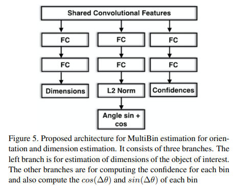

### Experiments and Discussions

#### Implementation Details

在 KITTI 和 Pascal 3D+ 数据集上进行了实验验证。

**KITTI 数据集：**该数据集包含 7481 张训练图像。我们首先训练 MS-CNN 物体检测器生成二维检测框，随后对得分超过阈值的检测框进行三维边界框估计。在三维参数回归任务中，采用去除全连接层的预训练 VGG 网络，并添加如图 5 所示的三维框预测模块。

该模块中，各朝向分支的首个全连接层维度为 256，而尺寸回归分支的首个全连接层维度为 512。训练过程中，真实标注区域被统一缩放至 224×224 像素。为增强网络对视角变化和遮挡的鲁棒性，我们对真实标注框进行了抖动处理，并调整 θl 以补偿裁剪中心射线的位移。此外还实施了随机色彩失真和镜像增强。采用固定学习率 0.0001 的 SGD 优化器，批量大小为 8，训练 20,000 次迭代后通过交叉验证选择最佳模型。图 6 展示了在 KITTI 验证集上对车辆和骑行者的三维框估计效果可视化。

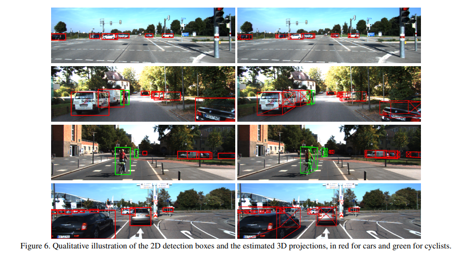

采用两种数据划分方案：第一种使用大部分训练图像以获取官方测试集结果；第二种完全复现 SubCNN 的划分方式（50% 数据用于验证）以确保公平对比。

**Pascal3D+：**该数据集包含 12 类物体的 Pascal VOC 和 Imagenet 图像，均标注有六自由度位姿。使用 Pascal 训练集和 Imagenet 图像进行训练，并在 Pascal 验证集评估。与 KITTI 不同，由于相机内参为近似值，无法还原真实物理尺寸，故仅评估三自由度视角估计以验证 MultiBin 损失的有效性。我们采用 C×3 个 MultiBin 模块预测每类物体的 3 个角度。为与论文 21 公平对比，保留 VGG 的 fc6 和 fc7 层，取消 MultiBin 模块的独立卷积分支，所有输入均通过连接 fc7 的单一全连接层生成，并复用论文 21 的超参数设置。

#### 3D Bounding Box Evaluation

**KITTI 方位角精度：**KITTI 数据集的官方 3D 评估指标是平均方位角相似度（AOS），是 2D 检测器的平均精度（AP）与方位角方向的平均余弦距离相似度的乘积。因此，AP 从定义上讲是 AOS 的上限。在发布时，论文在 KITTI 领先榜上对于简单车辆示例的 AOS 指标排名第一，对于中等难度车辆示例的 AOS 指标在所有非匿名方法中排名第一。

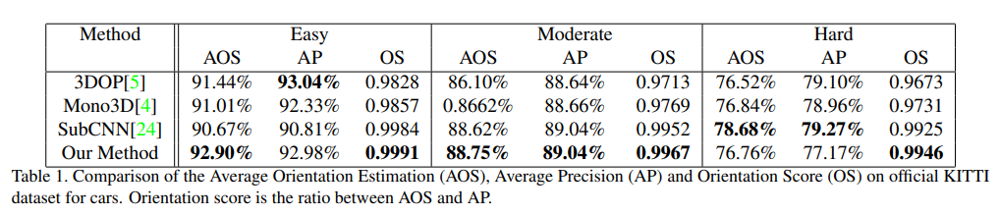

结果总结在表 1 中，表明在汽车朝向估计方面优于所有近期发表的方法。

对于中等难度的汽车，尽管平均精度（AP）相似，但仍优于 SubCNN；

而对于困难样本，尽管平均精度（AP）较低，但仍优于 3DOP。

每个方法的 AOS 与 AP 的比值代表了该方法仅在朝向估计方面的表现，同时排除了 2D 检测器性能的影响。将此分数称为朝向得分（OS），它代表了所有样本的误差（1 + cos(∆θ))/2 的平均值。通过 acos(2 ∗ OS - 1) 公式可将 OS 转换回角度误差，

在官方 KITTI 测试集上，MultiBin 模型在容易、中等和困难汽车上的误差分别为 3°、6° 和 8°。方法是唯一一种不依赖于计算诸如立体视觉、语义分割、实例分割等额外特征，也不需要像论文[24] 和 [23] 那样进行预处理的方法。

**Pascal3D+ 视点精度：**用于视点精度的两个指标是：中位误差（MedErr）和估计值在真实视点 π/6 范围内的百分比（Acc π/6）。旋转之间的距离计算为 ∆(R1, R2)。评估使用的是真实边界框。表 3 显示，MultiBin 模块比离散化分类[21]以及基于关键点的[14]方法更有效，后者基于关键点定位并解决复杂的优化问题来恢复姿态。

**MultiBin 损失分析：**表 4 展示了在 KITTI 和 Pascal3D+ 数据集上，为 Multibox 损失选择不同数量的箱对效果的影响。在两个数据集中，使用超过一个箱始终优于单箱变体，这相当于 L2 损失。在 KITTI 上，使用 2 个箱时性能最佳，而在 Pascal3D+ 上，8 个箱的效果最好。这是由于 Pascal3D+ 数据集中的视角分布更为多样。如表 4 所示，过度分箱最终会降低方法的有效性，因为它减少了每个箱的训练数据量。我们还试验了不同宽度的全连接层（见表 5），发现即使宽度超过 256，进一步增加全连接层的宽度仍能带来一些有限的收益。

**3D 边界框指标和比较：**方向估计损失仅评估 3D 边界框参数的一个子集。为了评估其余参数的准确性，我们引入了 3 个指标，并将我们的方法与 SubCNN 在 KITTI 汽车数据集上进行了比较。第一个指标是估计物体中心 3D 坐标的平均误差。第二个指标是估计 3D 箱体到相机最近点的平均误差。对于需要避免碰撞障碍物的驾驶场景，此指标非常重要。最后一个指标是 3D 交并比（3D IoU），这是利用所有估计 3D 边界框参数的最终指标。为了在并列比较中排除 2D 检测器性能的影响，我们仅保留了两种方法中检测到的 2D 箱体的交并比（IoU）≥ 0.7 的检测结果。如图 8 所示，在所有 3 个指标上，我们的方法均优于当前 SOTA 的 SubCNN 方法。尽管如此，3D IoU 数值仍明显低于 2D 检测器的数值。

**训练数据需求：**本文方法的一个缺点是需要学习全连接层的参数；与使用额外信息的方法相比，它需要更多的训练数据。为了验证这一假设，作者对汽车数据重复了实验，但将训练实例的数量限制在 1100 个。

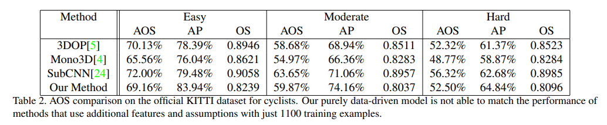

在表 4 中使用 10828 个实例可达到 0.9808 的方法，在相同的测试集上仅能达到 0.9026。此外，作者在官方 KITTI 数据集上的结果明显优于论文 [22] 中的分割（见表 1），因为使用了更多的训练数据。对于 KITTI 自行车骑行者任务也出现了类似的现象。自行车骑行者的实例数量远少于汽车实例数量（1144 个标记的自行车骑行者对比 18470 个标记的汽车）。**因此，没有足够的训练数据来很好地学习全连接层的参数。**尽管作者的纯数据驱动方法在自行车骑行者任务上取得了有竞争力的结果（见表 5.2），但它无法超越使用额外特征和假设的其他方法。

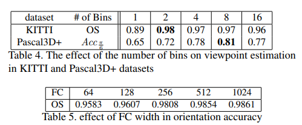

#### Implicit Emergent Attention

本节通过可视化分析网络在准确估计物体朝向时所关注的感兴趣区域。借鉴论文 28 的方法，在图像上滑动小尺寸灰度遮挡块，记录每个位置被遮挡时网络输出朝向与真实值的偏差。当遮挡特定区域导致输出显著变化时，表明该区域是网络的重要注意力区域。如图 9 所示的车辆检测热力图表明，网络主要聚焦于以下判别性部件：轮胎区域、车灯结构、后视镜位置。

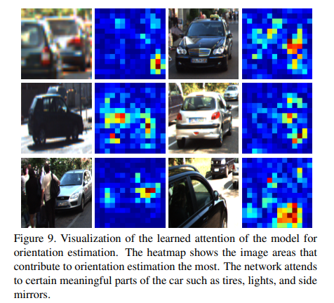

本方法似乎与其他方法的关键点类似，尽管并没有显式地标注关键点信息，仍然学习到了车身的局部特征。另一优势在于网络学习的是任务相关的特征，而非学习人工标注的关键点，这可能不是任务的最优解。

#### Alternative Representation

本节通过对比实验验证 3D 回归参数选择的重要性。

尝试采用替代方案：不直接回归物体尺寸，而是回归三维边界框中心点在图像平面的投影位置。该方法可通过单参数$\lambda$（表示中心点距相机的距离）来描述相机射线上的任意点，结合已知的二维投影中心与物体朝向，理论上可利用二维边界框边与三维框角点间的四个约束关系求解$\lambda$和物体尺寸$(length, width, height)$（共四个未知量）。

尽管该表示方法需回归的参数较少，但对误差更为敏感：**当缺乏物体尺寸约束时，优化过程会优先满足二维检测框约束，可能导致生成的三维尺寸不符合物体实际比例。**

为评估该方法的鲁棒性，我们在保持二维包围框不变的前提下，对真实三维框的中心位置或朝向添加噪声（模拟参数估计误差）。如图 10 所示，重建的三维框虽满足 2D-3D 对应关系，但因方向和中心点的小幅误差导致尺寸出现显著偏差。该实验结果验证了本文三维回归参数选择的合理性。

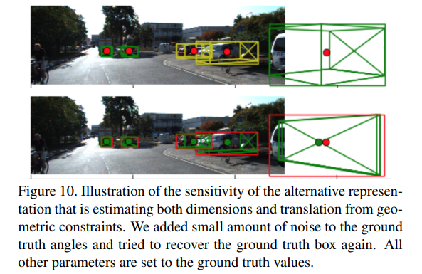

### Conclusions and Future Directions

论文提出了一种基于单目视觉的已知类别物体 3D 边界框重建方法。通过创新性地采用 MultiBin 损失函数进行目标朝向预测，并优化设计边界框维度回归参数，方法无需依赖额外 3D 形状模型或复杂预处理流程，即可实现高稳定性、高精度的三维位姿边界框估计。

未来的研究方向包括以下两个方面：

1. 探索在方法中融合立体视觉计算的**深度通道信息**，以增强 RGB 图像输入的表现；
2. 研究**时序**中的三维边界框估计，通过有效利用时序信息实现物体未来位置与运动速度的预测。

### Supplementary Material

#### Solving for 3D Box Translation

##### 2D Box Constraints

如论文所述，$\mathbf{K}$表示已知的内参矩阵，$\mathbf{R}$为对应的旋转矩阵，$\mathbf{D}$是通过 CNN 回归得到的估计框体尺寸。设二维边界框的垂直边对应三维框的第$i$个角点$\mathbf{X^i_o}$，则该对应关系的约束条件如下：

$$
\left(K
\begin{bmatrix}
I & R\times\mathbf{X_o^i} \\
0 & 1
\end{bmatrix}
\begin{bmatrix}
T_x \\
T_y \\
T_z \\
1
\end{bmatrix}\right)_x=x_{vertical}\quad(1)
$$

唯一未知的参数是$T=[T_x, T_y, T_z]$。类似水平边可以得到如下：

$$
\left(K
\begin{bmatrix}
I & R\times\mathbf{X_o^j} \\
0 & 1
\end{bmatrix}
\begin{bmatrix}
T_x \\
T_y \\
T_z \\
1
\end{bmatrix}\right)_y=y_{horizontal}\quad(2)
$$

公式中的$I$表示 $3 \times 3$ 单位阵

##### Solving the Linear System

对应二维边界框的 4 个边各有一个方程，共 4 个不同方程，用于求解平移参数$T$。将公式(1)和(2)的约束条件重新排列为$Ax=0$的形式，并通过$SVD$分解求解。

#### Equivalence between L2 Loss and Single Bin MultiBin Loss for Angle Regression

本节将证明：当仅使用单个 bin 时，采用 L2 损失的直接角度回归与 MultiBin 损失具有等价性。在下面的表示方法中，角度的 L2 损失等价于单位圆上两个向量之间的欧氏距离。因此，对于真实角度$\theta*$和估计角度$\theta$，其 L2 损失可表示为：

$$
L=\frac{1}{n}\sum_{i}\left(\cos(\theta_{i}^{*})-\cos(\theta_{i})\right)^{2}+\left(\sin(\theta_{i}^{*})-\sin(\theta_{i}))^{2}\right)\mathrm{(3)}
$$

其中，$n$表示 batch size。如果扩展公式(3)可以得到如下：

$$
\begin{aligned}
 & L= & & \frac{1}{n}\sum_{i}\left(\cos(\theta_{i}^{*})-\cos(\theta_{i})\right)^{2}+\left(\sin(\theta_{i}^{*})-\sin(\theta_{i}))^{2}\right) \\
 & = & & \frac{1}{n}\sum_{i}\left(cos(\theta_{i}^{*})^{2}+cos(\theta_{i})^{2}-2cos(\theta_{i}^{*})cos(\theta_{i})\right)+ \\
 & & & \frac{1}{n}\sum_i\left(sin(\theta_i^*)^2+sin(\theta_i)^2-2sin(\theta_i^*)sin(\theta_i)\right) \\
 & = & & 2-\frac{2}{n}\sum_{i}cos(\theta_{i}^{*}-\theta_{i}). \\
 & & \mathrm{(4)}
\end{aligned}
$$

在一个 bin 中，Loss 退化为$L_{loc}$，其只与 cosine 角度差别。
