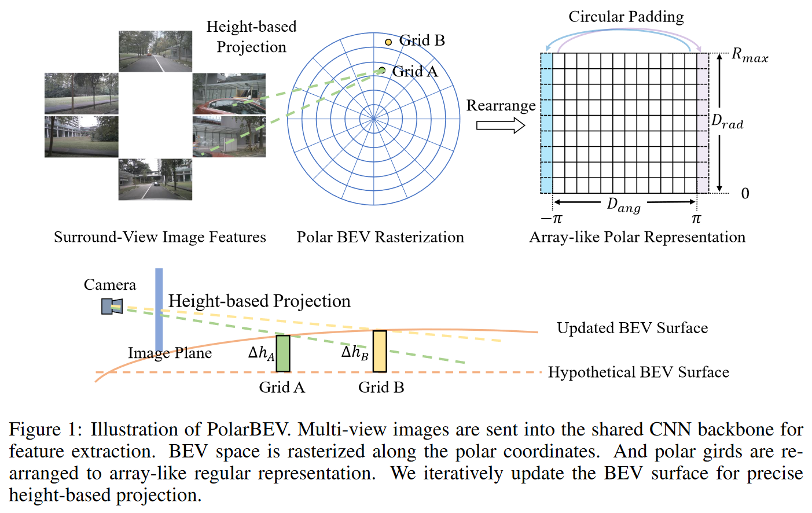
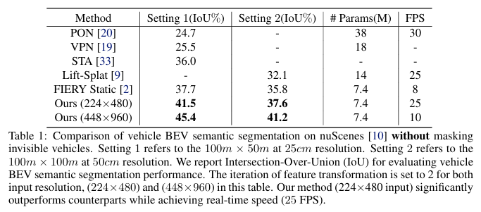
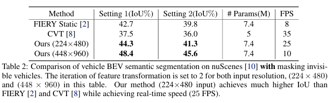
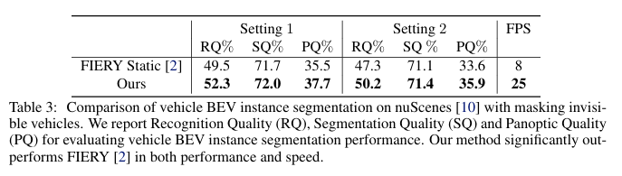
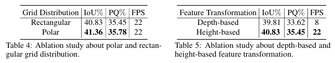
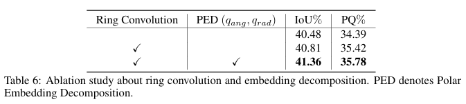
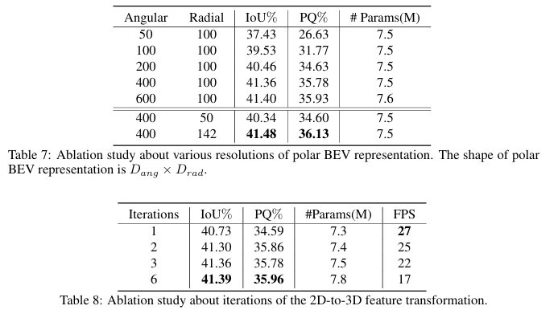
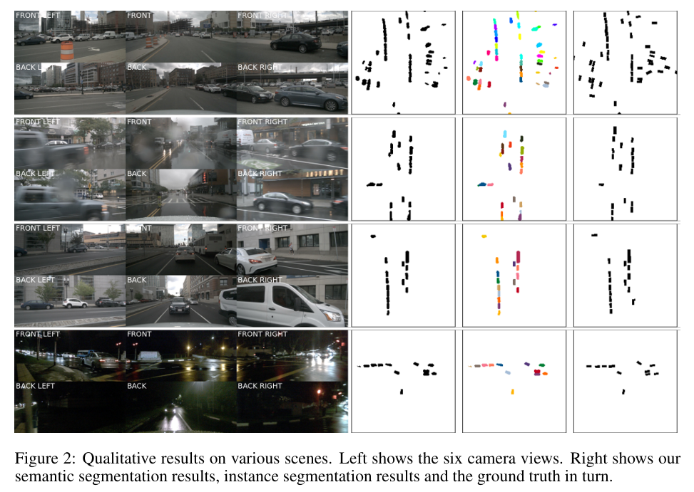
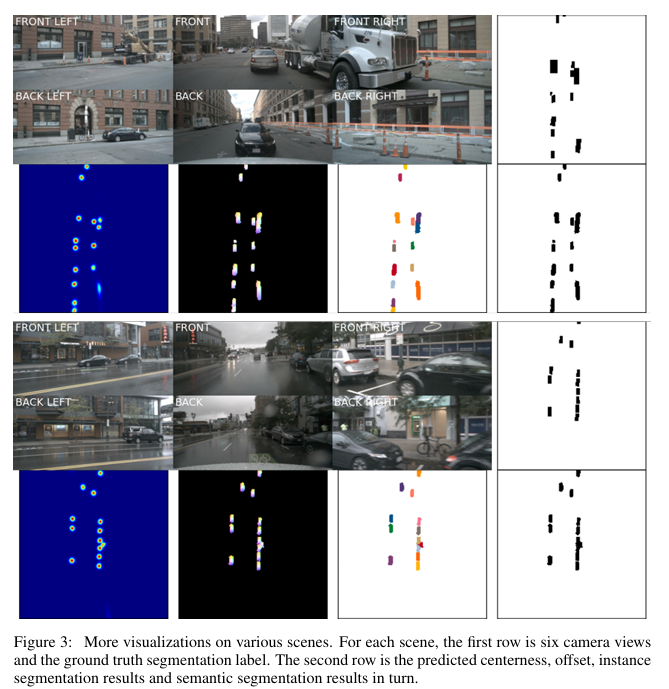
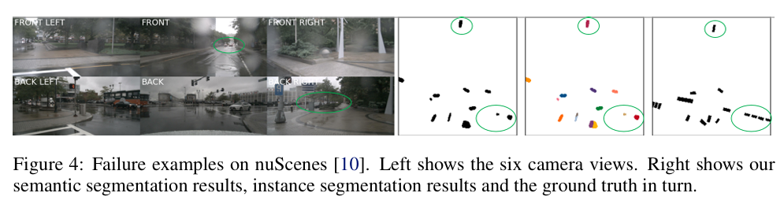

# PolarBEV

## Info

> 论文：[http://arxiv.org/abs/2207.01878](http://arxiv.org/abs/2207.01878)
> github：[https://github.com/SuperZ-Liu/PolarBEV](https://github.com/SuperZ-Liu/PolarBEV)

## Framework

### Abstract

作者提出 PolarBEV 用于不对称的 BEV 表示学习，为了适应相机前缩效应，使用极坐标光栅化将 BEV 空间转化为极坐标表示，引入 polar 嵌入分解方法来建模极坐标网格的关联。极坐标网格重分配为 array-like 的常规表示用于高效处理。此外，为了决定 2D-3D 的匹配，采用 height-based 特征提取。PolarBEV 在 2080Ti 上可实现实时推理，性能优于其他 BEV 语义和实例分割方法

### Introduction

PolarBEV 的优势在于：

1. PolarBEV 的极坐标表示相比于 rectangler 表示能够更好的表示目标距离对于自车的重要性
2. 极坐标是非对称的 BEV 表示，而远距离的 BEV 空间同样要求大量计算负载，极坐标栅格化能够设置距离相关的网格分布，从而降低计算量
3. 作者将目标 3D 位置通过角度和半径-相关的 embeding 到对应的极坐标网格，由于视觉成像的前缩效应，目标的尺度随着距离变化很大，极坐标网格相同距离下的尺度相同，相同角度方向的网格对应相同的 cam view，因此 BEV 表示到极坐标网格表示的呢个给增强 BEV 表示
4. 此外，作者引入迭代表面估计用于高效的 BEV 表示学习，以往的方法通常预测像素级的深度分布，再将像素特征传播到 BEV 空间（即 LSS 的 Lift）作者使用假设 BEV 表面，然后迭代更新极坐标网格的高度，并调整像素与 BEV 网格的 2D-3D 匹配，高度比深度更易估计，迭代增强过程能够有效提升 2D-3D 的特征变换从而获得更好的 BEV 表示
5. PolarBEV 在 2080Ti 上实现实时的推理（25Fps），性能优于当前的 BEV 语义分割和实例分割模型

### Related Work

BEV 表示的一种思路是显式地进行深度估计再将目标转化到 BEV 空间；OFT 使用正交 3D 空间来 map 图像到 BEV 的特征表示，这种问题在于像素特征和目标深度属性无关；LSS 从每个像素获得一个深度分布；FIERY 扩展了 LSS 使用多帧观测进行运动预测。不同于以上方法，作者采用 BEV 表面估计而非深度分布来绝对图像和 BEV 的映射关系。【这里的表面估计是指只估计最近深度，而非 BEV 的深度分布】

另一种方法是直接根据输入图像预测 BEV 输出，CVT 编码相机参数到空间信息，然后隐式的建模场景的空间结构；不同于 CVT 使用全局注意力来更新每个 query，GKT 学习几何先验来引导 transformer 聚焦到核心区域；VED 直接通过前视图像使用改进的 encoder-decoder 网络来预测语义 occupancy 网格；VPN 则是全连接 view 关系来预测语义 BEV map 信息；PON 使用改进的全连接网络来图像特征转换到 BEV 空间；TIM 通过 cross-atten 来建立图像列和 BEV polar 的关系；BEVFormer 预测均一的高度分布并将 anchor 点投影到图像上来获得特征

在 3D 空间，一些方法使用极坐标进行点云分割，从而适应 Lidar 点云分布特性，另一些方法考虑半径对称性来均一化点云在半径上的分布，方法引入极坐标参数化通过对图像和预测结果间建立隐式的关联进行 3D 检测。考虑到视觉的前缩效应和 BEV 感知的特点，作者将极坐标栅格化引入多视图 BEV 表示学习

### Method

#### Overview

PolarBEV 的框架如下：

1. 使用多视图图像作为输入，使用 CNN backbone 提取图像特征
2. 栅格化 BEV 空间为极坐标表示，再将极坐标表示转化为 array-like 的常规表示用于高效计算
3. 迭代更新 BEV 空间的网格的高度估计，再基于估计的高度和相机标定参数，将 2D 特征转换到 BEV 特征，BEV 高度更新和特征变换通过层级变量重复进行
4. BEV 特征使用各种检测头实现不同任务

#### Polar Rasterization and Rearrangement

极坐标表示的 BEV 空间是以自车为中心，满足半径为$R_{max}$，FOV 为 $360 \degree$ 的范围。将 BEV 网格转化为极坐标栅格的流程如下：

1. 对 BEV 空间进行角度和径向栅格化；径向按照分辨率为$D_{rad}$均匀分布到$[0, R_{max}]$范围，角度按照分辨率为$D_{ang}$均匀划分 $360 \degree$
2. 栅格化后为了有效处理极坐标表示，将极坐标网格的角度和半径 remap 到 array-like 的一般表示，维度为$D_{reg} \times D_{ang}$
3. 重映射的表示对于硬件计算更加友好，但无法通过卷积操作，角度范围为$- \pi$到$\pi$对应的角度相同，但是在 array-like 的一般表示中却不连续，因此作者使用带圆形 padding 的 ring 卷积来处理重映射的表示。作者首先在角度方向进行圆形 pad，然后在径向维度使用 0 padding 的卷积操作，ring 卷积使用 batch norm 和 ReLU 激活。

#### Polar Embedding Decomposition

对于每个极坐标网格，预定义可学习的 query 嵌入$q$和分解$q$为两部分，比如径向的 query$q_{rad}$和角度 query$q_{ang}$，并定义如下：

$$
q = q_{rad} + q_{ang}
$$

对于极坐标表示，相同距离的极坐标网格对应的尺度相同，相同角度对应的相机视图位置相同，通过径向和角度嵌入从而对极坐标网格和 BEV 表示的关系，消融实验证明了嵌入和分解的有效性。

#### Iterative Surface Estimation and 2D-to-3D Feature Transformation

为了保证图像特征和 BEV 之间的关联，设置带高度$h_{hypo}$的假想 BEV 表面，并且根据 query 嵌入迭代更新每个网格$i$的高度。以上操作可以描述为：

$$
h^t_i = \Theta(q^{t-1}_i)+h^{t-1}_i
$$

其中，$\Theta$表示 MLP 层，$h_0$表示假设高度$h_{hypo}$。然后使用 sigmoid 函数$\sigma$均一化高度$h_i$到$[0,1]$范围，进一步映射到$[Z_{inf},Z_{sup}]$范围：

$$
z_i = \omega(h_i) \times (Z_{sup} - Z_{inf}) + Z_{inf}
$$

其中，$z_{sup}$和$z_{inf}$表示高度预设的上界和下界。每个网格$i$对应的极坐标坐标系为$p_i = (r_i,\theta_i)$（网格中心点的位置）。而将极坐标坐标系$p$转换到笛卡尔坐标系$(x_i,y_i)$参考如下：

$$
x_i = r_i \times cos\theta_i, y_i = r_i \times sin \theta_i
$$

之后将笛卡尔坐标 concat 对应的高度信息$z_i$来构建同质坐标系$w_i$：

$$
w_i = (x_i,y_i) \oplus z_i \oplus 1
$$

其中，$\oplus$表示 concat 操作。然后将$w_i$通过相机内参$I \in \mathbb{R}^{K \times 3 \times 3}$和外参$E \in \mathbb{R}^{K \times 3 \times 4}$投影到图像平面：

$$
f_i=\sum_{n=1}^KM_n\cdot F_{i,n}
$$

其中，$F_{i,n}$为对应于投影点$p_{i,n}$采样后的图像特征，$M_n$表示二进制 mask，用于过滤掉投影到相机平面外的投影点

通过多次进行表面估计和 2D-3D 特征变换从而迭代地更新极坐标表示

#### Segmentation Head

参考 FIERY，采用较小的 encoder-decoder 来增强 BEV 特征，网络的三个分支分别预测分割 score，offset 和中心度。loss 设计也参考 FIERY，极坐标预测结果重新 map 到矩形表示并基于矩阵的 gt 来计算 loss

### Experiment

#### Experimental Settings

##### Datasets

采用 nuScenes 数据集。参考 Fiery 和 CVT，将车辆的 3D 检测框投影到体面从而获得 gt 标注

##### Architecture

使用预训练之后的 Efficient-B4 作为 backbone 提取多视图特征，步长为 8 的特征将作为特征变换的输入，初始化的 BEV 特征是角度 query 和径向 query 的结合，尺寸设置为 $400 \times 100 \times 64$，表征自车周边$100m \times 100m$的区域，设置最大半径为$R_{max} = 50 \sqrt{2}m$。小型 encoder-decoder 网络包含 RESNet-18 的前 4 层网络，所有卷积层的卷积核对应的卷积核 size 大于 1，转换为 ring conv 用于极坐标表示

##### Training

算法基于 Pytorch 和 Lightning，输入首先 resize 再随机裁剪到特定分辨率，之后送入网络，优化算法选择 AdamW，权重衰减率为 $1e^{-7}$，使用 one-cycle 动态调整学习率。网络采用 8GPU 训练，batch size 为 16

##### Evaluation

车辆语义 map 采用两种设置：

1. 感知范围为 $100m \times 50m$，分辨率为$0.25m$
2. 感知范围为 $100m \times 100m$，分辨率为$0.5m$

使用设置 2 作为消融实验的参考模型，推理模型输入为 $224 \times 480$

#### Performance Comparison

与当前的 BEV 语义分割和实例分割算法对比，所有方法都是单帧而非时序模型

##### BEV Semantic Segmentation

为了公平对比，作者分别对比了不可见和可见的车辆，其中表 1 对比了不可见的车辆。迭代 2 轮的模型大幅优于其他模型，尤其是在 $448 \times 960$分辨率下。对比FIERY，模型在$224 \times 480$分辨率下得分高 $3.8 \%$并且推理速度$ \times 3$倍。当分辨率在$448 \times 960$时，模型性能提升，并且速度更快。

表格 2，作者将 PolarBEV 与其他算法对比了不可见的目标。缺乏 FIERY 官方结果，作者重跑了结果，如表所示，作者基于 $224 \times 480$ 分辨率输入下迭代 2 轮的结果仍然优于其他模型，并且速度接近实时。

##### BEV Instance Segmentation

作者提供了标注为不可见车辆的 BEV 实例分割对比。作者同时复现了 FIERY 的结果，如表所示，迭代 2 轮的模型在 PQ 指标比 FIERY 更高，RQ 表面模型检测精度更高。

#### Ablation study

##### Polar vs. Rectangular Grid Distribution

表格 4 展示了关于极坐标和矩形网格消融实验，矩形网格采用 $200 \times 200$分辨率，极坐标采用$400 \times 100$分辨率，并且网格结构一致。如表所示网格分布在推理速度不降低的情况下实现了 $0.53$的IoU和$0.33$的 PQ 指标提升。

##### Height-based vs. Depth-based Feature Transformation

表格 5 展示了特征转换的消融实验对比。FIERY 基于深度投影转换，作者这里基于 FIERY 增加了基于高度的转换方式，结果表明基于高度转换方法推理速度提升$\times 3$倍，并且 IoU 和 PQ 指标也有明显提升。

该提升主要源于以下几点：每个像素的深度范围是$[0， +\infty)$，因此网络难以在该范围内估计出一个合理值，而 BEV 的高度范围却相对有限，基于高度的转换带来更小的预测误差。对于推理速度而言，FRERY 这种基于深度的方法是将像素特征在深度方法进行广播，再再垂直方向将所有 3D 特征叠加求和，该操作相当耗时，而高度转换相对轻量，推理速度更快。

##### Ring Convolution and Polar Embedding Decomposition

如表 6，作者就 ring 卷积和极坐标 embeding 分解进行了消融实验。基线模型达到了 $40.48 \%$的IoU和$34.39\%$的 PQ 指标，使用 ring 卷积后 IoU 和 PQ 分别提升 $0.33$和$1.03$。为了对极坐标网格相关性建模，作者将网格 embeding$q$分解为角度分量$q_{ang}$和半径分量$q_{rad}$，如最后一行所示，embeding 分解进一步提升了 $0.55$的IoU和$0.36$的 PQ。

##### Polar BEV Resolution

为了分析分辨率如何影响 PolarBEV 的性能，作者分别就角度和半径分辨率进行了消融实验。如表 7 所示，模型的性能随角度分辨率上升，在 $400
$时基本收敛；进一步提升角度分辨率可提升性能有限且增大参数量。考虑性能和内存占用情况，作者选择$400 \times 100$作为默认参数。

##### The Number of Iteration

作者如表 8 做了 BEV 表面估计迭代次数的消融实验。结果表明模型仅 1 轮迭代就取得了 $224 \times 480$的IoU和$224 \times 480$的 PQ 指标，超过所有方法，并且实现实时推理。迭代次数为 2 时，方法指标更高并且保持实时性，之后随着迭代次数上升，FPS 逐渐降低。

##### Qualitative Results

如图为量化结果的部分场景。这里展示了 6 张环视图像结果和对应带真值的语义和实例分割结果。结果表明 PolarBEV 能够在复杂场景下实现精准分割。

更多可视化结果如下：

#### Limitations

作者在如图展示了失效情况，对于远距离目标，PolarBEV 无法准确预测车辆位置，对于遮挡车辆，PolarBEV 也无法准确预测，后续改进方案是引入时序信息。

### Conclusion

作者提出的 PolarBEV 用于 vision-based 的 BEV 表示学习。PolarBEV 通过极坐标栅格化 BEV 空间，创建了非均匀的距离相关的非均匀网格分布。为了建模角度/半径-embeding 到极坐标网格，与以往基于深度的方法，首先设置一个假设 BEV 表面，然后迭代更新每个网格来实现图像到 BVE 网格间的 2D-3D 匹配，最后实验证明 PolarBEV 在分割方面精度和速度更优。
