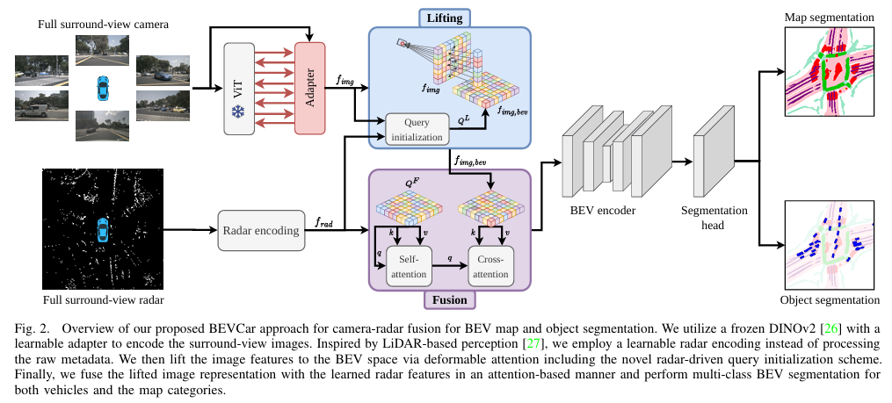
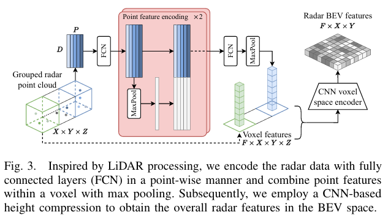
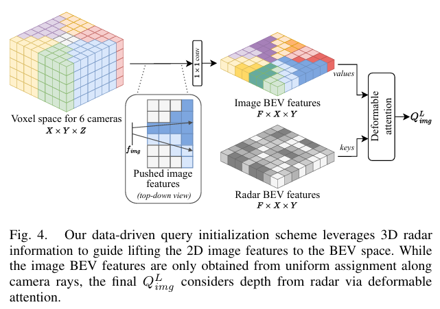
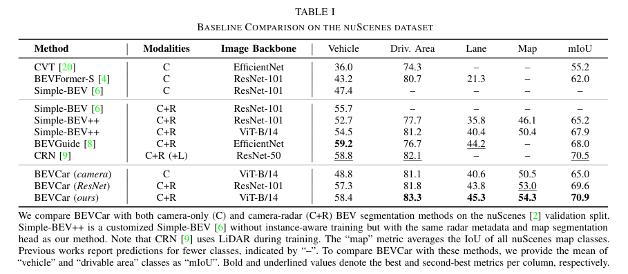
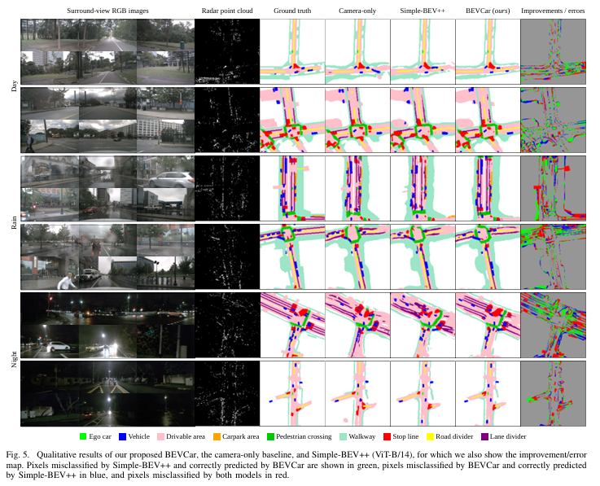
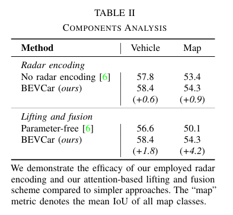
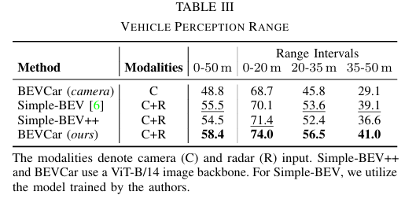
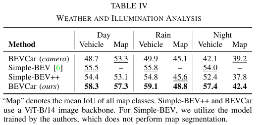
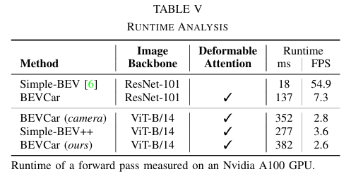

# BEVCar

## Info

> 论文：[https://arxiv.org/abs/2403.11761](https://arxiv.org/abs/2403.11761)
> github：[https://github.com/robot-learning-freiburg/BEVCar](https://github.com/robot-learning-freiburg/BEVCar)

## Framework

### Abstract

通过 BEV 视角进行语义场景分割对于运动机器人进行规划和决策具有重要作用。尽管当前 Vision-Only 方法性能表现已经取得进步，但是仍难以应对下雨或者夜间场景。此时主动传感器提供了一种解决可能，Lidar 高成本是个限制因素。因此将视觉与雷达进行融合是个可行方案但是在之前研究中较少受到关注。

在本文中，作者致力于探索这一领域，提出了 BEVCar，一个新颖的实现 BEV 检测和地图分割的方案。方法的核心是首先学习对雷达进行 point-based encoding，然后将其用于视觉特征到 BEV 空间的转换。作者在 nsScenes 数据集上进行试验表明了算法的 STA 性能。并且表明了与雷达结合能够显著增强环境感知的鲁棒性并提升远距离目标的分割表现。为了主力后续研究，作者提供了数据集中的天气片段以及代码和模型

### Intro

运动机器人比如自动驾驶车辆极其依赖于对环境精确鲁棒的感知。因此，机器人通常搭载了相互补偿的各种传感器。比如环视能够提供稠密的 RGB 图像，Lidar 或者 Radar 能够提供稀疏的深度测量，然而融合这些多模态数据是个挑战。同城方法是将同一帧数据在 BEV 空间进行表示。

Lidar 和 Radar 数据可以直接投影到 BEV 空间，视觉信息需要从图像平面投影到自上而下的 BEV 视角。因此各种投影策略的提出极大的提升了纯视觉的感知性能，有些可以与 Lidar 数据进行结合。尽管 Lidar 提供了高精度的 3D 点云，但是其大规模装备依然因为相对 radar 较高的价格而备受怀疑。然而，cam-radar 融合受到的较少关注，基本采用 Lidar 作为辅助。相比之下，radar 的数据稀疏性导致较少使用。

在本文中，作者强调了 radar 在自动驾驶系统中的重要性。针对 BEV 目标检测和地图分割，在视觉受限场景下 radar 具有独特优势。之前的研究中已经探索了 cam-radar fusion 在 BEV 分割中的作用，但是采用了 Lidar 或者特定 radar 数据进行监督，可能无法适配不同制造商。为了解决这一问题，这座提出了 BEVCar 架构，使用两种 encoder 和注意力模块用于图像升维到 BEV 以及 BEV 空间下的 cam-radar 融合。此外，作者将融合特征送入多任务 head 从而实现目标检测和地图生成，并在 nuScenes 数据集下对模型进行验证，达到了 SOTA 性能，并且在光照不良情况下保持鲁棒。

作者的贡献如下：

1. 引入 BEVCar 框架，使用 cam 和 radar 数据实现目标检测和地图分割
2. 引入新的 atten 方法实现图像升维，即利用稀疏雷达点实现 query 初始化
3. 验证了 learning-based 雷达 encoding 方法优于使用雷达原始数据
4. 对比了 BEVCar 和其他方法在复杂环境下的性能，证明了雷达辅助的优势
5. 开源了处理的白天/夜间/雨天的 nuScenes 数据集以及代码

### Related Work

此部分描述基于 BEV 的 vision-only 方法以及 radar-based 感知方案

**Camera-Based BEV Perception**：当前视觉 BEV 感知方法致力于处理图像空间到 BEV 空间的不匹配问题。现存方法一般使用 encoder-decoder 框架，使用一个独特的 view transform 模块来解决图像到 BEV 空间的投影问题。早期的方法通过各种 encoding 直接将特征 encoding 到 2D 笛卡尔坐标系。对比之前，VPN 使用 MLP 来对图像到 BEV 的位置关系进行建模，Roddick 在此基础上引入了几何模型，具体上是提出了带 pre-sacle 的 transformer 的金字塔占据网络来学习图像每一列到 BEV map 的关系，PoBEV 进一步使用水平和竖直的 transformer 来分别处理对应的特征。

最近的方法可以划分为 lifting-based 方法和 atten-based 方法。前者要么引入一个隐式的深度转换模块再将特征显式投影为 3D 输出结果。而 Atten-based 方法使用 view transformer 实现图像平面到 BEV 空间的转换。TIIM 模型通过在 BEV 空间中的极坐标射线与图像中的垂直列之间施加平面间注意力机制，并结合各自极坐标射线内的自注意力计算，相较于 LSS 等基于深度估计的方法实现了显著的性能提升。

近期的进展还包括：CVT 通过具有可学习位置编码的跨视角变换器规避显式几何建模，并将 BEV 表征应用于策略学习。BEVFormer 和 BEVSegFormer 利用相机标定参数显式建模几何关系，提出基于可变形注意力的空间交叉注意力模块实现视图反投影。BEVFormer 还引入时序注意力模块，借助车辆自运动信息融合多时刻 BEV 特征图，目前代表三维检测 SOTA 水平。BEVVerse 同样采用时序融合，通过增加运动预测头扩展现有方法，并验证了多任务网络凭借任务间正向迁移效应优于单任务网络。上述方法常结合创新性数据增强技术，通过保持各中间嵌入层的空间一致性来解决图像与 BEV 视角差异问题。SkyEye 提出一种弱约束方法，通过重构时序语义图像从标注的前视图像中学习 BEV 语义图。本文借鉴单目 BEV 感知领域最新成果，利用雷达模态实现更符合几何原理的视图投影，通过基于雷达查询的新型注意力式图像提升机制达成目标，同时提出利用对比学习预训练的图像主干网络进一步规范多模态分支。

**Radar-Based Perception**：雷达通过雷达波反射实现目标测距，现有数据集饱和各种雷达，旋转雷达，车载雷达和 4D 雷达，本文致力于车载雷达，雷达作为直接测距的便宜实现，已经有研究致力于提升视觉 3D 感知，ClusterFusion 将雷达融合到图像平面，SparseFusion3D 在图像和 BEV 平面进行融合。

在分割领域，早期研究主要探索无需视觉输入辅助的雷达点云语义分割。近年来，多模态 BEV 地图与目标分割研究日益受到关注。FISHING Net 提出基于多层感知机的图像特征提升策略，通过与 UNet 架构编码的雷达数据进行基于类别的优先级池化融合。与之对比，Simple-BEV 采用栅格化 BEV 格式处理原始雷达数据，并通过双线性采样提升的图像特征进行拼接。虽然该方法针对无关特定目标的车辆分割，但训练过程依赖目标中心点和像素偏移预测的实例信息。鉴于纯拼接式融合可能存在空间错位问题，CRN 采用可变形注意力机制聚合图像与雷达特征，但该方法使用 LSS 进行图像特征提升，且训练时需要激光雷达监督深度分布网络。BEVGuide 则仅利用部署阶段可用信息，通过单应性投影将 EfficientNet 图像主干特征转换为尺度模糊的俯视表征，将雷达数据转化为 BEV 空间后经由两个卷积层编码。与先前工作不同，BEVGuide 提出自底向上的特征提升方法，通过从统一 BEV 空间查询传感器特征获取特定模态嵌入后进行拼接。本文进一步发展这些思路，采用受激光雷达处理 VoxelNet 启发的精细化雷达编码器，并提出创新的特征提升方案，显式利用雷达点云作为强先验信息。

### Technical Approach

作者提出了用于环视相机与车载雷达的 BEV 目标及地图分割方案 BEVCar。如图所示，该方法包含分别针对图像与雷达数据设计了专门的 encoder。通过可变形 atten 将图像特征提升至 BEV 空间，并利用雷达数据来初始化 query。采用以上融合策略后，通过交叉 atten 模块将 lift 后的图像表征与的雷达特征进行融合。最后在 bottleneck 压缩分辨率，通过一个 multi-class 检测头同时完成车辆与地图的分割任务。后续小节将描述实现细节

#### Sensor Data Encoding

**Camera Encoder**：作者选择冻结的 DINOv2 ViT-B/14 来 ending 视觉数据，能够比 ResNet 的 Backbone 提取更多语义信息，参考一般方法，使用可学习权重的 VIT adapter。为了覆盖环视，作者将同一时间戳的$N$张图像组合为$N \times H \times W$的输入，其中$H$和$W$表示图像高宽。后续处理中，ViT adapter 输出$F$个通道的多尺度特征，分为为原始图像的 $1/4，1/8/，1/16，1/32$

**Radar Encoder**：雷达数据作为包含一系列特征的点云处理，作者使用 build-in 的后处理模块将降低处理方法通用性，因此类似 SaprseFusion3D，作者只使用$D$维雷达数据：位置$(x, y, z)$，速度$(v_x, v_y)$和反射率$RCS$。不直接使用原始数据，作者参考 VoxelNet 提出了一个学习雷达特征的方法：首先划分分辨率为$X \times Y \times Z$的 Voxel，与 BEV 空间的分辨率一致，但是高度离散。为控制内存占用并降低高密度 Voxel 带来的偏差，作者对包含超过$P$个点的 Voxel 进行随机采样。如图所示，每个包含原始雷达点均通过点 encoder 模块进行处理。该点特征 encoding 过程不会跨 Voxel 累积信息。随后对每个 Voxel 执行 maxpooling 操作，生成维度为$F$的特征向量。最后通过基于 CNN 的体素空间 encoder 压缩高度维特征，最终输出完整的雷达 BEV 编码器 $f_{rad}$。

#### Image Feature Lifting

参考 learning-based 方法来 lift 视觉特征到 BEV，具体使用 BEVFormer 的可变形 atten 机制，但是在初始化上使用了稀疏的雷达点特征

**Query Initialization：**作者提出的 query 初始化的核心动机就是利用雷达量测作为图像 lift 到 BEV 的初始化过程。如图所示：

1. 首先创建$X \times Y \times Z$的 voxel，对应的 BEV 分辨率为$X \times Y$，高度为$Z$，中心点位于前向 cam。
2. 将每个 voxel 根据 FOV 放到对应 cam 位置
3. 将视觉特征根据视锥射线从 2D 投影到 3D 空间。注意作者这里使用的 $1/8$的视觉特征。如果cam的FOV有重叠，将对应的voxel特征平均。之后再使用$1 \times 1$卷积层将高度压缩生成包含$F$个通道的$X \times Y$的 voxel 网格

注意，此时视觉特征仍然是均匀分布的，没有依赖雷达测距信息。因此作者使用可变形 atten 由稀疏雷达 BEV 特征图，从而得到初始化的$Q^L_{img}$，维度为$F \times X \times Y$.

**Lifting：**这一步将数据驱动的初始化$Q^L_{img}$与带可学习 embeding 结合，实现排列不变且可以学习的 BEV query：

$$
Q^L = Q^L_{img} + Q^L_{pos} + Q^L_{bev}
$$

再使用可变形 atten，得到维度为$X \times Y \times Z$的 3D BEV 空间，从图像中得到视觉 encoding。对比 query 初始化过程，作者在图像平面 sample 而非 BEV 平面。在 6 轮 cascaded transformer 后获得最终的特征图$f_{img,bev}$，其维度与雷达 encoder 维度一致

**Sensor Fusion：**要实现 lifted 图像特征和 encoded 雷达特征融合，作者参考 TransFusion，将雷达和 Lidar 融合的方式，使用可变形 atten 在周围雷达点中 query 图像特征，通过将 encoded 雷达$f_{rad}$、可学习的位置 encoding$Q^F_{pos}$以及可学习 BEV query$Q^F_{bev}$求和可以得到初始化 query：

$$
Q^F = f_{rad} + Q^F_{pos} + Q^F_{bev}
$$

注意，lifted 视觉特征只是作为 cross-atten 过程中的 key 和 val 值。作者总共使用了 6 次 cascade transformer 最终得到多模态的特征，最后将特征通过 ResNet-18 输出作为 BEV 的 encoder

Segmentation Head：这一阶段作者用于单个 multi-class 的 BEV 分割头。具体使用了两个带 Relu 的卷积层，以及一个 $1 \times 1$的卷积层来获得一个目标类别和$M$个地图类别。给定BEV分辨率，分割头最终输出维度为$(M + 1) \times X \times Y$。因此一个像素可以同时获得多个类别的预测类别。

**Object Segmentation：**对于分割目标，作者考虑所有目标类型，包括行人、小车和卡车等。作者认为与实例无关的分割方法在训练阶段不应依赖实例感知信息，因为获取此类信息需依赖额外标注，会降低方法的适用灵活性。为此，仅通过二元交叉熵损失函数对分割头中的目标通道进行监督：

$$
\mathcal{L}_{B C E}=\frac{-1}{N} \sum_{i=1}^{N} \log \left(p_{i, t}\right)
$$

其中，$p_{i,t}$定义为每个像素$i \in [1, N]$满足

$$
p_{i,t}=
\begin{cases}
p_i & \mathrm{if}y_i=1 \\
1-p_i & \text{otherwise.} & 
\end{cases}
$$

binary 的真值$y_i \in {\{0, 1\}}$表示一个像素$i$是否输出车辆类型，对应的预测概率为$p_i$

**Map Segmentation：**地图分割中，大多数工作只分割到了和车道线，作者进一步考虑了斑马线和人行道，为了监督分割头的地图通道，作者设置 loss 为 multi-class 的$\alpha - balanced$中心 loss：

$$
\mathcal{L}_{F O C}=\sum_{c=1}^{C} \frac{-1}{N} \sum_{i=1}^{N} \alpha_{i, t}\left(1-p_{i, t}\right)^{\gamma} \log \left(p_{i, t}\right)
$$

其中，$c \in [1, C]$表示语义分割类别，$\gamma$是一个中心参数用于区分类简单/困难。此外公式中的$\alpha_{i,t}$定义如下：

$$
\alpha_{i,t}=
\begin{cases}
\alpha & \mathrm{if}y_i=1 \\
1-\alpha & \text{otherwise.} & 
\end{cases}
$$

可调节参数$\alpha$用于处理前景-背景不平衡的问题。

### Experimental Evaluation

在本节作者将阐述实验的设计方案，并将 BEVCar 方法与多种 baseline 模型进行对比评估，并通过消融实验系统分析了各模块的贡献，并验证了在恶劣环境下雷达测量数据相较于纯视觉方法的性能优势。

#### **Experimental Settings**

**Dataset and Metrics:** 在 nuScenes 数据集上对 BEVCar 方法进行验证，按照官方划分使用 28,130 个训练样本和 6,019 个验证样本，并将验证集进一步划分为白天（4,449 样本）、雨天（968 样本）和夜间（602 样本）场景，该拆分方案已随代码发布。对于分割任务，作者合并所有子类为一类；而分割任务中涵盖全部可行驶区域、停车区、人行横道、步行道、停止线、道路分隔线和车道分隔线等类别。针对既有研究已涉及的类别，分别报告其 IoU，所有地图类别的平均 IoU 记为"地图"指标。为与预测类别较少的基线方法对比，额外了计算"车辆"与"可行驶区域"IoU 的均值作为"平均交并比"。

**Implementation Details：**遵循相关研究的设定，BEV 网格覆盖自车为中心的 100×100m 区域，离散化为 200×200 个单元。高度维度设置从地面至 10 米范围的 8 个分层，最终生成的 3D 张以前向相机为基准坐标系。训练与推理阶段，根据 Harley 等人的研究结论并适配 ViT 编码器需求，将六路相机图像统一缩放至 448×896 像素。参照该研究公开代码，作者聚合 5 次雷达扫描作为输入。训练过程中心损失参数设置为$\alpha = 0.25, \gamma = 3$。

#### **Quantitative Results：**

作者在表 I 中将 BEVCar 与多种基线方法进行对比，包括相机-雷达融合方案 Simple-BEV、BEVGuide 以及训练阶段依赖激光雷达深度的 CRN。其中仅 Simple-BEV 作者公开了代码。基于该代码开发了增强版 Simple-BEV++：新增 BEV 地图分割任务，移除额外雷达元数据，并取消实例感知损失函数。为验证雷达数据优势，还将 BEVCar 与纯视觉基线 CVT、BEVFormer 及各类变体进行对比。

在纯视觉版本对比中，BEVCar 的相机仅用版在"车辆"类别上较 Simple-BEV(C)基线提升 1.4 IoU，在"可行驶区域"类别较静态版 BEVFormer 提升 0.4 IoU。我们认为这种提升主要得益于 DINOv2 主干网络提供的丰富语义表征。通过作者提出的融合方法引入雷达数据后，车辆分割性能显著提升（+9.6 IoU），地图分割也取得显著进步（+3.8 mIoU）。由此推断，采用雷达的机器人感知系统具有显著性能优势。

在车辆分割任务中，BEVCar 以 2.7 IoU 优势超越 Simple-BEV，与 BEVGuide（差距 0.8 IoU）和 CRN（差距 0.4 IoU）性能相当。需要特别说明的是，CRN 在训练阶段依赖激光雷达学习度量深度。在地图分割方面，BEVCar 在提供更多语义类别信息的同时，所有基线方法均被超越。综合两项任务评估，BEVCar 以相较 BEVGuide 提升 2.9 mIoU、相较 CRN 提升 0.4 mIoU 的成绩全面领先。

进一步将 BEVCar 与前述 Simple-BEV++ 对比。为消除主干网络影响，作者在两种方法中分别集成 ResNet-101 和 DINOv2 ViT-B/14[26]。Simple-BEV++ 的多任务训练机制导致其车辆分割性能较 Simple-BEV 基线有所下降。虽然 DINOv2 主干网络也提升了 Simple-BEV++ 的效果，但 BEVCar 在 ResNet-101（+4.4 mIoU）和 ViT-B/14（+3.0 mIoU）两种主干网络下均保持优势，印证了所提方法的创新性。

如图通过可视化对比进一步验证该结论，展示了 BEVCar 相较 Simple-BEV++ 的改进与误差。作者这里同时呈现了真实 BEV 目标与地图分割标注，以及纯视觉基线、Simple-BEV++ 和 BEVCar 的预测结果。

#### Ablations and Analysis

本节通过消融实验验证各组件效果，并评估其在挑战性环境下的性能表现

**Components Analysis：**针对 BEVCar 的两个核心组件——雷达点云编码方案与雷达驱动的图像特征提升机制进行消融研究，表 II 展示了相较于基于 Simple-BEV 的基线模型的改进效果。首先，与直接使用原始雷达数据相比，采用学习式编码机制使车辆分割和地图分割任务分别提升 0.6 IoU 和 0.9 mIoU。其次，基线方法采用无参数图像特征提升至 BEV 空间，而注意力机制方案在特征提升阶段即融合雷达信息，该设计使车辆分割任务提升 1.8 IoU，地图分割任务提升 4.2 mIoU。

#### Distance-Based Object Segmentation

表 III 展示了 BEVCar、其纯视觉版本、Simple-BEV 及 Simple-BEV++ 在 0-20 米、20-35 米、35-50 米三个距离区间的车辆分割质量。注意，为支持距离分级评估而重新运行官方代码后，Simple-BEV 的整体性能较表 I 略有下降。总体而言，纯视觉基线在不同评估标准下表现差异显著：其在 0-20 米范围的 IoU 与 Simple-BEV 相当，但在 35-50 米范围仅能达到初始性能的一半。虽然所有相机-雷达融合方法都呈现相似趋势，但 BEVCar 的性能衰减最为轻微。实验证明利用雷达测量能有效保持远距离目标分割性能的优势。

#### Robustness to Weather and Illumination

相机与雷达的核心差异除信息互补性（稠密 RGB 数据 vs 稀疏距离速度测量）外，更体现在传感器能量来源的不同。被动传感器（如相机）依赖太阳等外部光源，而主动传感器（如雷达）可自主提供能量。因此被动传感器在雨夜等恶劣光照条件下性能易受影响。作者认为针对这些特殊场景进行专项评估，才能完整认知自动驾驶感知系统的真实性能。

在表 IV、图 1 与图 5 中，依据白天、雨天、夜间环境对 BEVCar 及同等基线模型的感知距离指标进行细分评估。数据显示，纯视觉基线在夜间的车辆分割 IoU 会出现显著下降，而所有 cam-radar 融合方法均能保持稳定性能，其中 BEVCar 表现最佳。另一方面，地图分割 mIoU 在雨天出现下降，夜间进一步恶化，该现象在所有被测方法中普遍存在。结果表明雷达对目标检测最为有益，而对 BEV 建图作用相对有限——这符合预期，因为将平面地图类别从 2D 图像空间映射至 BEV 空间时，深度信息的重要性远低于映射具有明确高度、宽度和深度参数的三维物体。

#### RuntimeAnalysis

表 V 展示了在 Nvidia A100 GPU 上测得的前向推理耗时（不含数据加载与损失计算，取验证集平均值）。最显著的延迟来自可变形注意力机制——该模块同时应用于的特征提升模块与 ViT 适配器。注意，**引入雷达信息并未较纯视觉基线产生明显额外耗时**。此外，nuScenes 数据集中同步关键帧的采集频率为 2Hz

### Conclusion

作者引入了 BEVCar 完成 cam-radar 融合并实现 BEV 地图和目标分割。BEVCar 引入了 learning-based 雷达点 encoding 并将雷达信息用于视觉特征从图像平面到 BEV 空间的 lifting。作者证明了 BEVCar 在检测和分割任务上性能优于之前方法，并且在复杂光照场景下分析了模型性能和各种距离下的感知鲁棒性。结果证明了通过 radar 有助于视觉感知。为了方便后续研究，作者开源了数据集的场景片段以及代码，后续将探讨传感器部分或者完全失效时的鲁棒性问题，比如跨模态的蒸馏学习。
