# MonoFlex

## Info

> 论文：[https://arxiv.org/pdf/2104.02323](https://arxiv.org/pdf/2104.02323)
> github：[https://github.com/zhangyp15/MonoFlex](https://github.com/zhangyp15/MonoFlex)

## Framework

### Abstract

无深度信息的情况下通过单张图像估计目标的 3D 位置是一个挑战性的问题。当前大部分方法都采用相同方法来处理所有目标，而并未考虑目标的差异性，导致遮挡目标表现较差。在本文中，作者提出了一个通过解耦遮挡目标的弹性框架用于 3D 目标深度估计。具体来说，作者将长尾遮挡目标解耦为特征图边缘，并且普通目标不受影响。并且作者将目标深度估计表征为不确定性引导的集成学习方法，直接回归未遮挡目标的深度或通过关键点组求解深度。实验证明作者的方法在中等和困难难度下超过 SOTA 算法 `27%` 和 `30%` 指标并且保持实时性。

### Introduction

3D 目标检测对机器人感知物理世界而言是个不可或缺的前提，并广泛用于自动驾驶和机器人导航。作者这里只聚焦解决单目问题。当前大部分方法依赖于 Lidar 感知或者双目相机来测量深度，增大了系统成本。因此单目 3D 感知成为一个广受关注的方向。单目 3D 测距的最大问题在于不同的目标使用同一的处理方法。比如部分方案使用 FCN 和共享权重来预测目标各种属性的分布。

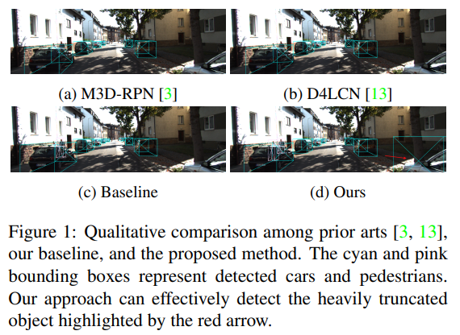

但是作者发现平等处理各种目标将导致性能不佳：

1. 严重遮挡目标难以检出，但是这些目标对于安全驾驶意义重大
2. 经验发现困难样本会增大训练成本并影响目标整体的预测

因此一视同仁的解决方案并不能解决所有 3D 目标的检测和测距问题。作者提出了一个新的检测器，将目标的 3D 属性解耦为中心点和深度来分别处理。

为解决 3D 投影中心问题，作者将目标根据投影中心分为图像内和图像外，对于图像内的目标计算投影中心点，图像外目标使用边缘点作为特征。考虑到卷积网络难以处理空间相关的预测，边缘融合模块用于解耦特征学习和预测图像外目标。

为估计目标深度，作者提出了处理结合不确定性的深度估计方法，包含直接估计和基于关键点的几何估计。基于关键点估计往往是个冗余问题，作者将关键点划分为$M$组，每组都足以求解深度，为了整合$M$组关键点估计器和直接估计，作者建模了对应的不确定性作为权重，这样就可以灵活的输出合适的估计器输出鲁棒和准确的结果。

KITTI 数据集实验表明方法超越其现有他方法，尤其是中等和复杂样本中。论文的主要贡献在于：

1. 揭示了解耦和单独预测遮挡 3D 目标的重要性
2. 提出了深度估计方法，利用相互独立的预测器来处理深度不确定性

### Related Work

#### Monocular 3D object Detection

考虑到从二维图像感知三维环境的困难，大多数现有的单目三维目标检测方法都利用额外信息来简化任务，包括预训练的深度估计模块、标注的关键点和 CAD 模型。Mono3D 首先基于地面先验采样候选区域，并利用语义/实例分割、上下文信息、物体形状和位置先验对其进行评分。MonoPSR 估计实例点云，并强制物体外观与投影点云之间的对齐以进行候选区域优化。Pseudo-LiDAR 通过估计深度将单目图像提升为伪激光雷达点云，然后利用基于激光雷达的检测器。AM3D [31]提出了一个多模态融合模块，用颜色信息增强伪激光雷达。PatchNet 将伪激光雷达组织成图像表示形式，并利用强大的二维 CNN 来提高检测性能。尽管这些利用额外信息的方法通常能取得更好的性能，但它们需要更多的标注数据进行训练，且通常泛化能力较差。

其他纯单目方法仅利用单张图像进行检测。Deep3DBox 提出了用于方向估计的 MultiBin 方法，并利用二维边界框的几何约束来推导三维边界框。FQNet 测量投影的三维候选区域与物体之间的拟合程度，从而选出拟合最佳的候选区域。MonoGRNet 利用稀疏监督直接预测物体的深度，并结合早期特征来细化位置估计。M3D-RPN 使用三维区域提议网络解决了该问题，并提出了深度感知卷积层来增强提取的特征。MonoPair 考虑了相邻物体之间的成对关系，将其作为空间约束来优化检测结果。RTM3D 预测三维边界框的投影顶点，并通过非线性最小二乘优化求解三维属性。现有方法大多忽略物体间的差异，或仅考虑一般的尺度变化，这可能导致在预测分布外的物体时性能下降。相比之下，作者的工作明确地对具有长尾分布的严重截断物体进行解耦以实现高效学习，并通过自适应地组合多个深度估计器来估计物体深度，而不是对所有物体使用单一方法。

#### Uncertainty Estimation

在贝叶斯建模中通常研究两种主要的不确定性。认知不确定性描述模型参数的不确定性，而偶然不确定性可以捕捉观测噪声，其在目标检测中的应用已在一些方法中探索。Gaussian YOLO 对预测的二维边界框的不确定性进行建模以修正检测分数。方法 2 将边界框预测为高斯分布，并将回归损失公式化为 KL 散度。MonoPair 使用不确定性为预测的三维位置与成对约束之间的后优化提供权重。作者对来自多个估计器的估计深度的不确定性进行建模，用于量化它们对最终组合预测的贡献。

#### Ensemble Learning

集成学习通过策略性地生成多个模型并组合它们的预测以获得更好的性能。传统的集成方法包括 bagging、boosting、stacking、门控网络等。集成学习通常假设学习器具有相同的结构，但使用不同的样本或初始化进行训练，而我们的多个深度估计器以各自不同的方式运行，并且也受到截然不同的损失函数的监督。作者这里提出将组合为所有预测的不确定性引导的平均值。

### Approach

#### Problem Statement

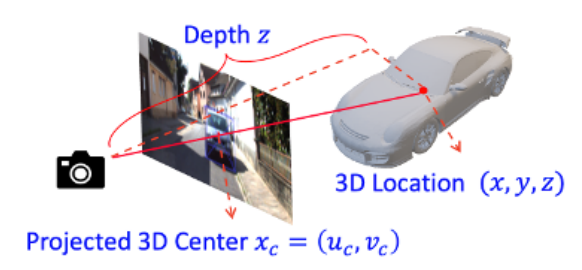

3D 目标检测问题包括位置$(x, y, z)$、尺度$(h, w, l)$和朝向$\theta$属性，这些属性可以直接通过外观相关的信息推理，3D 位置可以转化为投影的 3D 中心$\mathbf{x_c} = (u_c, v_c)$和目标深度$z$如下：

$$
x= \frac{(u_c - c_u)z}{f}, y = \frac{(u_c  - c_u)z}{f}
\quad(1)
$$

其中$(c_u, c_v)$为相机内参中的主点，$f$为焦距。下面将整个问题解构为独立的任务分别讨论。

#### Framework Overview

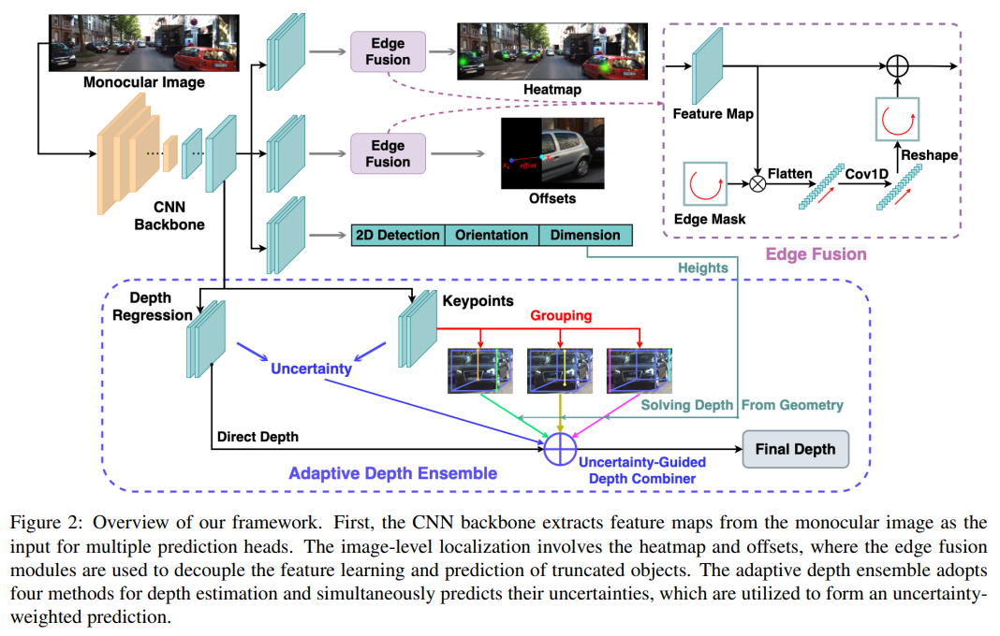

如图，框架基于 CenterNet，目标基于关键点和热力图进行检测。共享 backbone 之后的多个预测分支用于回归目标的属性，包括 2D 检测框，尺度，朝向，关键点和深度。最终的深度预测是回归深度和关键点及尺度估计的深度的不确定性引导结合。作者设计了正常和遮挡目标解耦特征点并将其引入视觉属性回归，最后进行深度集成。下面分别论述细节。

#### Decoupled Representations of Objects

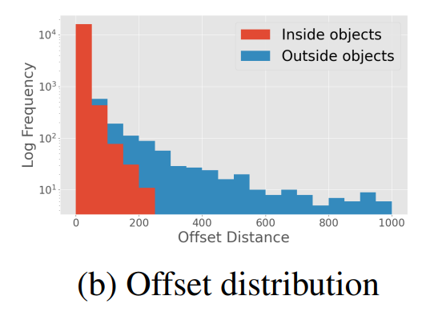

已有方法利用统一的$\mathbf{x_r}$，2D 检测框$\mathbf{x_b}$来表示所有目标，对应的偏移量$\mathbf{\delta_c} = x_c - x_b$用于回归投影的 3D 目标。作者根据投影的 3D 位置是否位于图像将目标分为两类。考虑两组数据的差异性，偏移量$\mathbf{\delta_c}$如图所示，联合学习$\mathbf{\delta_c}$可能受到长尾问题影响，因此作者选择解耦两种目标然后分别学习图像内和图像外目标。

**Inside Objects：**对于 3D 投影位于图像内目标，可以直接回归$\mathbf{x_r}$从而避免回归异常的$\mathbf{\delta_c}$。尽管由于 CNN backbone 网络的采样率$S$仍然需要回归离散误差$\mathbf{\delta_{in}}$，但是相比$\mathbf{\delta_c}$更容易回归：

$$
\delta_{in}= \frac{\mathbf{x_c}}{S} - \lfloor\frac{\mathbf{x_c}}{S}\rfloor
\quad(2)
$$

参考 CenterNet 使用$\mathbf{x_r}$位置的椭圆高斯核生成真值热力图。

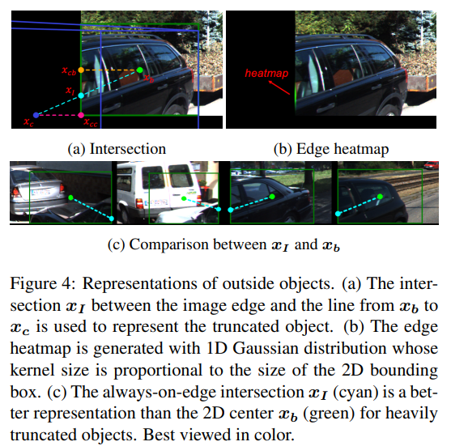

**Outside Objects：**为了解耦图像外目标，作者提出了通过图像边缘和$\mathbf{x_b}$到$\mathbf{x_c}$的连线得到的相交位置$\mathbf{x_I}$来判断遮挡，并且更具有物理意义。对$\mathbf{x_I}$的预测通过边缘热力图可以实现，表现为一维高斯核，如图 4(b)。对比图 4(c)常用的方法只能处理图像内的检测框导致视觉位置$\mathbf{x_b}$可能与其他车辆混淆。而使用相交位置$\mathbf{x_I}$边缘热力图能够专注图像外目标并提供强的边界先验方便定位。因此作者将回归的位置偏差定义如下：

$$
\delta_{out}= \frac{\mathbf{x_c}}{S} - \lfloor\frac{\mathbf{x_I}}{S}\rfloor
\quad(3)
$$

**Edge Fusion**：尽管在输出特征的内部区域和边缘区域中，内部和外部物体的表示已经被解耦，但共享的卷积核仍然难以处理空间变化的预测。因此，作者提出了一个边缘融合模块，以进一步解耦外部物体的特征学习和预测。如图 2 右侧所示，该模块首先提取特征图的四个边界，并按顺时针顺序将它们拼接成一个边缘特征向量，然后通过两个一维卷积层进行处理，以学习截断物体的独特特征。最后，处理后的向量被重新映射回四个边界，并加到输入特征图上。当应用于热图预测时，边缘特征可以专门用于预测外部物体的边缘热图，从而使内部物体的定位不受干扰。对于回归偏移量，如图 3(b)所示，$\mathbf{\delta_{in}}$ 和 $\mathbf{\delta_{out}}$之间显著的尺度差异可以通过边缘融合模块得到解决。

**Loss Func：**一般方法使用 Focal loss 来处理热力图预测，作者使用$L1$loss 来回归$\mathbf{\delta_{in}}$ ，使用 log 的 L1 loss 回归 $\mathbf{\delta_{out}}$，因为对异常值数据更加鲁棒，对应 loss 如下：

$$
L_{off}= \begin{cases} | \mathbf{\delta_{in}} - \mathbf{\delta_{in}^*}| \quad \text{if inside} \\ \log(1 + |\delta_{out} - \delta_{out}^*|)  \quad
 \text{otherwise} \end{cases}
\quad(4)
$$

其中$\mathbf{\delta_{in}}$ 和 $\mathbf{\delta_{out}}$表示预测，$\mathbf{\delta_{in}^*}$ 和 $\mathbf{\delta_{out}^*}$表示真值，注意对于图像内和图像外目标的$L_{off}$是分别平均的。

#### Visual Properties Regression

视觉属性的回归可以拆分为 2D 检测框，尺度，方位和关键点如下：

**2D Detection：**作者使用 FCOS 来回归 2D 检测框。定义坐上坐标为，右上坐标为，那么回归目标定义如下：

$$
\begin{aligned}
l^* = u_r - u_1, r^* = u_2 - u_r, \\
t^* = v_r - v_1, b^* = v_2 - v_r,
\end{aligned}
\quad(5)
$$

考虑到尺度鲁棒性，$GIoU$ loss 用于 2D 检测回归

**Dimension Estimation：**考虑到每个类别内物体尺寸的方差较小，尺度回归相对于统计平均值的相对变化，而不是绝对值。对于每个类别$c$ ，训练集的平均尺寸记为 $(\bar{h_c}, \bar{w_c}, \bar{l_c})$。假设回归得到的尺寸对数尺度偏移量为 \(  $(\delta_h, \delta_w, \delta_c)$，而真实尺寸为  $(h^*, w^*, l^*)$，则用于尺寸回归的 L1 损失定义为：

$$
L_{off}= \sum_{k \in \{h,w,l\}}|\bar{k}e^{\delta_k} - k^*|
\quad(6)
$$

**Orientation Estimation：**方向既可以表示为相机坐标系下的全局方向，也可以表示为相对于观察方向的局部方向。对于一个位于 $(x,y,z)$的物体，其全局方向 $r_y$ 与局部方向 $\alpha$满足关系式：

$$
r_y = \alpha + arctan(x/z)
\quad(7)
$$

如图所示，具有相同全局方向但不同视角的物体，会呈现出不同的局部方向和视觉外观。

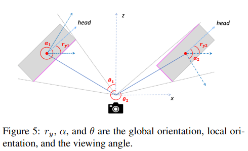

作者参考 3D DeepBox 选择使用 **MultiBin loss** 来估计局部方向。该方法将方向范围划分为$N_o$个重叠的区间，使网络能够确定物体位于哪个区间内，并估计相对于该区间中心点的残差旋转。

**Keypoint Estimation：**如图 6 所示，为每个物体定义了$N_k = 10$个关键点，包括三维边界框 8 个顶点的投影$\{k_i,i=1,\dots,8\}$、底部中心点 $k_{9}$和顶部中心点 $k_{10}$。

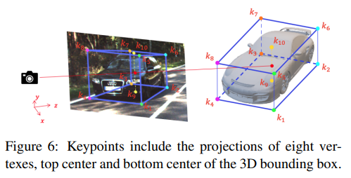

这里使用$L_1$损失回归从代表点 $x_r$ 到这 $N_k$个关键点的局部偏移量 $\{\delta_{k_i} = k_i - x_r,i=1\dots N_k\}$：

$$
L_{key}= \frac{\sum^{N_k}_{i=1}I_{in}(k_i) |\delta_{k_i} - \delta^*_{k_i}|}{\sum^{N_k}_{i=1}I_{in}(k_i)}
\quad(8)
$$

其中 $\delta^*_{k_i}$是真实偏移量，$I_{in}(k_)$ 表示关键点$k_i$是否在图像内部。

#### Adaptive Depth Ensemble

作者将物体深度的估计问题转化为 $M + 1$个独立估计器（包括直接回归和从关键点得出的 $M$个几何解）的自适应集成任务。首先介绍这些深度估计器，然后阐述如何利用不确定性将它们结合起来。

**Direct Regression：**直接回归物体深度，遵循如下方法，利用逆 sigmoid 变换将网络无限制的输出 $z_o$转换为绝对深度$z_r$：

$$
z_r = \frac{1}{\sigma(z_o)} - 1, \sigma(x) = \frac{1}{1 + e^{-x}}
\quad(9)
$$

为了联合建模回归深度的不确定性，采用改进的 L1 损失进行深度回归：

$$
L_{dep}= \frac{|z_r - z^*|}{\delta_{dep}} + \log(\delta_{dep})
\quad(10)
$$

其中，$\sigma_{dep}$是回归深度的不确定性。当模型对其预测缺乏置信度时，会输出一个较大的 $\sigma_{dep}$，从而减小 $L_{dep}$。而 $\log(\sigma_{dep})$这一项可以避免平凡解，并鼓励模型对其准确的预测保持乐观。

**Depth From Keypoints：**在已知相机矩阵的情况下，可以利用像素高度与估计物体高度之间的相对比例来计算物体深度。基线模型中，预测尺寸的相对误差在高度、宽度和长度上分别为 5.2%、6.1% 和 11.8%。因此，通过高度来求解深度不仅独立于方向估计，而且受尺寸估计误差的影响也较小。

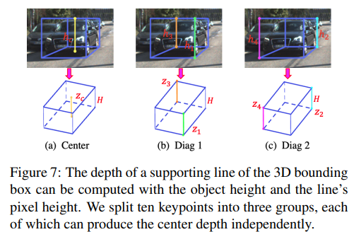

如图 7 所示，估计出的 9 个关键点构成了三维边界框的 5 条垂直支撑线。每条垂直线的深度 $z_l$可以根据其像素高度 $h_l$ 和物体高度$H$计算得出，如公式所示：

$$
z_l = \frac{f \times H }{h_l}
\quad(11)
$$

其中 $f$是相机的焦距。中心垂直线的深度$z_c$ 正是物体的深度，而对两条对角垂直边（即$z_1$ 和 $z_2$ 或 $z_3$和 $z_4$的深度取平均也可以得到物体深度。因此，估计出的 9 个关键点被分为三组，分别生成独立的深度，分别记为中心深度 $z_c$、对角深度 $z_{d_1}$和对角深度 $z_{d_2}$。为了进一步监督由关键点计算出的深度，并对其不确定性进行建模，作者采用带不确定性的$L_1$损失，具体如下：

$$
L_{kd}= \sum_{k \in \{c,d_1,d_2\}} \left[ \frac{|z_k - z^*|}{\sigma_k} + I_{in}\log(\sigma_k)\right]
\quad(12)
$$

其中$z^*$是真实深度值，$I_{in}(z_k)$表示用于计算 $z_k$的所有关键点是否都在图像内部。对于由不可见关键点计算出的 “无效” 深度，移除其对数不确定性项，使模型能够完全悲观，从而在集成时降低这些深度的权重。注意还限制这些无效深度的梯度仅用于更新不确定性。

**Uncertainty Guided Ensemble：**算法从 $M +1$ 个独立的估计器中得到了 $M +1$ 个预测深度 $\{z_i, i=1,\dots,M + 1\}$ 及其对应的不确定性 $\{\sigma_i,i=1,\dots,M+1\}$。作者提出计算不确定性加权平均，即软集成，如公式 (13) 所示：

$$
z_{soft}= \left( \sum^{M+1}_{i=1} \frac{z_i}{\sigma_i} /\right) / \left( \sum^{M+1}_{i=1} \frac{1}{\sigma_i} /\right)
\quad(13)
$$

软集成可以将更多的权重分配给那些置信度更高的估计器，同时对潜在的不准确的不确定性具有鲁棒性。还考虑了硬集成，即选择具有最小不确定性的估计器的输出作为最终的深度估计。这两种集成方式的性能将在第 4 节中进行比较。

**Integral Corner Loss：**参考其他论文，多个子任务的单独优化无法确保不同组件之间的最佳协同。因此作者利用 L1 损失对预测的三维边界框的 8 个角点坐标$\{ \mathbb{v}_i = (x_i,y_i,z_i), i=1,\dots,8\}$进行监督，这些角点由估计的尺寸、方向、偏移量和软深度$z_{soft}$共同构成：

$$
L_{corner}= \sum^8_{i=1} |\mathbb{v_i} - \mathbb{v^*_i}|
\quad(14)
$$

### Experiments

#### Implementation Details

算法在 KITTI 数据集上进行评估，检测结果按照三个难度等级进行评估：简单、中等和困难，这些等级根据边界框高度、遮挡程度和截断程度进行定义。所有报告的结果均来自联合检测多类别（包括汽车、行人和骑行者）的模型。

算法采用与 CenterNet 相同的改进版 DLA-34 作为骨干网络。所有输入图像均填充至统一尺寸 `384×1280`。连接至骨干网络的每个预测头由一层 `3×3×256` 卷积层、批归一化、ReLU 激活函数以及另一层 `1×1×co` 卷积层构成，其中 `co` 为输出通道数。边缘融合模块采用类似配置，但使用一维卷积层并根据经验移除了 ReLU 激活函数。对于 MultiBin 损失函数，使用四个以 `[0, π/2, π, -π/2]` 为中心的角度区间。模型训练采用 AdamW 优化器，初始学习率为 `3e-4`，权重衰减为 `1e-5`。作者在单块 RTX 2080Ti GPU 上以批量大小 7 训练模型 `34,000` 次迭代，学习率在第 `22,000` 次和第 `30,000` 次迭代时降至十分之一。随机水平翻转作为唯一的数据增强方法被采用。

#### Evaluation Metrics

检测性能通过 3D 边界框的平均精度（AP3D）进行评估。对于验证集，作者同时报告 `AP3D|R11和AP3D|R40` 两个指标，以便与先前研究进行全面对比。对于测试集，作者报告测试服务器提供的 `AP3D|R40` 结果。AP3D 计算中使用的 IoU 阈值设定为：汽车类别 `0.7`，行人及骑行者类别 `0.5`。

#### Quantitative Results

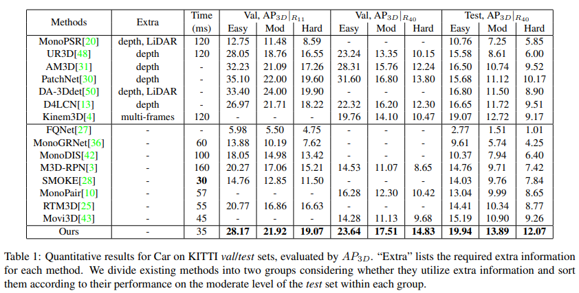

在表中，对所提方法与现有技术在 KITTI 基准的验证集和测试集上（针对汽车类别）进行了全面比较。在没有使用任何附加 trick 的情况下，算法超越了所有仅使用单目图像作为输入的先前方法。在验证集的 `AP3D|R40` 指标上，算法在三个难度级别上分别比第二名 MonoPair 高出 `45%`、`42%` 和 `42%`。在测试集上，提出的方法超越了所有现有方法，包括那些使用额外信息的方法。在困难样本上的显著改进表明，方法能有效检测严重截断的物体，这对实际应用至关重要。

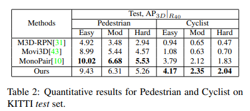

在表 2 中，展示了行人和骑行者类别在测试集上的结果。方法超越了 M3D-RPN 和 Movi3D，同时与 MonoPair 取得了相当的性能。最后，方法在速度上也远快于大多数现有方法，能够实现实时推理。总而言之，作者提出的框架在性能与延迟之间实现了最佳的平衡。

#### Ablation Study

##### Decoupled Representations

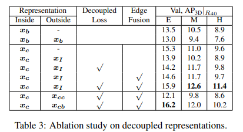

在表 3 中，比较了针对图像内物体与图像外物体的不同表征方法，并验证了分离偏移损失（即解耦损失）以及边缘融合模块带来的改进。以 xb 表征所有物体的第二行被视为基准方法。所有模型均采用直接回归物体深度的方式，未使用集成策略。作者发现：

1. 与基准方法相比，直接丢弃图像外物体能提升性能，这证明了解耦图像外物体的必要性。
2. 将图像内物体标识为其投影 3D 中心 xc 优于 2D 中心$x_b$，这可能是因为从$x_b$到$x_c$的偏移量不规则且难以学习。
3. 对图像内外物体偏移量进行解耦优化以及边缘融合模块，对于中等和困难样本（包含严重截断物体）的性能提升至关重要。
4. 与通过将 xc 和 xb 截断至图像边缘得到的 xcc 和 xcb（如图 4(a)所示）相比，我们提出的交点 xI 是表征图像外物体更有效的表示方法。

##### Object Depth Estimation

在表 4 中，作者比较了不同的物体深度估计方法。"直接回归"指代表 3 中采用解耦表征方式的最佳模型（但未预测关键点）。"关键点"方法将深度分支替换为关键点预测，并按照第 3.5 节的几何原理求解物体深度。直接回归的深度性能略优于基于关键点的求解方法。引入不确定性估计显著提升了两种方法的性能，因为这使得模型能够忽略难以处理的异常值，而专注于大多数中等难度物体。相比之下，我们的自适应深度集成方法同时执行两种预测，并通过不确定性引导的权重进行融合，其性能明显超越所有单一方法

##### Depth Combination

| 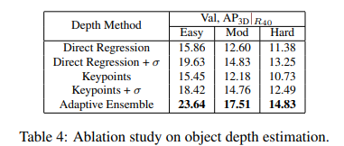 | 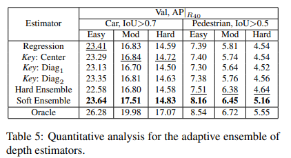 |
| ------------------------------------------- | ------------------------------------------- |

为进一步理解所提出的深度集成方法的有效性，在表中比较了各独立估计器与集成模型组合深度的性能。与表 4 的结果相比，联合学习持续提升了每个深度估计器的性能，这可能归因于增强的特征学习。通过软集成获得的组合深度超越了每个独立估计器，尤其在汽车类别的中等难度样本以及行人类别的所有难度级别上表现突出。硬集成方法效果较差，可能因其对实际深度误差与估计不确定性之间失配的敏感性所致。

此外还提供了"预言预测"的性能结果，即通过预测机制为每个物体始终选择最准确的估计器。这可视为深度集成方法的理论上限。为将预测物体与真实标注物体进行匹配，要求二者的二维 IoU 大于 0.5。在行人检测任务上，框架的软集成性能已非常接近预测深度，这证明了提出的组合方法的有效性。另一方面，汽车检测的预言深度表现揭示了融合不同深度估计器的巨大潜力，这为未来研究留下了探索空间。

#### Qualitative Results

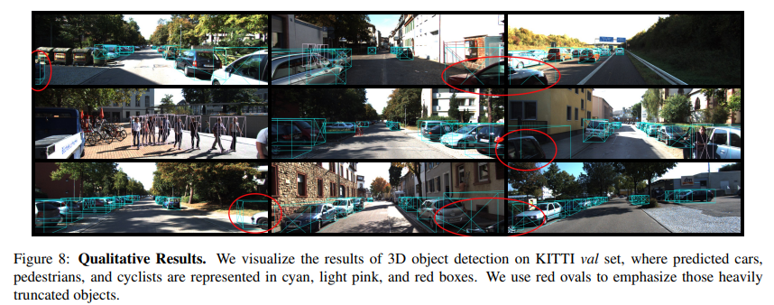

定性结果显示提出的框架能在多种街景中对常规物体产生优异的检测性能。如红色椭圆框所示，算法还能成功检测一些极端截断的物体——这对自动驾驶安全至关重要，从而证明了解耦截断物体策略的有效性。

### Conclusion

论文提出了一种新颖的单目 3D 物体检测方法，灵活处理不同类型的目标。通过观察截断物体的长尾分布特性，并提出的边缘热力图和边缘融合模块对其进行显式解耦。同时，将目标深度估计构建为不确定性引导的多方法集成框架，从而获得更鲁棒、更精准的预测结果。在 KITTI 数据集上的实验表明方法显著超越了现有 SOTA 方法。研究揭示了灵活处理不同类别物体——特别是对于挑战性的单目 3D 目标检测任务——具有重要价值。
